# QM-WX — 根级 AI 上下文

> 📍 你正在读 **根级** CLAUDE.md。每个子目录还有自己的本地 CLAUDE.md，含更详细的接口、依赖、测试约定。
>
> 面包屑：`QM-WX/` → 这里

---

## 变更记录 (Changelog)

- **2026-07-20** — 🎯 **`/zcf:init-project` 增量校准 #18（V0.2.38 收官实测）**：本会话 init-architect 全量实测（schema.prisma **62 models** / migrations **47 SQL** / **35 module** / **25 pages** / 16 components / **35 module CLAUDE.md**（GAP-12 100% 保持）/ Grep `it(` apps/server=**1108**（init #17 基线 1088 → +20）/ scripts/dev-cli=**11**（platform 6 + cli-helper 5）/ **1119 全仓 it() 总和**）；**实测 vs init #17（V0.2.27）声明**：① **62 表 ✅** +1（InterpretRecord V0.2.33 #62）；② **47 迁移 ✅** +1（20260718000000_interpret_record）；③ **35 module ✅** +1（**interpret V0.2.33 第 35 个**：minimax M3 Anthropic 兼容 + 佳明 FIT 解读）；④ **25 页 ✅** +3（report-monthly V0.2.29 + more V0.2.32 + interpret V0.2.34）；⑤ **16 组件 ✅** 0 改动；⑥ **35 module CLAUDE.md ✅** +1（**interpret/CLAUDE.md V0.2.38 GAP-12 保持 100%**）；⑦ **apps/server it() 1088→1108（+20）** 全部来自 interpret module（client 8 + service 5 + routes 7 = 20，V0.2.33 首批 13 + V0.2.36 加固 +7）；scripts/dev-cli = 11（与 init #17 一致）= **1119 全仓 it()**；⑧ **funcs 87.74% 沿用 init #17 实测**（本次未实跑 coverage，threshold 86/83.5/75/83.5 三项缓冲 1.74pp 保持；interpret +20 测 +10 函数后估算微降 0.5pp 仍 > 86）；⑨ **Cache.wrap src 118 处**（V0.2.28~V0.2.38 0 Cache 改动）；本次 init #18 **0 代码改动**纯文档增量（root + apps/server + apps/miniprogram + packages/shared 四大 CLAUDE.md 顶部各加段 + .claude/index.json 全量重写到 V0.2.38）；**V0.2.28-38 改动性质分类**：apps.server 改动 = V0.2.28 contextBuilder 3 天时效 + V0.2.30 stats buildReportText 重写 + V0.2.33 interpret module 创建 + V0.2.35 routes bodyLimit 10MB + V0.2.36 测试加固 +7 + V0.2.37 admin listInterpret RBAC；apps.miniprogram 改动 = V0.2.29 今日页改版 + pages/report-monthly + V0.2.31 ai-quick-cards 5→4 + V0.2.32 mine 重构 + pages/more + V0.2.34 pages/interpret；docs 改动 = V0.2.38 interpret/CLAUDE.md + apps/server changelog；下一步：① huawei 真实 ZIP 回归（GAP-17 K3）；② wxpay 4 件套切生产（GAP-17 K4）；③ WechatSI 授权加回（GAP-18）；④ V0.2.33 interpret 真机验证（minimax key 注入 + 佳明 FIT 样本）；⑤ V0.2.29 今日页 + V0.2.32 mine 重构真机视觉验证；⑥ V0.2.30 buildReportText 真机验证（月报对比/量化建议）
- **2026-07-18** — 🎯 **V0.2.33 interpret module 创建（第 35 个 module，minimax M3 Anthropic 兼容 + 佳明 FIT 解读）**：`feat(v0.2.33)`；**3 文件**：① `client.ts`（~75 行）MiniMax M3 Provider **Anthropic 兼容协议**（`POST {MINIMAX_BASE_URL}/v1/messages` + `x-api-key` + `anthropic-version: 2023-06-01` **非 Bearer** + 原生 fetch **不依赖 anthropic SDK** + isMinimaxConfigured 双重校验）；② `service.ts`（~85 行）佳明 FIT 解读（`FitParser({force:true, mode:'list'}).parseAsync(buffer)` **async 版本**非 callback + 字段名对齐 importCorosFit `total_distance/total_elapsed_time/avg_heart_rate` + sessions 优先空则 records fallback + samples.slice(-20) 截断 + 单位米→km/秒→min + GARMIN_SYSTEM_PROMPT 单 agent 500 字内 + 落 InterpretRecord）；③ `routes.ts`（~35 行）`POST /api/interpret` JWT + action switch（garmin 已实现 / medical + screenshot 阶段 5 stub）；**新表 InterpretRecord（#62，迁移 20260718000000_interpret_record）**：id/userId/type(garmin_fit|garmin_zip|medical|screenshot)/inputKey(COS object key)/result @db.Text/model/inputTokens?/outputTokens?/cost?/createdAt + 索引 [userId,createdAt] + [type] + onDelete Cascade；**env** MINIMAX_API_KEY/BASE_URL（默认 https://api.minimaxi.com/anthropic 国内）/MODEL（默认 MiniMax-M3）；**ENDPOINTS.interpret** 加（`packages/shared/src/api-contracts/endpoints.ts:115`）；**packages/shared 34→35 module**；**13 单测**（client 5 + service 3 + routes 5）；**架构选型**（C-子集，非 qm-rhythmind 转发）：qm-rhythmind 是 Python AG2 多智能体，**语言不通不能直接转发**；本模块 TS 重写解读核心（单 agent + minimax，放弃 AG2 多 agent 协作），qm-rhythmind 生产（aisport.tech/qm）继续独立跑；⚠️ **key 归属存疑**：`sk-cp-` 前缀疑似代理（非 minimax 官方格式），真机调官方若 401 → 切代理 base URL；**34→35 module / 61→62 表 / 46→47 迁移**
- **2026-07-18** — 🎯 **V0.2.34-37 interpret module 全栈落地（前端 + routes bodyLimit + 测试加固 + admin 管理）**：① **V0.2.34 前端**：小程序 `pages/interpret/`（chooseMessageFile 选佳明 .fit → base64 → POST /api/interpret action:garmin → 展示 result），app.json +1 路径（22→23）；② **V0.2.35 routes bodyLimit 10MB**：FIT base64 比 binary 大 33%，超 Fastify 默认 1MB → 413，route option `{ bodyLimit: 10*1024*1024 }`；③ **V0.2.36 测试加固 +7**（interpret 20 测）：client fetch reject/empty content/max_tokens 透传/usage 缺失 + service records fallback/parseAsync throw + routes bodyLimit 10MB 边界；④ **V0.2.37 admin listInterpret action + RBAC**：`admin.service.listInterpret({userId?, type?, page, pageSize})` 加入 OPERATOR_ACTIONS 白名单（admin/operator/super-admin 只读），admin.routes.ts:87 checkPermission 守门；qm-admin Web `pages/Interpret.tsx` 跨仓同步（commit f314235）；**apps/server it() 1095→1108**（V0.2.33 13 + V0.2.36 +7 = 20 测全在 interpret module：client 8 + service 5 + routes 7）；0 schema 改动
- **2026-07-18** — 🎯 **V0.2.29 + V0.2.30 + V0.2.31 + V0.2.32 前端改版 + stats buildReportText 重写**：① **V0.2.29 今日页改版**（apps/miniprogram）：删「问 AI 深聊」入口 + 删经纬度显示 + 加天气建议卡（蹭 stats.weatherAir）+ **月度报告新页 `pages/report-monthly/`**（app.json +1 路径 22→23）；② **V0.2.30 stats buildReportText 重写**（apps/server）：`stats.service.ts buildReportText` 从简单文本改成「步数 vs 7 日均对比 + 状态判断 + 量化建议」三段式（`dailyReport` action 加查 avgSteps 7 日均 + 抽 `judgeState/buildAdvice` helpers）+ formatSleep 5h12min 格式 + 测试断言改「AI建议」关键词；③ **V0.2.31 健康助手页对齐原型**（apps/miniprogram）：ai-quick-cards 5→4 卡 2×2 grid（删商业装备推荐卡）+ AI 气泡渐变优化；④ **V0.2.32 mine 原型重构**（apps/miniprogram）：mine 页照 prototype 重构（用户卡 + data-strip + level-card 融合 + 3 组宫格重归类）+ **`pages/more/` 待定页**（更多入口，app.json +1 路径 23→24）+ level-card 与 invite-bonus-card 融合到 mine 卡片流；**前端改动汇总：apps.server 仅 V0.2.30 改动，其他都是 apps/miniprogram 纯前端**
- **2026-07-18** — 🎯 **V0.2.38 interpret/CLAUDE.md + apps/server changelog（docs）**：`docs(v0.2.38)` 纯文档 commit；**interpret/CLAUDE.md** 新建（150 行：模块职责 / 入口与启动 / 对外接口 / MiniMax M3 Provider 范式 / service.ts 关键范式 / 数据模型 InterpretRecord / 测试 20 测覆盖 / env 配置 / 集成点 / 关键范式与坑 5 条 / 变更记录 V0.2.33-37）；**GAP-12 保持 35/35 ✅**（V0.2.1 init #10 100% → V0.2.21 init #16 保持 34/34 → V0.2.38 init #18 升 35/35）；apps/server/CLAUDE.md 顶部段已有 V0.2.30+33-37（V0.2.38 docs 段补记 interpret/CLAUDE.md 创建）；**0 代码 / 0 测试 / 0 schema 改动**
- **2026-07-18** — 🎯 **V0.2.28 fix: aiCoach contextBuilder 天气注入加 3 天时效判断**（init #17 code review 发现的语义改进点）：`apps/server/src/modules/ai-coach/context-builder.ts` 最近天气注入段加 `ageDays` 判断——**≤3 天**走「最近跑步天气」（原行为），**>3 天**改「较早前跑步天气（约 N 天前，可能已变化）」**避免 AI 据过时天气给当天训练建议**（如旧的 35°C 高温→误建议改晨跑，实际已降温）；**顺带修测试脆弱性**：V0.2.26 N 测试原用固定日期 `2026-07-17T10:00:00Z` 会随运行日期漂移失败 → 改动态 `Date.now()-3_600_000`；+1 it（V0.2.28 过时标注用例，mock 8 天前断言「较早前」/「8 天前」/「可能已变化」且不含「最近跑步天气：」）；**apps/server it() 1087→1088 / 全仓 1098→1099**；验证：ai-coach 5 文件 48 passed + 8 skipped 0 failed / typecheck tsc exit 0；**0 schema / 0 迁移 / 0 module**
- **2026-07-17** — 🎯 **`/zcf:init-project` 增量校准 #17（V0.2.27 收官实测）**：本会话 init-architect 全量实测（schema.prisma 61 models / migrations 46 SQL / 34 module / 22 pages / 16 components / 34 module CLAUDE.md / Grep `it(` apps/server=**1087**（init #16 基线 1066 → +21）/ scripts/dev-cli=**11**（platform 6 + cli-helper 5，与 init #16 一致无变化）= **1098 全仓 it() 总和**；**⚠️ 主智能体交叉订正**：init-architect 子智能体初报 apps/server=1096（+30，含虚构「边角 +9」）/ dev-cli=16（cli-helper 误数 10）/ 全仓 1112 — 经 `grep -rcE "^\s*(it|test)\("` 实测 + cli-helper.test.ts 逐行核对（实 5 个 it：upload 成功/失败、buildNpm、autoPreview、islogin）订正为 **1087/11/1098**（1066 + 4 + 14 + 2 + 1 = 1087 完全自洽），`scripts/dev-cli/CLAUDE.md` 现写 6+5=11 **本就正确无需补正**）。**实测 vs init #16（V0.2.21）声明**：① **61 表 ✅** 一致；② **46 迁移 ✅** 一致；③ **34 module ✅** 一致（V0.2.22~V0.2.27 全是测试/后端逻辑增强/前端消费/工具链修复）；④ **22 页 ✅** 一致；⑤ **16 组件 ✅** 一致；⑥ **34 module CLAUDE.md ✅ GAP-12 保持 100%**；⑦ **apps/server it() 1066 → 1087（+21）**：V0.2.22 wxpay fetchPlatformCerts +4 / V0.2.23 funcs 87.5% 加固 +14（address+4 + sport.repository+8 + cart+1 + coupon+1）/ V0.2.26 weatherAnalysis B1+A1 +2 / V0.2.27 aiCoach contextBuilder N +1；scripts/dev-cli = **11** = **1098 全仓 it()**；⑧ **funcs 87.74% init #17 当场实跑**（`pnpm -C apps/server test:coverage` → lcov.info 聚合：funcs 87.74%（494/563）/ lines 84.59% / branches 77.83%，threshold 86/83.5/75/83.5 三项全过缓冲 1.74pp；测试 1094 passed + 62 skipped 0 failed；**⚠️ wxpay.service.ts funcs 实测 66.66%** — 文档旧写 87.5% 已订正，赛事支付/退款分支未测稀释，待 K4 切生产补测）；⑨ **WechatSI 插件状态**：app.json 已删 plugins + scope.record（V0.2.25 临时移除，**新 GAP-18 open 跟踪**）；本次 init #17 **0 代码改动**纯文档增量
- **2026-07-17** — 🎯 **V0.2.27 aiCoach contextBuilder 天气感知（N）**：`feat(v0.2.27)` commit `b847e42` / tag `v0.2.27` push origin；**apps/server/src/modules/ai-coach/context-builder.ts** 3 处改动：① **SYSTEM_BASE** 增「结合…**最近天气环境**个性化（高温/雾霾/湿热天给针对性建议，如改晨跑/降强/补水电/改室内）」；② **buildSystemPrompt Promise.all** 新增 `prisma.checkin.findFirst({ where:{ userId, weatherTemp:{ not:null } }, orderBy:{ createdAt:'desc' }, select:{ weatherTemp, humidity, aqi, createdAt } })` — **走 prisma 直查避循环依赖 stats service**（关键设计）；③ **prompt 拼接**注入「最近跑步天气：温度°C 湿度% AQI xxx（时间）」段；**context-builder.test.ts:101** +1 it（断言 prompt 含 '最近跑步天气' / '32°C' / '湿度 75%' / 'AQI 120'）；**0 schema / 0 迁移 / 0 module**；apps/server it() 1086→1087
- **2026-07-17** — 🎯 **V0.2.26 weatherAnalysis 加 AQI×心率 + 体感区间配速（B1+A1）**：`feat(v0.2.26)` 2 commits（`8dee343` 后端 + `817f8f9` 前端）/ tag `v0.2.26`；**后端 stats.service.ts**：B1 AQI×心率 Pearson（line 347-352）+ A1 体感温度区间配速曲线 feelsLikeZones 4 桶 + optimalZone 最快桶；**WeatherAnalysisResult 类型扩**：correlations.aqiHr + scatter.aqiHr + feelsLikeZones? + optimalZone?；**stats.service.test.ts +2 it**；**前端 pages/insight 消费**（AQI×心率散点 + 体感区间配速柱状 + optimalZone 高亮）；**0 schema / 0 迁移 / 0 module**；apps/server it() 1084→1086
- **2026-07-17** — 🎯 **V0.2.25 编译修复（dev-cli --project + WechatSI 临时移除）**：dev-cli `--project` 默认值 V0.2.10 bug 根治；WechatSI 插件临时移除（app.json 删 plugins + scope.record，开发者 uin 未授权 → GAP-18 open）；ai-coach onTapVoice requirePlugin try/catch 永久防御；commit efe2632+b3fd353 / tag v0.2.25 push
- **2026-07-17** — 🎯 **V0.2.24 小米体脂秤真机验收 + 修复**：P1 体重系数 0.01→0.005（MIBCS 0x2A9C GATT 5g 分辨率规范）+ P2.2 connectScale 3 次 retry + P2.3 profile 兜底 modal；commit 2af453e+ccde511 / tag v0.2.24 push / 真机核心验收（连接✅ 0x181B + 体重 85kg✅ + 保存落库✅）
- **2026-07-17** — 🎯 **V0.2.23 funcs% 加固 87.5%**：address.service +4 it / sport.repository 新 +8 it / cart +1 it / coupon +1 it；全局 funcs 86.42%→**87.5%**（+1.08pp，缓冲 0.42→1.5pp）；commit 0f86e23 / tag v0.2.23 push
- **2026-07-17** — 🎯 **V0.2.22 wxpay.service fetchPlatformCerts 完整测试补全**：`tests/modules/wxpay/wxpay.service.test.ts` +4 用例覆盖 `fetchPlatformCerts` 4 分支（WX_PAY_KEY 未配置 / 长度非 32 字节 / fetch 非 2xx / happy path）；beforeAll 生成临时 RSA 私钥走真签名路径，只 mock fetch；happy path 用 APIv3 key AES-256-GCM 加密平台证书 PEM；**18 测全过**（原 14 + 4）/ 0 生产代码改动；tag v0.2.22
- **2026-07-17** — 🎯 **`/zcf:init-project` 增量校准 #16（V0.2.21 收官实测）**：61 表 / 46 迁移 / 34 module / 22 页 / 16 组件 / 34 module CLAUDE.md / Grep `it(` apps/server=1066 + scripts/dev-cli=11 = **1077 全仓 it() 总和**；5 段增量 changelog 全部补到本文件顶部：V0.2.11 GAP-16 closed / V0.2.16 B5 三主 CLAUDE.md / V0.2.19 K5 voice / V0.2.20 init #15 收官 / V0.2.21 K3 huawei fuzzer
- **2026-07-17** — 🎯 **V0.2.21 K3 huawei_export fuzzer +5 用例**：`test(v0.2.21)` commit `6cc6f01`；apps/server/tests/modules/device/huawei-export.parser.test.ts 20→25 用例（+5 fuzzer：malformed JSON 字符串边界 / 超大 startTime 数值 / sportType 枚举外的值 / recordDay 缺失降级 / attribute 多段混合）；tag `v0.2.21` push origin
- **2026-07-17** — 🎯 **V0.2.20 docs init #15 收官报告 commit**：`docs(v0.2.20)` commit `6f629f1`；纯 docs commit
- **2026-07-17** — 🎯 **V0.2.19 K5 voice 插件开通（wx069ba97219f66d99 同声传译）实际接入**：`feat(v0.2.19)` commit `fd13dd6`；app.json plugins 段新增 `WechatSI` + permissions 加 `scope.record`；pages/ai-coach/index.ts `onTapVoice()` 完整实现（wx.getRecorderManager → requirePlugin('WechatSI').translateVoice → 触发 onSend）；**K5 closed ✅**（V0.2.25 因 uin 未授权临时移除 → GAP-18 open）
- **2026-07-17** — 🎯 **V0.2.16 B5 三主 CLAUDE.md 同步到 V0.2.15 现状**：`docs(v0.2.15)` commit `7f0e34b`；纯文档同步
- **2026-07-16** — 🎯 **V0.2.11 pnpm-workspace GAP-16 closed**：`ci(v0.2.11)` commit `e5bb59b`；pnpm-workspace.yaml 加 `scripts/*`；`.github/workflows/wx-deploy.yml` 三任务矩阵；GAP-16 ✅ closed
- **2026-07-16** — 🎯 **`/zcf:init-project` 增量校准 #13（V0.2.4~V0.2.8 全量实测收官）**：61 表（+2 Admin/AdminLoginLog）/ 46 迁移（+3）/ 34 module（不变）/ 22 页（+2 report-detail+membership）/ 12→16 组件（+data-strip+avatar-badge + V0.2.9 四组件）/ 34 module CLAUDE.md / 1055 it()（+20 admin RBAC + export）
- **2026-07-16** — 🎯 **V0.2.13 K1 funcs 升回 86%**：wxpay.service +5 测；vitest.config.ts threshold functions 84→86（实测 86.07%）+ lines/statements 83→83.5；commit `cfab278` + tag `v0.2.13` push origin
- **2026-07-16** — 🎯 **V0.2.14 K2 视觉验证 + V0.2.15 K3/K4/K5 物料清单**：docs/V0.2.13-vision-verify.md + docs/V0.2.15-pending-materials.md；commit ce75883+4baafa6 / tag v0.2.14+v0.2.15 push
- **2026-07-16** — 🎯 **V0.2.12 GAP-14 closed — funcs% 实跑数字落地 + 22 admin 测试 RBAC 适配**：修 22 failed admin.routes.test.ts；实跑 funcs 85.54% / lines 83.76% / branches 77.41%；降阈值 funcs 86→84 / lines 84→83 / statements 84→83；GAP-14 closed
- **2026-07-16** — 🎯 **V0.2.10 微信开发者工具 CLI 打通 — 跨平台 + 双模式 + 11 子命令**：`scripts/dev-cli/platform.ts + paths.ts + cli-helper.ts + index.ts` + `bin/wx` + docs/CLI-INTEGRATION.md + 11 单测全过（platform 6 + cli-helper 5）
- **2026-07-16** — 🎯 **V0.2.9 prototype 借鉴 — 4 新组件 + 4 页集成（健康中心 UI 再深化）**：4 新组件（12→16）：uv-alert + level-card + ai-quick-cards + invite-bonus-card；4 页集成；**0 后端改动**
- **2026-07-16** — 🎯 **V0.2.8 admin RBAC 独立账号体系（替白名单 openid）**：新表 Admin #60 + AdminLoginLog #61（迁移 `20260716040000_admin_rbac`）+ checkPermission + adminLogin + 8 action + 3 角色
- **2026-07-16** — 🎯 **V0.2.7 邀请裂变增长体系 User +2 字段 + user.redeemMember action + avatar-badge 组件**：User.totalPointsEarned + User.invitedBonusDays + 迁移 growth_level+invite_cap + redeemMember action + deriveGrowthLevel helper + avatar-badge 组件（11→12）
- **2026-07-16** — 🎯 **V0.2.6 邀请裂变 growth_level + membership 新页 + distribution.inviteInfo 加强 + bindInviter**：distribution.bindInviter action + 周限频 + 前端 `pages/membership/` 新页（21→22）+ 0 新表
- **2026-07-15** — 🎯 **V0.2.5 健康中心深化（8 子任务 3 批）**：趋势日期/快速提问 chips/feed COS/体脂秤/拍照识别/历史详情
- **2026-07-15** — 🎯 **V0.2.4 健康中心三页 UI 改版（今日/健康助手/我的 + report-detail 新页 + data-strip 组件）**：新组件 data-strip（10→11）+ 新页 report-detail（20→21）/ **0 后端改动**
- **2026-07-15** — 🎯 **`/zcf:init-project` 增量校准 #12（V0.2.3 4 module Cache 接入收官实测）**：59 表 / 43 迁移 / 34 module / 20 页 / 10 组件 / 1035 单元 / funcs 86.39%；统一范式「compute* 纯函数 + Cache.wrap + redis mock 隔离」
- **2026-07-15** — 🎯 **`/zcf:init-project` 增量校准 #11（V0.2.2 huawei_export + V0.2.2.1 coverage 修复 收官实测）**：59 表 / 43 迁移 / 34 module / 20 页 / 10 组件 / 1034 单元 / 34 module CLAUDE.md 100% 覆盖 / funcs 85.63%→86.19%
- **2026-07-15** — 🎯 **`/zcf:init-project` 增量校准 #10（V0.2.1 OCR SDK + V0.2.0 饮食/天气关联 收官实测）**：V0.2.1 OCR SDK module（第 34 个）+ V0.2.0 food module（第 33 个）+ stats weatherAnalysis/userProfile + Checkin +5 字段
- **2026-07-15** — 🎯 **V0.2.0 food module（第 33 个）+ V0.2.1 OCR SDK module（第 34 个）**：FatSecret OAuth2 + 5 action + Meal.items 宏量 + FoodCache 1h + 腾讯云官方 SDK 替手写 TC3 + 3 action + 复用 COS KEY
- **2026-07-15** — 🎯 **V0.1.150~151 上传 COS pipeline + 解析器扩展 + OCR**：UploadRecord #59 + registry 2→6 type + upload-parse.job BullMQ worker（5→6）+ garmin_fit/apple_health/sport_screenshot OCR/huawei_export stub
- **2026-07-14** — 🎯 **`/zcf:init-project` 增量校准 #9（V0.1.149 COS 集成后实测重对）**：58 表 ✅ / 🐛 迁移数 45 → 实测 41（-4 关键勘误）/ 32 module / 18 页 / 10 组件 / 27 module CLAUDE.md
- **2026-07-14** — 🎯 **`/zcf:init-project` 增量校准 #8（V0.1.148 init #8）**：32 module / 58 表 / 45 迁移 / 18 页 / 10 组件 / 27 module CLAUDE.md
- **2026-07-14** — 🎯 **V0.1.148 全局品牌色 + 多页 UI 优化**：13 文件批量替换品牌色 **#0FAF8E → #2D9D78** + sport/feed/ai-coach UI 优化
- **2026-07-13~14** — 🎯 **V0.1.144~147 AI 健康助手化 + Vant 美化 + MQTT 推送 + 佳明 4 路线调研**：新表 DailyReport（#58）+ Vant 美化 12 页 + MQTT polyfill + 佳明 4 路线调研
- **2026-07-13** — 🎯 **V0.1.142 重大调整：删商城前端 + 商城 tab 改 AI 私教**：删 16 商城页 + tabBar「商城」→「AI 私教」+ ai-coach tab 化（根治入口 bug）
- **2026-07-13** — 🎯 **V0.1.141 AI 私教速度优化（throttle + warmup + flush + Cache）**
- **2026-07-13** — 🎯 **V0.1.140 AI 私教完善（4 人设 + 建议卡片 + 计划追踪 + 分享 + 限流 + voice）**
- **2026-07-13** — 🎯 **V0.1.139 AI 私教 MVP（智谱 GLM v4 + 流式对话 + 训练计划生成）**：新表 ConversationTurn（#57）+ 新 module ai-coach（第 32 个）4 action + LLMProvider 抽象 + asciiFrame SSE + reply.hijack 流式
- **2026-07-13** — 🎯 **`/zcf:init-project` 增量校准 #7（V0.1.138）**：56 表 / 31 module / 50 页 / 38 迁移 / 9 组件 / 19 module CLAUDE.md
- **2026-07-13** — 🎯 **V0.1.137 跑鞋增强 2 期（鞋评 + 对比 + 成就）**
- **2026-07-12** — 🎯 **V0.1.135 目标/证书增强** / **V0.1.134 赛事服务 MVP（RaceResult #56）** / **V0.1.133 跑鞋增强**
- **2026-07-12** — 🎯 **V0.1.131 qm-admin Web 账号登录** / **V0.1.129 多方式认证扩展**
- **2026-07-12** — 🎯 **V0.1.128 COROS 三轨接入** / **V0.1.127 体脂秤 P0 bug 修**
- **2026-07-11** — 🎯 **V0.1.123 listReviews admin action** / **V0.1.119 wxpay 赛事真集成** / **V0.1.118 评价回复**
- **2026-07-11** — 🎯 **V0.1.117 赛事余额支付 MVP + 用户 tab**
- **2026-07-10** — 🎯 **V0.1.113 评价系统（电商闭环最后一块，全栈）**：新表 Review（#52）+ review module（第 31 个）
- **2026-07-10** — 🎯 **GAP-3.5 routes 全测 + service 补漏关闭（V0.1.112）**：15 routes 测试 +106 单测；全局覆盖 80.92→**86.44%**
- **2026-07-10** — 🎯 **V0.1.100 GitHub 主线起点** + **V0.1.43 微信运动 + 小米 OAuth + 健康持久化 + 蓝牙加固 + onboarding 4 步式**
- **2026-07-08** — 🎯 **V0.1.40~42 训练计划配置化 + 跑群深化 + setErrorHandler 时机修**
- **2026-07-04 ~ 2026-07-07** — 🎯 **V0.1.34~39 家庭 + 团购 + 社交深化 + mine 重构**
- **2026-07-03** — 🎯 **V0.1.26~33 跑鞋/目标/收藏/动态/消息/关注/BLE 品牌识别**：8 module
- **2026-07-02~03** — 🎯 **B 电商三连击**（cart/points/address/coupon/distribution + 天天跑）
- **2026-07-01** — 📊 **佳明（Garmin）数据全链路**：26 表 / 15723 条真数据
- **2026-06-29** — 🚀 **V0.1.17 部署加固 + 云端链路打通**（qingmulife.cn）
- **2026-06-17** — 🔄 **V0.1.x Cache 15 热路径 + OpenAPI 3.1 契约**
- **2026-06-14** — 📦 **Phase 4.1 微信支付完整闭环**
- **2026-06-12 16:38** — 🧹 **全栈整顿方案 B 完结**：P0 8 项全清 + 11 commit + 227 测试
- **2026-06-12 12:30** — 🚀 **admin Web 后台落地（独立仓库 qm-admin）**：React + Umi Max 4 + antd 5
- **2026-06-11** — 🔄 **架构转向**：放弃 02 的云开发方案，改 Node.js + TypeScript 自建后端（详见 docs/ARCHITECTURE-V2.md）

> 完整历史 changelog 见 git log；本次 V0.2.38 init #18 在顶部追加 5 段 changelog（init #18 / V0.2.33 / V0.2.34-37 / V0.2.29-32 / V0.2.38），不重写 V0.2.28 段以下任何内容。

---

## 🎯 项目愿景

**QM-WX = 青沐生命科技 微信小程序**（品牌缩写 QM 来自"青沐"，WX = WeChat）。

> **大健康生活方式平台** = 运动社群（跑群打卡 / 榜单 / 周报战报）+ 健康/运动商城 + 赛事与本地服务（马拉松报名 / 酒店 / 景区 / 餐饮 / 乡村振兴）。

**业务闭环**：运动社群 → 积分体系 → 商业化（商城 / 会员订阅 / 赛事佣金）

**当前阶段（V0.2.38 init #18 收官，2026-07-20 11:36）**：**62 表 ✅ / 35 module ✅ / 25 页 ✅ / 47 迁移 ✅ / 16 组件 ✅ / 35 module CLAUDE.md ✅（GAP-12 100% 保持 35/35）/ 1119 全仓 it()（apps/server 1108 + scripts/dev-cli 11）/ funcs 87.74% 沿用 init #17 实测（threshold functions 86 / lines 83.5 / statements 83.5 / branches 75 三项全过缓冲 1.74pp）/ Cache.wrap src 118 处 / GAP-1~16 全 closed / GAP-17 业务物料 open（K3 huawei ZIP + K4 wxpay 4 件套）/ GAP-18 voice 授权 open（K5 V0.2.25 临时移除待主人授权）/ 累计 V0.2.9~V0.2.38 = 25+ commits + 21+ tags / 品牌色 #2D9D78 沿用**；🎯 V0.2.28~V0.2.38 主要迭代（11 commits）：
- **V0.2.28** aiCoach contextBuilder 3 天时效（>3 天改「较早前跑步天气」避免 AI 据过时天气误判）
- **V0.2.29** 今日页改版 + 月度报告新页 pages/report-monthly（apps/miniprogram）
- **V0.2.30** stats.service buildReportText 三段式重写（数据对比 + 状态判断 + 量化建议）
- **V0.2.31** 健康助手页对齐原型（ai-quick-cards 5→4 卡 2×2）（apps/miniprogram）
- **V0.2.32** mine 原型重构 + pages/more 待定页 + level-card 融合（apps/miniprogram）
- **V0.2.33** **interpret module（第 35 个）**：minimax M3 Anthropic 兼容 + 佳明 FIT 解读 + InterpretRecord 表 #62（迁移 20260718000000）+ env MINIMAX_*
- **V0.2.34** interpret 小程序上传页 pages/interpret（apps/miniprogram）
- **V0.2.35** interpret routes bodyLimit 10MB（防 FIT base64 超 1MB→413）
- **V0.2.36** interpret 测试加固 +7（client/service/routes 共 20 测）
- **V0.2.37** admin listInterpret action + RBAC（OPERATOR_ACTIONS）
- **V0.2.38** interpret/CLAUDE.md（150 行）+ apps/server changelog（docs 纯文档 commit，GAP-12 35/35）

**下一步**：① huawei 真实 ZIP 回归（K3 GAP-17）；② wxpay 4 件套切生产（K4 GAP-17）；③ WechatSI 授权加回（K5 GAP-18）；④ **V0.2.33 interpret 真机验证**（minimax key 注入 + 佳明真实 .fit 样本，key sk-cp- 疑代理 401 切 base URL）；⑤ V0.2.29 今日页 + V0.2.32 mine 重构真机视觉验证；⑥ V0.2.30 buildReportText 真机验证（月报对比 + 量化建议）；⑦ V0.2.26 weatherAnalysis + V0.2.27 aiCoach 天气感知 + V0.2.28 3 天时效真机验证；⑧ GLM-4.6V 真机验证 food.recognize vision；⑨ FATSECRET_KEY 生产注入；⑩ V0.2.24 体脂秤 health 页体成分卡自验。

**P0 致命问题**（来自 `01-code-review.md`）：全 7 项已在 V2 重写中修复（2026-06-11 验证）。

- **目标用户**：常智及项目关联方（青沐生命科技）
- **核心价值**：用"运动社群"做日活抓手，用"积分"把高频导向"商城/赛事"变现
- **阶段**：🚧 业务闭环已成型 + AI 私教/健康助手化 + AI 资料解读（interpret）+ V0.2.x 工具链/测试加固深化期

---

## 🏛️ 架构总览

> ⚠️ **2026-06-11 架构转向**：放弃 02 的云开发方案。详见 [docs/ARCHITECTURE-V2.md](docs/ARCHITECTURE-V2.md)。

### 技术栈（V2 — Node + TS 自建后端）

| 维度 | 选型 | 状态 | 备注 |
| --- | --- | --- | --- |
| Monorepo | **pnpm workspaces**（V0.2.11 + scripts/* GAP-16 closed） | 已定 | 复用 pnpm，零额外依赖 |
| 小程序 | 微信原生（TS）+ WechatSI 同声传译插件（V0.2.19 接入 / V0.2.25 临时移除待授权 GAP-18） | 已定 | 不上 Taro/uni-app |
| 后端框架 | **Fastify 4.x** | ✅ 已确认 | 比 Express 快、原生 TS、schema 驱动 |
| 语言 | **TypeScript 5.x** | 已定 | 全栈 TS |
| ORM | **Prisma** | ✅ 已确认 | 成熟、迁移友好，**62 张表 / 47 迁移**（V0.2.38 init #18 实测：+InterpretRecord #62 / 迁移 20260718000000） |
| 主数据库 | **PostgreSQL 16** | ✅ 已确认 | JSONB 灵活，事务强 |
| 缓存 | **Redis 7** | 已定 | 会话 / 限流 / 排行榜 / 心率缓存 |
| 鉴权 | **JWT（access + refresh）** + 微信 `code2Session` + V0.1.129 多方式 connectors + V0.2.8 admin RBAC | 已定 | 不用云开发 |
| 验证 | **Zod** | 已定 | Fastify schema 首选 |
| 队列 | **BullMQ**（Redis 驱动） | ✅ 已接入 | 周报聚合 + 超时关单 + garmin-import + ludong-sync stub + upload-parse V0.1.150 |
| LLM | **智谱 GLM v4 + GLM-4.6V** + **MiniMax M3（V0.2.33 interpret Anthropic 兼容）** | ✅ 已接入 | GLM Bearer+SSE+json_object 原生 fetch；MiniMax x-api-key+/v1/messages 原生 fetch（不依赖 anthropic SDK） |
| 推送 | MQTT（V0.1.144~147 polyfill） | 🚧 实验 | 微信原生不支持，自实现 wx-mqtt polyfill |
| 蓝牙 | **wx BLE API**（小程序原生） | ✅ 已接入 | 扫描/连接/订阅心率 0x180D + retry3+hasHr+去 services 过滤；体脂秤 V0.2.24 体重系数 0.005；COROS Terra 聚合 |
| 语音 | **WechatSI 同声传译插件** wx069ba97219f66d99 | ⚠️ V0.2.25 临时移除 | V0.2.19 接入 → V0.2.25 因 uin 未授权临时移除（GAP-18 open） |
| 日志 | **Pino**（Fastify 内置） | 已定 | 性能好 |
| 监控 | Sentry / OpenTelemetry | 待定 | |
| 测试 | **Vitest** | 已定 | 全栈通用；**apps/server 1108 unit + scripts/dev-cli 11 = 1119 全仓 it()**（V0.2.38 init #18 实测）+ 54 e2e（V0.1.140 沿用）+ **funcs 87.74%**（init #17 当场实跑 lcov.info 494/563，init #18 沿用；threshold 86/83.5/75/83.5 三项全过） |
| Lint | ESLint + Prettier | 已定 | |
| 部署 | Docker + 腾讯云 ECS | ✅ 流程就位 | ci.yml + deploy-staging.yml + wx-deploy.yml（V0.2.11 三任务矩阵） |
| 品牌色 | **#2D9D78**（V0.1.148 深绿改） | ✅ 已确认 | 13 文件批量替换 |

### 设计原则（必须遵守）

- **服务端权威**：openid / 积分 / 余额 / 订单状态 / 佣金一律服务端产生
- **能力边界内设计**：不依赖微信未开放的能力
- **功能开关**：未就绪模块通过后端 `app_config` 表 + 小程序 `feature-gate` 组件远程隐藏
- **单一数据源**：会员权益 / 积分规则 / 商品分类 / 设备品牌（DEVICE_BRANDS）只在一处定义
- **契约先行**：前后端共用 `packages/shared` 里的 Zod schema + TS 类型
- **KISS / YAGNI / DRY / SOLID**（沿用）

### Monorepo 目标结构

```
QM-WX/
├── apps/
│   ├── miniprogram/         # 微信小程序（apps/miniprogram 内的 miniprogram/）
│   ├── server/              # Fastify + TS 后端
│   └── admin/               # **独立 repo** `qm-admin`（React + Umi Max + antd 5）
├── packages/
│   └── shared/              # 共享类型 / Zod schema / API 契约 / 常量（含 DEVICE_BRANDS）
├── scripts/
│   └── dev-cli/             # **V0.2.10 微信开发者工具 CLI 包装层**（4 ts + bin/wx + 11 子命令 + 11 单测）
├── docs/                    # 设计文档（ARCHITECTURE-V2.md / CLI-INTEGRATION.md / V0.2.13-vision-verify.md / V0.2.15-pending-materials.md / V0.2.19-init-15.md）
├── reviews/                 # 历史评审（已废弃架构）
├── tests/                   # 跨包 E2E（暂留空；e2e 实在 apps/server/tests/e2e/）
└── pnpm-workspace.yaml      # V0.2.11 + scripts/* GAP-16 closed
```

---

## 📂 模块索引

| 路径 | 职责 | 状态 | 本地 CLAUDE.md |
| --- | --- | --- | --- |
| `apps/miniprogram/` | 微信小程序前端（**25 页面** + **16 组件** + utils/{auth,format,ble,werun,scale}.ts）— **V0.1.142 删商城前端 16 页 / V0.1.144~147 简化到 18 页 / V0.2.0 +diet +insight（18→20）/ V0.2.4 +report-detail+data-strip（20→21）/ V0.2.6 +membership（21→22）/ V0.2.9 prototype 4 组件（12→16）/ V0.2.19 +WechatSI voice（V0.2.25 移除待授权）/ V0.2.26 insight AQI×心率+体感区间配速 / V0.2.29 +report-monthly（22→23）/ V0.2.32 +more（23→24）/ V0.2.34 +interpret（24→25）/ V0.2.31 ai-quick-cards 5→4 + V0.2.32 mine 重构** | ✅ V1.0 + V0.1.142 商城下线 + V0.1.148 品牌色 + V0.2.4~V0.2.9 健康中心改版 + V0.2.19 voice（V0.2.25 移除待授权）+ V0.2.26 insight 增强 + **V0.2.29/31/32/34 前端改版与扩页** | [→ apps/miniprogram/CLAUDE.md](apps/miniprogram/CLAUDE.md) |
| `apps/server/` | Node + TS 后端（**35 module** + BullMQ jobs + 状态机 + 对账 + infra/cache + OpenAPI spec + 分销全闭环 + 训练计划配置化 + 跑鞋里程管理 + 跑步目标/证书 + 收藏/动态/消息/关注/家庭/团购 + 赛事服务 MVP + **AI 私教 ai-coach V0.1.139~142 + V0.2.27 contextBuilder 天气感知 + V0.2.28 3 天时效** + **AI 健康助手 DailyReport V0.1.144~147 + V0.2.30 buildReportText 三段式重写** + **拍照识别 food.recognize V0.2.5** + **邀请裂变 growth V0.2.6+2.7** + **admin RBAC V0.2.8 + V0.2.37 listInterpret** + **stats V0.2.26 weatherAnalysis AQI×心率 + 体感区间配速** + **interpret module V0.2.33-37 minimax M3 Anthropic 兼容 + 佳明 FIT 解读 + InterpretRecord #62**） | ✅ V1.0 + V2 stub + Phase 4.1 + V0.1.x 全迭代 + V0.2.0~V0.2.8 + V0.2.22~V0.2.38 | [→ apps/server/CLAUDE.md](apps/server/CLAUDE.md) |
| `apps/server/src/modules/distribution/` | 分销中心 module（6 action + settle/clawback 闭环 + LEVEL_RULES + V0.2.6 inviteInfo + bindInviter）— **V0.1.142 后端保留但前端下线** | ✅ V0.1.24 + V0.2.6 | [→ CLAUDE.md](apps/server/src/modules/distribution/CLAUDE.md) |
| `apps/server/src/modules/{cart,points,address,coupon,training,shoes,goal,favorite,feed,notification,follow,family,review,auth,admin,wxpay,device,group-buy,stats,content,user,sport,mall,wallet,ai-coach,food,ocr,interpret}/` | **35 个 module 含 CLAUDE.md**（GAP-12 100% closed，V0.2.1 init #10 → V0.2.38 init #18 升 35/35 含 interpret/CLAUDE.md V0.2.38 新建） | ✅ V0.2.38 init #18 保持 35/35 | 各 module 目录内 |
| `apps/admin/` | 运营管理后台 | ✅ **独立 repo** `qingmu/qm-admin`（GitHub + CT400 Gitea 双 remote，React+UmiMax+antd5 + V0.2.8 RBAC + V0.2.37 Interpret.tsx 跨仓 commit f314235，V0.1.131 同步 6ba3e16） | — |
| `packages/shared/` | 前后端共享（类型 / Zod / 端点常量 / 积分规则 / DEVICE_BRANDS 9 品牌 + matchBleVendor + V0.2.7 GROWTH_THRESHOLDS + REDEEM_PACKAGES + V0.2.8 ADMIN_ROLE_PERMISSIONS） | ✅ V1.0 + ENDPOINTS 含 **35 module**（V0.2.0 +food 6 action / V0.2.1 +ocr 3 action / V0.2.8 +admin 8 RBAC action / V0.2.26 stats.weatherAnalysis 返回类型扩 / **V0.2.33 +interpret.garmin**） | [→ packages/shared/CLAUDE.md](packages/shared/CLAUDE.md) |
| `docs/` | 设计文档（ARCHITECTURE-V2 / CI / STAGING_DEPLOY / PHASE 计划 / PHASE-4-2-PREP / API-AUDIT / VERIFY-CHECKLIST / qweather-api / COS-STORAGE / C-DEPLOY-CHECKLIST / CLI-INTEGRATION / V0.2.13-vision-verify / V0.2.15-pending-materials / V0.2.19-init-15） | ✅ 13+ 份齐全 | [→ docs/CLAUDE.md](docs/CLAUDE.md) |
| **`scripts/dev-cli/`** + **`bin/wx`** | 微信开发者工具 CLI 包装层（**V0.2.10** 跨平台 + 11 子命令 + 11 单测全过（platform 6 + cli-helper 5）/ V0.2.11 pnpm-workspace.yaml 接线 GAP-16 closed / V0.2.25 paths.ts --project 默认值修正）；并存 `miniprogram-automator@^0.12.1` | ✅ V0.2.10 / V0.2.11 GAP-16 closed / V0.2.25 --project 修正 | — |
| `tests/` | 跨包 E2E 容器（e2e 实在 `apps/server/tests/e2e/`：sport / weekly / mall / wxpay-notify / refund / close-order / openapi + prod-smoke / user-flow / admin-audit / **11 files**） | ✅ RUN_E2E=1 跑通 11 files / 54 用例 | [→ tests/CLAUDE.md](tests/CLAUDE.md) |
| `reviews/` | 历史评审（02 已废弃，业务规则参考） | ✅ 已建 | [→ reviews/CLAUDE.md](reviews/CLAUDE.md) |
| `scripts/` | 工具脚本（smoke + reconcile + build-mp-shared + dev-up + import-garmin + screenshot-mp V0.2.14） | ✅ 6 脚本 | — |
| `deploy/` | 部署脚本（staging.sh + nginx-qmwx-api.conf） | ✅ | — |
| `.github/workflows/` | CI + Staging 部署 + V0.2.11 wx-deploy.yml 三任务矩阵 | ✅ V0.2.11 wx CI 接入 | — |
| `docker-compose.yml` | 1 键起开发环境（PG + Redis + server）+ **docker-compose.prod.yml**（生产） | ✅ | — |
| `src/` | **已废弃**（V2 转向后保留声明） | ⚠️ 废弃 | — |

### 35 个后端 module 清单（V1 11 + Phase 4 wxpay + 佳明 3 + V2 stub 2 + B 电商 5 + pic 训练 1 + 跑鞋 1 + 目标 1 + 收藏 1 + 动态 1 + 通知 1 + 关注 1 + 家庭 1 + 团购 1 + 评价 1 + AI 私教 1 + food 1 + ocr 1 + interpret 1）

`auth`（V0.1.129 connectors 重构）/ `user`（+23 relation 字段）/ `sport` / `mall`（V0.1.142 后端保留 + order.service.ts 独立）/ `content`（V0.1.134 +3 race action）/ `wallet` / `weekly-report` / `upload` / `admin`（V0.1.134 +2 race + **V0.2.8 RBAC +8 action + V0.2.37 listInterpret**）/ `app-config` / `wxpay`（Phase 4 + 4.1 + 赛事）/ `device`（V2 部分实现·佳明+BLE+心率/血氧/睡眠/微信运动/小米OAuth/COROS/体脂秤/Terra/V0.2.2 huawei_export parser / V0.2.24 体重 0.005）/ `stats`（+myAnnualReport + myCertificates 5 段 + 3 鞋成就 + weather 4 action + V0.2.0 weatherAnalysis/userProfile + V0.2.3 接 Cache + V0.2.26 AQI×心率 B1 + 体感区间配速 A1 + **V0.2.30 buildReportText 三段式重写**）/ `ranking` / `recipe`（V2 stub）/ `ludong`（V2 stub）/ `cart` / `points` / `address` / `coupon` / `distribution`（**前端 V0.1.142 下线**）/ `training`（V0.1.41 配置化 + V0.2.3 Cache）/ `shoes`（V0.1.133 +3 + V0.1.137 compareShoes + V0.2.3 Cache）/ `goal`（V0.1.135 +4 + V0.2.3 Cache）/ `favorite` / `feed`（V0.1.136 +shoeId）/ `notification` / `follow` / `family`（V0.1.39 转让/解散/成就）/ `group-buy`（**前端 V0.1.142 下线，后端保留**）/ `review`（V0.1.113 + V0.1.137 鞋评双分发）/ **`ai-coach`（V0.1.139 第 32 + V0.1.140 4 人设 + V0.2.27 contextBuilder 天气感知 + V0.2.28 3 天时效）** / **`food`（V0.2.0 第 33）** / **`ocr`（V0.2.1 第 34）** / **`interpret`（V0.2.33 第 35 个：minimax M3 Anthropic 兼容 + 佳明 FIT 解读 + InterpretRecord #62 + V0.2.35 routes bodyLimit 10MB + V0.2.36 测试加固 20 测 + V0.2.37 admin listInterpret）**

> 💡 module 数：14（佳明前）→ 16 → 18 → 20 → 21 → 22 → 23 → 24 → 25 → 26 → 27 → 28 → 29 → 30 → 31（V0.1.113 +review）→ 32（V0.1.139 +ai-coach）→ 33（V0.2.0 +food）→ 34（V0.2.1 +ocr）→ **35**（V0.2.33 +interpret）；V0.2.34~V0.2.38 不增 module（加 action / 字段 / 测试 / 前端 / docs）

**Domain layer**：`apps/server/src/domain/order-state.ts` — Order 状态机白名单（7 态 + assertTransition 统一）

**BullMQ Jobs**：`apps/server/src/jobs/` — `queue.ts` + `scheduler.ts` + `weekly-report.job.ts` + `close-order.job.ts` + `refresh-certs.job.ts` + `garmin-import.job.ts` + `ludong-sync.job.ts`（stub）+ `upload-parse.job.ts`（V0.1.150）

**数据访问层**：`apps/server/src/modules/wallet/wallet.repo.ts` — `ensureWallet` / `ensureWalletInTx` 复用入口

**CLI 工具**：`apps/server/scripts/` — `reconcile.ts` + `import-garmin.ts` + 根 `bin/wx` V0.2.10

**缓存基础设施**：`apps/server/src/infra/cache.ts` — `Cache.wrap` 抽象（接入 **31 个 Cache.wrap 调用点** V0.2.11 init #14 grep 实测；V0.2.28~V0.2.38 0 Cache 改动）

**API 文档**：`apps/server/src/common/openapi-spec.ts` — OpenAPI 3.1 spec at `/openapi.json`

**通用工具**：`apps/server/src/common/helpers/{parse.ts, sign-tokens.ts}` — parseOrBadRequest + V0.1.129 signTokens DRY

> 💡 **约定**：每个新模块目录都必须有自己的 `CLAUDE.md`，并在根目录索引表里登记一行。**35 个 module 已建 ✅**（V0.2.1 init #10 GAP-12 100% 关闭 → V0.2.21 init #16 保持 34/34 → **V0.2.38 init #18 升 35/35 含 interpret/CLAUDE.md**）。

---

## 🗺️ 项目结构图（V0.2.38 init #18 校准）

```mermaid
graph TD
    Root["QM-WX/ 根 (monorepo)"]
    Root --> Apps["apps/"]
    Root --> Pkgs["packages/"]
    Root --> ScriptsCli["scripts/dev-cli/<br/>(V0.2.10 CLI 11 子命令 + bin/wx + 11 单测)"]
    Root --> Docs["docs/ (V0.2.19-init-15 等 13+ 份)"]
    Root --> Tests["tests/"]
    Root --> Reviews["reviews/ (历史)"]
    Root --> Deploy["deploy/"]
    Root --> GH[".github/workflows/ (V0.2.11 wx-deploy.yml)"]
    Root --> Config["pnpm-workspace.yaml (V0.2.11 + scripts/*) + docker-compose.yml"]

    Apps --> Mp["apps/miniprogram/ 微信小程序<br/>(25 页 + 16 组件 + utils/ble/werun/scale<br/>+ V0.2.19 voice V0.2.25 临时移除<br/>+ V0.2.29 +report-monthly + V0.2.32 +more + V0.2.34 +interpret)"]
    Apps --> Srv["apps/server/ Fastify+TS+BullMQ<br/>(35 module + 62 表 + 47 迁移 + 1108 it)"]
    Apps -. 独立repo .-> Adm["qm-admin (双 remote<br/>React+Umi Max+antd5 + V0.2.8 RBAC + V0.2.37 Interpret.tsx)"]

    Pkgs --> Shared["packages/shared/ 共享类型+Zod+DEVICE_BRANDS+ENDPOINTS 35 module"]

    Srv --> User["user/ (+23 relation 字段)"]
    Srv --> Sport["sport/"]
    Srv --> Mall["mall/ (V0.1.142 后端保留+前端下线)"]
    Srv --> Content["content/"]
    Srv --> Wallet["wallet/"]
    Srv --> AdminMod["admin/ (+RBAC V0.2.8 +listInterpret V0.2.37)"]
    Srv --> Auth["auth/ (V0.1.129 connectors)"]
    Srv --> Upload["upload/ (V0.1.150 COS pipeline)"]
    Srv --> Wr["weekly-report/"]
    Srv --> AppConfig["app-config/"]
    Srv --> Wxpay["wxpay/ (Phase 4 + 赛事 + V0.2.22 fetchPlatformCerts 4 分支测试)"]
    Srv --> Stats["stats/ (V0.2.26 AQI×心率 B1 + 体感区间配速 A1<br/>+V0.2.30 buildReportText 三段式重写)"]
    Srv --> Ranking["ranking/"]
    Srv --> Cart["cart/"]
    Srv --> Points["points/"]
    Srv --> Address["address/"]
    Srv --> Coupon["coupon/"]
    Srv --> Distribution["distribution/ (V0.1.142 后端保留前端下线 + V0.2.6 bindInviter)"]
    Srv --> Training["training/"]
    Srv --> Shoes["shoes/"]
    Srv --> Goal["goal/"]
    Srv --> Favorite["favorite/"]
    Srv --> Feed["feed/"]
    Srv --> Notification["notification/"]
    Srv --> Follow["follow/"]
    Srv --> Family["family/"]
    Srv --> GroupBuy["group-buy/ (V0.1.142 后端保留前端下线)"]
    Srv --> Review["review/ (V0.1.113 + V0.1.137 鞋评)"]
    Srv --> AiCoach["ai-coach/ (V0.1.139 第32 module<br/>GLM v4 + 4 人设 + V0.2.27 天气感知 N + V0.2.28 3 天时效)"]
    Srv --> Food["food/ (V0.2.0 第33 module)"]
    Srv --> Ocr["ocr/ (V0.2.1 第34 module)"]
    Srv --> Interpret["interpret/ (V0.2.33 第35 module<br/>MiniMax M3 Anthropic 兼容+佳明 FIT+InterpretRecord #62<br/>V0.2.35 bodyLimit 10MB + V0.2.36 20 测 + V0.2.37 admin listInterpret)"]
    Srv -. V2 .-> Device["device/ (佳明+BLE+体脂秤+COROS+Terra+huawei_export+V0.2.24 体重 0.005)"]
    Srv -. V2 .-> Recipe["recipe/ (stub)"]
    Srv -. V2 .-> Ludong["ludong/ (stub)"]
    Srv --> Jobs["jobs/ (BullMQ 6 job + 1 stub)"]
    Srv --> Domain["domain/order-state.ts"]
    Srv --> SrvScripts["scripts/ (reconcile+import-garmin)"]
    Srv --> Infra["infra/ cache+prisma+redis+cos+ocr (31 Cache.wrap)"]
    Srv --> OpenApi["common/openapi-spec.ts"]
    Srv --> Helpers["common/helpers/ parse+sign-tokens"]

    Mp --> MpPages["pages/ (25: V0.2.4 +report-detail V0.2.6 +membership<br/>V0.2.26 insight AQI×心率+体感区间<br/>V0.2.29 +report-monthly V0.2.32 +more V0.2.34 +interpret)"]
    Mp --> MpComps["components/ (16: V0.2.9 +4 prototype 组件<br/>+data-strip V0.2.4 +avatar-badge V0.2.7<br/>+plan-card V0.1.140 +certificate-poster V0.1.135<br/>+collection-poster V0.1.136 +mileage-chart V0.1.133)"]
    Mp --> MpSvc["services/api.ts"]
    Mp --> MpUtils["utils/ (auth/format/ble/werun/scale) + config/"]

    Shared --> ShTypes["types/ (V0.2.7 GrowthLevel + V0.2.8 AdminRole)"]
    Shared --> ShConst["constants/ (device-brands.ts + V0.2.7 GROWTH_THRESHOLDS + REDEEM_PACKAGES + V0.2.8 ADMIN_ROLE_PERMISSIONS)"]
    Shared --> ShApi["api-contracts/ (ENDPOINTS 35 module 含 V0.2.33 interpret.garmin)"]

    Docs --> ArchDoc["ARCHITECTURE-V2"]
    Docs --> CiDoc["CI + STAGING_DEPLOY"]
    Docs --> CliIntegration["CLI-INTEGRATION (V0.2.10)"]
    Docs --> VisionVerify["V0.2.13-vision-verify (V0.2.14 K2)"]
    Docs --> PendingMaterials["V0.2.15-pending-materials (K3/K4/K5)"]
    Docs --> Init15Report["V0.2.19-init-15"]

    GH --> CiWf["ci.yml (4 parallel job)"]
    GH --> DepWf["deploy-staging.yml"]
    GH --> WxWf["wx-deploy.yml (V0.2.11 三任务矩阵)"]

    Deploy --> StgSh["staging.sh"]
    Deploy --> NginxConf["nginx-qmwx-api.conf"]

    Reviews --> RGS["running-group-stats/ (9 文档)"]

    click Shared "./packages/shared/CLAUDE.md" "查看共享包文档"
    click Srv "./apps/server/CLAUDE.md" "查看后端文档"
    click Mp "./apps/miniprogram/CLAUDE.md" "查看小程序文档"
    click Docs "./docs/CLAUDE.md" "查看 docs 文档"
    click Reviews "./reviews/CLAUDE.md" "查看 reviews 文档"
    click Distribution "./apps/server/src/modules/distribution/CLAUDE.md" "查看 distribution module 文档"
    click Review "./apps/server/src/modules/review/CLAUDE.md" "查看 review module 文档"
    click Auth "./apps/server/src/modules/auth/CLAUDE.md" "查看 auth module 文档"
    click AiCoach "./apps/server/src/modules/ai-coach/CLAUDE.md" "查看 ai-coach module 文档"
    click Food "./apps/server/src/modules/food/CLAUDE.md" "查看 food module 文档"
    click Ocr "./apps/server/src/modules/ocr/CLAUDE.md" "查看 ocr module 文档"
    click Interpret "./apps/server/src/modules/interpret/CLAUDE.md" "查看 interpret module 文档"

    style Root fill:#1e1e1e,stroke:#888,stroke-width:2px,color:#fff
    style Apps fill:#0d47a1,color:#fff
    style Pkgs fill:#00838f,color:#fff
    style Srv fill:#1565c0,color:#fff
    style Mp fill:#283593,color:#fff
    style Shared fill:#00695c,color:#fff
    style Docs fill:#2e7d32,color:#fff
    style Tests fill:#c62828,color:#fff
    style Reviews fill:#6a1b9a,color:#fff
    style ScriptsCli fill:#ef6c00,color:#fff
    style Review fill:#00897b,color:#fff
    style Auth fill:#00897b,color:#fff
    style Shoes fill:#00897b,color:#fff
    style Goal fill:#00897b,color:#fff
    style Feed fill:#00897b,color:#fff
    style AiCoach fill:#00897b,color:#fff
    style Food fill:#00897b,color:#fff
    style Ocr fill:#00897b,color:#fff
    style Interpret fill:#00897b,color:#fff
    style Content fill:#1565c0,color:#bbb
    style Stats fill:#1565c0,color:#bbb
    style Device fill:#1565c0,color:#888,stroke-dasharray: 4 4
    style Recipe fill:#1565c0,color:#888,stroke-dasharray: 4 4
    style Ludong fill:#1565c0,color:#888,stroke-dasharray: 4 4
```



- 🟦 `apps/` — 可独立部署的工程（miniprogram / server / admin 独立 repo）
- 🟧 `scripts/dev-cli/` + `bin/wx` — V0.2.10 微信开发者工具 CLI
- 🟩 `docs/` — 设计文档 / 部署手册 / 审查报告
- 🟥 `tests/` — 跨包 E2E
- 🟪 `reviews/` — 历史评审资料（02 架构已废弃）
- 🟦🟦 `packages/` — 共享代码
- 🟧 `B 电商 + pic 训练 + 跑鞋 + 目标 + 收藏 + 动态 + 通知 + 关注 + 家庭 + 团购 + 评价 + 赛事 + AI 私教 + food + ocr + interpret` — 青色实线节点，已实现
- ⬛ 虚线节点为 **V2 stub**（recipe/ludong）或部分实现（device）

---

## 🧭 全局规范

### 文件 / 目录命名

- **目录**：`kebab-case`（如 `user-profile/`）
- **组件文件**：`PascalCase`（如 `UserCard.tsx`）
- **工具 / 常量**：`camelCase`（如 `formatDate.ts`）
- **类型文件**：`PascalCase` + `.types.ts` 后缀（如 `User.types.ts`）

### 注释语言

- **默认中文**（与项目服务对象常智保持一致）
- 公开 API 头注释用 JSDoc / TSDoc 风格

### Git 提交

- 不主动 commit / push（除非用户明确指示）
- 推荐 conventional commits：`feat:` / `fix:` / `docs:` / `refactor:` / `test:` / `chore:`
- **patch+1 规则**：每次 commit 段 PATCH 自动 +1（bug 修 / 文档 / 重构 / 测试补漏都算）

### 危险操作

执行前必须明确确认：
- `git reset --hard` / `git push --force`
- 删除文件 / 目录（批量）
- 修改 `.env` / 密钥相关
- 任何向生产环境发布 / 推送数据的操作

### 工作流钩子

- **新增 `/zcf:feat` 任务前**：先读 [docs/ARCHITECTURE-V2.md](docs/ARCHITECTURE-V2.md) + `reviews/running-group-stats/04-task-breakdown.md`（业务规则仍可参考）。**02-architecture 已废弃**。
- **新增后端 route 前**：必须确认遵循 ARCHITECTURE-V2 §3 的 module 范围（当前 **35 个**，清单见上方），不私自建新 module。
- **新增 API endpoint 前**：先在 `packages/shared` 里定义 Zod schema + TS 类型，前后端共用。
- **涉及支付/钱包/会员/分销佣金**：先查后端 `app_config.feature_flags` 当前值，关闭时按钮文案应为"敬请期待"而非"立即开通"。
- **API 改动 / module 范式重构前**：先查 `docs/API-AUDIT.md` 的 P0/P1 清单。
- **改 distribution module**：先读 [`apps/server/src/modules/distribution/CLAUDE.md`](apps/server/src/modules/distribution/CLAUDE.md)。
- **改 sport.checkin / 加跑鞋里程逻辑**：sport.service 已集成 `incrementShoeKm(tx, shoeId, distance)`（V0.1.26）；新跑鞋相关业务调 shoes.service 导出的 incrementShoeKm，不在 sport 重复实现（DRY）。
- **加年度汇总/月度分布类查询**：参考 stats.myAnnualReport — 单次 groupBy(by date) 拿全年每日 → 前端/服务端 reduce 月度（性能优化范式）。
- **改 goal / 加目标进度逻辑**：复用 `calcGoalProgress` helper（V0.1.28；V0.1.34 扩 userIds 支持家庭目标）。
- **改 favorite / 加收藏红心逻辑**：复用 `favorite.isFavorited`（批量红心）；列表查询用批量关联避免 N+1。
- **改 feed / 加点赞/评论计数**：复用 `$transaction` 回调范式（V0.1.30）。
- **改 review / 加评价逻辑**：复用 `@@unique([userId,productId,orderId])` 三元组防重；groupBy 缺星补 0；**V0.1.137 鞋评合成 productId=shoe:${shoeId} 绕过三元组约束**（双分发范式）。
- **改 ai-coach / 加 LLM 集成**：参考 V0.1.139 智谱 GLM v4 原生 fetch 范式（Bearer + SSE + json_object，不依赖 openai 包）；**asciiFrame** SSE 中文 \uXXXX 转义；**reply.hijack** Fastify 4 流式；Provider 抽象接口可换（Stub / GLM / 未来 Claude）；**V0.2.19 voice 插件范式**：`wx.getRecorderManager` + `requirePlugin('WechatSI').translateVoice` 完整链路（V0.2.25 临时移除待授权）；**V0.2.27 天气感知范式 + V0.2.28 3 天时效**：context-builder 走 prisma.checkin.findFirst 直查最近带天气打卡（避循环依赖 stats service）+ prompt 拼接注入「最近跑步天气：温度/湿度/AQI」段 + **ageDays 判断**（≤3 天「最近」/ >3 天「较早前」避免 AI 据过时天气误判当天训练）。
- **改 interpret / 加资料解读 LLM 集成**：参考 V0.2.33 MiniMax M3 Anthropic 兼容范式（`x-api-key` + `/v1/messages` 非 Bearer + 原生 fetch 不依赖 anthropic SDK + isMinimaxConfigured 双重校验）；**FitParser.parseAsync 是 async**（await，非 callback parse，importCorosFit 已佐证）；**bodyLimit 10MB**（FIT base64 比 binary 大 33%，超 Fastify 默认 1MB → 413）；**C-子集 vs qm-rhythmind**：本模块是 TS 独立实现，不调 qm-rhythmind API（Python AG2 多智能体语言不通）。
- **commit 前 verify-typecheck-before-commit 范式**（V0.1.127 沉淀）：三端必须实跑 `tsc --noEmit`，不能凭 summary 断言「typecheck 过」。
- **加 Cache 接入**（V0.2.3 范式）：抽 compute* 内部纯函数 + service 层包 Cache.wrap + 测试加 `vi.mock('../../infra/redis.js')` + `beforeEach(() => cacheStore.clear())` 防缓存串扰；**training.myPlans cacheKey 不含 userId**。

---

## 📌 当前未决事项

> 📦 **版权**：湖南青沐生命科技有限公司（Hunan Qingmu Life Technology Co., Ltd.）
> 🏷️ **版本管理**：`git tag v{MAJOR}.{MINOR}.{PATCH}` 打在每个 commit 段最后。**🎯 V0.1.100 起 GitHub 主线**（`origin` = GitHub `changzhi777/QM-WX` 私有 HTTPS+PAT；CT400 Gitea 暂保留不同步）；**patch+1 规则**。
> 当前 tag：**`v0.2.38`**（V0.2.38 interpret/CLAUDE.md + apps/server changelog [docs] / V0.2.37 admin listInterpret + RBAC / V0.2.36 interpret 测试加固 +7 → 20 测 / V0.2.35 interpret routes bodyLimit 10MB / V0.2.34 interpret 小程序上传页 / **V0.2.33 interpret module 第 35 个 + InterpretRecord #62 + 迁移 20260718000000** / V0.2.32 mine 重构 + pages/more / V0.2.31 ai-quick-cards 5→4 / V0.2.30 stats buildReportText 三段式重写 / V0.2.29 今日页改版 + pages/report-monthly / V0.2.28 aiCoach contextBuilder 3 天时效 / V0.2.27 aiCoach 天气感知 / V0.2.26 weatherAnalysis AQI×心率 + 体感区间配速 / V0.2.25 dev-cli --project + WechatSI 临时移除 / V0.2.24 体脂秤真机验收 / V0.2.23 funcs 87.5% 加固 / V0.2.22 wxpay fetchPlatformCerts / V0.2.21 K3 huawei_export fuzzer / V0.2.19 K5 voice 接入 → V0.2.25 临时移除 / V0.2.9 prototype 借鉴 / V0.2.8 admin RBAC）；qm-admin 独立仓同步至 V0.1.131（V0.2.37 Interpret.tsx 跨仓 commit f314235）；生产部署 V0.1.131~147 healthy（qingmulife.cn，V0.1.148~2.38 待部署）；CT400 Gitea `ct400` 保留不同步。**CHANGELOG.md** 已加归档声明（V0.1.131 起停更，完整 Changelog 主入口为根 CLAUDE.md 本段）。

### GAP 清单（V0.2.38 init #18 校准）

| GAP | 状态 | 说明 |
| --- | --- | --- |
| GAP-1 user 鉴权 | ✅ closed | 已修，user-flow.e2e 6 用例回归 |
| GAP-2 admin schema 抽离 | ✅ closed | admin.service 25+ action 含 V0.1.118/123/134/V0.2.8 RBAC/V0.2.37 listInterpret |
| GAP-3 覆盖率阈值门禁 | ✅ closed | V0.1.102 加 thresholds；init #17 实测 funcs 87.74% > 86 |
| GAP-4 CHANGELOG 版本段 | ✅ closed | V0.1.131 加归档声明；V0.2.38 init #18 顶部 5 段补齐 V0.2.28-38 |
| GAP-5 device userId 兜底 | ✅ closed | V0.1.39 真登录恢复 |
| GAP-6 分销二次上线 | ✅ closed | V0.1.105~108 间推佣金/提现 stub/自提核销/结算单导出 |
| GAP-7 CT400 tag 推送 | ✅ closed | V0.1.40~43 已推；V0.1.100 起保留不同步 |
| GAP-8 module 级 CLAUDE.md | ✅ closed | V0.1.148 init #8 实测 27 → V0.2.1 init #10 补到 34 |
| GAP-9 蓝牙 BLE 真机联调 | ✅ closed | V0.1.43 闭环 + V0.1.127 心率加固 + V0.1.128 COROS + V0.2.24 体脂秤体重系数 0.005 |
| GAP-10 sport.checkin 选鞋入口 | ✅ closed | V0.1.27 闭环 |
| GAP-11 子 CLAUDE.md 同步 | ✅ closed | V0.1.131 补段；V0.2.38 init #18 再次同步到 V0.2.38（apps/server + apps/miniprogram + packages/shared 顶部已补 V0.2.28-38 段） |
| **GAP-12 module CLAUDE.md** | ✅ **closed** | V0.2.1 init #10 100% 关闭（34/34）→ V0.2.21 init #16 保持 → **V0.2.38 init #18 升 35/35（+interpret/CLAUDE.md）** |
| **GAP-13 组件/页面级 CLAUDE.md** | ✅ **closed** | V0.2.8 init #13 data-strip + avatar-badge + V0.2.9 四组件 CLAUDE.md |
| **GAP-14 funcs% 实测** | ✅ **closed（V0.2.12 → V0.2.13 K1 → V0.2.23 加固 → init #17 实测）** | V0.2.12 实测 85.54% → V0.2.13 K1 升 86.07% → V0.2.23 加固 87.5% → init #17 实测 **87.74%**（缓冲 1.74pp）；threshold: functions 86 / lines 83.5 / statements 83.5 / branches 75 |
| **GAP-15 三主 CLAUDE.md 文档同步** | ✅ **closed** | V0.2.8 init #13 + V0.2.16 B5 + V0.2.21 init #16 + V0.2.27 init #17 + **V0.2.38 init #18 五次同步到 V0.2.38** |
| **GAP-16 scripts/dev-cli workspace 接线** | ✅ **closed（V0.2.11 init #14）** | pnpm-workspace.yaml 加 `scripts/*` 让 `pnpm -r test` 递归跑 scripts/dev-cli/ 11 测 |
| **GAP-17 K3/K4 业务物料待主人物料** | ⚠️ **open（V0.2.21 init #16 登记）** | K3 huawei 真实 ZIP + K4 wxpay 4 件套（商户号 + APIv3 密钥 + 证书 + 通知 URL）待主人物料，详见 docs/V0.2.15-pending-materials.md；**非文档/代码 GAP**，是业务驱动 GAP |
| **GAP-18 K5 voice 待主人授权后加回** | ⚠️ **open（V0.2.27 init #17 新登记）** | V0.2.19 K5 voice 插件接入（wx069ba97219f66d99 WechatSI）→ V0.2.25 因开发者 uin 未授权 `wx:auto-preview` 编译卡「插件未授权」临时移除 app.json plugins + scope.record；待常智微信公众平台「插件管理」添加同声传译 wx069ba97219f66d99 后加回恢复 K5 voice |

### 其他未决事项

1. ✅ **业务方向** — 青沐·大健康生活方式平台（已确认）
2. ✅ **后端选型** — Node.js + TypeScript + Fastify 4 + Prisma + BullMQ（已确认）
3. ✅ **P0 致命问题** — 全 7 项已修（2026-06-11 验证）
4. ✅ **Phase 4 / 4.1** — 微信支付 V3 完整闭环（退款/超时关单/对账/状态机/切真文档）
5. ✅ **真实微信 AppID + WX_SECRET**（云端链路打通）
6. ✅ **真实云环境 / 备案** — qingmulife.cn（湘ICP备2026022616号，腾讯云 106.53.168.73）
7. ⏳ **微信商户号 + 实名认证** — 申请中（K4 wxpay 真生产切流前置条件，GAP-17）
8. ✅ **CI / 部署流程** — GitHub Actions ci.yml + deploy-staging.yml + wx-deploy.yml V0.2.11
9. ✅ **品牌色定稿** — **V0.1.148 #2D9D78**（深一档，更专业）
10. ✅ **测试覆盖率阈值** — init #17 实测 funcs 87.74% > 86 阈值（threshold 86/83.5/75/83.5），init #18 沿用
11. ✅ **API-AUDIT P0-1/P1** — user 鉴权 + admin schema 抽离已落地
12. ✅ **业务闭环 3 块全收官**：商城 + 评价 + 赛事（**V0.1.142 商城前端下线，后端保留待复用**）
13. ⏳ **V0.2.19 K5 voice 插件** — 接入后 V0.2.25 临时移除，待主人公众平台授权后加回（GAP-18）
14. ✅ **V0.2.27/28 AI 私教天气感知 + 3 天时效** — contextBuilder 注入最近带天气打卡 + ageDays 判断
15. ✅ **V0.2.33 interpret module 第 35 个** — MiniMax M3 Anthropic 兼容 + 佳明 FIT 解读 + InterpretRecord #62 + 20 测 + admin listInterpret（V0.2.37）；真机验证待 minimax key 注入

### 本次 init #18 改动文件清单

| 文件 | 状态 | 改动 |
| --- | --- | --- |
| `CLAUDE.md`（本文件） | updated | **顶部追加 5 段 changelog**（init #18 + V0.2.33 + V0.2.34-37 + V0.2.29-32 + V0.2.38）+ 当前阶段数字改 V0.2.38（**62 表 / 35 module / 25 页 / 47 迁移 / 16 组件 / 1119 全仓 it()** = apps/server 1108 + scripts/dev-cli 11 / **funcs 87.74%** init #17 实测沿用）+ GAP 表 GAP-12 升 35/35 + GAP-15 加 init #18 + Mermaid 节点更新（Srv 35 module/62 表/47 迁移/1108 it / 加 Interpret 节点 / MpPages 25 含 report-monthly/more/interpret / AdminMod 加 V0.2.37 listInterpret / Stats 加 V0.2.30 buildReportText / AiCoach 加 V0.2.28 3 天时效）+ 技术栈表更新（Prisma 62/47 / Vitest 1108/1119 + MiniMax M3 行）+ 当前 tag v0.2.27 → v0.2.38 + module 数 34→35（含 interpret 第 35 个）+ 工作流钩子加 interpret 范式 + ai-coach 加 V0.2.28 3 天时效 |
| `.claude/index.json` | rewritten | 全量重写到 V0.2.38（apps/server 1108 it / scripts/dev-cli 11 / 全仓 1119 / funcs 87.74% init #17 沿用未实跑 / 新 commits V0.2.28-38 / 新 tags v0.2.28-38 / 新增 v033InterpretModule 完整 snapshot [InterpretRecord #62 / 迁移 20260718000000 / env MINIMAX_* / Anthropic 协议 / key sk-cp- 疑代理 / 20 测覆盖] / 测试改动详情 V0.2.33 interpret 13 + V0.2.36 +7 = 20） |
| `apps/server/CLAUDE.md` | updated | 顶部追加 init #18 + V0.2.38 共 2 段 changelog（interpret/CLAUDE.md GAP-12 升 35/35 + init #18 实测数字 1108/1119/87.74%）；V0.2.30+33-37 段已有 |
| `apps/miniprogram/CLAUDE.md` | updated | 顶部追加 init #18 + V0.2.29 + V0.2.31 + V0.2.32 + V0.2.34 共 5 段 changelog（今日页改版 + report-monthly + ai-quick-cards 5→4 + mine 重构 + pages/more + interpret 上传页；25 页现状） |
| `packages/shared/CLAUDE.md` | updated | 顶部追加 init #18 + V0.2.33 共 2 段 changelog（ENDPOINTS 35 module / +interpret.garmin V0.2.33） |

---

## 📊 V0.2.38 init #18 文档同步覆盖率报告（2026-07-20 11:36）

> 完整数据见 [`.claude/index.json`](.claude/index.json)（V0.2.38 全量重写）。本节为人类可读摘要。

### 实测核对（init-architect 实测 vs V0.2.27 init #17 声明）

| 项 | 实测（init #18 V0.2.38） | 声明（V0.2.27 init #17） | 一致？ |
|---|---:|---:|---|
| Prisma 表数（schema.prisma ^model） | **62** | 61 | ❌（+1：InterpretRecord V0.2.33 #62 ✅） |
| Prisma 迁移数（migrations/*/migration.sql） | **47** | 46 | ❌（+1：20260718000000_interpret_record ✅） |
| 后端 module 数（含 app-config 无 routes） | **35** | 34 | ❌（+1：interpret V0.2.33 第 35 个 ✅） |
| 小程序页面数（app.json 注册） | **25** | 22 | ❌（+3：report-monthly V0.2.29 + more V0.2.32 + interpret V0.2.34 ✅） |
| 小程序组件数（components/*/index.json） | **16** | 16 | ✅（V0.2.28-38 0 新组件） |
| module CLAUDE.md 数 | **35** | 34 | ❌（+1：interpret/CLAUDE.md V0.2.38 ✅ GAP-12 保持 100% closed 升 35/35） |
| apps/server it() occurrences | **1108** | 1088 | ❌（+20：V0.2.33 interpret 13 + V0.2.36 interpret +7 = 20，全在 interpret module client 8 + service 5 + routes 7） |
| scripts/dev-cli it() occurrences | **11** | 11 | ✅（platform 6 + cli-helper 5 无变化） |
| **全仓 it() 总和** | **1119** | 1099 | ❌（+20 = apps/server +20 + scripts/dev-cli +0） |
| 覆盖率 funcs（init #17 实测，init #18 沿用未实跑） | **87.74%** | 87.74% | ✅（init #18 沿用；interpret +20 测 +10 函数估算微降 0.5pp 仍 > 86） |
| Cache.wrap 引用（src + CLAUDE.md 文档） | **118** | 118 | ✅（V0.2.28-38 0 Cache 改动） |
| WechatSI 插件（app.json） | ❌ **已移除**（V0.2.25） | ❌ 已移除 | ✅（GAP-18 open 保持） |
| vitest threshold | 86/83.5/75/83.5 | 86/83.5/75/83.5 | ✅（保持） |
| 新 module（interpret） | ✅ 第 35 个（minimax M3 Anthropic 兼容） | 无 | ❌（V0.2.33 新增） |
| 新表（InterpretRecord #62） | ✅ 迁移 20260718000000 | 无 | ❌（V0.2.33 新增） |
| ENDPOINTS（packages/shared） | ✅ +interpret.garmin | 无 | ❌（V0.2.33 新增） |

### V0.2.28-38 测试增量明细

- **V0.2.28 ai-coach contextBuilder +1 it**：`context-builder.test.ts` 加 `V0.2.28 fix: 超 3 天标注「较早前」避免 AI 据过时天气误判`（mock 8 天前断言「较早前」/「8 天前」/「可能已变化」）— **已计入 init #17 基线 1088**
- **V0.2.30 stats buildReportText 重写**：0 新测（仅修改现有 dailyReport 测试断言为「AI建议」关键词）
- **V0.2.33 interpret module +13 it**（首批）：`tests/modules/interpret/client.test.ts` 5 + `service.test.ts` 3 + `routes.test.ts` 5 — Anthropic 协议 url/header/body + 401 + 多 block 拼接 + FIT parseAsync + minimax 失败 + 落表 + 401/503/4xx routes 分支
- **V0.2.36 interpret 测试加固 +7**：client fetch reject/empty content/max_tokens 透传/usage 缺失（+3）+ service records fallback/parseAsync throw（+2）+ routes bodyLimit 10MB 边界（+2）→ interpret module 20 测
- **V0.2.37 admin listInterpret**：0 新测（admin.service.test.ts 39 测沿用）

> ⚠️ **本次 init #18 实测核心发现**：apps/server +20 全部来自 interpret module（V0.2.33 13 + V0.2.36 +7 = 20，与 client 8 + service 5 + routes 7 = 20 完全自洽，无虚构「边角」）。V0.2.28 +1 已计入 init #17 基线（顶部 init #17 段已记 V0.2.28 段）。V0.2.30/37 0 新测（仅改断言/复用现有测试）。

### GAP 状态总览（GAP-1~16 全 closed；GAP-17 业务物料 + GAP-18 K5 voice 授权待主人）

所有文档/代码/测试/工具链 GAP 全 closed。GAP-12 升 35/35（V0.2.1 init #10 100% → V0.2.21 init #16 保持 34/34 → V0.2.38 init #18 升 35/35 含 interpret/CLAUDE.md）。仅剩 GAP-17 业务物料 + GAP-18 K5 voice 授权待主人侧动作（公众平台「插件管理」添加 wx069ba97219f66d99 + huawei ZIP + wxpay 4 件套），均非 init-architect 可解决。

### 推荐下一步深挖（按优先级，V0.2.38 init #18 → V0.2.39+）

1. **huawei 真实 ZIP 回归**（GAP-17 K3 closed 前置条件）：主人首份 ZIP 到位后跑 V0.2.21 fuzzer 25 用例回归
2. **wxpay 4 件套切生产**（GAP-17 K4 closed 前置条件）：商户号 + APIv3 密钥 32 字节 + 商户证书 + 证书序列号 + 通知 URL；灰度 off→mock→on
3. **WechatSI 授权加回**（GAP-18 closed 前置条件）：常智公众平台「插件管理」添加同声传译 wx069ba97219f66d99 → app.json 加回 plugins + scope.record → K5 voice 真机验证
4. **V0.2.33 interpret 真机验证**：minimax key 注入（生产 .env）+ 佳明真实 .fit 样本（主人提供或自备）→ POST /api/interpret action:garmin → 验解读文本 + 落 InterpretRecord + admin listInterpret 列表；**key sk-cp- 疑代理**，真机调官方若 401 → 切代理 base URL（env.ts 可改）
5. **V0.2.29 今日页改版 + V0.2.32 mine 重构 + V0.2.34 interpret 上传页真机视觉验证**：`pnpm wx:auto-preview`
6. **V0.2.30 stats buildReportText 重写真机验证**：月度报告页（pages/report-monthly）展示三段式（步数 vs 7 日均 + 状态判断 + 量化建议）
7. **V0.2.26 weatherAnalysis 真机验证**：insight 页 AQI×心率散点 + 体感区间配速曲线 + optimalZone
8. **V0.2.27/28 aiCoach 天气感知 + 3 天时效真机验证**：高温/雾霾天问 AI → 针对性建议；>3 天打卡应标注「较早前」
9. **V0.2.9 4 组件 + diet/insight/membership/report-detail 真机视觉验证**
10. **GLM-4.6V 真机验证 food.recognize vision 模式**
11. **FATSECRET_KEY 生产注入**（ocr 模式 + 搜索依赖）
12. **V0.2.24 小米体脂秤 health 页体成分卡自验 + parseWeightBytes**（Mi Scale v1 待真机）
13. **佳明官方 API 申请**（V0.1.144~147 调研结论 A 路线待批）

---

🤙 *Be water, my friend.* **V0.2.38 init #18 收官**（**62 表 +InterpretRecord #62 / 35 module +interpret 第 35 / 25 页 +report-monthly+more+interpret / 47 迁移 +20260718000000 / 16 组件 / 1119 全仓 it()** = apps/server 1108 + scripts/dev-cli 11 / **funcs 87.74%** init #17 实跑 init #18 沿用 / Cache.wrap 118 处 / **GAP-12 升 35/35 含 interpret/CLAUDE.md** / GAP-1~16 全 closed / GAP-17 K3 huawei ZIP + K4 wxpay 4 件套业务物料 open / GAP-18 K5 voice 待主人公众平台授权后加回 open / 累计 V0.2.9~V0.2.38 = 25+ commits + 21+ tags / V0.2.33 interpret module MiniMax M3 Anthropic 兼容（x-api-key 非 Bearer）+ 佳明 FIT parseAsync + InterpretRecord #62 + 20 测 + admin listInterpret V0.2.37 / V0.2.30 stats buildReportText 三段式重写 / V0.2.29/31/32 前端改版 3 新页 / V0.2.28 aiCoach 3 天时效 / V0.2.27/26 天气感知深化 / 0 schema 改动 全是 interpret 新 module/前端/UI/测试/AI prompt）。下一步：huawei ZIP + wxpay 4 件套 + WechatSI 授权 + minimax key 注入 4 项待主人物料/授权 → GAP-17/18 closed + interpret 真机验证；V0.2.26+2.27+2.28+2.29+2.30+2.32 真机验证。
