# QM-WX — 根级 AI 上下文

> 📍 你正在读 **根级** CLAUDE.md。每个子目录还有自己的本地 CLAUDE.md，含更详细的接口、依赖、测试约定。
>
> 面包屑：`QM-WX/` → 这里

---

## 变更记录 (Changelog)

- **2026-07-10** — 🎯 **GAP-6 分销二次上线 V0.1.108 结算单导出（admin CSV，4 段收官）**：admin.schema +ExportSettlementQuerySchema（yearMonth YYYY-MM 正则）；admin.service `exportSettlement({yearMonth}, adminOpenid)` 解析 CN 时区 [start, end) 范围 → 查 DistributionOrder status=settled → groupBy userId Map 汇总本月订单数+本月佣金 → CommissionLog groupBy 查累计佣金 → 合并按 monthCommission 降序 → toCsv 流式（复用 common/csv.ts 工具 + UTF8_BOM Excel 中文兼容）；admin.routes +exportSettlement action（Content-Type: text/csv + Content-Disposition: attachment）；+3 单测：CSV 表头+数据行+BOM / 空月份仅表头 / 降序排序；**关闭 GAP-6**：V0.1.105 间推佣金 + V0.1.106 提现 stub + V0.1.107 自提核销 + V0.1.108 结算单导出（4 段累计 +2 表 +4 字段 +1 纯函数 +10 action +27 单测，580→**615**）；**GAP 全清零**：项目 GAP 11 项已关闭 10 项，仅 GAP-11 文档清理（V0.1.104 已关闭）；**仍开放 0 项**。
- **2026-07-10** — 🎯 **GAP-6 分销二次上线 V0.1.107 自提核销（订单号 + 3 位大写字母数字）**：Order +4 字段（pickupCode @unique + pickupExpiresAt + pickupConfirmedAt + pickupConfirmedBy）；迁移 `20260710040000_order_pickup`；mall schema +deliveryType enum（pickup|express 默认 express）；mall.service `generatePickupCode` 纯函数（订单号末 6 位 + 3 位 28 字符表，避开 I/O/0/1 OCR 易混淆字符）+ createOrder 事务内 `if (deliveryType === 'pickup')` 生成 pickupCode + 30 天过期 + 返回 pickupCode/pickupExpiresAt 给前端；admin.service `confirmPickup(pickupCode, adminOpenid)` 校验：code 存在 / 未核销 / 未过期 / 订单已支付（status='paid'）→ update pickupConfirmedAt/By + AuditLog（不动 status，业务上 paid+核销=完成，KISS 不动状态机）；admin.routes +confirmPickup action；+7 单测（mall 3：生成函数 + 字符表避开 I/O/0/1 + 唯一性；admin 4：code 无效 404 / 已核销 400 / 未支付 400 / 核销成功 + AuditLog）；**605 → 612 passed**；不动 order-state 状态机（7 态不变），仅加字段追踪核销状态。
- **2026-07-10** — 🎯 **GAP-6 分销二次上线 V0.1.106 提现（低门槛手动审核 stub）**：新表 `WithdrawalRequest`（id/userId/amount/status pending|approved|rejected/reason?/processedBy?/processedAt?/createdAt/updatedAt + 索引 [userId,status]+[status,createdAt] + onDelete Cascade）+ 迁移 `20260710030000_withdrawal_request`；User +withdrawalRequests relation；distribution.service +requestWithdrawal（≥10 元 + 余额足 + 无 pending → 落 pending）+ myWithdrawals（分页含 status/reason/processedAt）；admin.service +listWithdrawals（按 status 过滤 + 含 user）/ approveWithdrawal（事务内二次校验余额，余额不足自动转 rejected + 扣减 + WalletTransaction(type=withdraw) + AuditLog）/ rejectWithdrawal（仅标状态 + AuditLog）；distribution.routes +withdrawRequest +myWithdrawals；admin.routes +listWithdrawals +approveWithdrawal +rejectWithdrawal；+10 单测（distribution 5 + admin 5）；**595 → 605 passed**；测试 mock `$transaction.mockImplementation(cb)` 范式落地；**微信企业付款 API 真对接留待 GAP-6.2**（需商户号 + APIv3 证书，V0.1.106 仅 stub：扣余额后标 approved，admin 手动打款）。
- **2026-07-10** — 🎯 **GAP-6 分销二次上线启动（V0.1.105 间推佣金）**：distribution.service 加 `INDIRECT_COMMISSION_RATE = 0.5` 常量 + `settleIndirectCommission(tx, orderId)` + `clawbackIndirectCommission(tx, orderId)` 2 函数；settleCommission/clawbackCommission 末尾追加触发；**2-hop 查询**：直推上线的 Team.inviterId = 间推上线（不依赖 Team.level=2 字段，V0.1.24 mall.createOrder 创建逻辑有 @unique 冲突风险 MVP 未触发）；WalletTransaction.type='commission'/'commission_clawback' + CommissionLog.type='settle_indirect'/'clawback_indirect' 4 type 扩展；+9 单测（settleIndirectCommission 5 + clawbackIndirectCommission 3 + INDIRECT_COMMISSION_RATE 常量 1）；全测试 580→**595 passed**；**仍开放 GAP-6**（V0.1.106 提现 / V0.1.107 自提 / V0.1.108 结算单 待续）。
- **2026-07-10** — 🎯 **GAP-11 断点续扫关闭（V0.1.104）**：根 + apps/server + packages/shared 3 个 CLAUDE.md 「下一步」段清理（移除已关闭 GAP-3 / GAP-8 / GAP-9 / GAP-10 提及）；根 Changelog V0.1.100~103 4 段已含 GAP-3/8/9 关闭；apps/server 387 行 + apps/miniprogram 305 行 + packages/shared 190 行详细段全部覆盖（module 清单 30 / 页面清单 42 / ENDPOINTS 16 module）；3 文件改动 0 代码 + pnpm typecheck 通过。
- **2026-07-10** — 🎯 **GAP-3 覆盖率阈值门禁关闭（V0.1.102）**：`apps/server/vitest.config.ts` 加 `coverage.thresholds`（lines 78 / functions 80 / branches 75 / statements 78），基于 **V0.1.101 后实测 79.58% lines / 85.51% funcs / 76.09% branches / 79.58% statements**，留 1.58% 缓冲给后续重构；`pnpm test:coverage` exit=0 通过；注释：routes.ts 普遍 13-19% 拉低全局（单测只测 service 不测 route handler），jobs/ 62.72% 未测，调高阈值需先补 routes/jobs 测试或改 exclude（暂 YAGNI 留待 GAP-3.2）；后续建议按 module exclude routes 提全局覆盖至 84%+。
- **2026-07-10** — 🎯 **GAP-8 module 级 CLAUDE.md 补建关闭（V0.1.103）**：12 个 module 补建本地 CLAUDE.md（参照 distribution 模板 175 行 — 面包屑/职责/入口/action 表/集成点/测试/范式/坑），`cart/points/address/coupon/training/shoes/goal/favorite/feed/notification/follow/family`，每个 ~100-250 行；统一模板统一格式，**2 处 N+1 规避范式**（favorite.list groupBy / family.myFamily+ranking groupBy — 范式累计第 4 次）沉淀到 CLAUDE.md；`User 双 relation @relation("name")` 范式累计 3 次（NotifActor V0.1.31 / Follower V0.1.32 / FamilyOwner V0.1.34）全部记录；`$transaction` 维护计数（feed.likeCount/commentCount）+ `notify()` 集成函数 + `calcGoalProgress` 扩 userIds DRY + `groupBy by userId` 1 次替代 N 次 aggregate — 4 大跨 module 范式完整记录。
- **2026-07-10** — 🎯 **GitHub 主线起点 + 微信运动/onboarding/重新激活授权（V0.1.100）**：
  1. **GitHub 私有 repo 起点**：push `changzhi777/QM-WX`，`origin`=HTTPS+PAT，`ct400`=CT400 Gitea 保留**不同步**，`v0.1.100` 跳号起点（CT400 历史 v0.1.0~42 保留），patch+1 规则文档化；`.gitignore` 排除 `.zcf/plan/history/` + 小米数据包 `*MiFitness*data_copy*`/`*MiFitness*.zip`
  2. **微信运动闭环**：`utils/werun.ts`（syncWeRunToday wx.getWeRunData→AES→upsert，session_key 过期自动重登重试 / getWeRunHistory / syncWeRunIfFirstToday 每日节流 / cnMonthRange）+ `pages/werun/`（月度柱状图+汇总+手动同步+月份切换）+ 首页 onShow 节流 + onboarding step3 一键同步；后端 `device.syncWeRun`/`myWeRun` V0.1.43 已就绪
  3. **onboarding 修 2 bug**：① profile 嵌套字段（原顶层传 gender/birthday/height/weight 被 Zod strip 全丢）→ 包进 `profile:{}`；② 头像 `api.uploadFile` 持久化（原存微信临时 CDN 链接会过期）
  4. **重新激活授权**：`user.resetOnboarding` action（onboardingDone=false）+ mine「重新激活授权」入口替退出登录（**wx.login 总登回原账号，真退出无意义**，改语义为重新走向导填资料/授权）
  5. **app.ts envVersion 分支**：develop→本地 / trial,release→生产（原硬编码 prod 导致预览扫码连生产旧后端，新功能 unknown action 全失败）
  6. **3 条教训**：小米数据包差点进 commit（.gitignore 排佳明漏小米，reset 撤回）→ push 前必跑 `git diff --cached --name-only | grep -iE 'MiFitness|zip|env|pem|sql'` 验证；SSH key 失败 2 次→转 HTTPS+PAT 最快；git rm --cached 只删当前 tree（历史 commit 仍含密码，私有 repo 风险低接受）

- **2026-07-08** — 🎯 **训练计划配置化 + 跑群深化 + setErrorHandler 时机修（V0.1.40~42）**：
  1. **V0.1.40 profile 完整实现**（/zcf:workflow 全链路审查）：User +5 字段（gender/birthday/region/height/weight）+ service updateProfile 处理 profile + uploadFile 拼 baseUrl + UserOutputSchema +5 + applyUser 回填；1 迁移；7 问题全修（Phase 1 半成品全链路断裂修复）
  2. **V0.1.41 训练计划配置化**（/zcf:workflow 方案2 轻量配置化）：2 新表 TrainingPlan+UserPlanEnrollment（1人1活跃 @unique）+ admin +2 action（upsertTrainingPlan/listTrainingPlans）+ training +3 action（joinPlan/myActivePlan/leavePlan）+ myPlans 改读 DB + calcPlanProgress 内部 helper（不耦合 goal.calcGoalProgress）+ seed 4 套模板 + 前端进度卡；修 V0.1.40 app.ts typecheck + 删 training.service 死代码；**43→45 表 / 29→30 module / 34→38 页 / 545→572 单元 / 17→18 迁移**
  3. **V0.1.42 跑群深化**（sport group 补全 3 缺口）：Group +announce 字段 + sport +3 action（groupDetail 群卡+汇总 总跑量/打卡数/活跃天数 / groupMembers 成员列表含本月跑量复用 familyRanking groupBy 范式 N+1 规避 / announceGroup owner 鉴权）+ 前端 group-detail 改造（群卡+公告+汇总+成员列表 role 标+joinedAt+monthDistance）；**45 表（Group +字段）/ sport 5→8 action / 38 页（group-detail 改造）/ 572→577 单元 / 18→19 迁移**
  4. **🐛 setErrorHandler 时机修**（pre-existing 大 bug，V0.1.41 部署发现）：setErrorHandler 必须在 route 注册前（Fastify 4 要求），原在 route 后导致所有 BusinessError 返默认格式 {statusCode, code:string, error, message}；前端 api.ts body.code===401（number）不匹配 string "401" → 401 不触发 refresh → toast '请求失败' 而非 '未登录'；V0.1.40 duck-typing 修了 instanceof 但漏修注册时机，V0.1.41 修；本地 buildApp+inject 调试范式沉淀（memory `fastify-sethandler-timing`）
  5. **部署 + CT400**：V0.1.41+42 生产部署（scp 直传，CT400 VPN 断）+ setErrorHandler 修重新部署；CT400 恢复后推 main + v0.1.40/41/42 tag；**45 表 / 30 module / 38 页 / 577 单元 / 19 迁移 / 15 缓存热路径**
- **2026-07-07** — 👨‍👩‍👧 **family 后续（转让家长 + 解散 + 家庭成就，V0.1.39）**：
  1. **family module +3 action**：transferOwner（owner 转让 → 事务 3 update：旧 owner member + 新 owner owner + family.ownerId）+ dissolveFamily（owner 解散 → delete Family 级联成员/目标）+ familyAchievements（全家累计跑量里程碑 100/500/1000/2000/5000km，动态生成零建表，复用 myCertificates 范式）
  2. 前端 family 页：owner 操作区（转让 showActionSheet 选成员 + 解散确认 dialog）+ 家庭成就卡（🏆达成/🎯进度条）
  3. **0 新表/module/页**（family 现有页加内容）；测试 **557→563**（family +6）；范式：owner 闭环（转让/解散解锁 leaveFamily）+ 动态成就复用
- **2026-07-07** — 🛒 **2764 团购深化（admin + 成团下单，V0.1.37 续）**：
  1. **Order +groupBuyId**（迁移 `20260707030000_order_groupbuy`，关联团购订单，onDelete SET NULL）
  2. **admin +2 action**：upsertGroupBuy（创建/编辑团购：校验商品 + groupPrice/targetCount/endDate）+ listGroupBuys（admin 列表含 product+进度）
  3. **mall.createOrder 改造**（+groupBuyId）：校验 reached + 已参与 + 单一团购商品 → OrderItem.price=groupPrice（团购价快照）+ Order.groupBuyId 落库
  4. 前端 group-buy-detail 加"团购下单"按钮（成团 reached+已参与时，调 createOrder with groupBuyId → 团购价订单）
  5. **深化无新表/页/测试**（557 不变，1 迁移）；范式：createOrder 多场景扩展（optional 字段 + 校验 + 团购价/分销处理）+ 团购价快照（OrderItem.price 锁定）
- **2026-07-07** — 🛒 **2764 团购（简化 MVP，/zcf:workflow 方案2+B）**：
  1. **2 新表**（43→**45**，迁移 `20260707020000_group_buy`）：GroupBuy（productId+groupPrice Decimal+targetCount+currentCount+status active|reached）+ GroupBuyMember（`@@unique` 防重）
  2. **新 module group-buy**（29→**30**，4 action）：list（active 团购含商品 + isJoined）/ detail / join（参与 + currentCount+1 事务，达目标 → status=reached + 循环 notify type=system）/ myJoined
  3. **2 新页**（36→**38**）：pages/group-buy/（团购卡 商品图+团购价+进度 X/N）+ pages/group-buy-detail/（详情+进度条+参与按钮乐观更新+onShareAppMessage 分享）
  4. mall entry-grid 加团购入口（9 项，团购排第1）
  5. **测试**：group-buy +8（list+detail 2+join 4 含达目标 notify 循环+myJoined）；**557 passed / 0 failed**；2 决策（方案2 简化 + 方案B 参与意向，不动 mall/wxpay）；范式：达目标循环 notify + Decimal 序列化 + 乐观更新参与
- **2026-07-07** — 🔥 **2771 社交深化（转发+话题+红心广场+视频，/zcf:workflow 方案3）**：
  1. **Feed +topic +videoUrl**（迁移 `20260707000000_feed_topic_video`）：topic（话题聚合）+ videoUrl（外部 mp4 链接 `<video>` 播放）+ 索引 [topic]
  2. **feed module 扩展**：list 加 `sort=hot`（orderBy likeCount desc）+ topic 过滤；publish 接受 topic/videoUrl；**hotTopics** action（groupBy topic 按 feed 数量 desc，take 10）
  3. **feed 页改造**：`onShareAppMessage`（转发微信群，button open-type=share 触发，零成本裂变）+ 动态卡 `<video>` + topic 标签（跳话题页）+ 发布弹层加 topic/video input
  4. **2 新页**（34→**36**）：`pages/hot/`（红心广场：热门 feed sort=hot + 热门话题横滚 chip）+ `pages/topic/`（话题页：?topic=xxx 聚合 + 话题头部渐变）；首页加「红心广场」入口
  5. **测试**：feed +4（hotTopics + publish topic/video + sort=hot + topic 过滤）；**549 passed / 0 failed**；3 决策（方案3全做 + 视频 B 外部链接 + 方案1 2新页）；坑：Prisma orderBy `as const` + groupBy `_count` 排序 + button open-type=share 触发 onShareAppMessage
- **2026-07-06** — 🎨 **mine 重构 + 功能分散到 4 tab + UI/UX 优化（112.jpg 启发，纯前端重构）**：
  1. **新组件 entry-grid**（components/ 第 5 个）：4 列 emoji 网格（flexbox width 25% 兼容小程序）+ title property + badge 红点 + 卡片自带样式；DRY 复用 sport/mall
  2. **sport tab 加运动入口网格**（14 项 4 段）：运动工具（跑鞋/目标/证书/年报）+ 数据榜单（榜单/周报/佳明）+ 健康设备（健康/设备/训练/天天跑）+ 社交赛事（动态/收藏/赛事）→ "运动中心"
  3. **mall tab 加商城入口网格**（8 项）：购物车/优惠券/订单/地址/分类/钱包/积分/分销 → "商城中心"
  4. **mine 精简**（删 22 项 list + 22 goXxx 方法 + onTapForceProfile 死方法）：保留 7 项（消息/家庭/资料/会员/客服/协议/退出）+ 头部 + **redirect-card 引导**（切运动/商城 tab）
  5. **UI/UX 优化**（3 项）：sport 打卡卡 title-row 品牌色底边 + mall 商品卡 box-shadow + entry-grid icon 渐变背景
  6. **index 首页优化**（V0.1.35 续）：hero 品牌色渐变（用户名+欢迎语）+ 本周数据卡悬浮覆盖 + redirect-card 运动/商城中心导流 tab + 快捷入口 entry-grid（6 高频 page：消息/动态/收藏/家庭/榜单/资料）+ 钱包卡
  7. **纯前端重构**：零后端 / 零 schema / 零迁移 / 测试不变 545 / 页面不变 34 / 新组件 1
- **2026-07-04** — 👨‍👩‍👧 **家庭空间 family（pic 2776 家庭方向，/zcf:workflow 方案1）**：
  1. **2 新表**（41→**43**，迁移 `20260704000000_family`）：`Family`（name/ownerId/inviteCode @unique 8 位短码）+ `FamilyMember`（familyId/`userId @@unique` 一人一家庭/role owner|member）；onDelete Cascade；Goal +`familyId String?`（null=个人，有值=家庭目标）
  2. **新 module family**（28→**29**，6 action）：createFamily（事务建 Family+owner，8 位 inviteCode）/ joinFamily（按 inviteCode）/ myFamily（家庭卡+成员本月跑量 Checkin aggregate）/ leaveFamily（owner 不可离开 badRequest）/ familyRanking（本周/本月 CN 时区跑量榜）/ inviteInfo
  3. **goal 扩展**（复用 Goal，DRY）：`calcGoalProgress` 改 userIds 参数（个人 [me] / 家庭 成员列表，where userId in）；addFamilyGoal（鉴权 member.familyId 匹配）/ myFamilyGoals（按家庭成员聚合）；list/myProgress 加 familyId=null 过滤（仅个人）
  4. **前端 pages/family/**（33→**34**）：家庭卡+邀请按钮（复制 inviteCode）+ 本月跑量榜（avatar+nickname+monthDistance+排名+家长标）+ 家庭目标进度条 + 创建/加入（无家庭态）+ 添加目标弹层 + mine 入口「家庭空间」
  5. **测试**：family +10 单测（mockImplementation 并发 aggregate 按 userId 区分）+ goal +5（addFamilyGoal 含 forbidden）；**545 passed / 0 failed**；3 决策：方案 2（A+B+C）/ 一人一家庭 / 复用 Goal+familyId
- **2026-07-03** — 📶 **BLE 设备品牌识别（/zcf:workflow 方案1 MVP）**：
  1. **shared device-brands.ts**：xiaomi available=true；加 `BLE_VENDOR_PATTERNS` + `matchBleVendor(name)` 函数（garmin/xiaomi/ble，前后端单一数据源）；garmin desc 加"BLE 实时心率 + OAuth 历史"
  2. **后端 device module**：`bindBleDevice` 接受 `vendor`（garmin/xiaomi/ble 按 [userId,vendor] upsert，可同时绑多设备；service 兜底 `?? 'ble'`）+ brandMeta 透传；`myBindings` 加 `garminBleBound`（BLE 绑定优先，OAuth 数据降级）— **零 schema 改**（复用 accessTokenEnc 存设备名）
  3. **前端 ble.ts**：加 `readBattery`（0x180F/2A19）+ `readDeviceInfo`（0x180A：Manufacturer Name + Model Number）+ `readCharValue` 通用工具（微信 readBLE 值在 onBLECharacteristicValueChange 回调非 success）
  4. **前端 device-bind 页**：扫描 `matchBleVendor` 自动识别（佳明蓝/小米橙/通用灰标签）+ 0x180A Manufacturer 二次验证 + 未识别 showActionSheet 手选兜底 + 心率卡显示电量/型号/厂商 + garmin OAuth 降级段
  5. **测试**：device.bindings.test.ts 重构 mock（+findUnique）+ 3 新测试（garmin BLE 优先 + bindBleDevice vendor=garmin/xiaomi）；**530 passed / 0 failed**；3 坑：service vendor 兜底 / readBLE 值在回调 / 小程序 TS 类型（TextDecoder+offCb 签名）
- **2026-07-03** — 👥 **关注关系 follow + training wxss 修复（pic 2 社交向深化）**：
  1. **新表 Follow**（40→**41**，迁移 `20260703190000_follow`）：followerId + followeeId + `@@unique` 防重；索引 [followerId]+[followeeId]；onDelete CASCADE（任一用户删→关系级联）；User 加 `following @relation("Follower")` + `followers @relation("Followee")` 双 relation（**坑：同 model 双 relation 必须 @relation("name") 消歧义**，否则 prisma generate 报 P1012 Ambiguous relation — 范式同 NotifActor V0.1.31）
  2. **新 module follow**（27→**28**）：follow（upsert 幂等 + 不能关注自己 badRequest + **复用 notify(type=follow)** try/catch 吞错）/ unfollow（deleteMany 幂等）/ isFollowing（批量查按钮状态 Set 拼装）/ myFollowing（分页含 user）/ myFollowers（分页含 user）/ myCounts（一次拿全：user + followingCount + followerCount + isFollowing + isSelf，用户主页用）— 6 action
  3. **前端 pages/user/**（32→**33**）：用户主页（头像+昵称+关注/粉丝数+关注按钮**乐观更新**+isSelf 自己不显示按钮）；feed wxml feed-head 加 data-uid + onTapUser → 跳用户主页（关注闭环入口）
  4. **🐛 training wxss 中文 selector 修复**：`.plan-card.入门/进阶/挑战/极限` 编译报 `unexpected � at pos 1725`（wxss 编译器对中文 selector 解析失败）→ **分离 levelKey（英文 beginner/intermediate/challenge/extreme 作 class）+ level（中文显示）**，LEVEL_KEY_MAP 映射；全 miniprogram wxss 扫描确认无中文 selector 残留
  5. **测试**：follow +10 单测（follow 3 含自己/notFound/通知 + unfollow 1 + isFollowing 1 + myFollowing 1 + myFollowers 1 + myCounts 3 含 isSelf/notFound；mock notify 隔离范式）；**527 passed / 0 failed**
- **2026-07-03** — 🔔 **消息中心 notification（pic 2 社交向收尾）**：
  1. **新表 Notification**（39→**40**，迁移 `20260703180000_notification`）：userId（接收者）+ actorId（触发者）+ type(like|comment|follow|system) + targetType?/targetId? + content? + isRead + createdAt；索引 [userId,isRead,createdAt]+[userId,createdAt]；onDelete CASCADE（user）+ RESTRICT（actor）；User 加 notifications + notifActions(@relation("NotifActor")) 双 relation
  2. **新 module notification**（26→**27**）：list（分页含 actor 头像/昵称）/ unreadCount（红点轻量 count）/ markRead（鉴权仅本人，n.userId !== userId → forbidden）/ markAllRead（updateMany 幂等）— 4 action；**导出 `notify()` 集成函数**（自己赞自己跳过 + 调用方 try/catch 吞错，DRY，可扩展 follow/goal_complete/系统公告）
  3. **feed 集成**：like/comment 事务后 try/catch notify（type=like/comment, targetType=feed, content 50 字截断作摘要）；通知写库失败不阻塞点赞/评论主链路
  4. **前端 pages/notification/**（31→**32**）：列表卡（actor 头像+昵称+文案+内容摘要+时间+未读红点）+ 全部已读按钮 + 点击乐观标记已读+跳 feed + onReachBottom 分页 + 下拉刷新；mine 入口带未读徽标 `.badge`（调 unreadCount，99+ 截断，`.right` 包裹避免 space-between 居中）
  5. **测试**：notification +8 单测（list 2 含 hasMore + unreadCount 1 + markRead 2 含 forbidden + markAllRead 1 + notify 2 含自己跳过）；**feed 重构 mock**（vi.mock notify 隔离 + 断言集成调用，替代原"try/catch 吞 TypeError 碰巧通过"的脆弱写法）；**517 passed / 0 failed**
- **2026-07-03** — 💬 **运动动态 feed（pic 2 社交向核心）**：
  1. **3 新表**（36→**39**，迁移 `20260703170000_feed`）：Feed + FeedLike(unique 防重) + FeedComment；onDelete Cascade（删动态级联）
  2. **新 module feed**（25→**26**）：list（含作者+liked）/myFeeds/publish/like/unlike/comment — 6 action；$transaction 回调维护 likeCount/commentCount
  3. **前端 pages/feed/**（30→**31**）：动态卡 + 发布弹层 + 点赞乐观更新 + 评论弹层 + FAB + mine 入口
  4. **测试**：feed +10 单测；**509 passed / 0 failed**（vi.hoisted 修复 createPrismaMock hoisting 坑）
- **2026-07-03** — ⭐ **收藏（pic 3 向社交向首功能，最 KISS）**：
  1. **新表 Favorite**（35→**36**，迁移 `20260703160000_favorite`）：userId + targetType(content|product) + targetId，unique 防重
  2. **新 module favorite**（24→**25**）：list（含详情，**批量关联避免 N+1**）/ add（upsert 幂等）/ remove / isFavorited（批量红心）— 4 action
  3. **前端 pages/favorite/**（29→**30**）：tab 内容/商品 + 列表卡 + 取消收藏 + mine 入口
  4. **测试**：favorite +6 单测；**499 passed / 0 failed**
  5. **测试审查**（本次中途）：stats.service 39→100%（补 myAnnualReport/myCertificates）；总覆盖 80.66→82.11%
- **2026-07-03** — 🎯 **跑步目标 + 我的证书**（用户选 4 跑者向剩余；pic 2768 跑者向）：
  1. **新表 Goal**（34→**35**，迁移 `20260703150000_goal`）：type(monthly/yearly/custom) + targetDistance + periodStart/End + status
  2. **新 module goal**（23→**24**）：list（含进度 percent + completed）/ add（type 自动算周期）/ remove / myProgress；进度复用 Checkin aggregate（calcGoalProgress DRY）
  3. **stats 加 myCertificates**（动态生成零建表）：里程碑证书（总跑量 100/500/1000/3000km 自动颁发）+ 赛事证书（Enrollment marathon）+ 下一里程碑进度
  4. **2 新前端页**（28→**29**）：pages/goal/（进度条+添加弹层）+ pages/certificate/（里程碑🏆+赛事+下一里程碑）+ mine 入口 +2
  5. **测试**：goal +7 单测；**487 passed / 0 failed**
- **2026-07-03** — 🎯 **sport 跑鞋 picker + 年度报告 + 蓝牙调试**（用户选 1+2+4 优先；**零 schema 改**）：
  1. **sport 打卡加跑鞋 picker（GAP-10 闭环）**：前端选 active 跑鞋 + 打卡传 shoeId → sport.checkin 事务内 incrementShoeKm 自动累计 → **跑鞋里程闭环**
  2. **年度报告（4a，参考图 2768/2771）**：stats 加 `myAnnualReport`（年汇总 + 月度分布 12 月 + 最长单次 + 活跃天数，单次 groupBy 性能优化）+ 前端 `pages/annual-report/`（渐变大卡 + 月度柱状图 + 年份切换 + 分享战报）+ mine 入口
  3. **蓝牙 BLE 联调辅助（GAP-9）**：device-bind 加调试面板（操作日志 + 心率回调计数 + 折叠），真机联调可观测性
  4. **数字**：页面 27→**28**；表/module/测试不变（34/23/479）
- **2026-07-03** — 👟 **我的跑鞋（pic 跑者向 2768）**：跑者刚需里程管理 + 800km 更换提醒防受伤
  1. **新表 Shoe**（33→**34**，迁移 `20260703140000_shoe`）：brand/model/nickname?/currentKm(默认0)/thresholdKm(默认800)/status(active|retired)/purchasedAt?/note?/createdAt/updatedAt；索引 `[userId, status]`
  2. **Checkin +shoeId**（可选，外键 ON DELETE SET NULL）：打卡时选 → sport.checkin 事务内调 `incrementShoeKm(tx, shoeId, distance)`（shoeId 为空跳过，向后兼容）；incrementShoeKm 从 shoes.service 导出供 sport 复用（DRY）；User +shoes relation
  3. **新 module shoes**（22→**23**）：list（含 healthRatio = currentKm/thresholdKm*100）/ add / update / retire（active→retired）/ myStats（total/activeCount/retiredCount/totalKm/retiringSoonCount，retiringSoon = healthRatio≥70%）
  4. **前端 pages/shoes/**（26→**27**）：跑鞋卡（进度条 + 健康度色码 绿<70%/黄70-100%/红>100% + 更换提醒文案）+ 添加弹层（品牌/型号/昵称/阈值）+ 退役按钮 + FAB 悬浮添加 + mine 加入口「我的跑鞋」
  5. **shared**：endpoints 加 shoes（5 action：list/add/update/retire/myStats）
  6. **测试**：shoes +7 单测（list 2 + add 1 + retire 3 + myStats 1）；**479 passed / 0 failed**（原 472）
- **2026-07-03** — 🎯 **pic 全新功能页 3 张：今日健康 + 蓝牙绑定 + 锻炼训练**（参考 pic 2774/2770/2775；途中用户追加"优先蓝牙设备/手环/手表绑定"）：
  1. **3 新前端页**（23→26）：今日健康（2774，6 卡片+5 占位）/ 设备绑定（2770，蓝牙 BLE 直连+9 品牌宫格+扫描弹层+实时心率）/ 锻炼训练（2775，GO+4 套计划+赛事助手+跑步记录）+ mine 入口 +3
  2. **1 新 module**（21→22）：training（myPlans 4 套硬编码模板 + mySportRecords 聚合 Checkin run + RawActivity running，importCheckinId 去重）
  3. **device 扩 5 action**：myTodayHealth（聚合 4 类佳明数据，Cache 300s，**14→15 热路径**）+ myBindings + bindBleDevice + unbind（stub→实现）+ submitHeartRate（stub→Redis）
  4. **蓝牙 BLE**：utils/ble.ts（扫描/连接/订阅心率服务 0x180D + 心率值解析）+ vendor 加 ble + **零 schema 改动**（复用 vendorUserId/scopes）
  5. **shared**：DEVICE_BRANDS 9 品牌 + endpoints 加 training + 3 device action
  6. **测试**：device +11 + training +5；admin redis mock 修复预先存在的 ioredis unhandled error；**472 全绿**
- **2026-07-03** — 🔄 **`/zcf:init-project` 增量刷新 #6**（V0.1.18~23 后首次校准；本次会话）；本次无新功能 commit，**纯文档/索引同步**：① 根 CLAUDE.md 模块索引 14→**21** + Mermaid 图加 `distribution/cart/points/address/coupon` 5 新 module 节点 + 「当前阶段/下一步/未决事项/覆盖率报告」段全量校准到 33 表 / 21 module / 23 页 / 461 单元；② `apps/server/CLAUDE.md` module 清单补 7 行 + Prisma 表清单 26→33 + 测试 461；③ **新建 `apps/server/src/modules/distribution/CLAUDE.md`**（首个 module 级，6 action + LEVEL_RULES + settle/clawback 闭环 + 17 单测）；④ `apps/miniprogram/CLAUDE.md` 页面 13→23；⑤ `packages/shared/CLAUDE.md` ENDPOINTS 补 cart/points/address/coupon/distribution；⑥ `.claude/index.json` 重写（33 表 / 21 module / 461 单元 / V0.1.24 预期 / 8 gaps）。working tree 仍未 commit（V0.1.22/23 已 push，V0.1.24 待）。
- **2026-07-03** — 🎯 **B 剩余：分销中心 + 天天跑首页**（`/zcf:workflow` B/方案1 全持久化闭环）：
  1. **3 新表**（30→33）：DistributionOrder（推广订单 + 佣金快照）+ Team（邀请关系，inviteeId 一人一上线）+ CommissionLog（佣金流水）+ 迁移 `20260703120000_distribution`
  2. **1 新 module**（20→21）：distribution（mySummary/myOrders/myTeam/myCommissionLogs/myLevel/inviteInfo 6 action）；User +inviteCode(@unique)/distributorLevel(V0-V3)；Order +sourceUserId
  3. **全闭环集成**：mall.createOrder 带 inviteCode 落 DistrOrder(pending) + Team(直推+间推)；wxpay notify paid 触发 `settleCommission`（钱包入账 + CommissionLog + 等级重算）；refund 触发 `clawbackCommission`（冲红/取消）
  4. **2 前端页**（21→23）：分销中心（2762 红卡 + 6 宫格 + 3 tab 列表 + 邀请码复制）+ 天天跑首页（2767 搜索 + 3 入口 + 促销横幅 + 功能宫格 + 新人专享商品流）+ mine 入口
  5. **等级规则**（service 常量）：V1≥100元或3人(10%) / V2≥500或10人(15%) / V3≥2000或50人(20%)；`computeLevel` 纯函数；间推关系记录但佣金 MVP 仅直推
  6. **测试**：distribution 17 单测（computeLevel 6 + ensureInviteCode 2 + mySummary/myLevel 2 + settleCommission 4 + clawback 3）；**461 单元全绿**；shared 6 测试 + build:mp-shared 注入
- **2026-07-02（晚）** — 🎁 **个人中心电商版：订单 5 tab + 地址 + 优惠券**（`/zcf:workflow` 方案1/2-A）：
  1. **2 新表**（28→30）：Address（setDefault 事务清他处）+ Coupon（单表实例，模板用常量）
  2. **2 新 module**（18→20）：address（CRUD + setDefault）+ coupon（templates/myCoupons/receive/availableCount，MVP 领看不集成下单）
  3. **order-list 5 tab**（全部/待付/待发/待收/完成，复用 mall.myOrders status）
  4. **2 新前端页**（18→21）：地址管理（list+form）+ 优惠券（领券中心+我的券）
  5. mine 加入口（优惠券/地址）；mall.myOrders status 已支持（无需改）
  6. 测试：address 4 + coupon 5 单测；444 单元全绿
- **2026-07-02** — 🛒 **B 电商核心 3 页：购物车 + 积分签到 + 分类导航**（`/zcf:workflow` B-核心/方案1）：
  1. **2 新表**（26→28）：Cart（userId+productId unique 合并 qty）+ SigninRecord（连续签到，unique date 防重）+ 迁移 `20260702060000_cart_signin`
  2. **2 新后端 module**（16→18）：cart（add/remove/list/updateQty/clear）+ points（myBalance/signin/myTasks，签到 +10/天 + 连续 7 天 +50）
  3. **3 前端页**（15→18）：购物车（2765）+ 积分中心（2763）+ 全部商品分类（2766）+ mine 入口
  4. **测试**：cart 6 + points 5 单测；435 单元全绿
  5. **商品 seed**（V0.1.21，3→8 商品：T恤/水杯/帽子/腿套/毛巾，4 分类）
- **2026-07-01（晚）** — 🏃 **佳明跑者中心 3 页 + 数据处理 + 统一榜**（`/zcf:workflow` D/乙/①/甲/方案2/2b；**working tree 含未提交改动**）：
  1. **Prisma 加字段**（不新表）— RawActivity +status/importedAt/importCheckinId；Checkin +dataSource/garminActivityId/sportType（迁移 `20260701150000_garmin_import_ranking`）
  2. **2 新后端 module**（14→16）— `stats`（myRunnerStats 年/总跑量汇总 + Cache）+ `ranking`（groupRankingMulti 多维榜单，按成员 userId 聚合 → 佳明无 group 打卡也计入）
  3. **device 扩 4 action** — myPending/myProcessed/ignoreActivity/importToCheckin（BullMQ 入队）；device「部分实现」→「数据处理完整」
  4. **BullMQ 新队列** — `garmin-import`（jobs 5→6，worker concurrency=2，5min 桶去重）；导入逻辑抽 `jobs/garmin-import.job.ts`
  5. **CLI 全量导入** — `scripts/import-garmin.ts`（`pnpm garmin-import`，500/事务，筛 distance>0 && duration>0，run/hike/ride 映射）
  6. **3 前端页**（小程序 13→15）— mine 改（跑量汇总卡 + 9 宫格入口）+ 新建 garmin-data（待处理/已处理 + 导入/忽略，参考 2769）+ ranking（多维榜单 + 跑团子榜，参考 2772）
  7. **shared ENDPOINTS** +device 4 action +stats +ranking 模块；**缓存热路径 14→16**
  8. **测试** — stats 3 + ranking 4 单测；queue.test 断言更新（3→4 worker）；后端 404→**417 单元全绿**
  9. **统一榜 ①**（佳明进 Checkin 与手动同榜）+ **全量导入甲**（脚本就绪，待 `pnpm garmin-import` 执行）+ **物理设计 2b**（RawActivity 加字段，省 15723 条双写）
- **2026-07-01** — 📊 **佳明（Garmin）数据全链路落地**（本次 `/zcf:init-project` 增量校准；**working tree 含未提交改动**）：
  1. **Prisma 23 → 26 表**（迁移 `20260701034725_garmin_tables` + `20260701123150_garmin_metric_sport`）— 新增 `GarminSleep` / `GarminFitnessAge` / `GarminMetric`（通用指标表，含 sport 列）
  2. **device module 从纯 stub → 部分实现**（`device.service.ts` 268 行 / `device.schema.ts` 82 行）— 新增 4 个佳明查询 action：`myActivities`（复用 RawActivity, vendor=garmin）/ `mySleep` / `myMetrics` / `myFitnessAge`，全部接入 `Cache.wrap`（TTL 300s）→ **缓存热路径 10 → 14**
  3. **真实数据灌入** — 15723 条佳明历史数据（活动/睡眠/指标/健身年龄）入库；云部署同步；小程序「我的」页实测看到真实活动列表（`api.call('device', 'myActivities')`）
  4. **packages/shared** — `ENDPOINTS` 新增 `device` 模块（10 action）+ `API_BASE.prod` 从 `api.qingmu.example` → `qingmulife.cn`（生产真实域名）
  5. **device 测试 0 → 3 files / 18 用例**（`device.garmin.test.ts` 6 + `device.service.test.ts` 10 + `device.routes.test.ts` 2）
  6. **临时默认张晨**（device 查询 userId 兜底）— 待改用户切换；working tree 另含若干需 `.gitignore` 的数据/备份文件（佳明数据包 zip / 生产 PG 备份 sql / 截图 png）
- **2026-06-29（晚）** — 🚀 **V0.1.17 部署加固 + 云端链路打通 + admin 重构 + P0-1 修复**（本次 `/zcf:init-project` 增量校准；**working tree 含未提交改动**）：
  1. **V0.1.17 已 commit**（`8029ef9 perf(deploy): 部署代码审查与加固`）— 生产部署审查收口
  2. **云端链路全打通**（working tree，预期 V0.1.18+）— 真 AppID `wx8c37d7ac5b7d0a83` + 真 `WX_SECRET` + 云 PG seed（AppConfig/Product/User）+ `docker-compose.prod.yml`（生产 compose）+ `prod-smoke.e2e`（3 用例，CI gate 对 qingmulife.cn）+ `user-flow.e2e`（6 用例，P0-1 回归）+ `admin-audit.e2e`
  3. **P0-1 user 鉴权修复**（working tree）— `user.routes.ts:34/42/50` 三处 `if(!req.user) → await requireLogin(req)`，public 路由 me/updateProfile/bindApps 不再恒 401 → **GAP-1 关闭**
  4. **admin 范式重构落地**（working tree，预期 V0.1.18+19）— `admin.service.ts`（522 行 / 18 action）+ `admin.schema.ts`（143 行）抽离，routes 276→113 行；新增黑名单（ban/unban）+ 审计（AuditLog 落表）+ 报表（statsByTimeRange）+ 导出（exportOrders/exportUsers CSV，`common/csv.ts`）→ **GAP-2 关闭**
  5. **Prisma 22→23 表**（迁移 `20260629144948_auditlog_blacklist`）+ **e2e 7→10 files** + `common/csv.ts`
  6. **GAP-1/2 关闭**；GAP-3（覆盖率阈值）/ GAP-4（CHANGELOG 版本段）仍待
- **2026-06-29** — 🔄 **`/zcf:init-project` 全量扫描校准**（V0.1.16 后再次校准）：312 文件扫描 / **87% 覆盖**。本轮无新功能 commit，**重点交付三件**：
  1. **`.claude/index.json` 重写** — 替换 2026-06-11 旧版（仅 18 文件 / 78% 覆盖 / 5 个 modules 假象），现覆盖 **14 个后端 module + 22 Prisma 表 + 402 测试（365 单元 + 37 e2e）+ 10 缓存热路径 + V0.1.10~16 全部段 + 5 jobs + domain 状态机 + 3 个 V2 stub**。模块数声明（14 module）已与 `apps/server/src/modules/` 目录实况核验
  2. **GAP 清单沉淀** — `docs/API-AUDIT.md`（2026-06-29 新增）已发现 **P0 user 鉴权 bug**（user.routes public 路由内 me/updateProfile/bindApps 恒 401）+ admin 范式重构（service 276→72 + 4 新 action：listUsers/listContents/listProducts/stats）已落地但 schema 仍内联未抽离
  3. **版本一致性 gap** — CHANGELOG 顶部仍标 V0.1.15，根 CLAUDE.md 标 v0.1.16（tag 已推 CT400）— 建议下个 commit 段补 CHANGELOG V0.1.16 段
  4. **Mermaid 结构图 / 7 个 CLAUDE.md 面包屑已就位**（沿用 2026-06-17 增量刷新成果，本轮不重画）— 各 module CLAUDE.md 与当前代码逐一核验一致：
     - `apps/server` 含 14 module + domain + 5 jobs + Cache 10 + OpenAPI 9 paths
     - `apps/miniprogram` 13 页面 + 4 组件（feature-gate / error-state / privacy-popup / profile-popup）
     - `packages/shared` 4 常量 + endpoints（含 actionUrl 工具）+ types
     - `docs` / `tests` / `reviews` / `src`（已废弃声明） — 全部齐全
  5. **下个 PATCH 段建议**（待你拍板）：GAP-1 user 鉴权 fix（3 处 `if(!req.user) → await requireLogin(req)`） → 凑 v0.1.17
- **2026-06-17** — 🔄 **`/zcf:init-project` 增量刷新（V0.1.x 后首次）**：自 2026-06-11 上次 init 后历经 Phase 4 + 4.1 + V0.1.0→V0.1.15（**59 commit**），全仓扫描校准 8 个 CLAUDE.md。**关键修正**：① 后端 `src/infra/cache.ts`（`Cache.wrap` 抽象，V0.1.x 核心，原索引漏登）+ `common/openapi-spec.ts`（OpenAPI 3.1 spec at `/openapi.json`，V0.1.4/13）+ `jobs/refresh-certs.job.ts`（微信平台证书刷新）补入；② 小程序组件 **3 → 4**（`error-state` 通用组件，方案 B 引入，原漏登）；③ 测试数校准（vitest 实跑）：**365 单元 + 37 e2e = 402**（原索引 308，严重过时；`openapi.e2e` V0.1.13 扩到 19 用例）；④ tag 推进 v0.1.0 → **v0.1.12 已打**（V0.1.13~15 在 working tree 待 commit）；⑤ `src/CLAUDE.md` 改写为废弃声明（消除"空目录待填充"误导）；⑥ CT400 未决事项更新。`docs/CLAUDE.md` 已准确无需改。
- **2026-06-14** — 📦 **Phase 4.1 微信支付完整闭环 + 收尾 + 文档整理**（`/zcf:workflow` 6 阶段，方案 1 — 5-7 人天 MVP 灰度 / 7 commit）：① 状态机 `domain/order-state.ts`（7 态 + TRANSITIONS 白名单 + assertTransition 替换 5 处硬编码）；② `wallet.repo.ts` 抽 ensureWalletInTx（事务内/外双入口）；③ wxpay.refund service + admin 退款 action + WalletTransaction 扣减（限定 paid 状态）；④ BullMQ 超时关单（closeOrderQueue + 30min delayed + jobId 幂等 + notify 关单保护）；⑤ 对账脚本（`pnpm reconcile -- YYYY-MM-DD`，5 类 diff，cron 退出码 2 报警）；⑥ `docs/PHASE-4-2-PREP.md` 切真生产 playbook（7 章节 + 9 项 checklist + 7 章回滚）；⑦ e2e 补漏（`refund-flow.e2e` 3 + `close-order.e2e` 5 + `mall-flow.e2e` 适配 V1 收紧）。**qm-admin 独立仓同步**：Orders 退款按钮 + Modal + 状态机收紧 + vitest 27 → 35 测试 + happy-dom 框架。**后端测试 227 → 308（+81）**、state machine 5 处硬编码 → 0、CT400 仍阻塞 23+ commit 待推。完整摘要见 `CHANGELOG.md` [Unreleased] 段。
- **2026-06-12 16:38** — 🧹 **全栈整顿方案 B 完结**（`/zcf:workflow` 6 阶段）：4 个 Explore agent 并行扫两仓 → 选 B 方案。P0 8 项全清 + P1 9 项 + 测试基建 + CI parallel。① 后端：content/mall 公开端点 + isAdmin 缓存 + recipe.myMeals Zod；② shared：ENDPOINTS 补 4 缺口 + 新增 `actionUrl()` 工具（修根因 — `api.call` 原来用 `ENDPOINTS[module]` 拿到嵌套对象拼接成 `[object Object]`，URL 全错）；③ 小程序：api.call/refreshToken 走 actionUrl + 抽 `<error-state>` 通用组件 + mine 去冗余；④ qm-admin（独立 repo）：Login 加固（me + listAdmins 双校验，消 6 P0 隐患）+ 删 zustand 死依赖 + access 真校验 + nginx 改 envsubst `${BACKEND_URL}` 模板 + 订单状态扭转并发锁；⑤ 测试：`tests/helpers/{mockErrors,mockPrisma}.ts` + `tests/fixtures/{user,product,order,group}.fixture.ts`，wallet 示范改造 231→183 行；⑥ E2E：`tests/e2e/mall-flow.e2e.test.ts` 完整 Happy Path（登录→下单→取消→积分回退）；⑦ CI：拆 `lint-typecheck` + `unit-tests`（无 services） + `e2e-tests`（PG+Redis） parallel。**11 commit + 227 测试全绿 + 覆盖 86.28→88.08% + mall.routes 2.38→100%**。计划文件归档到 `.zcf/plan/history/`。
- **2026-06-12 12:30** — 🚀 **admin Web 后台落地（独立仓库）**：选型 React + Umi Max 4 + antd 5 + ProComponents，**独立 git repo** `qingmu/qm-admin`（CT400 Gitea，不收纳到 monorepo）。骨架 + 业务页 5 页（Login/Dashboard/商品分类/商品 CRUD/订单管理）一次成型。dev proxy `/api → 127.0.0.1:3000`，临时鉴权走"手工填 JWT token + openid"。`tsc --noEmit` 全绿、`max dev` 5459 模块编译通过。本地 5 commit、push 完成。
- **2026-06-11 23:30** — 🔧 **P0 验证 + AppID 修 3 bug + Phase 3 补全**：(1) 确认 P0 全 7 项已在 V2 重写中修复；(2) 小程序端修 `process.env`→`getAccountInfoSync`、login 跳转路径、`silentLogin` 补全 `me` 调用；(3) 后端加 admin 订单管理（listOrders/updateOrderStatus）、mall 分类列表（listCategories）、feature flag 缓存失效机制。typecheck + 30 测试全绿。
- **2026-06-11 23:30** — 🧹 **小程序 typecheck 16 错全清**：(1) `ApiResponse` 加 `data?:never`/`msg?:never` 编译提示；(2) `services/api.ts` 改用断言收窄；(3) `mine` 加 `FeatureFlagsConfig` import；(4) `sport` 补全占位项字段；(5) `weekly-report` 改用 `weeklyReport` 键 + `WechatMiniprogram.CanvasRenderingContext.CanvasRenderingContext2D` 类型；(6) ENDPOINTS 加 `weeklyReport` 键。全栈 typecheck 通过、30 测试全绿。
- **2026-06-11 23:30** — 🔄 **`/zcf:init-project` 增量刷新**：159 源文件全仓扫描（4/4 模块覆盖）。修正 Prisma 表数 20→22、sport 单元测试 10→12。全部 8 个 CLAUDE.md 验证一致，Mermaid 结构图确认准确。
- **2026-06-11 22:00** — 🔄 **`/zcf:init-project` 全量刷新**：Phase 0~2 + CI/CD + Staging 全完成后，更新全部 CLAUDE.md。后端 13 module（10 有 service）、22 张表、30 单元 + 5 e2e 测试、GitHub Actions CI + staging deploy、小程序 13 页面 + 3 组件。新建 `packages/shared/CLAUDE.md`。
- **2026-06-11 11:35** — ⚠️ **架构转向**：用户拍板**放弃 02 架构的"微信云开发"方案**，改用 **Node.js + TypeScript 自建后端**。原因：团队希望掌握完整后端控制权（自定义鉴权、跨端 API、admin 后台、长连接、对接其他系统）。新建 `docs/ARCHITECTURE-V2.md` 详述新方案；`reviews/running-group-stats/02-architecture.md` 标记为"已废弃，作为业务规则参考保留"。
- **2026-06-11 11:21** — 心跳式重跑：用户未新增文件，状态稳定；无内容变更。
- **2026-06-11 11:18** — 增量更新：识别到 `reviews/running-group-stats/` 8 篇评审文档，**业务方向从"待定"落实为「青沐生命科技·大健康生活方式平台」**（运动社群 + 健康/运动商城 + 赛事与本地服务）。更新"项目愿景"、模块索引、Mermaid 结构图与未决事项。新建 `reviews/CLAUDE.md`。

---

## 🎯 项目愿景

**QM-WX = 青沐生命科技 微信小程序**（品牌缩写 QM 来自"青沐"，WX = WeChat）。

定位（已确认，基于 `reviews/running-group-stats/02-architecture.md` / `03-product-prototype.md`）：

> **大健康生活方式平台** = 运动社群（跑群打卡 / 榜单 / 周报战报）+ 健康/运动商城 + 赛事与本地服务（马拉松报名 / 酒店 / 景区 / 餐饮 / 乡村振兴）。

**业务闭环**：

```
  运动社群（流量与留存）        积分体系（连接器）           商业化（收入）
  跑群打卡 · 排行榜 · 周报  →  打卡得分 / 会员月赠  →  商城 · 会员订阅 · 赛事佣金
  （战报图转发回微信群=零成本裂变）
```

**当前阶段**：V1.0 后端核心模块 + V2 stub + CI/CD + Staging + **生产部署**（qingmulife.cn / 腾讯云 106.53.168.73）+ **P0 全修** + **Phase 3 核心补全** + **Phase 4/4.1**（微信支付 V3 完整闭环）+ **V0.1.17**（部署加固）+ **云端链路打通**（公网 API↔DB↔微信，真 AppID/WX_SECRET）+ **佳明数据全链路**（26 表 / device 部分实现 / 14 缓存热路径 / 15723 条真数据灌入，2026-07-01）+ **B 电商三连击**（2026-07-02~03：购物车/积分签到/分类 + 地址/优惠券 + 分销中心/天天跑；33 表 / 21 module / 23 页 / 461 单元）+ **pic 全新功能页 3 张**（2026-07-03：今日健康 + 蓝牙绑定 + 锻炼训练；22 module / 26 页 / 472 单元 / 15 缓存热路径 / 33 表不变）+ **我的跑鞋**（V0.1.26，2026-07-03，pic 2768：跑者里程管理 + 800km 更换提醒；34 表 / 23 module / 27 页 / 479 单元）+ **V0.1.27**（2026-07-03：sport 跑鞋 picker 闭环 + 年度报告页 + 蓝牙调试面板；**零 schema 改**；28 页 / 34 表 / 23 module / 479 单元不变）+ **V0.1.28**（2026-07-03：跑步目标 + 我的证书；新表 Goal；35 表 / 24 module / 29 页 / 487 单元 / 12 迁移）+ **V0.1.29**（2026-07-03：收藏 pic 3 向社交向首功能；新表 Favorite；36 表 / 25 module / 30 页 / 499 单元 / 13 迁移；stats.service 覆盖 39→100%，总覆盖 80.66→82.11%）+ **V0.1.30**（2026-07-03：运动动态 feed，pic 2 社交向核心；3 新表 Feed+FeedLike+FeedComment；**39 表 / 26 module / 31 页 / 509 单元 / 14 迁移**）+ **V0.1.31**（2026-07-03：消息中心 notification，pic 2 社交向收尾；新表 Notification + notify() 集成函数；**40 表 / 27 module / 32 页 / 517 单元 / 15 迁移**）+ **V0.1.32**（2026-07-03：关注关系 follow，pic 2 社交向深化 + training wxss 中文 selector 修复；新表 Follow + 用户主页 pages/user；**41 表 / 28 module / 33 页 / 527 单元 / 16 迁移**）+ **V0.1.33**（2026-07-03：BLE 设备品牌识别，/zcf:workflow 方案1 MVP；佳明手表+小米手环 BLE 扫描绑定 + 电量/设备信息；**41 表 / 28 module / 33 页 / 530 单元 / 16 迁移，零 schema 改**）+ **V0.1.34**（2026-07-04：家庭空间，pic 2776 家庭方向，/zcf:workflow 方案1；Family+FamilyMember 表 + 家庭目标复用 Goal+familyId；**43 表 / 29 module / 34 页 / 545 单元 / 17 迁移**）。+ **V0.1.35**（2026-07-06：mine 重构 4 tab + index 首页优化，纯前端零后端；entry-grid 组件 4→5；34 页/545 测试不变）+ **V0.1.36**（2026-07-07：2771 社交深化，Feed+topic+videoUrl + hotTopics + 红心广场+话题 2 新页；41 表不变 / 36 页 / 549 单元 / 1 迁移）+ **V0.1.37~38**（2026-07-07：2764 团购 MVP+深化，GroupBuy+GroupBuyMember 表 + Order +groupBuyId；43→45 表 / 30 module / 38 页 / 557 单元 / 1 迁移）+ **V0.1.39**（2026-07-07：family 后续 转让/解散/家庭成就；563 单元 / 0 新表页）+ **V0.1.40**（2026-07-07：profile 完整实现，User +5 字段；45 表 / 30 module / 38 页 / 563 单元 / 1 迁移）+ **V0.1.41**（2026-07-08：训练计划配置化，TrainingPlan+UserPlanEnrollment 表 + admin +2/training +3 action；45 表 / 30 module / 38 页 / 572 单元 / 18 迁移；修 setErrorHandler 时机 pre-existing 大 bug）+ **V0.1.42**（2026-07-08：跑群深化，Group +announce + sport +3 action；**45 表 / 30 module / 38 页 / 577 单元 / 19 迁移**）

**下一步**：① 真机验证 V0.1.40~42（profile + 训练计划配置化 + 跑群深化）；② ✅ device userId 兜底已修（V0.1.39 真登录恢复，device.routes 用 req.user.id）；③ 等 4 件外部依赖（商户号 / APIv3 密钥 / 商户 API 证书 + 序列号 / 微信平台证书）切真支付生产 — 见 `docs/PHASE-4-2-PREP.md`；④ GAP-3 覆盖率阈值门禁（总覆盖 82.11%）+ GAP-6 分销二次上线（间推佣金 / 提现 / 自提收货）；⑤ ✅ CT400 已推到 V0.1.43（v0.1.40/41/42/43 tag 已推）；⑥ 蓝牙 BLE 真机联调（心率订阅 0x180D 实测，V0.1.27 调试面板 + V0.1.33 品牌识别就位，代码侧完整待真机）；⑦ 跑鞋：可选阈值个性化 + 历史里程曲线；⑧ 目标/证书增强（自定义里程碑 / 多种证书类型）；⑨ **收藏 + 动态社交向扩展**（分享收藏单/合集/红心广场 + feed 图文/视频/带打卡/带跑鞋/话题/转发）；⑩ **赛事服务 MVP**（业务闭环第 3 块，0 实现）+ 评价系统（电商闭环最后一块）。

**P0 致命问题**（来自 `01-code-review.md`）：
1. ✅ 钱包余额客户端可篡改 → V2 已修：服务端权威 + 功能开关
2. ✅ 所有云函数信任前端 openid → V2 已修：JWT + code2Session
3. ✅ `'test_openid'` 兜底 → V2 已修：新代码无 test_openid
4. ✅ 登录链路断裂 → V2 已修：wx.login → code2Session → JWT
5. ✅ 调用不存在的云函数 → V2 已修：全走 HTTP API
6. ✅ "自动统计微信群消息"前提不成立 → V2 已修：checkin + BullMQ 周报
7. ✅ 基础配置占位符 / `sitemap.json` 缺失 → V2 已修：env.ts Zod 校验 + sitemap.json

详细见 [reviews/CLAUDE.md](reviews/CLAUDE.md)。

- **目标用户**：常智及项目关联方（青沐生命科技）
- **核心价值**：用"运动社群"做日活抓手，用"积分"把高频导向"商城/赛事"变现
- **阶段**：🚧 重构期（按 04 任务拆解推进）

---

## 🏛️ 架构总览

> ⚠️ **2026-06-11 架构转向**：放弃 02 的云开发方案。详见 [docs/ARCHITECTURE-V2.md](docs/ARCHITECTURE-V2.md) 与 [reviews/CLAUDE.md](reviews/CLAUDE.md) 的废弃说明。

### 技术栈（V2 — Node + TS 自建后端）

| 维度 | 选型 | 状态 | 备注 |
| --- | --- | --- | --- |
| Monorepo | **pnpm workspaces** | 已定 | 复用 pnpm，零额外依赖 |
| 小程序 | 微信原生（TS） | 已定 | 不上 Taro/uni-app，避免跨端复杂度 |
| 后端框架 | **Fastify 4.x** | ✅ 已确认 | 比 Express 快、原生 TS、schema 驱动 |
| 语言 | **TypeScript 5.x** | 已定 | 全栈 TS |
| ORM | **Prisma** | ✅ 已确认 | 成熟、迁移友好，**45 张表** + 迁移历史（V0.1.18~42 电商三连击 + pic + 跑鞋 + 目标/收藏/动态 + 消息/关注/家庭/团购 + 训练计划配置化；V0.1.42 +Group.announce） |
| 主数据库 | **PostgreSQL 16** | ✅ 已确认 | JSONB 灵活，事务强 |
| 缓存 | **Redis 7** | 已定 | 会话 / 限流 / 排行榜 / 心率缓存（ble:hr:{userId}） |
| 鉴权 | **JWT（access + refresh）** + 微信 `code2Session` | 已定 | 不用云开发，靠 wx.login → 自家后端换 openid |
| 验证 | **Zod** | 已定 | Fastify schema 首选 |
| 队列 | **BullMQ**（Redis 驱动） | ✅ 已接入 | 周报聚合定时器（每周日 20:00）+ 超时关单 + garmin-import |
| 蓝牙 | **wx BLE API**（小程序原生） | ✅ 已接入（V0.1.25） | `utils/ble.ts`：扫描/连接/订阅心率服务 0x180D；V0.1.27 device-bind 加调试面板 |
| 日志 | **Pino**（Fastify 内置） | 已定 | 性能好 |
| 监控 | Sentry / OpenTelemetry | 待定 | |
| 测试 | **Vitest** | 已定 | 全栈通用 |
| Lint | ESLint + Prettier | 已定 | |
| 部署 | Docker + 阿里云/腾讯云 ECS | ✅ 流程就位 | ci.yml + deploy-staging.yml + staging.sh |
| 品牌色 | **#0FAF8E**（青沐绿） | ✅ 已确认 | 全局应用，取代微信绿 #1aad19 |

### 设计原则（必须遵守）

- **服务端权威**：openid / 积分 / 余额 / 订单状态 / 佣金一律服务端产生，前端只是展示与发起
- **能力边界内设计**：不依赖微信未开放的能力（读群消息、向群发消息、抖音发布）
- **功能开关**：未就绪模块（钱包/支付/会员/智能体）通过后端 `app_config` 表 + 小程序 `feature-gate` 组件远程隐藏
- **单一数据源**：会员权益 / 积分规则 / 商品分类 / 设备品牌（DEVICE_BRANDS）只在一处定义（数据库 + 小程序 `constants.ts` 镜像）
- **契约先行**：前后端共用 `packages/shared` 里的 Zod schema + TS 类型
- **KISS / YAGNI / DRY / SOLID**（沿用）

### Monorepo 目标结构

```
QM-WX/
├── apps/
│   ├── miniprogram/         # 微信小程序（apps/miniprogram 内的 miniprogram/）
│   ├── server/              # Fastify + TS 后端
│   └── admin/               # **独立 repo** `qm-admin`（CT400 Gitea qingmu/qm-admin，React + Umi Max + antd 5），不收纳到 monorepo
├── packages/
│   └── shared/              # 共享类型 / Zod schema / API 契约 / 常量（含 DEVICE_BRANDS）
├── docs/                    # 设计文档（ARCHITECTURE-V2.md 等）
├── reviews/                 # 历史评审（已废弃架构）
├── tests/                   # 跨包 E2E（暂留空）
└── pnpm-workspace.yaml
```

---

## 📂 模块索引

| 路径 | 职责 | 状态 | 本地 CLAUDE.md |
| --- | --- | --- | --- |
| `apps/miniprogram/` | 微信小程序前端（**38 页面** + 5 组件含 entry-grid + **utils/ble.ts 蓝牙工具**） | ✅ V1.0 + Phase 4 + 佳明 3 页 + **电商 8 页** + **pic 3 页**（V0.1.25）+ 跑鞋/年度报告/目标/证书/收藏/动态 6 页（V0.1.26~30）+ **消息中心/用户主页**（V0.1.31~32）+ **家庭空间**（V0.1.34）+ **红心广场/话题 2 页**（V0.1.36）+ **团购 2 页**（V0.1.37）+ **训练计划配置化**（V0.1.41 进度卡）+ **跑群深化**（V0.1.42 group-detail 改造）+ profile 完整（V0.1.40）| [→ apps/miniprogram/CLAUDE.md](apps/miniprogram/CLAUDE.md) |
| `apps/server/` | Node + TS 后端（**30 module** + BullMQ jobs + 状态机 + 对账 + **infra/cache 15 热路径 + OpenAPI spec** + **分销全闭环** + **训练计划配置化** + **跑鞋里程管理** + **跑步目标/证书** + **收藏/动态/消息/关注/家庭/团购**） | ✅ V1.0 + V2 stub + Phase 4.1 + V0.1.x Cache 15 热路径 + 佳明全链路 + B 电商三连击 + V0.1.25~30 pic/跑鞋/目标/收藏/动态 + **V0.1.31 notification** + **V0.1.32 follow** + **V0.1.33 BLE 品牌识别** + **V0.1.34 family** + **V0.1.36 社交深化** + **V0.1.37~38 团购** + **V0.1.39 family 后续** + **V0.1.40 profile 完整** + **V0.1.41 训练计划配置化** + **V0.1.42 跑群深化** + setErrorHandler 时机修 | [→ apps/server/CLAUDE.md](apps/server/CLAUDE.md) |
| `apps/server/src/modules/distribution/` | 分销中心 module（6 action + settle/clawback 闭环 + LEVEL_RULES） | ✅ V0.1.24 | [→ apps/server/src/modules/distribution/CLAUDE.md](apps/server/src/modules/distribution/CLAUDE.md) |
| `apps/admin/` | 运营管理后台 | ✅ **独立 repo** `qingmu/qm-admin` (CT400 Gitea，React+UmiMax+antd5 + 35 tests) | — |
| `packages/shared/` | 前后端共享（类型 / Zod / 端点常量 / 积分规则 / **DEVICE_BRANDS 9 品牌**） | ✅ V1.0 + vitest 3.2.6 + **6 测试** + build:mp-shared 注入 + **V0.1.27 stats +myAnnualReport** + **V0.1.28 +goal + stats.myCertificates** + **V0.1.29 +favorite** + **V0.1.30 +feed** | [→ packages/shared/CLAUDE.md](packages/shared/CLAUDE.md) |
| `docs/` | 设计文档（ARCHITECTURE-V2 / CI / STAGING_DEPLOY / PHASE 计划 / **PHASE-4-2-PREP** / **API-AUDIT**） | ✅ 8 份齐全 | [→ docs/CLAUDE.md](docs/CLAUDE.md) |
| `tests/` | 跨包 E2E 容器（e2e 实在 `apps/server/tests/e2e/`：sport / weekly / mall / wxpay-notify / refund / close-order / openapi + **prod-smoke / user-flow / admin-audit**） | ✅ RUN_E2E=1 跑通 **10 files** | [→ tests/CLAUDE.md](tests/CLAUDE.md) |
| `reviews/` | 历史评审（02 已废弃，业务规则参考） | ✅ 已建 | [→ reviews/CLAUDE.md](reviews/CLAUDE.md) |
| `reviews/running-group-stats/` | 9 篇 review 文档（+09-code-optimization）+ 1 构建脚本 | ✅ 已建 | 父级覆盖 |
| `scripts/` | 工具脚本（smoke + **reconcile** + **build-mp-shared** + **import-garmin**） | ✅ 4 脚本 | — |
| `deploy/` | 部署脚本（staging.sh + **nginx-qmwx-api.conf**） | ✅ staging.sh + nginx conf | — |
| `.github/workflows/` | CI + Staging 部署（lint + typecheck + test + build + deploy） | ✅ ci.yml + deploy-staging.yml（拆 4 parallel job） | — |
| `docker-compose.yml` | 1 键起开发环境（PG + Redis + server） | ✅ + **docker-compose.prod.yml**（生产） | — |
| `src/` | **已废弃** | ⚠️ 废弃 | — |
| `.vscode/` | 编辑器配置 | 🚧 空 | — |

**30 个后端 module 清单**（V1 11 个 + Phase 4 wxpay + 佳明 2 个 + V2 3 个 + 电商 5 个 + 训练 1 个 + 跑鞋 1 个 + 目标 1 个 + 收藏 1 个 + 动态 1 个 + 消息 1 个 + 关注 1 个 + 家庭 1 个 + 团购 1 个）：

`auth` / `user`（**+goals relation V0.1.28 / +favorites relation V0.1.29 / +feeds/feedLikes/feedComments relation V0.1.30**）/ `sport`（**+shoeId 集成 incrementShoeKm + V0.1.27 前端 picker 联动**）/ `mall` / `content` / `wallet` / `weekly-report` / `upload` / `admin` / `app-config` / **`wxpay`**（Phase 4 + 4.1） + **佳明**: `device`（✅ 部分实现 — 佳明 4 查询 + 数据处理 + **今日健康聚合 myTodayHealth** + 蓝牙绑定 + 心率缓存）/ `stats`（跑者汇总 + **V0.1.27 +myAnnualReport 年度报告** + **V0.1.28 +myCertificates 我的证书**；**V0.1.29 覆盖 39→100%**）/ `ranking`（多维榜单） + **V2 stub**: `recipe`（stub）/ `ludong`（stub） + **B 电商**（2026-07-02~03）: `cart`（购物车）/ `points`（积分签到）/ `address`（地址管理）/ `coupon`（优惠券）/ **`distribution`**（分销中心 + 全闭环集成）+ **pic 训练**（V0.1.25）: **`training`**（myPlans 4 套硬编码 + mySportRecords 聚合 run，importCheckinId 去重）+ **跑鞋**（V0.1.26）: **`shoes`**（list/add/update/retire/myStats，thresholdKm 默认 800 + healthRatio 计算 + incrementShoeKm 导出供 sport 复用）+ **跑步目标**（V0.1.28）: **`goal`**（list/add/remove/myProgress 4 action + calcGoalProgress 进度复用 Checkin aggregate DRY + type 自动算周期 monthly 本月1号-下月1号 / yearly 今年1/1-明年1/1 / custom 手传 periodStart/End）+ **收藏**（V0.1.29）: **`favorite`**（list 含详情 **批量关联避免 N+1** / add upsert 幂等 / remove / isFavorited 批量红心 — 4 action，content|product 通用）+ **运动动态**（V0.1.30）: **`feed`**（list 含作者+liked 状态 / myFeeds / publish 可关联 checkinId+distanceKm / like / unlike / comment — 6 action，$transaction 回调维护 likeCount/commentCount；V0.1.36 +topic+videoUrl+hotTopics）+ **消息中心**（V0.1.31）: **`notification`**（list/unreadCount/markRead/markAllRead + 导出 `notify()` 集成函数被 feed/follow 复用）+ **关注关系**（V0.1.32）: **`follow`**（follow/unfollow/isFollowing/myFollowing/myFollowers/myCounts 6 action）+ **家庭空间**（V0.1.34）: **`family`**（createFamily/joinFamily/myFamily/leaveFamily/familyRanking/inviteInfo 6 action + V0.1.39 transferOwner/dissolveFamily/familyAchievements）+ **团购**（V0.1.37）: **`group-buy`**（list/detail/join/myJoined 4 action + 达目标循环 notify）+ **训练计划配置化**（V0.1.41）: training +joinPlan/myActivePlan/leavePlan + myPlans 改读 DB + admin upsertTrainingPlan/listTrainingPlans + **跑群深化**（V0.1.42）: sport +groupDetail/groupMembers/announceGroup

> 💡 module 数：14（佳明前）→ 16（+stats/ranking）→ 18（+cart/points）→ 20（+address/coupon）→ 21（+distribution）→ 22（+training，V0.1.25）→ 23（+shoes，V0.1.26）→ 24（+goal，V0.1.28）→ 25（+favorite，V0.1.29）→ 26（+feed，V0.1.30）→ 27（+notification，V0.1.31）→ 28（+follow，V0.1.32）→ 29（+family，V0.1.34）→ **30**（+group-buy，V0.1.37）；V0.1.27/33/35/36/38~42 不增 module（加 action 或前端改造）

**Domain layer**：`apps/server/src/domain/order-state.ts` — Order 状态机白名单（7 态 + assertTransition 统一）

**BullMQ Jobs**：`apps/server/src/jobs/` — `queue.ts` + `scheduler.ts` + `weekly-report.job.ts`（每周日 20:00）+ **`close-order.job.ts`**（30 分钟超时关单）+ **`refresh-certs.job.ts`**（微信平台证书定时刷新，V0.1.1）+ **`garmin-import.job.ts`**（佳明活动入 Checkin，concurrency=2 / 5min 桶去重）

**数据访问层**：`apps/server/src/modules/wallet/wallet.repo.ts` — `ensureWallet` / `ensureWalletInTx` 复用入口（被 wxpay notify / refund / **settleCommission / clawbackCommission** 复用）

**CLI 工具**：`apps/server/scripts/` — `reconcile.ts`（`pnpm reconcile -- YYYY-MM-DD` 微信账单比对）+ `import-garmin.ts`（`pnpm garmin-import` 佳明全量入 Checkin）

**缓存基础设施**（V0.1.x）：`apps/server/src/infra/` — `cache.ts`（`Cache.wrap` 抽象，接入 **15 热路径**：mall×3 / user / sport×3 / content×2 / weekly-report + 佳明×4 [activities/sleep/metrics/fitnessAge, TTL 300s] + **device.myTodayHealth** [聚合 4 类数据, TTL 300s, V0.1.25] + **stats.myCertificates** [TTL 120s, V0.1.28]，命中 ~0.5ms 替代 5-10ms DB 查询；Decimal/DateTime 进缓存前显式 `toString()/toISOString()` 序列化）+ `prisma.ts` / `redis.ts` 单例

**API 文档**（V0.1.4/13）：`apps/server/src/common/openapi-spec.ts` — OpenAPI 3.1 spec at `/openapi.json`（9 paths + 16 schemas，`openapi.e2e` CI gate）

**通用工具**（V0.1.24）：`apps/server/src/common/helpers/parse.ts` — `parseOrBadRequest` 统一 Zod 解析（distribution / cart / address / coupon / shoes / goal / favorite / feed 等新 module 复用）

> 💡 **约定**：每个新模块目录都必须有自己的 `CLAUDE.md`，并在根目录索引表里登记一行。（**distribution 是首个 module 级 CLAUDE.md**，其余 module 暂在 server 总 CLAUDE.md 覆盖；后续按需补建）

---

## 🗺️ 项目结构图

```mermaid
graph TD
    Root["QM-WX/ 根 (monorepo)"]
    Root --> Apps["apps/"]
    Root --> Pkgs["packages/"]
    Root --> Docs["docs/"]
    Root --> Tests["tests/"]
    Root --> Reviews["reviews/ (历史)"]
    Root --> Deploy["deploy/"]
    Root --> GH[".github/workflows/"]
    Root --> Config["pnpm-workspace.yaml + docker-compose.yml"]

    Apps --> Mp["apps/miniprogram/ 微信小程序<br/>(38 页面 + utils/ble.ts)"]
    Apps --> Srv["apps/server/ Fastify+TS+BullMQ<br/>(30 module + 45 表)"]
    Apps -. 独立repo .-> Adm["qm-admin (CT400 Gitea<br/>React+Umi Max+antd5)"]

    Pkgs --> Shared["packages/shared/ 共享类型+Zod+DEVICE_BRANDS"]

    Srv --> User["user/ (+goals/favorites/feeds relation, V0.1.28/29/30)"]
    Srv --> Sport["sport/ (+shoeId 联动跑鞋 + V0.1.27 picker, V0.1.26)"]
    Srv --> Mall["mall/ (+分销集成)"]
    Srv --> Content["content/"]
    Srv --> Wallet["wallet/ (settle/clawback 入口)"]
    Srv --> AdminMod["admin/"]
    Srv --> Auth["auth/"]
    Srv --> Upload["upload/"]
    Srv --> Wr["weekly-report/"]
    Srv --> AppConfig["app-config/"]
    Srv --> Wxpay["wxpay/ (Phase 4 + 4.1)"]
    Srv --> Stats["stats/ (汇总+V0.1.27 myAnnualReport+V0.1.28 myCertificates<br/>V0.1.29 覆盖 39→100%)"]
    Srv --> Ranking["ranking/ (多维榜单)"]
    Srv --> Cart["cart/ (购物车)"]
    Srv --> Points["points/ (积分签到)"]
    Srv --> Address["address/ (地址)"]
    Srv --> Coupon["coupon/ (优惠券)"]
    Srv --> Distribution["distribution/ (分销+settle/clawback)"]
    Srv --> Training["training/ (4 计划模板+运动记录, V0.1.25)"]
    Srv --> Shoes["shoes/ (跑鞋里程+800km提醒, V0.1.26)"]
    Srv --> Goal["goal/ (跑步目标+进度, V0.1.28)"]
    Srv --> Favorite["favorite/ (内容/商品收藏+批量红心, V0.1.29)"]
    Srv --> Feed["feed/ (运动动态+点赞+评论+话题+视频, V0.1.30/36)"]
    Srv --> Notification["notification/ (消息中心+notify()集成, V0.1.31)"]
    Srv --> Follow["follow/ (关注关系+myCounts, V0.1.32)"]
    Srv --> Family["family/ (家庭空间+转让/解散/成就, V0.1.34/39)"]
    Srv --> GroupBuy["group-buy/ (团购+成团下单, V0.1.37/38)"]
    Srv -. V2 .-> Device["device/ (佳明+蓝牙+今日健康+V0.1.27 调试面板+V0.1.33 品牌识别)"]
    Srv -. V2 .-> Recipe["recipe/ (stub)"]
    Srv -. V2 .-> Ludong["ludong/ (stub)"]
    Srv --> Jobs["jobs/ (BullMQ: 周报/关单/刷证书/garmin-import)"]
    Srv --> Domain["domain/order-state.ts (状态机)"]
    Srv --> Scripts["scripts/ (reconcile+import-garmin)"]
    Srv --> Infra["infra/ cache+prisma+redis (15 热路径)"]
    Srv --> OpenApi["common/openapi-spec.ts (V0.1.4/13)"]
    Srv --> Helpers["common/helpers/parse.ts (V0.1.24)"]

    Mp --> MpPages["pages/ (31: +cart/points/category/<br/>address/coupon/distribution/tiantian/<br/>garmin-data/ranking + health/device-bind/training/<br/>shoes + annual-report + goal/certificate + favorite + feed)"]
    Mp --> MpComps["components/ (4: +error-state)"]
    Mp --> MpSvc["services/api.ts"]
    Mp --> MpUtils["utils/ (auth/format + ble.ts) + config/"]

    Shared --> ShTypes["types/"]
    Shared --> ShConst["constants/ (含 device-brands.ts)"]
    Shared --> ShApi["api-contracts/ (ENDPOINTS + device/cart/points/<br/>address/coupon/distribution/training/shoes/goal/favorite/feed<br/>+ stats.myAnnualReport/myCertificates)"]

    Docs --> ArchDoc["ARCHITECTURE-V2"]
    Docs --> CiDoc["CI + STAGING_DEPLOY"]
    Docs --> PhaseDoc["PHASE-0 + PHASE-V2"]
    Docs --> Phase4Prep["PHASE-4-2-PREP"]
    Docs --> ApiAudit["API-AUDIT (P0 user 鉴权)"]

    GH --> CiWf["ci.yml"]
    GH --> DepWf["deploy-staging.yml"]

    Deploy --> StgSh["staging.sh"]
    Deploy --> NginxConf["nginx-qmwx-api.conf"]

    Reviews --> RGS["running-group-stats/"]
    RGS --> RGS01["01-code-review"]
    RGS --> RGS02["02-architecture (废弃)"]
    RGS --> RGS03["03-product-prototype"]
    RGS --> RGS04["04-task-breakdown"]
    RGS --> RGS05["05-payment"]
    RGS --> RGS06["06-device-integration"]
    RGS --> RGS07["07-food-nutrition-apis"]
    RGS --> RGS08["08-recipe-ludong"]

    click Shared "./packages/shared/CLAUDE.md" "查看共享包文档"
    click Srv "./apps/server/CLAUDE.md" "查看后端文档"
    click Mp "./apps/miniprogram/CLAUDE.md" "查看小程序文档"
    click Docs "./docs/CLAUDE.md" "查看 docs 文档"
    click Reviews "./reviews/CLAUDE.md" "查看 reviews 文档"
    click Distribution "./apps/server/src/modules/distribution/CLAUDE.md" "查看 distribution module 文档"

    style Root fill:#1e1e1e,stroke:#888,stroke-width:2px,color:#fff
    style Apps fill:#0d47a1,color:#fff
    style Pkgs fill:#00838f,color:#fff
    style Srv fill:#1565c0,color:#fff
    style Mp fill:#283593,color:#fff
    style Shared fill:#00695c,color:#fff
    style Docs fill:#2e7d32,color:#fff
    style Tests fill:#c62828,color:#fff
    style Reviews fill:#6a1b9a,color:#fff
    style RGS fill:#4a148c,color:#fff
    style GH fill:#555,color:#fff
    style Deploy fill:#e65100,color:#fff
    style Config fill:#555,color:#fff
    style User fill:#1565c0,color:#bbb
    style Sport fill:#1565c0,color:#bbb
    style Mall fill:#4a148c,color:#fff
    style Content fill:#1565c0,color:#bbb
    style Wallet fill:#4a148c,color:#fff
    style AdminMod fill:#1565c0,color:#bbb
    style Auth fill:#1565c0,color:#bbb
    style Upload fill:#1565c0,color:#bbb
    style Wr fill:#1565c0,color:#bbb
    style AppConfig fill:#1565c0,color:#bbb
    style Wxpay fill:#4a148c,color:#fff
    style Stats fill:#1565c0,color:#bbb
    style Ranking fill:#1565c0,color:#bbb
    style Cart fill:#00897b,color:#fff
    style Points fill:#00897b,color:#fff
    style Address fill:#00897b,color:#fff
    style Coupon fill:#00897b,color:#fff
    style Distribution fill:#e91e63,color:#fff
    style Training fill:#00897b,color:#fff
    style Shoes fill:#00897b,color:#fff
    style Goal fill:#00897b,color:#fff
    style Favorite fill:#00897b,color:#fff
    style Feed fill:#00897b,color:#fff
    style Notification fill:#00897b,color:#fff
    style Follow fill:#00897b,color:#fff
    style Family fill:#00897b,color:#fff
    style GroupBuy fill:#00897b,color:#fff
    style Device fill:#1565c0,color:#888,stroke-dasharray: 4 4
    style Recipe fill:#1565c0,color:#888,stroke-dasharray: 4 4
    style Ludong fill:#1565c0,color:#888,stroke-dasharray: 4 4
    style Jobs fill:#ff6f00,color:#fff
    style Domain fill:#e91e63,color:#fff
    style Scripts fill:#00897b,color:#fff
    style Infra fill:#00897b,color:#fff
    style OpenApi fill:#558b2f,color:#fff
    style Helpers fill:#00897b,color:#bbb
    style MpPages fill:#283593,color:#bbb
    style MpComps fill:#283593,color:#bbb
    style MpSvc fill:#283593,color:#bbb
    style MpUtils fill:#283593,color:#bbb
    style ShTypes fill:#00695c,color:#bbb
    style ShConst fill:#00695c,color:#bbb
    style ShApi fill:#00695c,color:#bbb
    style Adm fill:#0d47a1,color:#bbb,stroke-dasharray: 4 4
    style CiWf fill:#555,color:#bbb
    style DepWf fill:#e65100,color:#bbb
    style StgSh fill:#e65100,color:#bbb
    style NginxConf fill:#e65100,color:#bbb
    style ArchDoc fill:#2e7d32,color:#bbb
    style CiDoc fill:#2e7d32,color:#bbb
    style PhaseDoc fill:#2e7d32,color:#bbb
    style ApiAudit fill:#ff6f00,color:#fff
```



- 🟦 `apps/` — 可独立部署的工程（miniprogram / server / admin）
- 🟩 `docs/` — 设计文档
- 🟥 `tests/` — 测试
- 🟪 `reviews/` — **历史评审资料**（02 架构已废弃，业务规则参考保留）
- 🟦🟦 `packages/` — 共享代码
- 🟧 `B 电商 + pic 训练 + 跑鞋 + 目标 + 收藏 + 动态新 module`（cart/points/address/coupon/distribution/training/shoes/goal/favorite/feed）— 青色实线节点，已实现
- 🌺 `distribution`（粉红高亮）— 首个含 module 级 CLAUDE.md 的 module
- ⬛ 虚线节点为**未来可能扩展**的工程（不要预先创建）

---

## 🧭 全局规范

### 文件 / 目录命名

- **目录**：`kebab-case`（如 `user-profile/`）
- **组件文件**：`PascalCase`（如 `UserCard.tsx`）
- **工具 / 常量**：`camelCase`（如 `formatDate.ts`）
- **类型文件**：`PascalCase` + `.types.ts` 后缀（如 `User.types.ts`）

### 注释语言

- **默认中文**（与项目服务对象常智保持一致）
- 公开 API 头注释用 JSDoc / TSDoc 风格

### Git 提交

- 不主动 commit / push（除非用户明确指示）
- 推荐 conventional commits：`feat:` / `fix:` / `docs:` / `refactor:` / `test:` / `chore:`

### 危险操作

执行前必须明确确认：
- `git reset --hard` / `git push --force`
- 删除文件 / 目录（批量）
- 修改 `.env` / 密钥相关
- 任何向生产环境发布 / 推送数据的操作

### 工作流钩子

- **新增 `/zcf:feat` 任务前**：先读 [docs/ARCHITECTURE-V2.md](docs/ARCHITECTURE-V2.md) + `reviews/running-group-stats/04-task-breakdown.md`（业务规则仍可参考）。**02-architecture 已废弃**，别再按云开发写代码。
- **新增后端 route 前**：必须确认遵循 ARCHITECTURE-V2 §3 的 module 范围（当前 **26 个**：auth/user/sport/mall/content/wallet/weekly-report/upload/admin/app-config/wxpay + 佳明 device/stats/ranking + V2 stub recipe/ludong + 电商 cart/points/address/coupon/distribution + 训练 training + 跑鞋 shoes + 目标 goal + 收藏 favorite + 动态 feed），不私自建新 module。
- **新增 API endpoint 前**：先在 `packages/shared` 里定义 Zod schema + TS 类型，前后端共用。
- **涉及支付/钱包/会员/分销佣金**：先查后端 `app_config.feature_flags` 当前值，关闭时按钮文案应为"敬请期待"而非"立即开通"。
- **API 改动 / module 范式重构前**：先查 `docs/API-AUDIT.md` 的 P0/P1 清单（**P0-1 user 鉴权** 已修 working tree；**admin service/schema 抽离** 已落地 working tree；e2e 已补 `user-flow` 回归）。
- **改 distribution module**：先读 [`apps/server/src/modules/distribution/CLAUDE.md`](apps/server/src/modules/distribution/CLAUDE.md)（settle/clawback 闭环 + LEVEL_RULES 等级规则 + 复用入口）。
- **改 sport.checkin / 加跑鞋里程逻辑**：sport.service 已集成 `incrementShoeKm(tx, shoeId, distance)`（V0.1.26），shoeId 为空跳过；**V0.1.27 前端 sport 打卡页已加跑鞋 picker**（调 shoes.list 取 active，传 shoeId）→ 跑鞋里程闭环；新跑鞋相关业务调 shoes.service 导出的 incrementShoeKm，不在 sport 重复实现（DRY）。
- **加年度汇总/月度分布类查询**：参考 stats.myAnnualReport（V0.1.27）— 单次 groupBy(by date) 拿全年每日 → 前端/服务端 reduce 月度，避免 12 次 aggregate（性能优化范式）。
- **改 goal / 加目标进度逻辑**：复用 `calcGoalProgress` helper（V0.1.28，list + myProgress 共用，DRY）；进度基于 Checkin aggregate（date "YYYY-MM-DD" 在 periodStart-End 范围内）；type=monthly/yearly 自动算周期，custom 手传 periodStart/End。
- **改 favorite / 加收藏红心逻辑**：复用 `favorite.isFavorited`（批量红心，详情页/列表页用）；列表查询用批量关联（findMany where id in + Map）避免 N+1；add 用 upsert 幂等（重复收藏不报错）；remove 用 deleteMany（不存在也 ok）。
- **改 feed / 加点赞/评论计数**：复用 `$transaction` 回调范式（V0.1.30）— like/unlike 事务内 update FeedLike + Feed.likeCount±1；comment 事务内 create FeedComment + Feed.commentCount+1；FeedLike `@@unique([feedId,userId])` 保证幂等；Feed/FeedLike/FeedComment onDelete CASCADE（删动态级联）。

---

## 📌 当前未决事项

> 📦 **版权**：湖南青沐生命科技有限公司（Hunan Qingmu Life Technology Co., Ltd.）
> 🏷️ **版本管理**：`git tag v{MAJOR}.{MINOR}.{PATCH}` 打在每个 commit 段最后。**约定：每次 commit 段 PATCH 自动 +1**（bug 修 / 文档 / 重构 / 测试补漏都算）。**🎯 V0.1.100 起 GitHub 主线**（`origin` = GitHub `changzhi777/QM-WX` 私有；CT400 Gitea 暂保留不同步）；初始 `v0.1.100`，后续 `v0.1.101 / 102 …` patch 递增。
> 当前 tag：**`v0.1.23`** 已 push（个人中心电商版）；**working tree 待 commit V0.1.24 + V0.1.25 + V0.1.26 + V0.1.27 + V0.1.28 + V0.1.29 + V0.1.30**（V0.1.24: distribution 三表 + 全闭环集成 + 天天跑首页；V0.1.25: pic 3 页 + training module + device 扩 5 action + 蓝牙 BLE；V0.1.26: 跑鞋 Shoe 表 + sport.checkin 集成 incrementShoeKm + shoes module + 跑鞋前端页；V0.1.27: sport 跑鞋 picker + 年度报告页 + device-bind 调试面板，零 schema 改；V0.1.28: Goal 表 + goal module + stats.myCertificates + 目标/证书 2 前端页；V0.1.29: Favorite 表 + favorite module + 收藏前端页 + stats.service 覆盖 39→100%；V0.1.30: Feed+FeedLike+FeedComment 三表 + feed module（6 action）+ 动态前端页 + feed +10 单测）。CT400 待推 V0.1.18~30 tag。详细规则见 [`CHANGELOG.md` 顶部"版本规则"段](CHANGELOG.md)。

1. ✅ **业务方向** — 青沐·大健康生活方式平台（已确认）
2. ✅ **后端选型** — Node.js + TypeScript（已确认 2026-06-11）
3. ✅ **后端细分选型** — Fastify 4 + Prisma + BullMQ（已确认）
4. ✅ **P0 致命问题** — 全 7 项已在 V2 重写中修复（2026-06-11 验证）
5. ✅ **Phase 4 MVP** — 微信支付 V3 灰度下单（已完成 2026-06-12）
6. ✅ **Phase 4.1** — 完整闭环：退款 / 超时关单 / 对账 / 状态机 / 切真文档（已完成 2026-06-14）
7. ✅ **真实微信 AppID** — 真 AppID `wx8c37d7ac5b7d0a83` + 真 `WX_SECRET` 已接入（2026-06-29 云端链路打通）
8. ✅ **真实云环境 / 备案** — qingmulife.cn 已部署（腾讯云 106.53.168.73 全 docker + nginx，备案湘ICP备2026022616号）
9. ⏳ **微信商户号 + 实名认证** — 申请中（Phase 4.2 切真生产前置条件）
10. ✅ **CI / 部署流程** — GitHub Actions ci.yml + deploy-staging.yml（已完成，拆 4 parallel job）
11. ✅ **品牌色定稿** — #0FAF8E（青沐绿，已全局应用）
12. ✅ **CT400 推 tag** — V0.1.40/41/42 tag 已推 CT400（main 推到 bc34aff；见 memory `gitea-ssh-ct400-push`）
13. ⏳ **测试覆盖率阈值**（建议参考 04 任务的 AC 走最小验收）— **本次中途审查（V0.1.29）：总覆盖 80.66→82.11%**（stats.service 39→100%）；距 80% 阈值已超，距 84% 还差 1.89%；当前 **509 单元**，建议设阈值 80%
14. ✅ **API-AUDIT P0-1/P1**（working tree 已修，部分 commit）— user 鉴权三处 `requireLogin` + admin service/schema 抽离 + 黑名单/审计/报表/导出；GAP-3 覆盖率阈值仍待
15. ✅ **CHANGELOG 版本段对齐** — 已补 V0.1.13~23 段
16. ✅ **B 电商核心 + 个人中心电商版 + 分销中心**（2026-07-02~03 完成）— 7 表 / 5 module / 8 页 / 461 单元
17. ⏳ **分销二次上线**（GAP-6）— 间推佣金（关系已记录）/ 提现到微信 / 自提收货确认 / 结算单
18. ✅ **pic 全新功能页 3 张**（V0.1.25，2026-07-03）— 今日健康 + 蓝牙绑定 + 锻炼训练 + training module + device 扩 5 action
19. ⏳ **蓝牙 BLE 真机联调**（GAP-9，V0.1.25 引入；V0.1.27 已加调试面板提升可观测性）— utils/ble.ts 已就位，待真手环/手表联调心率订阅 0x180D
20. ✅ **我的跑鞋**（V0.1.26，2026-07-03）— Shoe 表 + shoes module（5 action）+ sport.checkin 集成 incrementShoeKm + 跑鞋前端页 + 7 单测；479 单元全绿
21. ✅ **V0.1.27 sport 跑鞋 picker + 年度报告 + 蓝牙调试**（2026-07-03）— sport 打卡加跑鞋 picker（GAP-10 闭环 → 跑鞋里程自动累计）+ 年度报告页（stats.myAnnualReport，年汇总+月度分布+最长单次+活跃天数，groupBy 性能优化）+ device-bind 调试面板（GAP-9 可观测性）；零 schema 改动；页面 27→28
22. ✅ **V0.1.28 跑步目标 + 我的证书**（2026-07-03）— 新表 Goal（#35，迁移 `20260703150000_goal`，type monthly/yearly/custom + targetDistance + periodStart/End + status）+ goal module（4 action：list/add/remove/myProgress，calcGoalProgress 复用 Checkin aggregate DRY）+ stats 加 myCertificates（动态生成零建表：里程碑证书 100/500/1000/3000km + 赛事证书 marathon + 下一里程碑进度，Cache 120s）+ 前端 2 新页（pages/goal/ 进度条+添加弹层 / pages/certificate/ 里程碑🏆+赛事+下一里程碑）+ mine 入口 +2（跑步目标 / 我的证书）+ goal +7 单测；**487 单元全绿**
23. ✅ **V0.1.29 收藏（pic 3 向社交向首功能）**（2026-07-03）— 新表 Favorite（#36，迁移 `20260703160000_favorite`，userId + targetType(content|product) + targetId，unique 防重，索引 [userId, targetType]）+ User +favorites relation + favorite module（4 action：list 含详情批量关联避免 N+1 / add upsert 幂等 / remove / isFavorited 批量红心）+ 前端 pages/favorite/（tab 内容/商品 + 列表卡 + 取消收藏 + 点卡跳详情）+ mine 入口「我的收藏」+ favorite +6 单测；**499 单元全绿**；**测试审查**：stats.service 覆盖 39→100%（补 myAnnualReport/myCertificates），总覆盖 80.66→82.11%
24. ✅ **V0.1.30 运动动态 feed（pic 2 社交向核心）**（2026-07-03）— 3 新表（#37-39，迁移 `20260703170000_feed`）：Feed（content/images[]/checkinId?/distanceKm?/likeCount/commentCount，索引 [createdAt]+[userId,createdAt]，onDelete RESTRICT）+ FeedLike（`@@unique([feedId,userId])` 防重，onDelete CASCADE）+ FeedComment（索引 [feedId,createdAt]，onDelete CASCADE）+ User 加 feeds/feedLikes/feedComments relation + feed module（6 action：list 含作者+liked 状态 / myFeeds / publish 可关联 checkinId+distanceKm / like / unlike / comment，$transaction 回调维护 likeCount/commentCount）+ 前端 pages/feed/（动态卡+发布弹层+点赞**乐观更新**+评论弹层+FAB+分页 onReachBottom）+ mine 入口「运动动态」+ feed +10 单测（list 2 + publish 1 + like 3 + unlike 2 + comment 2）；**509 单元全绿**；vi.hoisted 修复 createPrismaMock hoisting 坑
25. ✅ **V0.1.31 消息中心 notification（pic 2 社交向收尾）**（2026-07-03）— 新表 Notification（#40，迁移 `20260703180000_notification`，userId（接收者）+actorId（触发者）+type(like|comment|follow|system)+targetType?/targetId?+content?+isRead，索引 [userId,isRead,createdAt]+[userId,createdAt]，onDelete CASCADE(user)+RESTRICT(actor)）+ User 加 notifications/notifActions(@relation("NotifActor")) 双 relation + notification module（4 action：list 含 actor / unreadCount 红点 / markRead 鉴权仅本人 forbidden 他人 / markAllRead updateMany 幂等）+ **导出 notify() 集成函数**（自己赞自己跳过，调用方 try/catch 吞错，可扩展 follow/goal_complete/系统公告）+ feed 集成（like/comment 事务后 try/catch notify，content 50 字截断）+ 前端 pages/notification/（列表卡 actor+文案+摘要+时间+红点 + 全部已读 + 点击乐观标记+跳feed + 分页 + 下拉刷新）+ mine 入口带未读徽标 + notification +8 单测 + feed 重构 mock（vi.mock notify 隔离+断言集成调用）；**517 单元全绿**
26. ✅ **V0.1.32 关注关系 follow + training wxss 修复（pic 2 社交向深化）**（2026-07-03）— 新表 Follow（#41，迁移 `20260703190000_follow`，followerId+followeeId+`@@unique` 防重+索引 [followerId]+[followeeId]+onDelete CASCADE，User 加 `following @relation("Follower")`+`followers @relation("Followee")` 双 relation）+ follow module（6 action：follow upsert 幂等+不能关注自己+复用 notify(type=follow) / unfollow deleteMany / isFollowing 批量 / myFollowing / myFollowers / myCounts 一次拿全 user+counts+isFollowing+isSelf）+ 前端 pages/user/（用户主页：头像+昵称+关注/粉丝数+关注按钮乐观更新+isSelf 自己不显示）+ feed 头像点击跳用户主页（闭环入口）+ follow +10 单测（mock notify 隔离范式）；**🐛 training wxss 中文 selector 修复**（`.plan-card.入门/进阶/挑战/极限` 编译报 `unexpected �` → 分离 levelKey 英文 class + level 中文显示，LEVEL_KEY_MAP 映射，全 miniprogram wxss 扫描无残留）；**527 单元全绿**
27. ✅ **V0.1.33 BLE 设备品牌识别（/zcf:workflow 方案1 MVP）**（2026-07-03）— /zcf:workflow 6 阶段首次用于设备模块；shared device-brands.ts xiaomi available=true + `matchBleVendor` 函数（garmin/xiaomi/ble 设备名正则，前后端单一数据源）+ 后端 bindBleDevice 接受 vendor 按 [userId,vendor] upsert（可同时绑多设备，service 兜底 `?? 'ble'`）+ myBindings garminBleBound（BLE 优先 OAuth 降级）+ 前端 ble.ts readBattery（0x180F）+ readDeviceInfo（0x180A Manufacturer Name + Model Number）+ readCharValue 通用工具（微信 readBLE 值在 onBLECharacteristicValueChange 回调非 success）+ device-bind 页 matchBleVendor 自动识别+0x180A 二次验证+手选兜底+品牌标签（佳明蓝/小米橙/通用灰）+心率卡电量/型号展示 — **零 schema 改**（复用 accessTokenEnc）；3 坑：service vendor 兜底（Zod default 不覆盖直接调用）/ readBLE 值在回调非 success / 小程序 TS 类型（TextDecoder 非 DOM lib + offBLECharacteristicValueChange 签名不接受参数 + OnBLECharacteristicValueChangeCallbackResult 不存在）；device.bindings.test.ts 重构 mock + 3 新测试；**530 单元全绿**

---

## 📊 2026-07-08 V0.1.42 文档同步覆盖率报告（增量 #13，GAP-11 断点续扫）

> 完整数据见 [`.claude/index.json`](.claude/index.json)（V0.1.42 全量重写）。本节为人类可读摘要。

### 关键数据（2026-07-08 V0.1.42 实测核验）

| 项 | V0.1.30 | V0.1.42 | 变化 |
|---|---:|---:|---|
| Prisma 表 | 39 | **45** | +6（Notification/Follow/Family/FamilyMember/GroupBuy/GroupBuyMember/TrainingPlan/UserPlanEnrollment，减 Group +announce 字段非新表）|
| 后端 module | 26 | **30** | +4（notification/follow/family/group-buy）|
| 小程序页面 | 31 | **38** | +7（notification/user/family/hot/topic/group-buy/group-buy-detail）|
| 后端单元测试 | 509 | **577** | +68（V0.1.31~42 各 module +N）|
| 缓存热路径 | 15 | 15（持平）| family/group-buy/training 等暂未接 Cache |
| Prisma 迁移数 | 14 | **19** | +5（notification/follow/family/group_buy/group_announce + training_plan/order_groupbuy/feed_topic_video 等）|

### V0.1.40~42 三件事

1. **V0.1.40 profile 完整实现**：User +5 字段（gender/birthday/region/height/weight）+ service updateProfile 处理 profile + uploadFile 拼 baseUrl + UserOutputSchema +5 + applyUser 回填；7 问题全修（Phase 1 半成品全链路断裂修复）
2. **V0.1.41 训练计划配置化**：2 新表 TrainingPlan+UserPlanEnrollment + admin +2/training +3 action + myPlans 改读 DB + calcPlanProgress + setErrorHandler 时机修（pre-existing 大 bug）
3. **V0.1.42 跑群深化**：Group +announce + sport +3 action（groupDetail/groupMembers/announceGroup）+ 前端 group-detail 改造

### 产物

- **`.claude/index.json`**：V0.1.42 全量重写 — 45 表 / 30 module / 38 页 / 577 单元 / 19 迁移 / V0.1.42 / GAP-7 关闭 / GAP-11 断点续扫
- **CT400**：main 推到 bc34aff，v0.1.40/41/42 tag 已推
- **生产**：qingmulife.cn 运行 V0.1.42

### GAP 清单（GAP-3/8/11/7 关闭；仅 GAP-6 开放）

1. ✅ ~~GAP-1（P0）user 鉴权~~（已修）
2. ✅ ~~GAP-2（P1）admin schema 抽离~~（已落地）
3. ✅ ~~GAP-3（🟡 P2）覆盖率阈值门禁~~（V0.1.102 关闭 — `apps/server/vitest.config.ts` 加 `thresholds: lines 78 / functions 80 / branches 75 / statements 78`，实测 79.58/85.51/76.09/79.58%，`pnpm test:coverage` exit=0；routes/jobs 拉低全局覆盖留待 GAP-3.2）
4. ✅ ~~GAP-4（P3）CHANGELOG 版本段~~（已补）
5. ✅ ~~GAP-5 device userId 兜底~~（V0.1.39 真登录恢复，device.routes 已用 req.user.id，全 server 无张晨兜底）
6. ⏳ GAP-6（🟡 P2）分销二次上线（间推佣金/提现/自提）
7. ✅ ~~GAP-7 CT400 tag 推送~~（V0.1.40/41/42 已推）
8. ✅ ~~GAP-8（🟢 P3）module 级 CLAUDE.md~~（V0.1.103 关闭 — 12 个 module 补建本地 CLAUDE.md：cart/points/address/coupon/training/shoes/goal/favorite/feed/notification/follow/family；每个 ~100-250 行统一模板）
9. ✅ ~~GAP-9（🟢 P3）蓝牙 BLE 真机联调~~（V0.1.43 闭环 — 小米 10Pro 标准 0x180D 心率广播走通，utils/ble.ts retry3+hasHr+去 services 过滤+getDeviceServices 诊断就位）
10. ✅ ~~GAP-10 sport.checkin 前端选鞋入口~~（V0.1.27 闭环）
11. ✅ ~~GAP-11（🟢 P3）子 CLAUDE.md 详细段 + 根残留段落断点续扫~~（V0.1.104 关闭 — 根 + apps/server + packages/shared 「下一步」段清理已关闭 GAP 提及；module 清单 30 / 页面清单 42 / ENDPOINTS 16 module 详细段全部覆盖）

---

## 📊 2026-07-03 V0.1.30 文档同步覆盖率报告（增量 #12，历史归档）

> 完整数据见 [`.claude/index.json`](.claude/index.json)。本节为人类可读摘要。**本轮有 schema 改动（3 新表 Feed+FeedLike+FeedComment）+ 新 module feed + 新前端页 + 新单测**。

### 关键数据（2026-07-03 V0.1.30 实测核验）

| 项 | 上次 (V0.1.29) | 本次 (V0.1.30) | 变化 |
|---|---:|---:|---|
| Prisma 表 | 36 | **39** | +3（**Feed** + **FeedLike** + **FeedComment**，onDelete Cascade） |
| 后端 module | 25 | **26** | +1（**feed**：list/myFeeds/publish/like/unlike/comment 6 action，$transaction 回调维护计数） |
| 小程序页面 | 30 | **31** | +1（**feed**：动态卡 + 发布弹层 + 点赞乐观更新 + 评论 + FAB + 分页） |
| 后端单元测试 | 499 | **509** | +10（feed.service.test：list 2 + publish 1 + like 3 + unlike 2 + comment 2） |
| shared 测试 | 6 | 6 | 持平（endpoints 加 feed） |
| 缓存热路径 | 15 | 15（持平） | feed 暂未接 Cache（后续可加 list 分页缓存） |
| Prisma 迁移数 | 13 | **14** | +1（`20260703170000_feed`：CREATE TABLE Feed + FeedLike + FeedComment + User feeds/feedLikes/feedComments relation） |

### V0.1.30 三件事

1. **3 新表**（36→39，迁移 `20260703170000_feed`）：
   - **Feed**：id/userId/content/images[]/checkinId?/distanceKm?/likeCount(默认0)/commentCount(默认0)/createdAt/updatedAt；索引 [createdAt] + [userId,createdAt]；onDelete RESTRICT（User）
   - **FeedLike**：id/feedId/userId/createdAt；`@@unique([feedId,userId])` 防重；onDelete CASCADE（Feed 删除级联）
   - **FeedComment**：id/feedId/userId/content/createdAt；索引 [feedId,createdAt]；onDelete CASCADE
   - User 加 relation：`feeds Feed[]` + `feedLikes FeedLike[]` + `feedComments FeedComment[]`
2. **新 module feed**（25→26，6 action）：
   - `list`：返回动态列表（含作者 User + 当前用户 liked 状态）
   - `myFeeds`：仅当前用户的动态
   - `publish`：发布动态（可关联 checkinId + distanceKm，从打卡延伸而来）
   - `like`：$transaction 回调内 create FeedLike + Feed.likeCount+1（依赖 unique 约束幂等）
   - `unlike`：$transaction 回调内 delete FeedLike + Feed.likeCount-1（幂等）
   - `comment`：$transaction 回调内 create FeedComment + Feed.commentCount+1
3. **前端 pages/feed/**（30→31）+ mine 入口：
   - 动态卡（作者头像+昵称+时间+内容+图+跑量+点赞❤️+评论💬）
   - 发布弹层（textarea 500 字）
   - 点赞**乐观更新**（先 UI+1，失败回滚）
   - 评论弹层
   - FAB 悬浮发布
   - 分页 onReachBottom
   - mine 入口「运动动态」
4. **坑修复**：feed.service.test.ts 首版 vi.mock hoisting 错（`Cannot access 'mocks' before initialization`）→ 改 `vi.hoisted(() => require(...).createPrismaMock(...))`

### 产物

- **Mermaid 结构图**：1 个（位于本文件"项目结构图"段；`User` 节点 +V0.1.30 feeds/feedLikes/feedComments relation；新增 `Feed` 节点；`Srv` 改 26 module + 39 表；`Mp` 改 31 页；`MpPages` 加 feed；`ShApi` 加 feed；加 `style Feed`）
- **面包屑**：**9 个** CLAUDE.md 含 `📍 面包屑：...` 顶部行（无新增）
- **`.claude/index.json`**：本次更新 — **39 表 / 26 module / 31 页 / 509 单元 / 15 缓存热路径（持平）/ 14 迁移 / V0.1.30 working tree（+Feed+FeedLike+FeedComment）/ GAP 10 项**

### GAP 清单（7 项；原 GAP-1/2/4/10 已关闭）

1. ✅ ~~**GAP-1（P0）**：user 鉴权~~（已修，user-flow.e2e 6 用例回归）
2. ✅ ~~**GAP-2（P1）**：admin schema 抽离~~（已落地，admin.service 522 行 / 18 action）
3. ⏳ **GAP-3（🟡 P2）**：覆盖率阈值门禁 — CI 无强制阈值。**V0.1.29 中途审查**：总覆盖 80.66→**82.11%**（stats.service 39→100%）；距 80% 阈值已超，距 84% 还差 1.89%。建议 `vitest.config.ts` 加 `coverage.thresholds`（80%）。
4. ✅ ~~**GAP-4（P3）**：CHANGELOG 版本段~~（已补 V0.1.13~23）
5. ⏳ **GAP-5（P2）**：device 查询 userId 兜底（临时默认张晨，2026-07-01 引入）— 待改真用户切换（小程序登录态 → req.user.id）
6. ⏳ **GAP-6（🟡 P2）**：分销二次上线 — 间推佣金（关系已记录，MVP 仅发直推）/ 提现到微信 / 自提收货确认 / 结算单导出
7. ✅ ~~**GAP-7**：CT400 tag 推送~~（V0.1.40/41/42 tag 已推 CT400，main 推到 bc34aff）
8. ⏳ **GAP-8（🟢 P3）**：电商/训练/跑鞋/目标/收藏/动态 module 级 CLAUDE.md — 目前仅 distribution 有，cart/points/address/coupon/training/shoes/goal/favorite/feed 暂在 server 总 CLAUDE.md 覆盖；后续按需补建
9. ⏳ **GAP-9（🟢 P3，V0.1.25 引入；V0.1.27 提升可观测性）**：蓝牙 BLE 真机联调 — `utils/ble.ts` 已就位（扫描/连接/订阅心率 0x180D/解析心率值），**V0.1.27 device-bind 已加调试面板**（操作日志 + 心率回调计数 hrCount + 折叠默认隐藏）；心率值走 Redis 缓存 `ble:hr:{userId}` TTL 1h；待真手环/手表实测扫描/订阅链路
10. ✅ ~~**GAP-10（🟢 P3，V0.1.26 引入；V0.1.27 关闭）**：sport.checkin 前端选鞋入口~~（V0.1.27 已闭环 — sport 打卡页加跑鞋 picker，调 shoes.list 取 active，传 shoeId → incrementShoeKm 自动累计跑鞋里程）

### 建议下一步（按优先级）

1. **commit working tree** → V0.1.24（distribution 三表 + 5 新 module + 7 表迁移 + 分销全闭环集成 + 天天跑首页）+ V0.1.25（pic 3 页 + training module + device 扩 5 action + 蓝牙 BLE）+ V0.1.26（Shoe 表 + shoes module + sport.checkin 集成 incrementShoeKm + 跑鞋前端页 + 7 单测）+ V0.1.27（sport 跑鞋 picker + 年度报告页 + device-bind 调试面板，零 schema 改）+ V0.1.28（Goal 表 + goal module 4 action + stats.myCertificates + 目标/证书 2 前端页 + 7 单测）+ V0.1.29（Favorite 表 + favorite module 4 action + 收藏前端页 + 6 单测 + stats.service 补单测覆盖 100%）+ V0.1.30（Feed+FeedLike+FeedComment 3 表 + feed module 6 action + 动态前端页 + feed +10 单测 + vi.hoisted 修复 hoisting 坑）→ 推 tag
2. **CT400 推 tag** — V0.1.18~30 一并推 Gitea（GAP-7）
3. **GAP-5 device userId 兜底改真用户切换**（当前默认张晨，影响佳明查询准确性）
4. **GAP-9 蓝牙真机联调** — 找真手环/手表测心率订阅（V0.1.27 调试面板已就位，可观测性大幅提升）
5. **GAP-3 阈值门禁** — `vitest.config.ts` 加 `coverage.thresholds`（建议 80%，已超；需确认 CI 不阻塞）
6. **真支付生产** — 商户号 / APIv3 / 证书到位后切真（见 `docs/PHASE-4-2-PREP.md`）
7. **GAP-6 分销二次上线** — 间推佣金 / 提现 / 自提收货（用户量起来后）
8. **精确测试数校准** — `pnpm test:coverage` 抓最新覆盖快照（当前 509 单元为各 module 测试累加估算值）
9. **V2 stub 完整性核对** — recipe/ludong 深读，与 `reviews/06/07/08` 文档对齐（device 已部分实现）
10. **目标/证书增强 + 收藏/动态社交向扩展**（可选）— 自定义里程碑 / 多种证书类型（连续打卡 / 配速进步 / 跑群贡献）/ 目标分享卡片 / 证书分享海报；**收藏 + 动态**：分享收藏单/合集/红心广场 + feed 图文/视频/带打卡/带跑鞋/话题/转发微信群（社交向扩展，pic 2/3 后续深化）

---

🤙 *Be water, my friend.* **V0.1.103 已推 GitHub**（V0.1.101 init 索引刷新 + V0.1.102 GAP-3 阈值门禁 + V0.1.103 GAP-8 12 module CLAUDE.md）；V0.1.100/43 微信运动+小米 OAuth+健康持久化+蓝牙加固+onboarding 4 步式（**51 表 / 30 module / 42 页 / 580 单元 / 27 迁移**）；**GAP 已关闭 8 项**：GAP-1/2/4/5/7/8/9/10 + GAP-3（V0.1.102）；**仍开放 2 项**：GAP-6（分销二次上线：间推佣金/提现/自提收货）+ GAP-11（断点续扫，V0.1.104+）；**下一个 patch 段**：真机验证 + 赛事服务 MVP（业务闭环第 3 块）+ 评价系统（电商闭环最后一块）。
