# QM-WX — 根级 AI 上下文

> 📍 你正在读 **根级** CLAUDE.md。每个子目录还有自己的本地 CLAUDE.md，含更详细的接口、依赖、测试约定。
>
> 面包屑：`QM-WX/` → 这里

---

## 变更记录 (Changelog)

- **2026-07-13** — 🎯 **V0.1.139 AI 私教 MVP（智谱 GLM v4 + 流式对话 + 训练计划生成）**：`/zcf:workflow` 6 阶段（方案 1 独立 ai-coach module）+ 后端 **新表 ConversationTurn（#57，迁移 20260713110000，多轮记忆）** + **LLMProvider 抽象**（Stub 规则话术+逐字流式+4 套计划模板 / **GLM 智谱 v4 原生 fetch**：Bearer 鉴权+SSE 流式+json_object 结构化，**不依赖 openai 包**）+ ContextBuilder 全量聚合（user/stats/goal/shoes/training/device/BodyComp/WeRun，10 并行查询+Cache 60s）+ service 4 action（chat/chatStream reply.hijack SSE/generatePlan/adoptPlan TrainingPlan archived）+ **asciiFrame**（SSE 中文 \uXXXX 转义，前端跨 chunk 安全）+ routes（Fastify hijack 流式）+ env LLM_BASE_URL/API_KEY/MODEL（智谱默认）+ **28 单测**（providers stub/glm + context-builder + service + routes）；前端 **pages/ai-coach/ 新页**（流式 wx.request enableChunked + onChunkReceived + abToAscii 逐字节解码 + 按 \n\n 分帧 + 打字机 setData）+ **components/plan-card/ 新组件**（周计划卡 + 采纳/重新生成/微调，level/type 英文 key→中文 label）+ mine 入口（feature-gate smartAgent）+ app.json +1；shared ENDPOINTS +aiCoach（4 action）；**关键坑**：用户要求不用 OpenAI 协议→改智谱 GLM v4 原生 fetch（卸载 openai 包）；SSE 跨 chunk 多字节 UTF-8→asciiFrame 中文 \uXXXX 转义；mockReply writeHead 漏 d；feature flag 是 smartAgent 非 ai；test 857→**885** passed（+28）/ 0 回归 / **56→57 表 / 38→39 迁移 / 31→32 module / 50→51 页 / 9→10 组件** / funcs **87.5% > 86 阈值**；**完善续**：+history/regenerate 2 action（历史持久化 + 重新生成）+ 前端历史加载/新对话/快捷问题/重新生成/停止生成 5 增强，test 885→**892**（+7）/ 0 回归；tag v0.1.139 待 commit
- **2026-07-13** — 🎯 **`/zcf:init-project` 增量校准 #7（V0.1.138，post-v0.1.137 全量实测重对）**：本会话 init-architect 全面实测核对（Glob 模块/迁移/页面/组件/schema model + 读 migration SQL），**实测 vs 文档声明校准**：① **56 表 ✅**（schema.prisma 实测 56 model）= 声明 56；② **31 module ✅** = 声明 31；③ **50 页 ✅**（app.json 实测 50 注册）= 声明 50；④ **38 迁移 ✅**（migrations/* 实测 38 目录去 lock）= 声明 38；⑤ **9 组件**（实测）vs 声明 5 → **修正**（V0.1.133/135/136 +4 新 Canvas 组件：mileage-chart / certificate-poster / goal-share-card / collection-poster）；⑥ **19 module CLAUDE.md**（实测）vs 声明 15 → **修正**（V0.1.131 后新建 admin/wxpay/device/group-buy 4 个未登记）；⑦ **🐛 文档 bug 修**：V0.1.118 段历史多次声明「新表 Reply / Review 1:N Reply cascade delete」**实测为文档错误** — schema.prisma Review model 是 `replyContent String? + repliedAt DateTime?` 字段，migration 20260710060000_review_reply 仅 ALTER TABLE ADD COLUMN，**从未建独立 Reply 表**；本次校准根 + apps/server + review module CLAUDE.md + index.json 全部修正为「Review 表字段」；⑧ .claude/index.json 全量重写（从 V0.1.131/partial-V0.1.134 → V0.1.137 现状）；⑨ 6 段 changelog 补到 apps/server + apps/miniprogram + packages/shared + review/shoes module CLAUDE.md（V0.1.132~137）；⑩ GAP-8 段修正 15→19 个 module CLAUDE.md；⑪ GAP-12 NEW（open）：stats/content/sport/mall/wallet 等 12 个 module 仍无 CLAUDE.md（YAGNI 暂不强建）；本次 init **0 代码改动**，纯文档校准；857 单元 / funcs 86.72% / lines 85.36% / branches 76.84%（沿用 V0.1.137 实测声明，未实跑 pnpm test:coverage）。**续（任务 1+2+3）**：补建 stats + content 2 个 module CLAUDE.md（19→**21** 个，GAP-12 12→**10** 仍 open；user/sport/mall/wallet/weekly-report/upload/app-config/ranking/recipe/ludong）+ apps/server + apps/miniprogram + packages/shared 三大 CLAUDE.md 顶部补 V0.1.132~137 共 6 段 changelog（原停 V0.1.131；三大文件正文数据仍过时 — server 30module/51表/776测 vs 实际 31/56/857，miniprogram 42页/4组件 vs 实际 50/9，建议下次全量重写）。**再续（补 GAP-12 核心 module）**：补建 user/sport/mall/wallet 4 个高频核心 module CLAUDE.md（21→**25** 个，GAP-12 10→**6** 剩 weekly-report/upload/app-config/ranking/recipe/ludong）；前台 agent 同步并行实测发现 apps/server module 清单表测试数严重过时（user 3→**21** / sport 12→**43** / mall 7→**64** / wallet 12→**18**）+ **mall 有独立 order.service.ts（352 行）**（原以为只有 service+refund），这些偏差留全量重写修正
- **2026-07-13** — 🎯 **V0.1.137 跑鞋增强 2 期（鞋评 + 对比 + 成就）**：`/zcf:workflow` 6 阶段（方案 A 完整版）+ 后端 **鞋评（复用 Review 表 合成 productId=shoe:${shoeId} 绕过 @@unique 三元组约束 + content 加 [shoe-review] tag 区分 + listByTarget/targetStats 双分发）** + **shoes.compareShoes(userId, ids[2])** 横向对比（含 checkinCount 批量 groupBy + daysSincePurchase + healthRatio） + **stats.myCertificates 扩 3 段成就**（shoesMilestones 100/500/1000/3000 km 🏃👟🏆👑 + shoeDays 30/100/365 天 📅🗓️🎖️ + shoeCheckin 50/100/500 次 🎯💯🏅） + schema 扩 targetType enum + reviews.routes +2 case + shoes.routes +1 case + ENDPOINTS +1 键 + **关键坑：现有 4 个 stats.myCertificates 测试需补 shoe.aggregate mock（V0.1.137 新依赖）** + 7 单测 + 前端 **pages/shoes-compare/ 新页**（2 列横向对比表 + 胜出项高亮绿）+ pages/shoes 改造（成就 card + 「对比 2 双」按钮）+ app.json +1 路径；test 850 → **857** passed (+7)；lines 85.48→**85.36**% / funcs 86.77→**86.72**% / branches 77.16→**76.84**%；**49→50 页 / 31 module / 56 表 / 38 迁移不变**；tag v0.1.137 (3e113ad)
- **2026-07-13** — 🎯 **V0.1.136 收藏+动态社交向扩展**：`/zcf:workflow` 6 阶段（方案 A 完整版）+ 后端 **Feed +shoeId 字段（迁移 20260713100000_feed_shoe_id，Feed.shoe SetNull onDelete）+ Shoe +feeds relation** + feed.service publish 校验 shoeId 归属/list 含 shoe include/新增 `shoesForPicker` 跑鞋 picker 接口 + schema +2 + routes +1 case + 4 单测 + 前端 **pages/feed 改造**（chooseMedia 多图选择 9 张上限 + 跑鞋 picker + shoe badge 显示跑鞋信息点击跳 shoes-detail）+ **pages/user 改造 3 tab**（feeds 调 feed.list/favorites 调 favorite.list/stats 调 stats.myRunnerStats）+ **components/collection-poster/ 新组件**（Canvas 2d 3x3 网格合集海报 + 保存相册）+ pages/favorite 改造（多选分享合集按钮）；test 846 → **850** passed (+4)；37→38 迁移
- **2026-07-12** — 🎯 **V0.1.135 目标/证书增强**：User +customMilestones Json? 字段（迁移 20260713000000）+ goal.service +4 函数（addCustomMilestone/removeCustomMilestone/listCustomMilestones/checkMilestoneAchievement）+ stats.myCertificates 扩 5 段返（milestones + marathons + paceProgressCert + consecutiveCheckinCert + groupContributionCert）+ 前端 components/certificate-poster/ + components/goal-share-card/ 新组件（Canvas 2d）；test 840→846 (+6)；36→37 迁移
- **2026-07-12** — 🎯 **V0.1.134 赛事服务 MVP 完整闭环（业务闭环第 3 块收官）**：新表 **RaceResult（#56，迁移 20260712100000，@@unique enrollmentId 1:1）** + content.service +3 函数（submitRaceResult/getRaceLeaderboard/getMyRaceResult）+ admin.service +2 函数（submitRaceResult/listEnrollmentsByContent）+ 前端 **pages/admin-race-result/ 新页** + content-detail 4 tab 改造（type=marathon）；test 825→840 (+15)；35→36 迁移；48→49 页
- **2026-07-12** — 🎯 **V0.1.133 跑鞋增强（阈值个性化 + 历史里程曲线 + 详情页）**：shoes.service +getDetail/+getMileageHistory/+updateThreshold + 关键坑（Checkin.distance 单位混用：garmin cm→/100000 转 km；sport km 直通）+ findMany + 内存 reduce 避免 Prisma Float 精度 + bucketByPeriod helper + 前端 **pages/shoes-detail/ 新页** + **components/mileage-chart/ 新组件**（Canvas 2d 折线图）；test 816→825 (+9)；47→48 页；35 迁移不变
- **2026-07-12** — 🎯 **V0.1.132 init 校准 + GAP-8 收口**（纯文档 3 commit）：init-architect 全面清点 + 新建 review/CLAUDE.md + auth/CLAUDE.md（关闭 GAP-8 重开项）+ CHANGELOG.md 加归档声明 + vitest.config.ts coverage threshold functions 87→86
- **2026-07-12** — 🎯 **V0.1.131 qm-admin Web 账号登录（生产已部署，admin 闭环）**：bindApps +username 支持（admin Web 账号绑定前置）+ qm-admin 独立仓升级（6ba3e16）；双仓 v0.1.131 同步 push + 生产 healthy；admin 闭环：小程序微信登录 → bind-apps 绑 username/pwd → Web 登录 → 白名单验 openid → qm-admin 部署
- **2026-07-12** — 🎯 **V0.1.130 bind-apps 前端页 + toUserOutput 扩展 + auth route P0 修复**：pages/bind-apps（手机号/邮箱/密码绑定+状态，三 tab 切换 + 验证码输入 + bcrypt 提交）+ UserOutputSchema +email/+username/+hasPassword 字段；**P0 修复**：独立 route 从 req.body.payload 取；判断标准：api.call vs wx.request；生产部署 V0.1.130 done
- **2026-07-12** — 🎯 **V0.1.129 多方式认证扩展（参考 logto connector 模式）**：User +4 字段（phone/email/passwordHash/username @unique，迁移 `20260712090000_user_auth_fields`）+ auth module 重构为 **connectors 架构**（wechat/phone/email/password/sms/mail 6 子文件）+ login dispatcher 4 method + signTokens helper DRY + bindApps + bcrypt 防重 + 短信邮件 stub；+17 单测；776→793 passed；生产 V0.1.129 部署 done
- **2026-07-12** — 🎯 **V0.1.128 COROS 三轨接入（BLE 心率 + FIT 导入 + Terra 聚合）**：复用 V0.1.127 BLE 心率通道 + `fit-file-parser` 包解析 FIT + 新表 CorosRawEvent（迁移 `20260712080000_coros_raw_event`）+ device.terra-client.ts Terra 聚合 API；研究结论：COROS 官方 API 闭路 + BLE 闭源 → 走第三方 Terra API；+11 单测；Terra 待用户配 API key
- **2026-07-12** — 🎯 **V0.1.127 体脂秤 P0 bug 修 + health 页体成分卡集成**：scale.ts `impedance:z` → `impedance`（**P0 bug：IMC 字段名错**，新增 verify-typecheck-before-commit 范式）+ age 参与内脏脂肪公式修正；新表 BodyCompositionRecord（迁移 `20260712060000_body_composition`）；前端 health 页加体成分紫色卡 + Promise.allSettled 并行拉取
- **2026-07-11** — 🎯 **V0.1.123 listReviews admin action + enroll wxpay 失败处理修复**：admin +listReviews action；content enroll wxpay unifiedOrder 失败时 try/catch 清理 enrollment + cancel Order；生产部署 V0.1.123 healthy
- **2026-07-11** — 🎯 **V0.1.119 wxpay 赛事真集成**：Order +contentType/contentId 区分赛事 vs 商品 + Enrollment +orderId 回调关联（迁移 `20260710070000_order_content_enroll`）+ enroll wxpay 创建走 unifiedOrder + 回调 contentType=enroll 跳钱包入账直接 enrollment confirmed；+12 单测；payment=ON + 商户配置生效
- **2026-07-11** — 🎯 **V0.1.118 评价回复 + feed.list userId 过滤**：admin addReviewReply 2 单测 + **Review 表加字段 replyContent/repliedAt**（迁移 `20260710060000_review_reply`，**注：是字段不是独立 Reply 表** — 文档历史曾错误声明"新表 Reply"，本次 V0.1.138 init #7 已修）；feed.list 支持 userId 过滤
- **2026-07-11** — 🎯 **V0.1.117 赛事余额支付 MVP + 用户 tab**：wallet 扣费事务范式（ensureWalletInTx + decrement + WalletTransaction type=content_enroll + confirmed）+ admin.namespace 模式 + 用户 tab + 前端 pages/my-enrollments；781 passed
- **2026-07-10** — 🎯 **V0.1.113 评价系统（电商闭环最后一块，全栈）**：新表 Review（#52，迁移 `20260710050000_review`，`@@unique([userId,productId,orderId])` 防重，onDelete Cascade）+ 新 module review（**第 31 个**，5 action）+ User/Product/Order +reviews relation + 前端 pages/review-publish + product-detail 评价段 + order-list「去评价」入口；**30→31 module / 51→52 表 / 42→43 页 / 755→776 passed**；create 校验链 5 道
- **2026-07-10** — 🎯 **GAP-3.5 routes 全测 + service 补漏关闭（V0.1.112）**：15 routes 测试（+106 单测）+ wxpay.notify +6 分支（funcs 36%→100%）+ order.service +8（52.8%→71.53%）；全局覆盖 80.92→**86.44%**；阈值 79/85/74/79 → **84/87/75/84**；全测试 630→**755 passed**
- **2026-07-10** — 🎯 **V0.1.100 GitHub 主线起点**（origin HTTPS+PAT / ct400 保留不同步 / v0.1.100 跳号起点）+ **V0.1.43 微信运动 + 小米 OAuth + 健康持久化 + 蓝牙加固 + onboarding 4 步式**：4 新表 WeRunRecord/HeartRateRecord/SpO2Record/SleepRecord + User +onboardingDone + device +3 action syncWeRun/myWeRun/myHealthHistory + utils/werun.ts + utils/ble.ts retry3+hasHr+去 services 过滤 + 4 新前端页（werun/onboarding/health-history/data-import-guide）+ 重新激活授权入口 + app.ts envVersion 分支；**51 表 / 30 module / 42 页 / 580 单元 / 27 迁移**；3 教训：push 前必跑 `git diff --cached --name-only | grep -iE 'MiFitness|zip|env|pem|sql'` / SSH key 失败转 HTTPS+PAT / git rm --cached 不清历史
- **2026-07-08** — 🎯 **V0.1.40~42 训练计划配置化 + 跑群深化 + setErrorHandler 时机修**：V0.1.40 profile 完整实现（User +5 字段）+ V0.1.41 TrainingPlan+UserPlanEnrollment + training +3 action + admin +2 + setErrorHandler 时机修（pre-existing 大 bug）+ V0.1.42 Group +announce + sport +3 action（groupDetail/groupMembers/announceGroup）；**45 表 / 30 module / 38 页 / 577 单元 / 19 迁移**
- **2026-07-04 ~ 2026-07-07** — 🎯 **V0.1.34~39 家庭 + 团购 + 社交深化 + mine 重构**：family（Family+FamilyMember 表 + 6 action + 后续转让/解散/家庭成就）+ group-buy（GroupBuy+GroupBuyMember + 4 action + 成团下单）+ feed topic/videoUrl + 红心广场 + 话题 + mine 重构 4 tab + entry-grid 组件
- **2026-07-03** — 🎯 **V0.1.26~33 跑鞋/目标/收藏/动态/消息/关注/BLE 品牌识别**：8 module（shoes/goal/favorite/feed/notification/follow + sport +shoeId 集成）+ RaceReport/Goal/Favorite/Feed/FeedLike/FeedComment/Notification/Follow 表 + 用户主页 + family 空间 + BLE 品牌识别
- **2026-07-02~03** — 🎯 **B 电商三连击**（cart/points/address/coupon/distribution + 天天跑）+ pic 全新功能页 3 张（health/device-bind/training）+ **V0.1.24~25**
- **2026-07-01** — 📊 **佳明（Garmin）数据全链路**：26 表 / device 部分实现 / 14 缓存热路径 / 15723 条真数据灌入
- **2026-06-29** — 🚀 **V0.1.17 部署加固 + 云端链路打通**（qingmulife.cn）+ admin 重构 + P0-1 修复
- **2026-06-17** — 🔄 **V0.1.x Cache 15 热路径 + OpenAPI 3.1 契约**
- **2026-06-14** — 📦 **Phase 4.1 微信支付完整闭环**
- **2026-06-12 16:38** — 🧹 **全栈整顿方案 B 完结**：P0 8 项全清 + 11 commit + 227 测试 + 覆盖 86→88%
- **2026-06-12 12:30** — 🚀 **admin Web 后台落地（独立仓库 qm-admin）**：React + Umi Max 4 + antd 5
- **2026-06-11** — 🔄 **架构转向**：放弃 02 的云开发方案，改 Node.js + TypeScript 自建后端（详见 docs/ARCHITECTURE-V2.md）

> 完整历史 changelog 见 git log；本次 V0.1.138 init #7 仅做文档校准，无代码改动。

---

## 🎯 项目愿景

**QM-WX = 青沐生命科技 微信小程序**（品牌缩写 QM 来自"青沐"，WX = WeChat）。

定位（已确认，基于 `reviews/running-group-stats/02-architecture.md` / `03-product-prototype.md`）：

> **大健康生活方式平台** = 运动社群（跑群打卡 / 榜单 / 周报战报）+ 健康/运动商城 + 赛事与本地服务（马拉松报名 / 酒店 / 景区 / 餐饮 / 乡村振兴）。

**业务闭环**：

```
  运动社群（流量与留存）        积分体系（连接器）           商业化（收入）
  跑群打卡 · 排行榜 · 周报  →  打卡得分 / 会员月赠  →  商城 · 会员订阅 · 赛事佣金
  （战报图转发回微信群=零成本裂变）
```

**当前阶段（V0.1.137，2026-07-13 init #7 实测核验）**：**56 表 / 31 module / 50 页 / 857 单元 / 38 迁移 / 9 组件 / 19 module CLAUDE.md / funcs 86.72% / lines 85.36% / branches 76.84% / tag v0.1.137 (commit 3e113ad)**

业务闭环三块全部收官：
- **第 1 块 商城**：V0.1.22~24 电商 + 分销中心（cart/points/address/coupon/distribution）
- **第 2 块 评价**：V0.1.113 评价系统闭环（Review 表 + 5 action + 评价回复）
- **第 3 块 赛事**：V0.1.117 余额支付 + V0.1.119 wxpay 真集成 + **V0.1.134 赛事服务 MVP 完整闭环**（RaceResult 表 + 排行榜 + 自报成绩）

**下一步**：① 真机验证 V0.1.132~137（跑鞋对比/鞋评/证书海报/自定义里程碑/赛事排行榜/收藏合集）；② 等 4 件外部依赖（商户号 / APIv3 密钥 / 商户 API 证书 + 序列号 / 微信平台证书）切真支付生产 — 见 `docs/PHASE-4-2-PREP.md`；③ GAP 全清零（GAP-1~11 全关，**GAP-12 NEW** open：12 个 module 仍无 CLAUDE.md，YAGNI 暂不强建）；④ V0.1.138+ 新功能规划（跑鞋对比扩到 3 双 / 自定义里程碑图标 / 收藏合集分享深化）。

**P0 致命问题**（来自 `01-code-review.md`）：全 7 项已在 V2 重写中修复（2026-06-11 验证）。

- **目标用户**：常智及项目关联方（青沐生命科技）
- **核心价值**：用"运动社群"做日活抓手，用"积分"把高频导向"商城/赛事"变现
- **阶段**：🚧 业务闭环已成型，进入深化迭代期

---

## 🏛️ 架构总览

> ⚠️ **2026-06-11 架构转向**：放弃 02 的云开发方案。详见 [docs/ARCHITECTURE-V2.md](docs/ARCHITECTURE-V2.md) 与 [reviews/CLAUDE.md](reviews/CLAUDE.md) 的废弃说明。

### 技术栈（V2 — Node + TS 自建后端）

| 维度 | 选型 | 状态 | 备注 |
| --- | --- | --- | --- |
| Monorepo | **pnpm workspaces** | 已定 | 复用 pnpm，零额外依赖 |
| 小程序 | 微信原生（TS） | 已定 | 不上 Taro/uni-app，避免跨端复杂度 |
| 后端框架 | **Fastify 4.x** | ✅ 已确认 | 比 Express 快、原生 TS、schema 驱动 |
| 语言 | **TypeScript 5.x** | 已定 | 全栈 TS |
| ORM | **Prisma** | ✅ 已确认 | 成熟、迁移友好，**56 张表** + **38 个迁移**（V0.1.18~137：见下方表清单） |
| 主数据库 | **PostgreSQL 16** | ✅ 已确认 | JSONB 灵活，事务强 |
| 缓存 | **Redis 7** | 已定 | 会话 / 限流 / 排行榜 / 心率缓存（ble:hr:{userId}） |
| 鉴权 | **JWT（access + refresh）** + 微信 `code2Session` + V0.1.129 多方式 connectors | 已定 | 不用云开发，靠 wx.login → 自家后端换 openid |
| 验证 | **Zod** | 已定 | Fastify schema 首选 |
| 队列 | **BullMQ**（Redis 驱动） | ✅ 已接入 | 周报聚合定时器（每周日 20:00）+ 超时关单 + garmin-import + ludong-sync stub |
| 蓝牙 | **wx BLE API**（小程序原生） | ✅ 已接入（V0.1.25/33/43/127/128） | `utils/ble.ts`：扫描/连接/订阅心率 0x180D + retry3+hasHr+去 services 过滤；V0.1.127 scale 体脂秤；V0.1.128 COROS Terra 聚合 |
| 日志 | **Pino**（Fastify 内置） | 已定 | 性能好 |
| 监控 | Sentry / OpenTelemetry | 待定 | |
| 测试 | **Vitest** | 已定 | 全栈通用；857 unit + 54 e2e |
| Lint | ESLint + Prettier | 已定 | |
| 部署 | Docker + 阿里云/腾讯云 ECS | ✅ 流程就位 | ci.yml + deploy-staging.yml + staging.sh + docker-compose.prod.yml |
| 品牌色 | **#0FAF8E**（青沐绿） | ✅ 已确认 | 全局应用，取代微信绿 #1aad19 |

### 设计原则（必须遵守）

- **服务端权威**：openid / 积分 / 余额 / 订单状态 / 佣金一律服务端产生，前端只是展示与发起
- **能力边界内设计**：不依赖微信未开放的能力（读群消息、向群发消息、抖音发布）
- **功能开关**：未就绪模块（钱包/支付/会员/智能体）通过后端 `app_config` 表 + 小程序 `feature-gate` 组件远程隐藏
- **单一数据源**：会员权益 / 积分规则 / 商品分类 / 设备品牌（DEVICE_BRANDS）只在一处定义（数据库 + 小程序 `constants.ts` 镜像）
- **契约先行**：前后端共用 `packages/shared` 里的 Zod schema + TS 类型
- **KISS / YAGNI / DRY / SOLID**（沿用）

### Monorepo 目标结构

```
QM-WX/
├── apps/
│   ├── miniprogram/         # 微信小程序（apps/miniprogram 内的 miniprogram/）
│   ├── server/              # Fastify + TS 后端
│   └── admin/               # **独立 repo** `qm-admin`（GitHub changzhi777/qm-admin + CT400 Gitea qingmu/qm-admin，React + Umi Max + antd 5），不收纳到 monorepo
├── packages/
│   └── shared/              # 共享类型 / Zod schema / API 契约 / 常量（含 DEVICE_BRANDS）
├── docs/                    # 设计文档（ARCHITECTURE-V2.md 等）
├── reviews/                 # 历史评审（已废弃架构）
├── tests/                   # 跨包 E2E（暂留空；e2e 实在 apps/server/tests/e2e/）
└── pnpm-workspace.yaml
```

---

## 📂 模块索引

| 路径 | 职责 | 状态 | 本地 CLAUDE.md |
| --- | --- | --- | --- |
| `apps/miniprogram/` | 微信小程序前端（**50 页面** + **9 组件** + **utils/{auth,format,ble,werun,scale}.ts**） | ✅ V1.0 + Phase 4 + 佳明 3 页 + 电商 8 页 + pic 3 页 + 跑鞋/年度/目标/证书/收藏/动态 6 页 + 消息/用户主页 2 页 + 家庭空间 + 红心广场/话题 + 团购 2 页 + 微信运动/onboarding/health-history/data-import-guide 4 页 + bind-apps + my-enrollments + review-publish/review-my/review-list 3 页 + shoes-detail + admin-race-result + **shoes-compare**（V0.1.137） | [→ apps/miniprogram/CLAUDE.md](apps/miniprogram/CLAUDE.md) |
| `apps/server/` | Node + TS 后端（**31 module** + BullMQ jobs + 状态机 + 对账 + **infra/cache 15 热路径 + OpenAPI spec** + 分销全闭环 + 训练计划配置化 + 跑鞋里程管理 + 跑步目标/证书 + 收藏/动态/消息/关注/家庭/团购 + **赛事服务 MVP V0.1.134** + **跑鞋增强 2 期 V0.1.137**） | ✅ V1.0 + V2 stub + Phase 4.1 + 全 V0.1.x 迭代 | [→ apps/server/CLAUDE.md](apps/server/CLAUDE.md) |
| `apps/server/src/modules/distribution/` | 分销中心 module（6 action + settle/clawback 闭环 + LEVEL_RULES） | ✅ V0.1.24 | [→ CLAUDE.md](apps/server/src/modules/distribution/CLAUDE.md) |
| `apps/server/src/modules/{cart,points,address,coupon,training,shoes,goal,favorite,feed,notification,follow,family,review,auth,admin,wxpay,device,group-buy}/` | **19 个 module 含 CLAUDE.md**（V0.1.24/103/131/post-V0.1.131 各阶段补建） | ✅ V0.1.138 GAP-8 修正（原声明 15，实测 19） | 各 module 目录内 |
| `apps/admin/` | 运营管理后台 | ✅ **独立 repo** `qingmu/qm-admin`（GitHub + CT400 Gitea 双 remote，React+UmiMax+antd5 + 35 tests，V0.1.131 同步 6ba3e16） | — |
| `packages/shared/` | 前后端共享（类型 / Zod / 端点常量 / 积分规则 / **DEVICE_BRANDS 9 品牌** + matchBleVendor） | ✅ V1.0 + vitest 3.2.6 + 6 测试 + build:mp-shared 注入 + ENDPOINTS 含 31 module + shoes.compareShoes（V0.1.137） | [→ packages/shared/CLAUDE.md](packages/shared/CLAUDE.md) |
| `docs/` | 设计文档（ARCHITECTURE-V2 / CI / STAGING_DEPLOY / PHASE 计划 / PHASE-4-2-PREP / API-AUDIT / VERIFY-CHECKLIST） | ✅ 9 份齐全 | [→ docs/CLAUDE.md](docs/CLAUDE.md) |
| `tests/` | 跨包 E2E 容器（e2e 实在 `apps/server/tests/e2e/`：sport / weekly / mall / wxpay-notify / refund / close-order / openapi + prod-smoke / user-flow / admin-audit / **11 files**） | ✅ RUN_E2E=1 跑通 11 files / 54 用例 | [→ tests/CLAUDE.md](tests/CLAUDE.md) |
| `reviews/` | 历史评审（02 已废弃，业务规则参考） | ✅ 已建 | [→ reviews/CLAUDE.md](reviews/CLAUDE.md) |
| `scripts/` | 工具脚本（smoke + reconcile + build-mp-shared + dev-up + import-garmin） | ✅ 5 脚本 | — |
| `deploy/` | 部署脚本（staging.sh + nginx-qmwx-api.conf） | ✅ | — |
| `.github/workflows/` | CI + Staging 部署（ci.yml 4 parallel job + deploy-staging.yml） | ✅ | — |
| `docker-compose.yml` | 1 键起开发环境（PG + Redis + server）+ **docker-compose.prod.yml**（生产） | ✅ | — |
| `src/` | **已废弃**（V2 转向后保留声明） | ⚠️ 废弃 | — |

### 31 个后端 module 清单（V1 11 + Phase 4 wxpay + 佳明 3 + V2 stub 2 + B 电商 5 + pic 训练 1 + 跑鞋 1 + 目标 1 + 收藏 1 + 动态 1 + 通知 1 + 关注 1 + 家庭 1 + 团购 1 + **评价 1** V0.1.113 第 31 个）

`auth`（V0.1.129 connectors 重构）/ `user`（+profile/shoes/goals/favorites/feeds/notifications/following/followers/familiesOwned/familyMember/phone/email/passwordHash/username/customMilestones/onboardingDone/scaleBind relation 字段累计 19 个）/ `sport`（+shoeId 集成 + V0.1.42 +3 group action）/ `mall` / `content`（**V0.1.134 +3 race action**）/ `wallet` / `weekly-report` / `upload` / `admin`（**V0.1.134 +2 race action**）/ `app-config` / `wxpay`（Phase 4 + 4.1 + 赛事）/ `device`（V2 部分实现·佳明+BLE+心率/血氧/睡眠/微信运动/小米OAuth/COROS/体脂秤）/ `stats`（**+myAnnualReport/myCertificates V0.1.135 扩 5 段 + V0.1.137 +3 鞋成就**）/ `ranking` / `recipe`（V2 stub）/ `ludong`（V2 stub）/ `cart` / `points` / `address` / `coupon` / `distribution`（全闭环 + 自提/提现/结算单）/ `training`（V0.1.41 配置化）/ `shoes`（**V0.1.133 +getDetail/getMileageHistory/updateThreshold + V0.1.137 +compareShoes**）/ `goal`（**V0.1.135 +4 customMilestone action**）/ `favorite` / `feed`（**V0.1.136 +shoeId 字段 + shoesForPicker**）/ `notification` / `follow` / `family`（V0.1.39 转让/解散/成就）/ `group-buy` / **`review`（V0.1.113 第 31 个；V0.1.118 +replyContent/repliedAt 字段；V0.1.137 鞋评双分发）**

> 💡 module 数：14（佳明前）→ 16 → 18 → 20 → 21 → 22 → 23 → 24 → 25 → 26 → 27 → 28 → 29 → 30 → **31**（V0.1.113 +review）；V0.1.27/33/35/36/38~42/127~137 不增 module（加 action 或字段）

**Domain layer**：`apps/server/src/domain/order-state.ts` — Order 状态机白名单（7 态 + assertTransition 统一）

**BullMQ Jobs**：`apps/server/src/jobs/` — `queue.ts` + `scheduler.ts` + `weekly-report.job.ts` + `close-order.job.ts` + `refresh-certs.job.ts` + `garmin-import.job.ts` + `ludong-sync.job.ts`（stub）

**数据访问层**：`apps/server/src/modules/wallet/wallet.repo.ts` — `ensureWallet` / `ensureWalletInTx` 复用入口（被 wxpay notify / refund / settleCommission / clawbackCommission 复用）

**CLI 工具**：`apps/server/scripts/` — `reconcile.ts`（`pnpm reconcile -- YYYY-MM-DD` 微信账单比对）+ `import-garmin.ts`（`pnpm garmin-import` 佳明全量入 Checkin）

**缓存基础设施**：`apps/server/src/infra/cache.ts` — `Cache.wrap` 抽象（接入 **15 热路径**：mall×3 / user / sport×3 / content×2 / weekly-report + 佳明×4 TTL 300s + device.myTodayHealth TTL 300s + stats.myCertificates TTL 120s）

**API 文档**：`apps/server/src/common/openapi-spec.ts` — OpenAPI 3.1 spec at `/openapi.json`（9 paths + 16 schemas，`openapi.e2e` CI gate）

**通用工具**：`apps/server/src/common/helpers/{parse.ts, sign-tokens.ts}` — parseOrBadRequest + V0.1.129 signTokens DRY

> 💡 **约定**：每个新模块目录都必须有自己的 `CLAUDE.md`，并在根目录索引表里登记一行。**19 个 module 已建**（distribution 首个 V0.1.24，V0.1.103 GAP-8 补 12 个，V0.1.131 新建 review+auth，post-V0.1.131 新建 admin+wxpay+device+group-buy）；**12 个 module 仍缺 CLAUDE.md**（user/sport/mall/content/wallet/weekly-report/upload/app-config/stats/ranking/recipe/ludong，YAGNI 视需要补）。

---

## 🗺️ 项目结构图（V0.1.138 校准）

```mermaid
graph TD
    Root["QM-WX/ 根 (monorepo)"]
    Root --> Apps["apps/"]
    Root --> Pkgs["packages/"]
    Root --> Docs["docs/"]
    Root --> Tests["tests/"]
    Root --> Reviews["reviews/ (历史)"]
    Root --> Deploy["deploy/"]
    Root --> GH[".github/workflows/"]
    Root --> Config["pnpm-workspace.yaml + docker-compose.yml"]

    Apps --> Mp["apps/miniprogram/ 微信小程序<br/>(50 页 + 9 组件 + utils/ble/werun/scale)"]
    Apps --> Srv["apps/server/ Fastify+TS+BullMQ<br/>(31 module + 56 表 + 38 迁移)"]
    Apps -. 独立repo .-> Adm["qm-admin (双 remote<br/>React+Umi Max+antd5)"]

    Pkgs --> Shared["packages/shared/ 共享类型+Zod+DEVICE_BRANDS+ENDPOINTS"]

    Srv --> User["user/ (+19 relation 字段累计)"]
    Srv --> Sport["sport/ (+shoeId+group V0.1.42)"]
    Srv --> Mall["mall/ (+分销集成)"]
    Srv --> Content["content/ (+3 race action V0.1.134)"]
    Srv --> Wallet["wallet/ (settle/clawback 入口)"]
    Srv --> AdminMod["admin/ (+race action V0.1.134)"]
    Srv --> Auth["auth/ (V0.1.129 connectors)"]
    Srv --> Upload["upload/"]
    Srv --> Wr["weekly-report/"]
    Srv --> AppConfig["app-config/"]
    Srv --> Wxpay["wxpay/ (Phase 4 + 赛事)"]
    Srv --> Stats["stats/ (汇总+myAnnualReport+myCertificates<br/>V0.1.135 扩 5 段+V0.1.137 +3 鞋成就)"]
    Srv --> Ranking["ranking/ (多维榜单)"]
    Srv --> Cart["cart/"]
    Srv --> Points["points/"]
    Srv --> Address["address/"]
    Srv --> Coupon["coupon/"]
    Srv --> Distribution["distribution/ (settle/clawback 全闭环)"]
    Srv --> Training["training/ (V0.1.41 配置化)"]
    Srv --> Shoes["shoes/ (V0.1.133 +3 + V0.1.137 compareShoes)"]
    Srv --> Goal["goal/ (V0.1.135 +4 customMilestone)"]
    Srv --> Favorite["favorite/"]
    Srv --> Feed["feed/ (V0.1.136 +shoeId)"]
    Srv --> Notification["notification/"]
    Srv --> Follow["follow/"]
    Srv --> Family["family/ (转让/解散/成就)"]
    Srv --> GroupBuy["group-buy/"]
    Srv --> Review["review/ (第 31 个, V0.1.113; V0.1.137 鞋评)"]
    Srv -. V2 .-> Device["device/ (佳明+BLE+体脂秤+COROS)"]
    Srv -. V2 .-> Recipe["recipe/ (stub)"]
    Srv -. V2 .-> Ludong["ludong/ (stub)"]
    Srv --> Jobs["jobs/ (BullMQ 5 job + 1 stub)"]
    Srv --> Domain["domain/order-state.ts (状态机)"]
    Srv --> Scripts["scripts/ (reconcile+import-garmin)"]
    Srv --> Infra["infra/ cache+prisma+redis (15 热路径)"]
    Srv --> OpenApi["common/openapi-spec.ts"]
    Srv --> Helpers["common/helpers/ parse+sign-tokens"]

    Mp --> MpPages["pages/ (50: V0.1.137 +shoes-compare<br/>V0.1.134 +admin-race-result<br/>V0.1.133 +shoes-detail<br/>V0.1.130 +bind-apps / V0.1.127 +health<br/>V0.1.117 +my-enrollments / V0.1.113 +3 review<br/>V0.1.43 +4 werun/onboarding/health-history/data-import-guide)"]
    Mp --> MpComps["components/ (9: feature-gate/error-state/<br/>privacy-popup/profile-popup/entry-grid<br/>+mileage-chart/certificate-poster/<br/>goal-share-card/collection-poster V0.1.133/135/136)"]
    Mp --> MpSvc["services/api.ts"]
    Mp --> MpUtils["utils/ (auth/format/ble/werun/scale) + config/"]

    Shared --> ShTypes["types/"]
    Shared --> ShConst["constants/ (含 device-brands.ts)"]
    Shared --> ShApi["api-contracts/ (ENDPOINTS 31 module + actionUrl 工具)"]

    Docs --> ArchDoc["ARCHITECTURE-V2"]
    Docs --> CiDoc["CI + STAGING_DEPLOY"]
    Docs --> PhaseDoc["PHASE-0 + PHASE-V2"]
    Docs --> Phase4Prep["PHASE-4-2-PREP"]
    Docs --> ApiAudit["API-AUDIT (P0 user 鉴权)"]
    Docs --> VerifyChecklist["VERIFY-CHECKLIST (V0.1.122)"]

    GH --> CiWf["ci.yml (4 parallel job)"]
    GH --> DepWf["deploy-staging.yml"]

    Deploy --> StgSh["staging.sh"]
    Deploy --> NginxConf["nginx-qmwx-api.conf"]

    Reviews --> RGS["running-group-stats/ (9 文档)"]

    click Shared "./packages/shared/CLAUDE.md" "查看共享包文档"
    click Srv "./apps/server/CLAUDE.md" "查看后端文档"
    click Mp "./apps/miniprogram/CLAUDE.md" "查看小程序文档"
    click Docs "./docs/CLAUDE.md" "查看 docs 文档"
    click Reviews "./reviews/CLAUDE.md" "查看 reviews 文档"
    click Distribution "./apps/server/src/modules/distribution/CLAUDE.md" "查看 distribution module 文档"
    click Review "./apps/server/src/modules/review/CLAUDE.md" "查看 review module 文档"
    click Auth "./apps/server/src/modules/auth/CLAUDE.md" "查看 auth module 文档"

    style Root fill:#1e1e1e,stroke:#888,stroke-width:2px,color:#fff
    style Apps fill:#0d47a1,color:#fff
    style Pkgs fill:#00838f,color:#fff
    style Srv fill:#1565c0,color:#fff
    style Mp fill:#283593,color:#fff
    style Shared fill:#00695c,color:#fff
    style Docs fill:#2e7d32,color:#fff
    style Tests fill:#c62828,color:#fff
    style Reviews fill:#6a1b9a,color:#fff
    style Review fill:#00897b,color:#fff
    style Auth fill:#00897b,color:#fff
    style Shoes fill:#00897b,color:#fff
    style Goal fill:#00897b,color:#fff
    style Feed fill:#00897b,color:#fff
    style Content fill:#1565c0,color:#bbb
    style Stats fill:#1565c0,color:#bbb
    style Device fill:#1565c0,color:#888,stroke-dasharray: 4 4
    style Recipe fill:#1565c0,color:#888,stroke-dasharray: 4 4
    style Ludong fill:#1565c0,color:#888,stroke-dasharray: 4 4
```



- 🟦 `apps/` — 可独立部署的工程（miniprogram / server / admin 独立 repo）
- 🟩 `docs/` — 设计文档 / 部署手册 / 审查报告
- 🟥 `tests/` — 跨包 E2E（e2e 实在 apps/server/tests/e2e/）
- 🟪 `reviews/` — **历史评审资料**（02 架构已废弃，业务规则参考保留）
- 🟦🟦 `packages/` — 共享代码
- 🟧 `B 电商 + pic 训练 + 跑鞋 + 目标 + 收藏 + 动态 + 通知 + 关注 + 家庭 + 团购 + 评价 + 赛事`（cart/points/address/coupon/distribution/training/shoes/goal/favorite/feed/notification/follow/family/group-buy/review + content RaceResult）— 青色实线节点，已实现
- ⬛ 虚线节点为 **V2 stub**（recipe/ludong）或部分实现（device）

---

## 🧭 全局规范

### 文件 / 目录命名

- **目录**：`kebab-case`（如 `user-profile/`）
- **组件文件**：`PascalCase`（如 `UserCard.tsx`）
- **工具 / 常量**：`camelCase`（如 `formatDate.ts`）
- **类型文件**：`PascalCase` + `.types.ts` 后缀（如 `User.types.ts`）

### 注释语言

- **默认中文**（与项目服务对象常智保持一致）
- 公开 API 头注释用 JSDoc / TSDoc 风格

### Git 提交

- 不主动 commit / push（除非用户明确指示）
- 推荐 conventional commits：`feat:` / `fix:` / `docs:` / `refactor:` / `test:` / `chore:`
- **patch+1 规则**：每次 commit 段 PATCH 自动 +1（bug 修 / 文档 / 重构 / 测试补漏都算）

### 危险操作

执行前必须明确确认：
- `git reset --hard` / `git push --force`
- 删除文件 / 目录（批量）
- 修改 `.env` / 密钥相关
- 任何向生产环境发布 / 推送数据的操作

### 工作流钩子

- **新增 `/zcf:feat` 任务前**：先读 [docs/ARCHITECTURE-V2.md](docs/ARCHITECTURE-V2.md) + `reviews/running-group-stats/04-task-breakdown.md`（业务规则仍可参考）。**02-architecture 已废弃**，别再按云开发写代码。
- **新增后端 route 前**：必须确认遵循 ARCHITECTURE-V2 §3 的 module 范围（当前 **31 个**，清单见上方），不私自建新 module。
- **新增 API endpoint 前**：先在 `packages/shared` 里定义 Zod schema + TS 类型，前后端共用。
- **涉及支付/钱包/会员/分销佣金**：先查后端 `app_config.feature_flags` 当前值，关闭时按钮文案应为"敬请期待"而非"立即开通"。
- **API 改动 / module 范式重构前**：先查 `docs/API-AUDIT.md` 的 P0/P1 清单。
- **改 distribution module**：先读 [`apps/server/src/modules/distribution/CLAUDE.md`](apps/server/src/modules/distribution/CLAUDE.md)。
- **改 sport.checkin / 加跑鞋里程逻辑**：sport.service 已集成 `incrementShoeKm(tx, shoeId, distance)`（V0.1.26）；新跑鞋相关业务调 shoes.service 导出的 incrementShoeKm，不在 sport 重复实现（DRY）。
- **加年度汇总/月度分布类查询**：参考 stats.myAnnualReport — 单次 groupBy(by date) 拿全年每日 → 前端/服务端 reduce 月度（性能优化范式）。
- **改 goal / 加目标进度逻辑**：复用 `calcGoalProgress` helper（V0.1.28；V0.1.34 扩 userIds 支持家庭目标）。
- **改 favorite / 加收藏红心逻辑**：复用 `favorite.isFavorited`（批量红心）；列表查询用批量关联避免 N+1。
- **改 feed / 加点赞/评论计数**：复用 `$transaction` 回调范式（V0.1.30）。
- **改 review / 加评价逻辑**：复用 `@@unique([userId,productId,orderId])` 三元组防重；groupBy 缺星补 0；**V0.1.137 鞋评合成 productId=shoe:${shoeId} 绕过三元组约束**（双分发范式）。
- **commit 前 verify-typecheck-before-commit 范式**（V0.1.127 沉淀）：三端必须实跑 `tsc --noEmit`，不能凭 summary 断言「typecheck 过」。

---

## 📌 当前未决事项

> 📦 **版权**：湖南青沐生命科技有限公司（Hunan Qingmu Life Technology Co., Ltd.）
> 🏷️ **版本管理**：`git tag v{MAJOR}.{MINOR}.{PATCH}` 打在每个 commit 段最后。**🎯 V0.1.100 起 GitHub 主线**（`origin` = GitHub `changzhi777/QM-WX` 私有 HTTPS+PAT；CT400 Gitea 暂保留不同步）；**patch+1 规则**。
> 当前 tag：**`v0.1.137`** 已 commit（`3e113ad`）+ push GitHub origin（main 分支）；qm-admin 独立仓同步至 V0.1.131（`6ba3e16`，V0.1.132~137 未在 qm-admin 部署）；生产部署 V0.1.131 healthy（qingmulife.cn，V0.1.132~137 部署状态未在本次 init #7 核实）；CT400 Gitea `ct400` 保留不同步。**CHANGELOG.md** 已加归档声明（V0.1.131 起停更，完整 Changelog 主入口为根 CLAUDE.md 本段）。

### GAP 清单（V0.1.138 init #7 校准）

| GAP | 状态 | 说明 |
| --- | --- | --- |
| GAP-1 user 鉴权 | ✅ closed | 已修，user-flow.e2e 6 用例回归 |
| GAP-2 admin schema 抽离 | ✅ closed | admin.service 25+ action 含 V0.1.118/123/134 |
| GAP-3 覆盖率阈值门禁 | ✅ closed | V0.1.102 加 thresholds；V0.1.137 实测 funcs 86.72% / lines 85.36% / branches 76.84% 全满足 84/86/75/84 |
| GAP-4 CHANGELOG 版本段 | ✅ closed | V0.1.131 加归档声明 |
| GAP-5 device userId 兜底 | ✅ closed | V0.1.39 真登录恢复 |
| GAP-6 分销二次上线 | ✅ closed | V0.1.105~108 间推佣金/提现 stub/自提核销/结算单导出 |
| GAP-7 CT400 tag 推送 | ✅ closed | V0.1.40~43 已推；V0.1.100 起保留不同步 |
| GAP-8 module 级 CLAUDE.md | ✅ closed | **V0.1.138 实测修正：19 个**（原声明 15 漏算 admin/wxpay/device/group-buy） |
| GAP-9 蓝牙 BLE 真机联调 | ✅ closed | V0.1.43 闭环 + V0.1.127 心率加固 + V0.1.128 COROS |
| GAP-10 sport.checkin 选鞋入口 | ✅ closed | V0.1.27 闭环 |
| GAP-11 子 CLAUDE.md 同步 | ✅ closed | V0.1.131 补段；V0.1.132~137 部分同步（review/shoes V0.1.137 补段） |
| **GAP-12（NEW V0.1.138）** | ⚠️ open | 12 module 仍无 CLAUDE.md：user/sport/mall/content/wallet/weekly-report/upload/app-config/**stats**（高频改动）/ ranking / recipe / ludong — YAGNI 暂不强建 |

### 其他未决事项

1. ✅ **业务方向** — 青沐·大健康生活方式平台（已确认）
2. ✅ **后端选型** — Node.js + TypeScript + Fastify 4 + Prisma + BullMQ（已确认）
3. ✅ **P0 致命问题** — 全 7 项已修（2026-06-11 验证）
4. ✅ **Phase 4 / 4.1** — 微信支付 V3 完整闭环（退款/超时关单/对账/状态机/切真文档）
5. ✅ **真实微信 AppID + WX_SECRET**（云端链路打通）
6. ✅ **真实云环境 / 备案** — qingmulife.cn（湘ICP备2026022616号，腾讯云 106.53.168.73）
7. ⏳ **微信商户号 + 实名认证** — 申请中（Phase 4.2 切真生产前置条件）
8. ✅ **CI / 部署流程** — GitHub Actions ci.yml + deploy-staging.yml
9. ✅ **品牌色定稿** — #0FAF8E（青沐绿）
10. ✅ **测试覆盖率阈值** — V0.1.137 实测满足阈值 84/86/75/84
11. ✅ **API-AUDIT P0-1/P1** — user 鉴权 + admin schema 抽离已落地
12. ✅ **业务闭环 3 块全收官**：商城（V0.1.22~24）+ 评价（V0.1.113）+ 赛事（V0.1.134）

---

## 📊 V0.1.138 init #7 文档同步覆盖率报告（2026-07-13）

> 完整数据见 [`.claude/index.json`](.claude/index.json)（V0.1.138 全量重写到 V0.1.137 现状）。本节为人类可读摘要。

### 实测核对（init-architect 实测 vs 文档声明）

| 项 | 实测（init #7） | 声明（V0.1.137） | 一致？ |
|---|---:|---:|---|
| Prisma 表数（schema.prisma model） | **56** | 56 | ✅ |
| Prisma 迁移数（migrations/* - lock） | **38** | 38 | ✅ |
| 后端 module 数（apps/server/src/modules/*） | **31** | 31 | ✅ |
| 小程序页面数（app.json 注册） | **50** | 50 | ✅ |
| 小程序组件数（components/*） | **9** | **5（V0.1.131 旧）** | ❌ → 修正为 9 |
| module CLAUDE.md 数 | **19** | **15（V0.1.131 旧）** | ❌ → 修正为 19 |
| 单元测试数（沿用 V0.1.137 实测） | 857 | 857 | ✅（未实跑） |
| 覆盖率 funcs / lines / branches | 86.72 / 85.36 / 76.84 % | 同 | ✅（未实跑） |

### 本次 init #7 改动文件清单

| 文件 | 状态 | 改动 |
| --- | --- | --- |
| `CLAUDE.md`（本文件） | updated | 顶部加 V0.1.138 init #7 段 + Mermaid 加 Review/Auth/Shoes-compare/RaceResult/Admin-race-result 等节点 + 模块索引 30→31 module / 38→50 页 / 5→9 组件 + GAP-12 NEW + V0.1.118 段标注 Reply 字段非表 |
| `.claude/index.json` | rewritten | 从 V0.1.131/partial-V0.1.134 全量重写到 V0.1.137 现状（56 表/38 迁移/50 页/857 单元/9 组件/19 module CLAUDE.md） |
| `apps/server/CLAUDE.md` | updated | 加 V0.1.132~137 共 6 段 changelog + 表数 51→56 + 迁移 27→38 + 测试 580→857 |
| `apps/miniprogram/CLAUDE.md` | updated | 加 V0.1.132~137 共 6 段 changelog + 页面 42→50 + 组件 4→9 |
| `packages/shared/CLAUDE.md` | updated | 加 V0.1.132~137 共 6 段 changelog + ENDPOINTS 加 shoes.compareShoes/content 3 race action/goal +4 customMilestone |
| `apps/server/src/modules/review/CLAUDE.md` | updated | V0.1.137 补鞋评双分发段 + 修 V0.1.118 Reply 表 → Review 字段文档 bug |
| `apps/server/src/modules/shoes/CLAUDE.md` | updated | V0.1.137 补 compareShoes 段（8→9 action） |
| 其他 17 个 module CLAUDE.md | unchanged | 已有文档保持现状（V0.1.132~137 改动用 index.json 汇总） |

### GAP 状态（GAP-1~11 全 closed；GAP-12 NEW open）

GAP-12（open）：12 个 module 仍无 CLAUDE.md（user/sport/mall/content/wallet/weekly-report/upload/app-config/stats/ranking/recipe/ludong）— YAGNI 视用户需求补建。**stats 是高频改动 module**（V0.1.27/28/135/137 都改 stats），**优先级最高**。

### 推荐下一步深挖（按优先级）

1. **生产部署 V0.1.132~137**（scp 直传 + 重启 server 容器 + 健康检查 + 迁移自动跑）
2. **真机验证 V0.1.132~137**（跑鞋对比 / 鞋评 / 证书海报 / 自定义里程碑 / 赛事排行榜 / 收藏合集）
3. **wxpay 真生产切流**（payment=ON + 商户配置 + 证书齐全）
4. **V0.1.138+ 跑鞋对比扩展到 3 双**（当前 ids[2]，可扩 ids[3-4]）
5. **stats module CLAUDE.md 补建**（V0.1.27/28/135/137 高频改动沉淀，YAGNI 视用户需求）
6. **content module CLAUDE.md 补建**（V0.1.134 赛事服务 3 action 沉淀）
7. **module CLAUDE.md 补段**（admin V0.1.134 + goal V0.1.135 + feed V0.1.136，YAGNI 视用户需求）

---

🤙 *Be water, my friend.* **V0.1.138 init #7 已完成**（post-v0.1.137 全量实测重对 + 文档 bug 修正 + GAP-12 NEW open）；V0.1.137 跑鞋增强 2 期（鞋评+对比+成就）已 commit（3e113ad）；**56 表 / 31 module / 50 页 / 9 组件 / 19 module CLAUDE.md / 38 迁移 / 857 单元 / funcs 86.72% / lines 85.36% / branches 76.84% / tag v0.1.137**；业务闭环 3 块全收官（商城 + 评价 + 赛事）；GAP-1~11 全关，GAP-12 open（12 module 无 CLAUDE.md，YAGNI）；下一步：生产部署 V0.1.132~137 + 真机验证 + V0.1.138+ 新功能规划。
