# QM-WX — 根级 AI 上下文

> 📍 你正在读 **根级** CLAUDE.md。每个子目录还有自己的本地 CLAUDE.md，含更详细的接口、依赖、测试约定。
>
> 面包屑：`QM-WX/` → 这里

---

## 变更记录 (Changelog)

- **2026-07-15** — 🎯 **V0.2.5 健康中心深化（8 子任务 3 批：趋势日期/快速提问chips/feed COS/体脂秤/拍照识别/历史详情）**：`/zcf:workflow` 大单子分 3 批执行（纯前端 + 后端 food.recognize，typecheck 三包全过 + shared 产物 rebuild）；**批 1**：今日页本周趋势柱底加日期（`weekTrend:{date,score}` + `bar-col` 数值贴柱顶随高度）+ 健康助手快速提问**纠 V0.2.4 网格错**改回横滚胶囊（`QUICK_QUESTIONS` 回 string[]）+ 设置打通验证（profile `updateProfile`/`bindApps`/`me` + 头像 `api.uploadFile` COS 全通，后端 line107 兼容 avatarFileID，**零改**）；**批 2**：feed 动态图走 COS（`onSubmitPublish` 逐张 `api.uploadFile('image')`→url 数组，纠 V0.1.136 MVP 临时路径）；**批 3**：⑥小米体脂秤（shared `DEVICE_BRANDS` +`mi_scale` + `DeviceCategory` +'scale' + LABEL，device 页零改复用 scale.ts 闭环）+ ②历史报告详情（index 历史项 `bindtap`→`report-detail?date`，report-detail `onLoad` 接 date 从 `dailyReportList` 查当日）+ ⑦拍照识别（后端 `food.recognize` 双模式：`vision`=GLM-4V 多模态识菜品返 `{name,calorie,3宏量}` / `ocr`=腾讯 OCR 提文字→FatSecret 匹配；前端 diet 加拍照按钮 `chooseMedia`→`uploadFile` COS→`food.recognize`→填 addForm；`ENDPOINTS.food` +`recognize` 5→6 action）；shared device-brands + endpoints 改动已 rebuild `miniprogram_npm`（`pnpm build:mp-shared` 9 文件）；**遗留**：GLM-4V 真机验证（env `LLM_API_KEY` + `LLM_VISION_MODEL=glm-4v-plus`）/ `FATSECRET_KEY` 生产注入（ocr 模式 + 搜索依赖）/ 真机验证 4 页 + 拍照识别 + 体脂秤扫描；tag v0.2.5 待 commit
- **2026-07-15** — 🎯 **V0.2.4 健康中心三页 UI 改版（今日/健康助手/我的 + report-detail 新页 + data-strip 组件）**：`/zcf:workflow` 纯前端改版（后端 0 改动 / typecheck 3 次过）；**新组件 `components/data-strip/`**（第 11 个，10→11）4 项数据条（步数/心率/睡眠/健康分）双主题 `mode=light/dark` + `type:null` 绕微信 properties Number+null 类型冲突；**新页 `pages/report-detail/`**（20→21 页）完整报告详情（免费 reportText 模糊锁定 + 会员引导 + 分享）；**今日页**：去"跑者" + AI reportText 前 2 句摘要(summarizeReport) + "问 AI 深聊"小入口替"问AI详情"大按钮 + "查看完整报告"/"解锁完整版"/免费角标 + 本周趋势柱顶 bar-val 数值 + 历史 7 日+"更多"懒加载(historyAll pageSize:100)；**健康助手页**（原"问AI"）：tabBar+navigationBarTitleText 改"健康助手" + 页头"健康助手/健康提醒"（原"🤖 青沐AI运动健康助手"）+ data-strip(dark) 替内联 today-data-strip + top-bar 去 title 让 4 按钮(计划/新聊/历史/分享) flex 均分全宽 + "快速提问"5 卡 2 列网格（QUICK_QUESTIONS 改 `{q,tag}` 对象数组，`:nth-child(odd):last-child` 全宽兜底）；**我的页**：新布局（用户卡 + data-strip + 3 组宫格[运动/数据/服务 各 4 项] + 设置卡）+ loadTodayHealth（复用 stats.healthScore）+ 删 runnerStats 死数据/void api；app.json +report-detail 路径 + tabBar「问AI」→「健康助手」；**membership 页未建**：3 处 goMembership 加 fail 兜底弹"会员服务开发中"（grep `会员服务正在开发中` 上线后删兜底）；**10→11 组件 / 20→21 页 / 59 表 / 43 迁移 / 34 module 不变 / 后端 0 改动 / 品牌色 #2D9D78 沿用 / tag v0.2.4 待 commit**
- **2026-07-15** — 🎯 **`/zcf:init-project` 增量校准 #12（V0.2.3 stats/goal/shoes/training 4 module Cache 接入收官实测）**：本会话 init-architect 实测核对（schema.prisma / migrations / modules / pages / components / module CLAUDE.md / Grep `Cache.wrap` + `it(`）。**实测 vs init #11 声明**：① **59 表 / 43 迁移 / 34 module / 20 页 / 10 组件 / 34 module CLAUDE.md** 全一致（V0.2.3 0 schema/迁移/module/页/组件改动）；② **1035 it() occurrences** 实测（基线 1034，声明沿用 1042）；③ **funcs 86.39%**（V0.2.3 声明沿用，**未实跑** pnpm test:coverage；累计 V0.2.3 +0.76pp，基线 86.19%）；④ **热路径 15→23**（V0.2.3 +8 接入点）；**V0.2.3 = 4 个 perf commit**（`0198f2f` stats.weatherAnalysis + userProfile → `41ab4c3` goal.list + myProgress → `b0cecfd` shoes.list + myStats → `b3e761b` training.myPlans + myActivePlan，全部 TTL 120s）；**统一范式**「抽 compute* 内部纯函数（`computeWeatherAnalysis`/`computeUserProfile`/`computeList`/`computeMyProgress`/`computeMyStats`/`computeMyPlans`/`computeMyActivePlan`）+ service 层包 Cache.wrap + 测试加 redis mock 隔离 + `beforeEach(() => cacheStore.clear())` 防缓存串扰」（V0.2.3 沉淀通用范式，shoes 是首发站）；**关键设计**：training.myPlans cacheKey=`training:myPlans` **不含 userId**（全 user 共享 active 计划模板，admin 维护，提高命中率）/ myActivePlan 含 userId；写接口（add/remove/joinPlan/updateThreshold 等）不接 Cache 依赖 TTL 120s 自然过期；本次 init #12 **0 代码改动**纯文档增量（stats/goal/shoes/training 4 module CLAUDE.md 顶部加 V0.2.3 段 + apps/server/CLAUDE.md 顶部加 2 段 + .claude/index.json 全量重写到 V0.2.3）；下一步：**huawei 真实样本回归**（主人首份 ZIP）/ diet + insight 真机验证 / wxpay 真生产切流 / AI 私教 voice 插件 / **V0.2.3 tag 打点**（建议在 `b3e761b` HEAD 打 v0.2.3）
- **2026-07-15** — 🎯 **`/zcf:init-project` 增量校准 #11（V0.2.2 huawei_export parser + V0.2.2.1 coverage 修复 收官实测）**：本会话 init-architect 实测核对（schema.prisma / migrations / modules / pages / components / tests / module CLAUDE.md）。**实测 vs init #10 声明**：① **59 表 / 43 迁移 / 34 module / 20 页 / 10 组件 / 1034 单元**（V0.2.2/2.2.1 0 改动，沿用 init #10 数字）；② **27→34 module CLAUDE.md**（init #10 末尾补建 5 GAP-12：weekly-report/app-config/ranking/recipe/ludong + food/ocr 已在 init #10 补建，**GAP-12 100% 关闭** 0 module 无 CLAUDE.md）；③ **coverage funcs 86.19% 实测**（init #10 沿用声明 86.72% 实际 85.63% 跌破 86% 阈值 → V0.2.2.1 补 12 边界测试突破 86.19%）；**V0.2.2 huawei_export parser**（基于 `CTHRU/Hitrava` v6.3.0 / 421 stars 逆向 schema 落地，**无需主人提供样本**；13 sportType 映射 + 4 单位换算 ms/毫卡/m/dm/s + 3 格式兼容 2020-07/2021-04/2025-01 降级 + 20 合成 JSON 单测；device-parser.registry stub 替换 + 循环 sportService.checkin dataSource='huawei_export'；commit b7c7327 / 生产 20s healthy）；**V0.2.2.1 coverage 修复**（+12 边界测试：food +5 recordMeal 默认日期/NaN 容错/myMeals 兜底 + stats +5 weatherAnalysis 负相关/湿度<10/全相同兜底/userProfile BMI 分支/BodyComp 兜底 + user +2 completeOnboarding/resetOnboarding + device 1 stub 改；commit ed53e47 / 生产 20s healthy / 1034 测试全过）；本次 init #11 **0 代码改动纯文档增量**（5 GAP-12 module CLAUDE.md 末尾补建 + stats/CLAUDE.md V0.2.0 段补 + device/CLAUDE.md V0.2.2 段补）+ 后续：根 CLAUDE.md 顶部追加本段 + apps/server/CLAUDE.md V0.2.2/2.2.1 段 + .claude/index.json 全量重写；下一步：**diet + insight 真机验证** / **CAM QcloudOCRFullAccess 关联** / **FATSECRET_KEY 生产注入** / **huawei 真实样本回归**（主人首份 ZIP）
- **2026-07-15** — 🎯 **`/zcf:init-project` 增量校准 #10（V0.2.1 OCR SDK + V0.2.0 饮食/天气关联 + V0.1.150/151 上传 pipeline + diet/insight 页 收官实测）**：本会话 init-architect 实测核对（schema.prisma / migrations / modules / pages / components / tests）。**实测 vs init #9 声明**：① **59 表**（init #9 声明 58 → +1 V0.1.150 UploadRecord）；② **43 迁移**（init #9 声明 41 → +2 V0.1.150 upload_record + V0.2.0 checkin_weather_geo）；③ **34 module**（init #9 声明 32 → **+2 food V0.2.0 第 33 个 + ocr V0.2.1 第 34 个**）；④ **20 页**（init #9 声明 18 → +2 diet V0.2.0 + insight V0.2.0）；⑤ **10 组件** 沿用不变；⑥ **27 module CLAUDE.md**（init #9 声明 27 → 27 不变；food/ocr 未建，**GAP-12 5→7**）；⑦ 测试数声明 V0.2.1 **1003 / 实测 ~996 it() occurrences**（沿用声明）；**V0.2.1 OCR SDK module**（第 34 个，tencentcloud-sdk-nodejs-ocr@4.1.267 替 V0.1.151 手写 TC3 + 复用 COS SecretId/Key + getOcrClient 单例 + 3 action generalBasic/generalAccurate/idCard + 18 单测；infra/ocr.ts 仅留 parseSportScore 纯函数）+ **V0.2.0 food module**（第 33 个，FatSecret OAuth2 client_credentials + searchFood/getFoodNutrition 原生 fetch + FoodCache 1h TTL + Meal.items 扩宏量字段 + 5 action search/nutrition/record/myMeals/removeMeal + 22 单测）+ **V0.2.0 阶段 2 stats.weatherAnalysis**（Pearson 温度×配速 / 湿度×心率，sufficient:false 兜底）+ **V0.2.0 阶段 3 stats.userProfile**（tags 自动生成 + basic/sport/body 三段 summary + frontend insight 页可一键喂 aiCoach.chat 拿千人千面建议）+ **Checkin +5 字段**（weatherTemp/humidity/aqi/lat/lon，迁移 20260716000000_checkin_weather_geo；history 不回填 weatherAnalysis initially 样本少 sufficient:false 兜底）+ **前端 diet 页**（FatSecret 搜索 + 营养详情 + Meal 记录 + 5 ENDPOINTS food.*）+ **前端 insight 页**（3 卡片：画像/天气关联散点/AI 策略，调 stats.userProfile/stats.weatherAnalysis/aiCoach.chat）；本次 init #10 **顶部追加 4 段 changelog**（init #10 + V0.2.1 + V0.2.0 + V0.1.151）+ **不动 V0.1.150 段以下任何内容** + 配套新建 food/CLAUDE.md + ocr/CLAUDE.md（YAGNI 但后人对接省事）+ Mermaid 加 food + ocr 节点 + ENDPOINTS 加 food 5 action + ocr 3 action + stats weatherAnalysis + userProfile 2 action；GAP-12 5→**7**（+food +ocr）；下一步：**huawei 样本待主人提供**（V0.1.151 parser stub 等样本）/ **FATSECRET_KEY/SECRET 生产注入** / **qmwx-cos-uploader 子用户关联 QcloudOCRFullAccess 策略**（V0.2.1 复用 COS KEY 必需）/ **diet + insight 真机验证**（V0.2.0 新页 + 字段命名 + 事件穿透）
- **2026-07-15** — 🎯 **V0.2.1 OCR SDK module（第 34 个，官方 SDK 替 V0.1.151 手写 TC3）**：`/zcf:workflow` 一阶段集成腾讯云 OCR 精简包 tencentcloud-sdk-nodejs-ocr@4.1.267（v20181119）+ **新 module ocr**（33→34）：**ocr.client.ts** 单例 `getOcrClient()`（复用 COS_SECRET_ID/KEY，region = COS_REGION 广州 ap-guangzhou，profile signMethod HmacSHA256/reqTimeout 30s）+ **ocr.service.ts** 3 action `generalBasic`（通用印刷体 — 运动截图成绩）/ `generalAccurate`（高精度 — 模糊截图增强）/ `idCard`（身份证实名 — 赛事报名/账户安全，返 {name,idNo,sex,birth,address}）+ **ocr.routes.ts** POST /api/ocr { action, payload:{imageBase64} }（Buffer.from(b64,'base64')）+ 18 单测（client 5 + service 7 + routes 6）；**V0.1.151 infra/ocr.ts 仅保留 parseSportScore 纯函数**（手写 TC3-HMAC-SHA256 generalOcr 已被 ocrService.generalBasic 替代；device-parser.registry.sport_screenshot 改用 ocrService 调 OCR 避免循环 import 走 ESM 编译期静态解析）+ **复用 COS KEY**（V0.1.149 子用户 qmwx-cos-uploader 关联 QcloudOCRFullAccess 策略即可，无需新密钥管理）+ ensureConfigured 双重防御（routes 层 + service 层 isOcrConfigured）；commit 待；**32→34 module / 43 迁移 / 1003 测**；GAP-12 5→**7**（+ocr）
- **2026-07-15** — 🎯 **V0.2.0 food module（第 33 个，FatSecret 饮食搜索）+ 阶段 2/3 stats.weatherAnalysis/userProfile + diet/insight 新页 + Checkin 5 字段**：`/zcf:workflow` 4 阶段：① **新 module food**（32→33，3 文件 client.ts + food.service.ts + food.routes.ts + tests）：**client.ts** FatSecret OAuth2 client_credentials（**复用 COS key 思想 + FATSECRET_KEY + FATSECRET_SECRET 两个新 env**）+ searchFood(`food.search.v2`)/getFoodNutrition(`food.get.v2` 每 100g 宏量) + tokenCache 缓存（expires_in-60s 提前刷新）+ isFatSecretConfigured 双重校验；**food.service.ts** 5 action：`search`(FoodCache 1h TTL + hitCount 累加 + 缓存写失败不阻塞)/`nutrition`(foodId 透传)/`record`(mealType+items+date? 算 totalCalorie + 落 Meal 含宏量字段 protein/fat/carb/qty/foodId)/`myMeals`(某日 list + 宏量汇总 默认今日 CN 时区)/`removeMeal`(鉴权仅本人)；**Meal.items 字段 V0.2.0 升级**（V2 stub 阶段 Json 字段注释 `[name, calorie, protein?, fat?, carb?, qty?, foodId?]` + 老 stub 数据兼容）+ **FoodCache 表启用**（V2 stub 阶段已建）+ **22 单测**（service 12 + routes 10）；② **stats V0.2.0 阶段 2 weatherAnalysis**（Checkin weatherTemp+配速 / humidity+heartRate Pearson 相关系数，sufficient:false 兜底 — history 不回填 initially 样本少）+ **阶段 3 userProfile**（tags 自动生成 + summary 段落 + basic/sport/body 三段聚合，frontend insight 页可一键喂 aiCoach.chat 拿千人千面建议）+ ENDPOINTS.stats **8→10 action**（+weatherAnalysis +userProfile）；③ **Checkin +5 字段**（weatherTemp/humidity/aqi/lat/lon，迁移 20260716000000_checkin_weather_geo；permission scope.userLocation + requiredPrivateInfos=getLocation app.json 已配）；④ **前端 diet 页**（apps/miniprogram/miniprogram/pages/diet/，调 5 ENDPOINTS food.*；FatSecret 搜索 + 营养详情 + Meal 记录）+ **insight 页**（apps/miniprogram/miniprogram/pages/insight/，3 卡片：用户画像/天气×运动 Pearson 散点/AI 策略）+ app.json +2 路径；commit 待；**32→33 module / 41→43 迁移 / 18→20 页 / 测试 1003（声明沿用 V0.1.149）/ GAP-12 5→6**（+food）
- **2026-07-15** — 🎯 **V0.1.151 Phase 2 + Phase 3 上传解析器扩展 + OCR**：registry 2→6 type；**garmin_fit**（复用 importCorosFit，TODO vendor=garmin）；**apple_health**（fast-xml-parser 解析 Health export.xml Workout HKWorkoutActivityTypeRunning → 循环 sportService.checkin，mi→km 换算）；**sport_screenshot OCR**（infra/ocr.ts 原生 fetch + TC3-HMAC-SHA256 签名无 SDK；generalOcr + parseSportScore 距离/时长/配速正则；OCR→成绩→sportService.checkin 自动建 Checkin，失败存 OCR 文本可追溯）；huawei_export stub（待样本）；**OCR key 配置**（qmwx-cos-uploader + QcloudOCRFullAccess 复用 COS key）；commit 0fcf870/ea27c8b/80527ed；59 表不变 / registry 6 type / +infra/ocr.ts +fast-xml-parser；huawei 待样本 + OCR 单测 + push 待网络
- **2026-07-15** — 🎯 **V0.1.150 Phase 1 上传 COS 异步解析 pipeline（方案 1 务实渐进）**：`/zcf:workflow` 6 阶段；**新表 UploadRecord（#59，迁移 20260715000000，COS 中转 + 异步解析留底）**：userId/type/cosUrl/objectKey/mime/size/status(pending\|parsing\|parsed\|failed)/password?/parsedResult?/errorMsg?/createdAt + index[userId,createdAt]+[status]，onDelete Cascade；**infra/cos.ts getObject**（job 下载，putObject 保留 upload.service V0.1.149）；**upload 扩 50MB + zip/octet-stream + type 加下划线 + header x-upload-password**（小米 ZIP）；**device-parser.registry**（xiaomi_zip/coros_fit 注册，复用 deviceService.importXiaomiZip/importCorosFit buffer 入参）；**upload-parse.job BullMQ worker**（pending→parsing→parsed/failed 状态机 + 幂等 + 重试）；**queue.ts +uploadParseQueue + enqueueUploadParse**（5→6 worker）；**upload-record.service**（createUploadRecord 有 parser 入队 / myUploads / getUpload 鉴权）；**upload.routes 建 record + POST /records myUploads**；**admin listUploads/retryParse**（后台列表/筛选/重跑）；15 新单测（upload-record 5 + upload-parse.job 5 + admin 4）/ 99 全过 / typecheck 过；**58→59 表 / 41→42 迁移 / 5→6 worker / +infra/cos + registry + upload-parse.job + upload-record.service 4 新文件**；Phase 2 待加华为/苹果/佳明 FIT 解析器，Phase 3 截图 OCR；G 小程序 UI 待
- **2026-07-14** — 🎯 **`/zcf:init-project` 增量校准 #9（V0.1.149 COS 集成后实测重对）**：BB小子 直跑实测（Bash 数 model/迁移/module/pages/components + Read upload.service.ts/env.ts/stats.weather/upload 测试），**实测 vs init #8 声明校准**：① **58 表 ✅** 一致；② **🐛 迁移数 45 → 实测 41（-4，关键勘误）** — init #8 与 V0.1.144~147 段声明「40→45 迁移 / +5」为误，实测迁移目录仅 41 个（末位 `20260713200000_daily_report`），V0.1.144~147 实际只 +1 迁移（daily_report），Vant 美化 / MQTT polyfill / 佳明调研均无 DB 迁移；本次修正当前阶段 / ORM / Mermaid / 底部签名 4 处「45→41」（历史 changelog 段保留原貌，本段勘误）；③ **32 module ✅**（31 有 *.routes.ts，app-config 无 routes 内嵌）/ **18 页 ✅** / **10 组件 ✅** / **27 module CLAUDE.md ✅** 全一致；④ **V0.1.149 COS 集成已落地确认**：upload.service.ts（getCOS/uploadToCos/uploadToLocal/uploadFile 派发 + COS 失败静默 fallback 本地）+ upload.routes.ts（?type 派发 + ?localFallback=1 + 5/min 限流）+ env.ts +5 COS_* + .env.example 桶 `qm-wx-1418512491` + CDN `cos-cdn.qingmulife.cn` + cos-nodejs-sdk-v5@^3.0.0 + **upload/CLAUDE.md 已建（coordinator）** + docs/COS-STORAGE.md + docs/C-DEPLOY-CHECKLIST.md + upload 测试 16 service + 5 routes = 21 单测；⑤ **🐛 upload.service.ts L10 注释桶名 `qmwx-prod` 过时 → 修正 `qm-wx-1418512491`**（与 .env.example/记忆一致）；⑥ **GAP-12 勘误**：upload CLAUDE.md 已建（V0.1.149 coordinator），缺 CLAUDE.md 实测 5 个（app-config/ludong/ranking/recipe/weekly-report，**不含 upload**）；⑦ stats.weather action 已落（V0.1.148 coord）+ docs/qweather-api.md；本次 init #9 **1 处源码注释 + 多处文档数字修正 + 1 段 changelog**；测试/覆盖率**未实跑**（声明 V0.1.149 apps/server 段 915→930 / funcs 86.72%，与 init #8 声明 901/87.5% 漂移，建议实跑核实）；**COS 待主人完成 CAM 子用户 + 注入生产 KEY 切真**（见记忆 v01149-cos-session-snapshot）
- **2026-07-14** — 🎯 **`/zcf:init-project` 增量校准 #8（V0.1.148 init #8，post-v0.1.139~148 全量实测重对）**：本会话 init-architect 全面实测核对（Glob 模块/迁移/页面/组件/schema.prisma + 读 migration SQL），**实测 vs V0.1.138 init #7 声明校准**：① **58 表**（schema.prisma 实测 58 model）vs 声明 56 → **+2**（V0.1.139 ConversationTurn #57 + V0.1.144~147 DailyReport #58）；② **45 迁移** vs 声明 38 → **+7**（20260713110000_ai_coach + 20260713120000_ai_coach_persona + 20260713200000_daily_report + 4 more V0.1.144~147）；③ **32 module** vs 声明 31 → **+1**（V0.1.139 ai-coach 第 32 个）；④ **18 页**（app.json 实测 18 注册）vs 声明 50 → **-32**（V0.1.142 删商城前端 16 页 + V0.1.144~147 进一步简化 51→35→18）；⑤ **10 组件** vs 声明 9 → **+1**（V0.1.140 plan-card）；⑥ **27 module CLAUDE.md** vs 声明 19 → **+8**（V0.1.139 新建 ai-coach + 上次 init #7 续任务补 stats/content + 再续任务补 user/sport/mall/wallet 等核心 6 个）；本次 init #8 **顶部追加 3 段 changelog**（本段 + V0.1.144~147 + V0.1.148），**不重写 V0.1.142 段以下**；Mermaid 加 ai-coach 节点 + 数字标 V0.1.148（32 module / 58 表 / 45 迁移 / 18 页 / 10 组件 / 27 module CLAUDE.md）；本次 init #8 **0 代码改动**，纯文档增量；unit tests / coverage 沿用 V0.1.140 实测 901 / funcs 87.5%（**V0.1.144~148 未实跑 pnpm test:coverage**，init-architect 不实跑沿用声明）；不动 docs/（coordinator 已建 qweather-api.md）
- **2026-07-14** — 🎯 **V0.1.148 全局品牌色 + 多页 UI 优化**：`/zcf:workflow` UI 全面优化 + 13 文件批量替换品牌色 **#0FAF8E → #2D9D78**（青沐绿深一档更专业稳重）+ sport 打卡页 UI 优化（emoji→文字 + 卡片阴影 + 表单圆角 + 品牌色统一）+ feed 动态页 UI 优化（emoji→文字 + 卡片阴影 + 品牌色统一）+ AI 私教 UI/UX 全面优化（品牌色统一 + emoji→文字 + 视觉提升 + 操作栏 emoji→文字 + top-bar 品牌色渐变）；commit 9223e56/fcab0fb/7d882a4/8144826/677f81a（最近 5 commit）；**不动 schema/不动测试，纯前端样式**；app.json navigationBarBackgroundColor `#2D9D78` + tabBar.selectedColor `#2D9D78`
- **2026-07-13~14** — 🎯 **V0.1.144~147 AI 健康助手化 + Vant 美化 + MQTT 推送 + 佳明 4 路线调研**：`/zcf:workflow` 多阶段：① **AI 健康助手化**（参考 prototype "今日"页 3 tab 健康中心）+ **新表 DailyReport（#58，迁移 20260713200000，@@unique(userId,date) 防重）**：healthScore(0-100) + reportText(AI 解读) + alertText + steps + restingHr + sleepHours + index[userId,date]，onDelete Cascade，AI 每日生成 + 缓存；② **Vant 美化 12 页**（参考 Vant Weapp UI 库升级部分页面，含 ai-coach / mine / sport 等）；③ **MQTT 订阅前端 polyfill**（微信原生不支持 mqtt.js → 自实现 polyfill wx-mqtt）；④ **佳明 4 路线调研结论**：A 官方 API 架子（已申请待批）/ B 逆向架子（YAGNI 法律风险高）/ C BLE 已实现（V0.1.25）/ D Terra（V0.1.128 第三方聚合）；= **57→58 表 / 40→45 迁移 / 32 module / 51→18 页（同步简化前端）/ 901 单元不变**
- **2026-07-13** — 🎯 **V0.1.142 重大调整：删商城前端 + 商城 tab 改 AI 私教**：`/zcf:workflow` 方案 1 真删 — 删 16 商城页（mall/cart/points/category/address/coupon/distribution/tiantian/order-list/order-confirm/product-detail/review-publish/review-my/review-list/group-buy/group-buy-detail）+ app.json pages 删 16 + tabBar「商城」→「AI 私教」+ mine 删商城入口 + goAiCoach switchTab + sport 删天天跑 + favorite 商品跳提示 + **ai-coach tab 化（根治入口 bug：tabBar 直接显示不依赖 feature-gate/config）**；51→35 页 / 后端商城 module 保留 / typecheck 过 + 无残留 / commit edeaff5
- **2026-07-13** — 🎯 **V0.1.141 AI 私教速度优化（throttle + warmup + flush + Cache）**：A 前端 setData throttle（buffer 50ms flush，频率降 ~20x）+ B warmup action（进页预 Cache system prompt）+ C SSE flushHeaders + E loadHistory Cache 30s + 清理调试代码（FORCE_PROD=false + mine 调试条删）；test 46 passed / 0 回归 / 9→10 action（+warmup）/ commit de9c038
- **2026-07-13** — 🎯 **V0.1.140 AI 私教完善（4 人设 + 建议卡片 + 计划追踪 + 分享 + 限流 + voice）**：`/zcf:workflow` 6 阶段（A-F 全做）+ User +aiCoachPersona 字段（scientist/coach/buddy/strict，迁移 20260713120000）+ context-builder **4 人设 DRY**（共享 SYSTEM_BASE + PERSONA_PROMPTS 人设段，cache key 含 persona）+ **C 计划追踪**（计划进度 + 最近 7 天打卡喂 LLM，零新表复用 calcPlanProgress）+ **B 建议卡片**（reply `📋建议：` 标记 + 前端正则提取 + addGoal/adoptPlan 卡片，流式友好）+ **setPersona** action（第 9 个，Cache.delByPattern 失效）+ **E 限流**（Redis 30/分/用户，只 LLM action chat/chatStream/generatePlan/regenerate，超 429）+ **D 分享**（onShareAppMessage）+ **F voice** 占位（待微信同声传译插件 wx069ba97219f66d99 开通）+ 前端 **UI/UX 优化**（人设 chip 横滚高亮 + 图标操作栏 + 渐变气泡 + 建议卡片 + voice 按钮）+ mine 入口"测试"标签；test 901 passed（+9）/ 0 回归 / **57 表不变 / 39→40 迁移 / 8→9 ai-coach action**
- **2026-07-13** — 🎯 **V0.1.139 AI 私教 MVP（智谱 GLM v4 + 流式对话 + 训练计划生成）**：`/zcf:workflow` 6 阶段（方案 1 独立 ai-coach module）+ 后端 **新表 ConversationTurn（#57，迁移 20260713110000，多轮记忆）** + **LLMProvider 抽象**（Stub 规则话术+逐字流式+4 套计划模板 / **GLM 智谱 v4 原生 fetch**：Bearer 鉴权+SSE 流式+json_object 结构化，**不依赖 openai 包**）+ ContextBuilder 全量聚合（user/stats/goal/shoes/training/device/BodyComp/WeRun，10 并行查询+Cache 60s）+ service 4 action（chat/chatStream reply.hijack SSE/generatePlan/adoptPlan TrainingPlan archived）+ **asciiFrame**（SSE 中文 \uXXXX 转义，前端跨 chunk 安全）+ routes（Fastify hijack 流式）+ env LLM_BASE_URL/API_KEY/MODEL（智谱默认）+ **28 单测**（providers stub/glm + context-builder + service + routes）；前端 **pages/ai-coach/ 新页**（流式 wx.request enableChunked + onChunkReceived + abToAscii 逐字节解码 + 按 \n\n 分帧 + 打字机 setData）+ **components/plan-card/ 新组件**（周计划卡 + 采纳/重新生成/微调，level/type 英文 key→中文 label）+ mine 入口（feature-gate smartAgent）+ app.json +1；shared ENDPOINTS +aiCoach（4 action）；**关键坑**：用户要求不用 OpenAI 协议→改智谱 GLM v4 原生 fetch（卸载 openai 包）；SSE 跨 chunk 多字节 UTF-8→asciiFrame 中文 \uXXXX 转义；mockReply writeHead 漏 d；feature flag 是 smartAgent 非 ai；test 857→**885** passed（+28）/ 0 回归 / **56→57 表 / 38→39 迁移 / 31→32 module / 50→51 页 / 9→10 组件** / funcs **87.5% > 86 阈值**；**完善续**：+history/regenerate 2 action（历史持久化 + 重新生成）+ 前端历史加载/新对话/快捷问题/重新生成/停止生成 5 增强，test 885→**892**（+7）/ 0 回归；tag v0.1.139 待 commit
- **2026-07-13** — 🎯 **`/zcf:init-project` 增量校准 #7（V0.1.138，post-v0.1.137 全量实测重对）**：本会话 init-architect 全面实测核对（Glob 模块/迁移/页面/组件/schema model + 读 migration SQL），**实测 vs 文档声明校准**：① **56 表 ✅**（schema.prisma 实测 56 model）= 声明 56；② **31 module ✅** = 声明 31；③ **50 页 ✅**（app.json 实测 50 注册）= 声明 50；④ **38 迁移 ✅**（migrations/* 实测 38 目录去 lock）= 声明 38；⑤ **9 组件**（实测）vs 声明 5 → **修正**（V0.1.133/135/136 +4 新 Canvas 组件：mileage-chart / certificate-poster / goal-share-card / collection-poster）；⑥ **19 module CLAUDE.md**（实测）vs 声明 15 → **修正**（V0.1.131 后新建 admin/wxpay/device/group-buy 4 个未登记）；⑦ **🐛 文档 bug 修**：V0.1.118 段历史多次声明「新表 Reply / Review 1:N Reply cascade delete」**实测为文档错误** — schema.prisma Review model 是 `replyContent String? + repliedAt DateTime?` 字段，migration 20260710060000_review_reply 仅 ALTER TABLE ADD COLUMN，**从未建独立 Reply 表**；本次校准根 + apps/server + review module CLAUDE.md + index.json 全部修正为「Review 表字段」；⑧ .claude/index.json 全量重写（从 V0.1.131/partial-V0.1.134 → V0.1.137 现状）；⑨ 6 段 changelog 补到 apps/server + apps/miniprogram + packages/shared + review/shoes module CLAUDE.md（V0.1.132~137）；⑩ GAP-8 段修正 15→19 个 module CLAUDE.md；⑪ GAP-12 NEW（open）：stats/content/sport/mall/wallet 等 12 个 module 仍无 CLAUDE.md（YAGNI 暂不强建）；本次 init **0 代码改动**，纯文档校准；857 单元 / funcs 86.72% / lines 85.36% / branches 76.84%（沿用 V0.1.137 实测声明，未实跑 pnpm test:coverage）。**续（任务 1+2+3）**：补建 stats + content 2 个 module CLAUDE.md（19→**21** 个，GAP-12 12→**10** 仍 open；user/sport/mall/wallet/weekly-report/upload/app-config/ranking/recipe/ludong）+ apps/server + apps/miniprogram + packages/shared 三大 CLAUDE.md 顶部补 V0.1.132~137 共 6 段 changelog（原停 V0.1.131；三大文件正文数据仍过时 — server 30module/51表/776测 vs 实际 31/56/857，miniprogram 42页/4组件 vs 实际 50/9，建议下次全量重写）。**再续（补 GAP-12 核心 module）**：补建 user/sport/mall/wallet 4 个高频核心 module CLAUDE.md（21→**25** 个，GAP-12 10→**6** 剩 weekly-report/upload/app-config/ranking/recipe/ludong）；前台 agent 同步并行实测发现 apps/server module 清单表测试数严重过时（user 3→**21** / sport 12→**43** / mall 7→**64** / wallet 12→**18**）+ **mall 有独立 order.service.ts（352 行）**（原以为只有 service+refund），这些偏差留全量重写修正
- **2026-07-13** — 🎯 **V0.1.137 跑鞋增强 2 期（鞋评 + 对比 + 成就）**：`/zcf:workflow` 6 阶段（方案 A 完整版）+ 后端 **鞋评（复用 Review 表 合成 productId=shoe:${shoeId} 绕过 @@unique 三元组约束 + content 加 [shoe-review] tag 区分 + listByTarget/targetStats 双分发）** + **shoes.compareShoes(userId, ids[2])** 横向对比（含 checkinCount 批量 groupBy + daysSincePurchase + healthRatio） + **stats.myCertificates 扩 3 段成就**（shoesMilestones 100/500/1000/3000 km 🏃👟🏆👑 + shoeDays 30/100/365 天 📅🗓️🎖️ + shoeCheckin 50/100/500 次 🎯💯🏅） + schema 扩 targetType enum + reviews.routes +2 case + shoes.routes +1 case + ENDPOINTS +1 键 + **关键坑：现有 4 个 stats.myCertificates 测试需补 shoe.aggregate mock（V0.1.137 新依赖）** + 7 单测 + 前端 **pages/shoes-compare/ 新页**（2 列横向对比表 + 胜出项高亮绿）+ pages/shoes 改造（成就 card + 「对比 2 双」按钮）+ app.json +1 路径；test 850 → **857** passed (+7)；lines 85.48→**85.36**% / funcs 86.77→**86.72**% / branches 77.16→**76.84**%；**49→50 页 / 31 module / 56 表 / 38 迁移不变**；tag v0.1.137 (3e113ad)
- **2026-07-13** — 🎯 **V0.1.136 收藏+动态社交向扩展**：`/zcf:workflow` 6 阶段（方案 A 完整版）+ 后端 **Feed +shoeId 字段（迁移 20260713100000_feed_shoe_id，Feed.shoe SetNull onDelete）+ Shoe +feeds relation** + feed.service publish 校验 shoeId 归属/list 含 shoe include/新增 `shoesForPicker` 跑鞋 picker 接口 + schema +2 + routes +1 case + 4 单测 + 前端 **pages/feed 改造**（chooseMedia 多图选择 9 张上限 + 跑鞋 picker + shoe badge 显示跑鞋信息点击跳 shoes-detail）+ **pages/user 改造 3 tab**（feeds 调 feed.list/favorites 调 favorite.list/stats 调 stats.myRunnerStats）+ **components/collection-poster/ 新组件**（Canvas 2d 3x3 网格合集海报 + 保存相册）+ pages/favorite 改造（多选分享合集按钮）；test 846 → **850** passed (+4)；37→38 迁移
- **2026-07-12** — 🎯 **V0.1.135 目标/证书增强**：User +customMilestones Json? 字段（迁移 20260713000000）+ goal.service +4 函数（addCustomMilestone/removeCustomMilestone/listCustomMilestones/checkMilestoneAchievement）+ stats.myCertificates 扩 5 段返（milestones + marathons + paceProgressCert + consecutiveCheckinCert + groupContributionCert）+ 前端 components/certificate-poster/ + components/goal-share-card/ 新组件（Canvas 2d）；test 840→846 (+6)；36→37 迁移
- **2026-07-12** — 🎯 **V0.1.134 赛事服务 MVP 完整闭环（业务闭环第 3 块收官）**：新表 **RaceResult（#56，迁移 20260712100000，@@unique enrollmentId 1:1）** + content.service +3 函数（submitRaceResult/getRaceLeaderboard/getMyRaceResult）+ admin.service +2 函数（submitRaceResult/listEnrollmentsByContent）+ 前端 **pages/admin-race-result/ 新页** + content-detail 4 tab 改造（type=marathon）；test 825→840 (+15)；35→36 迁移；48→49 页
- **2026-07-12** — 🎯 **V0.1.133 跑鞋增强（阈值个性化 + 历史里程曲线 + 详情页）**：shoes.service +getDetail/+getMileageHistory/+updateThreshold + 关键坑（Checkin.distance 单位混用：garmin cm→/100000 转 km；sport km 直通）+ findMany + 内存 reduce 避免 Prisma Float 精度 + bucketByPeriod helper + 前端 **pages/shoes-detail/ 新页** + **components/mileage-chart/ 新组件**（Canvas 2d 折线图）；test 816→825 (+9)；47→48 页；35 迁移不变
- **2026-07-12** — 🎯 **V0.1.132 init 校准 + GAP-8 收口**（纯文档 3 commit）：init-architect 全面清点 + 新建 review/CLAUDE.md + auth/CLAUDE.md（关闭 GAP-8 重开项）+ CHANGELOG.md 加归档声明 + vitest.config.ts coverage threshold functions 87→86
- **2026-07-12** — 🎯 **V0.1.131 qm-admin Web 账号登录（生产已部署，admin 闭环）**：bindApps +username 支持（admin Web 账号绑定前置）+ qm-admin 独立仓升级（6ba3e16）；双仓 v0.1.131 同步 push + 生产 healthy；admin 闭环：小程序微信登录 → bind-apps 绑 username/pwd → Web 登录 → 白名单验 openid → qm-admin 部署
- **2026-07-12** — 🎯 **V0.1.130 bind-apps 前端页 + toUserOutput 扩展 + auth route P0 修复**：pages/bind-apps（手机号/邮箱/密码绑定+状态，三 tab 切换 + 验证码输入 + bcrypt 提交）+ UserOutputSchema +email/+username/+hasPassword 字段；**P0 修复**：独立 route 从 req.body.payload 取；判断标准：api.call vs wx.request；生产部署 V0.1.130 done
- **2026-07-12** — 🎯 **V0.1.129 多方式认证扩展（参考 logto connector 模式）**：User +4 字段（phone/email/passwordHash/username @unique，迁移 `20260712090000_user_auth_fields`）+ auth module 重构为 **connectors 架构**（wechat/phone/email/password/sms/mail 6 子文件）+ login dispatcher 4 method + signTokens helper DRY + bindApps + bcrypt 防重 + 短信邮件 stub；+17 单测；776→793 passed；生产 V0.1.129 部署 done
- **2026-07-12** — 🎯 **V0.1.128 COROS 三轨接入（BLE 心率 + FIT 导入 + Terra 聚合）**：复用 V0.1.127 BLE 心率通道 + `fit-file-parser` 包解析 FIT + 新表 CorosRawEvent（迁移 `20260712080000_coros_raw_event`）+ device.terra-client.ts Terra 聚合 API；研究结论：COROS 官方 API 闭路 + BLE 闭源 → 走第三方 Terra API；+11 单测；Terra 待用户配 API key
- **2026-07-12** — 🎯 **V0.1.127 体脂秤 P0 bug 修 + health 页体成分卡集成**：scale.ts `impedance:z` → `impedance`（**P0 bug：IMC 字段名错**，新增 verify-typecheck-before-commit 范式）+ age 参与内脏脂肪公式修正；新表 BodyCompositionRecord（迁移 `20260712060000_body_composition`）；前端 health 页加体成分紫色卡 + Promise.allSettled 并行拉取
- **2026-07-11** — 🎯 **V0.1.123 listReviews admin action + enroll wxpay 失败处理修复**：admin +listReviews action；content enroll wxpay unifiedOrder 失败时 try/catch 清理 enrollment + cancel Order；生产部署 V0.1.123 healthy
- **2026-07-11** — 🎯 **V0.1.119 wxpay 赛事真集成**：Order +contentType/contentId 区分赛事 vs 商品 + Enrollment +orderId 回调关联（迁移 `20260710070000_order_content_enroll`）+ enroll wxpay 创建走 unifiedOrder + 回调 contentType=enroll 跳钱包入账直接 enrollment confirmed；+12 单测；payment=ON + 商户配置生效
- **2026-07-11** — 🎯 **V0.1.118 评价回复 + feed.list userId 过滤**：admin addReviewReply 2 单测 + **Review 表加字段 replyContent/repliedAt**（迁移 `20260710060000_review_reply`，**注：是字段不是独立 Reply 表** — 文档历史曾错误声明"新表 Reply"，本次 V0.1.138 init #7 已修）；feed.list 支持 userId 过滤
- **2026-07-11** — 🎯 **V0.1.117 赛事余额支付 MVP + 用户 tab**：wallet 扣费事务范式（ensureWalletInTx + decrement + WalletTransaction type=content_enroll + confirmed）+ admin.namespace 模式 + 用户 tab + 前端 pages/my-enrollments；781 passed
- **2026-07-10** — 🎯 **V0.1.113 评价系统（电商闭环最后一块，全栈）**：新表 Review（#52，迁移 `20260710050000_review`，`@@unique([userId,productId,orderId])` 防重，onDelete Cascade）+ 新 module review（**第 31 个**，5 action）+ User/Product/Order +reviews relation + 前端 pages/review-publish + product-detail 评价段 + order-list「去评价」入口；**30→31 module / 51→52 表 / 42→43 页 / 755→776 passed**；create 校验链 5 道
- **2026-07-10** — 🎯 **GAP-3.5 routes 全测 + service 补漏关闭（V0.1.112）**：15 routes 测试（+106 单测）+ wxpay.notify +6 分支（funcs 36%→100%）+ order.service +8（52.8%→71.53%）；全局覆盖 80.92→**86.44%**；阈值 79/85/74/79 → **84/87/75/84**；全测试 630→**755 passed**
- **2026-07-10** — 🎯 **V0.1.100 GitHub 主线起点**（origin HTTPS+PAT / ct400 保留不同步 / v0.1.100 跳号起点）+ **V0.1.43 微信运动 + 小米 OAuth + 健康持久化 + 蓝牙加固 + onboarding 4 步式**：4 新表 WeRunRecord/HeartRateRecord/SpO2Record/SleepRecord + User +onboardingDone + device +3 action syncWeRun/myWeRun/myHealthHistory + utils/werun.ts + utils/ble.ts retry3+hasHr+去 services 过滤 + 4 新前端页（werun/onboarding/health-history/data-import-guide）+ 重新激活授权入口 + app.ts envVersion 分支；**51 表 / 30 module / 42 页 / 580 单元 / 27 迁移**；3 教训：push 前必跑 `git diff --cached --name-only | grep -iE 'MiFitness|zip|env|pem|sql'` / SSH key 失败转 HTTPS+PAT / git rm --cached 不清历史
- **2026-07-08** — 🎯 **V0.1.40~42 训练计划配置化 + 跑群深化 + setErrorHandler 时机修**：V0.1.40 profile 完整实现（User +5 字段）+ V0.1.41 TrainingPlan+UserPlanEnrollment + training +3 action + admin +2 + setErrorHandler 时机修（pre-existing 大 bug）+ V0.1.42 Group +announce + sport +3 action（groupDetail/groupMembers/announceGroup）；**45 表 / 30 module / 38 页 / 577 单元 / 19 迁移**
- **2026-07-04 ~ 2026-07-07** — 🎯 **V0.1.34~39 家庭 + 团购 + 社交深化 + mine 重构**：family（Family+FamilyMember 表 + 6 action + 后续转让/解散/家庭成就）+ group-buy（GroupBuy+GroupBuyMember + 4 action + 成团下单）+ feed topic/videoUrl + 红心广场 + 话题 + mine 重构 4 tab + entry-grid 组件
- **2026-07-03** — 🎯 **V0.1.26~33 跑鞋/目标/收藏/动态/消息/关注/BLE 品牌识别**：8 module（shoes/goal/favorite/feed/notification/follow + sport +shoeId 集成）+ RaceReport/Goal/Favorite/Feed/FeedLike/FeedComment/Notification/Follow 表 + 用户主页 + family 空间 + BLE 品牌识别
- **2026-07-02~03** — 🎯 **B 电商三连击**（cart/points/address/coupon/distribution + 天天跑）+ pic 全新功能页 3 张（health/device-bind/training）+ **V0.1.24~25**
- **2026-07-01** — 📊 **佳明（Garmin）数据全链路**：26 表 / device 部分实现 / 14 缓存热路径 / 15723 条真数据灌入
- **2026-06-29** — 🚀 **V0.1.17 部署加固 + 云端链路打通**（qingmulife.cn）+ admin 重构 + P0-1 修复
- **2026-06-17** — 🔄 **V0.1.x Cache 15 热路径 + OpenAPI 3.1 契约**
- **2026-06-14** — 📦 **Phase 4.1 微信支付完整闭环**
- **2026-06-12 16:38** — 🧹 **全栈整顿方案 B 完结**：P0 8 项全清 + 11 commit + 227 测试 + 覆盖 86→88%
- **2026-06-12 12:30** — 🚀 **admin Web 后台落地（独立仓库 qm-admin）**：React + Umi Max 4 + antd 5
- **2026-06-11** — 🔄 **架构转向**：放弃 02 的云开发方案，改 Node.js + TypeScript 自建后端（详见 docs/ARCHITECTURE-V2.md）

> 完整历史 changelog 见 git log；本次 V0.1.148 init #8 仅在顶部追加 3 段 changelog（init #8 / V0.1.148 / V0.1.144~147），不重写 V0.1.142 段以下任何内容。

---

## 🎯 项目愿景

**QM-WX = 青沐生命科技 微信小程序**（品牌缩写 QM 来自"青沐"，WX = WeChat）。

定位（已确认，基于 `reviews/running-group-stats/02-architecture.md` / `03-product-prototype.md`）：

> **大健康生活方式平台** = 运动社群（跑群打卡 / 榜单 / 周报战报）+ 健康/运动商城 + 赛事与本地服务（马拉松报名 / 酒店 / 景区 / 餐饮 / 乡村振兴）。

**业务闭环**：

```
  运动社群（流量与留存）        积分体系（连接器）           商业化（收入）
  跑群打卡 · 排行榜 · 周报  →  打卡得分 / 会员月赠  →  商城 · 会员订阅 · 赛事佣金
  （战报图转发回微信群=零成本裂变）
```

**当前阶段（V0.2.3，2026-07-15 init #12 实测核验）**：**59 表 / 34 module / 20 页 / 43 迁移 / 10 组件 / 34 module CLAUDE.md（GAP-12 100% 关闭）/ 测试声明 1042（实测 1035 it()）/ funcs 86.39%（声明沿用未实跑）/ 热路径 23（V0.2.3 +8）/ tag v0.2.3 待打（建议 b3e761b HEAD）**；🎯 init #11~#12 关键事件（V0.2.3 纯 perf + V0.2.2 huawei + V0.2.2.1 coverage，详见顶部 changelog）：
- **V0.2.3** stats/goal/shoes/training 4 module 8 接口接 Cache.wrap 120s（commit `0198f2f`/`41ab4c3`/`b0cecfd`/`b3e761b`）；统一范式「抽 compute* 纯函数 + service 包 Cache.wrap + 测试 redis mock + `beforeEach(() => cacheStore.clear())` 防串扰」；**training.myPlans cacheKey 不含 userId 全 user 共享**（admin 维护的 active 计划模板）
- **V0.2.2** huawei_export parser（基于 `CTHRU/Hitrava` v6.3.0 逆向 schema 落地 / 13 sportType 映射 + 4 单位换算 + 3 格式降级 / commit b7c7327 / 生产 20s healthy）+ **V0.2.2.1** coverage 修复（+12 边界测试 funcs 85.63%→86.19% 突破 86% 阈值 / commit ed53e47 / GAP-12 27→34 module CLAUDE.md **100% 关闭**）
- **init #10 关键事件（V0.1.150~V0.2.1）**：
- **V0.1.150** UploadRecord 表 #59（41→42 迁移）+ COS upload pipeline（5 解析器）
- **V0.1.151** 5 解析器扩展（garmin_fit/apple_health/sport_screenshot OCR + huawei_export stub）+ infra/ocr.ts 手写 TC3
- **V0.2.0** food module 第 33 个（FatSecret OAuth2 + Meal 升级 + FoodCache 1h）+ stats V0.2.0 阶段 2/3（weatherAnalysis + userProfile）+ Checkin +5 字段（迁移 #43）+ diet + insight 新页（18→20）
- **V0.2.1** ocr module 第 34 个（tencentcloud-sdk-nodejs-ocr 替手写 TC3 + 复用 COS KEY + 3 action generalBasic/generalAccurate/idCard）

**GAP-12 5→7**（+food +ocr）；GAP-12 剩余 7 个：weekly-report/app-config/ranking/recipe/ludong + **food V0.2.0** + **ocr V0.2.1**（food/ocr 已在 init #10 补建 CLAUDE.md，本节仅作 GAP-12 收口追踪用）

业务闭环三块全部收官：
- **第 1 块 商城**：V0.1.22~24 电商 + 分销中心（cart/points/address/coupon/distribution）— **V0.1.142 删商城前端 16 页（后端 module 保留）**
- **第 2 块 评价**：V0.1.113 评价系统闭环（Review 表 + 5 action + 评价回复）
- **第 3 块 赛事**：V0.1.117 余额支付 + V0.1.119 wxpay 真集成 + **V0.1.134 赛事服务 MVP 完整闭环**（RaceResult 表 + 排行榜 + 自报成绩）

**V0.1.139~149 主要迭代**：
- **V0.1.139** AI 私教 MVP（智谱 GLM v4 流式对话 + 训练计划生成，第 32 module ai-coach + ConversationTurn 表）
- **V0.1.140** AI 私教完善（4 人设 + 建议卡片 + 计划追踪 + 分享 + 限流 + voice 占位）
- **V0.1.141** AI 私教速度优化（throttle + warmup + flush + Cache）
- **V0.1.142** 删商城前端 16 页 + AI 私教 tab 化（tabBar「商城」→「AI 私教」）
- **V0.1.144~147** AI 健康助手化（DailyReport 表 #58 + 3 tab 健康中心）+ Vant 美化 12 页 + MQTT 订阅前端 polyfill + 佳明 4 路线调研
- **V0.1.148** 品牌色 #0FAF8E → #2D9D78（13 文件批量替换）+ 多页 UI 优化
- **V0.1.149** 腾讯云 COS 对象存储（upload module 重构 + 混合模式 fallback + CDN cos-cdn.qingmulife.cn + 5/min 限流 + upload/CLAUDE.md + 21 单测 + docs/COS-STORAGE.md）

**V0.1.150~V0.2.1 主要迭代**：
- **V0.1.150** 上传 COS pipeline Phase 1（新表 UploadRecord #59 + infra/cos.ts getObject + 5 解析器 registry + upload-parse.job BullMQ worker + 6 worker）
- **V0.1.151** Phase 2+3 解析器扩展（garmin_fit/apple_health/sport_screenshot OCR + huawei_export stub）+ infra/ocr.ts 手写 TC3-HMAC-SHA256
- **V0.2.0** food module 第 33 个（FatSecret OAuth2 + Meal.items 宏量升级 + FoodCache 1h TTL + 5 action + 22 单测）+ stats 阶段 2 weatherAnalysis + 阶段 3 userProfile + Checkin +5 字段（迁移 43）+ diet + insight 新页（18→20）
- **V0.2.1** ocr module 第 34 个（tencentcloud-sdk-nodejs-ocr 替手写 TC3 + 复用 COS KEY + 3 action generalBasic/generalAccurate/idCard + 18 单测）

**下一步**：① huawei_export 样本待主人提供（V0.1.151 parser stub 等样本）；② FATSECRET_KEY/SECRET 生产注入；③ qmwx-cos-uploader 子用户关联 QcloudOCRFullAccess 策略（V0.2.1 复用 COS KEY 必需）；④ diet + insight 真机验证（V0.2.0 新页 + 字段命名 + 事件穿透）；⑤ 真机验证 V0.1.144~149（AI 健康助手 DailyReport + MQTT 推送 + Vant 美化视觉 + 品牌色统一 + COS 切真）；⑥ wxpay 真生产切流（payment=ON + 商户配置 + 证书齐全）；⑦ AI 私教 voice 插件开通（wx069ba97219f66d99 同声传译）；⑧ GAP-12 剩余 5 个 module CLAUDE.md（weekly-report/app-config/ranking/recipe/ludong，**food/ocr V0.2.0/2.1 已建 + upload V0.1.149 已建**）YAGNI。

**P0 致命问题**（来自 `01-code-review.md`）：全 7 项已在 V2 重写中修复（2026-06-11 验证）。

- **目标用户**：常智及项目关联方（青沐生命科技）
- **核心价值**：用"运动社群"做日活抓手，用"积分"把高频导向"商城/赛事"变现
- **阶段**：🚧 业务闭环已成型 + AI 私教/健康助手化，进入 AI 加持深化期

---

## 🏛️ 架构总览

> ⚠️ **2026-06-11 架构转向**：放弃 02 的云开发方案。详见 [docs/ARCHITECTURE-V2.md](docs/ARCHITECTURE-V2.md) 与 [reviews/CLAUDE.md](reviews/CLAUDE.md) 的废弃说明。

### 技术栈（V2 — Node + TS 自建后端）

| 维度 | 选型 | 状态 | 备注 |
| --- | --- | --- | --- |
| Monorepo | **pnpm workspaces** | 已定 | 复用 pnpm，零额外依赖 |
| 小程序 | 微信原生（TS） | 已定 | 不上 Taro/uni-app，避免跨端复杂度 |
| 后端框架 | **Fastify 4.x** | ✅ 已确认 | 比 Express 快、原生 TS、schema 驱动 |
| 语言 | **TypeScript 5.x** | 已定 | 全栈 TS |
| ORM | **Prisma** | ✅ 已确认 | 成熟、迁移友好，**58 张表** + **41 个迁移**（V0.1.18~149，init #9 实测：见下方表清单） |
| 主数据库 | **PostgreSQL 16** | ✅ 已确认 | JSONB 灵活，事务强 |
| 缓存 | **Redis 7** | 已定 | 会话 / 限流 / 排行榜 / 心率缓存（ble:hr:{userId}） |
| 鉴权 | **JWT（access + refresh）** + 微信 `code2Session` + V0.1.129 多方式 connectors | 已定 | 不用云开发，靠 wx.login → 自家后端换 openid |
| 验证 | **Zod** | 已定 | Fastify schema 首选 |
| 队列 | **BullMQ**（Redis 驱动） | ✅ 已接入 | 周报聚合定时器（每周日 20:00）+ 超时关单 + garmin-import + ludong-sync stub |
| LLM | **智谱 GLM v4**（V0.1.139） | ✅ 已接入 | Bearer 鉴权 + SSE + json_object，**原生 fetch，不依赖 openai 包** |
| 推送 | MQTT（V0.1.144~147 polyfill） | 🚧 实验 | 微信原生不支持，自实现 wx-mqtt polyfill |
| 蓝牙 | **wx BLE API**（小程序原生） | ✅ 已接入（V0.1.25/33/43/127/128） | `utils/ble.ts`：扫描/连接/订阅心率 0x180D + retry3+hasHr+去 services 过滤；V0.1.127 scale 体脂秤；V0.1.128 COROS Terra 聚合 |
| 日志 | **Pino**（Fastify 内置） | 已定 | 性能好 |
| 监控 | Sentry / OpenTelemetry | 待定 | |
| 测试 | **Vitest** | 已定 | 全栈通用；901 unit + 54 e2e（V0.1.140 沿用） |
| Lint | ESLint + Prettier | 已定 | |
| 部署 | Docker + 阿里云/腾讯云 ECS | ✅ 流程就位 | ci.yml + deploy-staging.yml + staging.sh + docker-compose.prod.yml |
| 品牌色 | **#2D9D78**（V0.1.148 深绿改） | ✅ 已确认 | 13 文件批量替换，全局应用，取代微信绿 #1aad19 与旧青沐 #0FAF8E |

### 设计原则（必须遵守）

- **服务端权威**：openid / 积分 / 余额 / 订单状态 / 佣金一律服务端产生，前端只是展示与发起
- **能力边界内设计**：不依赖微信未开放的能力（读群消息、向群发消息、抖音发布）
- **功能开关**：未就绪模块（钱包/支付/会员/智能体）通过后端 `app_config` 表 + 小程序 `feature-gate` 组件远程隐藏
- **单一数据源**：会员权益 / 积分规则 / 商品分类 / 设备品牌（DEVICE_BRANDS）只在一处定义（数据库 + 小程序 `constants.ts` 镜像）
- **契约先行**：前后端共用 `packages/shared` 里的 Zod schema + TS 类型
- **KISS / YAGNI / DRY / SOLID**（沿用）

### Monorepo 目标结构

```
QM-WX/
├── apps/
│   ├── miniprogram/         # 微信小程序（apps/miniprogram 内的 miniprogram/）
│   ├── server/              # Fastify + TS 后端
│   └── admin/               # **独立 repo** `qm-admin`（GitHub changzhi777/qm-admin + CT400 Gitea qingmu/qm-admin，React + Umi Max + antd 5），不收纳到 monorepo
├── packages/
│   └── shared/              # 共享类型 / Zod schema / API 契约 / 常量（含 DEVICE_BRANDS）
├── docs/                    # 设计文档（ARCHITECTURE-V2.md 等 + qweather-api.md V0.1.148）
├── reviews/                 # 历史评审（已废弃架构）
├── tests/                   # 跨包 E2E（暂留空；e2e 实在 apps/server/tests/e2e/）
└── pnpm-workspace.yaml
```

---

## 📂 模块索引

| 路径 | 职责 | 状态 | 本地 CLAUDE.md |
| --- | --- | --- | --- |
| `apps/miniprogram/` | 微信小程序前端（**18 页面** + **10 组件** + utils/{auth,format,ble,werun,scale}.ts）— **V0.1.142 删商城前端 16 页 / V0.1.144~147 简化到 18 页 / V0.1.139 +ai-coach 页 / V0.1.140 +plan-card / V0.1.148 品牌色统一** | ✅ V1.0 + V0.1.142 商城前端下线 + V0.1.148 品牌色 | [→ apps/miniprogram/CLAUDE.md](apps/miniprogram/CLAUDE.md) |
| `apps/server/` | Node + TS 后端（**32 module** + BullMQ jobs + 状态机 + 对账 + infra/cache + OpenAPI spec + 分销全闭环 + 训练计划配置化 + 跑鞋里程管理 + 跑步目标/证书 + 收藏/动态/消息/关注/家庭/团购 + 赛事服务 MVP V0.1.134 + 跑鞋增强 2 期 V0.1.137 + **AI 私教 ai-coach V0.1.139~142** + **AI 健康助手 DailyReport V0.1.144~147**） | ✅ V1.0 + V2 stub + Phase 4.1 + V0.1.x 全迭代 | [→ apps/server/CLAUDE.md](apps/server/CLAUDE.md) |
| `apps/server/src/modules/distribution/` | 分销中心 module（6 action + settle/clawback 闭环 + LEVEL_RULES）— **V0.1.142 后端保留但前端下线** | ✅ V0.1.24 | [→ CLAUDE.md](apps/server/src/modules/distribution/CLAUDE.md) |
| `apps/server/src/modules/{cart,points,address,coupon,training,shoes,goal,favorite,feed,notification,follow,family,review,auth,admin,wxpay,device,group-buy,stats,content,user,sport,mall,wallet,ai-coach}/` | **27 个 module 含 CLAUDE.md**（V0.1.24/103/131/post-V0.1.131/V0.1.138 init #7 续补 stats+content/V0.1.138 init #7 再续补 user+sport+mall+wallet/post-V0.1.138 +ai-coach V0.1.139 各阶段补建） | ✅ V0.1.148 init #8 实测修正（原声明 19，实测 27） | 各 module 目录内 |
| `apps/admin/` | 运营管理后台 | ✅ **独立 repo** `qingmu/qm-admin`（GitHub + CT400 Gitea 双 remote，React+UmiMax+antd5 + 35 tests，V0.1.131 同步 6ba3e16） | — |
| `packages/shared/` | 前后端共享（类型 / Zod / 端点常量 / 积分规则 / DEVICE_BRANDS 9 品牌 + matchBleVendor） | ✅ V1.0 + vitest 3.2.6 + 6 测试 + build:mp-shared 注入 + ENDPOINTS 含 **32 module** + **aiCoach 9 action**（V0.1.139/140）+ **4 weather action**（V0.1.148 coord 补） | [→ packages/shared/CLAUDE.md](packages/shared/CLAUDE.md) |
| `docs/` | 设计文档（ARCHITECTURE-V2 / CI / STAGING_DEPLOY / PHASE 计划 / PHASE-4-2-PREP / API-AUDIT / VERIFY-CHECKLIST + **qweather-api.md V0.1.148**） | ✅ 10 份齐全 | [→ docs/CLAUDE.md](docs/CLAUDE.md) |
| `tests/` | 跨包 E2E 容器（e2e 实在 `apps/server/tests/e2e/`：sport / weekly / mall / wxpay-notify / refund / close-order / openapi + prod-smoke / user-flow / admin-audit / **11 files**） | ✅ RUN_E2E=1 跑通 11 files / 54 用例 | [→ tests/CLAUDE.md](tests/CLAUDE.md) |
| `reviews/` | 历史评审（02 已废弃，业务规则参考） | ✅ 已建 | [→ reviews/CLAUDE.md](reviews/CLAUDE.md) |
| `scripts/` | 工具脚本（smoke + reconcile + build-mp-shared + dev-up + import-garmin） | ✅ 5 脚本 | — |
| `deploy/` | 部署脚本（staging.sh + nginx-qmwx-api.conf） | ✅ | — |
| `.github/workflows/` | CI + Staging 部署（ci.yml 4 parallel job + deploy-staging.yml） | ✅ | — |
| `docker-compose.yml` | 1 键起开发环境（PG + Redis + server）+ **docker-compose.prod.yml**（生产） | ✅ | — |
| `src/` | **已废弃**（V2 转向后保留声明） | ⚠️ 废弃 | — |

### 32 个后端 module 清单（V1 11 + Phase 4 wxpay + 佳明 3 + V2 stub 2 + B 电商 5 + pic 训练 1 + 跑鞋 1 + 目标 1 + 收藏 1 + 动态 1 + 通知 1 + 关注 1 + 家庭 1 + 团购 1 + 评价 1 + **AI 私教 1** V0.1.139 第 32 个）

`auth`（V0.1.129 connectors 重构）/ `user`（+profile/shoes/goals/favorites/feeds/notifications/following/followers/familiesOwned/familyMember/phone/email/passwordHash/username/customMilestones/onboardingDone/aiCoachPersona/scaleBind relation 字段累计 21 个）/ `sport`（+shoeId 集成 + V0.1.42 +3 group action）/ `mall`（**V0.1.142 后端保留 + order.service.ts 独立**）/ `content`（V0.1.134 +3 race action）/ `wallet` / `weekly-report` / `upload` / `admin`（V0.1.134 +2 race action）/ `app-config` / `wxpay`（Phase 4 + 4.1 + 赛事）/ `device`（V2 部分实现·佳明+BLE+心率/血氧/睡眠/微信运动/小米OAuth/COROS/体脂秤/V0.1.128 Terra）/ `stats`（+myAnnualReport + V0.1.135 myCertificates 5 段 + V0.1.137 +3 鞋成就 + **V0.1.148 weather action** coord 补）/ `ranking` / `recipe`（V2 stub）/ `ludong`（V2 stub）/ `cart` / `points` / `address` / `coupon` / `distribution`（全闭环 + 自提/提现/结算单，**前端 V0.1.142 下线**）/ `training`（V0.1.41 配置化）/ `shoes`（V0.1.133 +3 + V0.1.137 compareShoes）/ `goal`（V0.1.135 +4 customMilestone action）/ `favorite` / `feed`（V0.1.136 +shoeId 字段 + shoesForPicker）/ `notification` / `follow` / `family`（V0.1.39 转让/解散/成就）/ `group-buy`（**前端 V0.1.142 下线，后端保留**）/ `review`（V0.1.113 第 31 个 + V0.1.118 replyContent/repliedAt 字段 + V0.1.137 鞋评双分发）/ **`ai-coach`（V0.1.139 第 32 个 + V0.1.140 4 人设 + V0.1.142 tab 化 + V0.1.144~147 完善 + V0.1.148 UI 优化）**

> 💡 module 数：14（佳明前）→ 16 → 18 → 20 → 21 → 22 → 23 → 24 → 25 → 26 → 27 → 28 → 29 → 30 → 31（V0.1.113 +review）→ **32**（V0.1.139 +ai-coach）；V0.1.140/141/142/144~147/148 不增 module（加 action / 字段 / UI 优化）

**Domain layer**：`apps/server/src/domain/order-state.ts` — Order 状态机白名单（7 态 + assertTransition 统一）

**BullMQ Jobs**：`apps/server/src/jobs/` — `queue.ts` + `scheduler.ts` + `weekly-report.job.ts` + `close-order.job.ts` + `refresh-certs.job.ts` + `garmin-import.job.ts` + `ludong-sync.job.ts`（stub）

**数据访问层**：`apps/server/src/modules/wallet/wallet.repo.ts` — `ensureWallet` / `ensureWalletInTx` 复用入口（被 wxpay notify / refund / settleCommission / clawbackCommission 复用）

**CLI 工具**：`apps/server/scripts/` — `reconcile.ts`（`pnpm reconcile -- YYYY-MM-DD` 微信账单比对）+ `import-garmin.ts`（`pnpm garmin-import` 佳明全量入 Checkin）

**缓存基础设施**：`apps/server/src/infra/cache.ts` — `Cache.wrap` 抽象（接入 **15 热路径**：mall×3 / user / sport×3 / content×2 / weekly-report + 佳明×4 TTL 300s + device.myTodayHealth TTL 300s + stats.myCertificates TTL 120s + aiCoach contextBuilder Cache 60s + aiCoach loadHistory Cache 30s）

**API 文档**：`apps/server/src/common/openapi-spec.ts` — OpenAPI 3.1 spec at `/openapi.json`（9 paths + 16 schemas，`openapi.e2e` CI gate）

**通用工具**：`apps/server/src/common/helpers/{parse.ts, sign-tokens.ts}` — parseOrBadRequest + V0.1.129 signTokens DRY

> 💡 **约定**：每个新模块目录都必须有自己的 `CLAUDE.md`，并在根目录索引表里登记一行。**27 个 module 已建**（distribution 首个 V0.1.24，V0.1.103 GAP-8 补 12 个，V0.1.131 新建 review+auth，post-V0.1.131 新建 admin+wxpay+device+group-buy，V0.1.138 init #7 续补 stats+content（21），再续补 user+sport+mall+wallet（25），V0.1.139+ 新建 ai-coach（27））；**5 个 module 仍缺 CLAUDE.md**（weekly-report/upload/app-config/ranking/recipe/ludong，YAGNI 视需要补）。

---

## 🗺️ 项目结构图（V0.1.148 init #8 校准）

```mermaid
graph TD
    Root["QM-WX/ 根 (monorepo)"]
    Root --> Apps["apps/"]
    Root --> Pkgs["packages/"]
    Root --> Docs["docs/ (+qweather-api.md V0.1.148)"]
    Root --> Tests["tests/"]
    Root --> Reviews["reviews/ (历史)"]
    Root --> Deploy["deploy/"]
    Root --> GH[".github/workflows/"]
    Root --> Config["pnpm-workspace.yaml + docker-compose.yml"]

    Apps --> Mp["apps/miniprogram/ 微信小程序<br/>(18 页 + 10 组件 + utils/ble/werun/scale)"]
    Apps --> Srv["apps/server/ Fastify+TS+BullMQ<br/>(34 module + 59 表 + 43 迁移)"]
    Apps -. 独立repo .-> Adm["qm-admin (双 remote<br/>React+Umi Max+antd5)"]

    Pkgs --> Shared["packages/shared/ 共享类型+Zod+DEVICE_BRANDS+ENDPOINTS"]

    Srv --> User["user/ (+21 relation 字段)"]
    Srv --> Sport["sport/ (+shoeId+group V0.1.42)"]
    Srv --> Mall["mall/ (V0.1.142 后端保留+前端下线)"]
    Srv --> Content["content/ (+3 race V0.1.134)"]
    Srv --> Wallet["wallet/ (settle/clawback 入口)"]
    Srv --> AdminMod["admin/ (+race V0.1.134)"]
    Srv --> Auth["auth/ (V0.1.129 connectors)"]
    Srv --> Upload["upload/"]
    Srv --> Wr["weekly-report/"]
    Srv --> AppConfig["app-config/"]
    Srv --> Wxpay["wxpay/ (Phase 4 + 赛事)"]
    Srv --> Stats["stats/ (汇总+myAnnualReport+myCertificates<br/>V0.1.135 5 段+V0.1.137 3 鞋成就+weather V0.1.148)"]
    Srv --> Ranking["ranking/ (多维榜单)"]
    Srv --> Cart["cart/"]
    Srv --> Points["points/"]
    Srv --> Address["address/"]
    Srv --> Coupon["coupon/"]
    Srv --> Distribution["distribution/ (V0.1.142 后端保留前端下线)"]
    Srv --> Training["training/ (V0.1.41 配置化)"]
    Srv --> Shoes["shoes/ (V0.1.133 +3 + V0.1.137 compareShoes)"]
    Srv --> Goal["goal/ (V0.1.135 +4 customMilestone)"]
    Srv --> Favorite["favorite/"]
    Srv --> Feed["feed/ (V0.1.136 +shoeId)"]
    Srv --> Notification["notification/"]
    Srv --> Follow["follow/"]
    Srv --> Family["family/ (转让/解散/成就)"]
    Srv --> GroupBuy["group-buy/ (V0.1.142 后端保留前端下线)"]
    Srv --> Review["review/ (V0.1.113 + V0.1.137 鞋评)"]
    Srv --> AiCoach["ai-coach/ (V0.1.139 第32 module<br/>GLM v4 + 4 人设 + tab 化)"]
    Srv --> Food["food/ (V0.2.0 第33 module<br/>FatSecret OAuth2+Meal+FoodCache)"]
    Srv --> Ocr["ocr/ (V0.2.1 第34 module<br/>腾讯云SDK+复用COS KEY)"]
    Srv -. V2 .-> Device["device/ (佳明+BLE+体脂秤+COROS+Terra)"]
    Srv -. V2 .-> Recipe["recipe/ (stub)"]
    Srv -. V2 .-> Ludong["ludong/ (stub)"]
    Srv --> Jobs["jobs/ (BullMQ 5 job + 1 stub)"]
    Srv --> Domain["domain/order-state.ts (状态机)"]
    Srv --> Scripts["scripts/ (reconcile+import-garmin)"]
    Srv --> Infra["infra/ cache+prisma+redis (15 热路径)"]
    Srv --> OpenApi["common/openapi-spec.ts"]
    Srv --> Helpers["common/helpers/ parse+sign-tokens"]

    Mp --> MpPages["pages/ (20: V0.2.0 +diet +insight)"]
    Mp --> MpComps["components/ (10: 5 原生+5 Canvas<br/>+plan-card V0.1.140)"]
    Mp --> MpSvc["services/api.ts"]
    Mp --> MpUtils["utils/ (auth/format/ble/werun/scale) + config/"]

    Shared --> ShTypes["types/"]
    Shared --> ShConst["constants/ (含 device-brands.ts)"]
    Shared --> ShApi["api-contracts/ (ENDPOINTS 32 module + 4 weather V0.1.148)"]

    Docs --> ArchDoc["ARCHITECTURE-V2"]
    Docs --> CiDoc["CI + STAGING_DEPLOY"]
    Docs --> PhaseDoc["PHASE-0 + PHASE-V2"]
    Docs --> Phase4Prep["PHASE-4-2-PREP"]
    Docs --> ApiAudit["API-AUDIT (P0 user 鉴权)"]
    Docs --> VerifyChecklist["VERIFY-CHECKLIST (V0.1.122)"]
    Docs --> QWeather["qweather-api.md (V0.1.148)"]

    GH --> CiWf["ci.yml (4 parallel job)"]
    GH --> DepWf["deploy-staging.yml"]

    Deploy --> StgSh["staging.sh"]
    Deploy --> NginxConf["nginx-qmwx-api.conf"]

    Reviews --> RGS["running-group-stats/ (9 文档)"]

    click Shared "./packages/shared/CLAUDE.md" "查看共享包文档"
    click Srv "./apps/server/CLAUDE.md" "查看后端文档"
    click Mp "./apps/miniprogram/CLAUDE.md" "查看小程序文档"
    click Docs "./docs/CLAUDE.md" "查看 docs 文档"
    click Reviews "./reviews/CLAUDE.md" "查看 reviews 文档"
    click Distribution "./apps/server/src/modules/distribution/CLAUDE.md" "查看 distribution module 文档"
    click Review "./apps/server/src/modules/review/CLAUDE.md" "查看 review module 文档"
    click Auth "./apps/server/src/modules/auth/CLAUDE.md" "查看 auth module 文档"
    click AiCoach "./apps/server/src/modules/ai-coach/CLAUDE.md" "查看 ai-coach module 文档"
    click Food "./apps/server/src/modules/food/CLAUDE.md" "查看 food module 文档"
    click Ocr "./apps/server/src/modules/ocr/CLAUDE.md" "查看 ocr module 文档"

    style Root fill:#1e1e1e,stroke:#888,stroke-width:2px,color:#fff
    style Apps fill:#0d47a1,color:#fff
    style Pkgs fill:#00838f,color:#fff
    style Srv fill:#1565c0,color:#fff
    style Mp fill:#283593,color:#fff
    style Shared fill:#00695c,color:#fff
    style Docs fill:#2e7d32,color:#fff
    style Tests fill:#c62828,color:#fff
    style Reviews fill:#6a1b9a,color:#fff
    style Review fill:#00897b,color:#fff
    style Auth fill:#00897b,color:#fff
    style Shoes fill:#00897b,color:#fff
    style Goal fill:#00897b,color:#fff
    style Feed fill:#00897b,color:#fff
    style AiCoach fill:#00897b,color:#fff
    style Food fill:#00897b,color:#fff
    style Ocr fill:#00897b,color:#fff
    style Content fill:#1565c0,color:#bbb
    style Stats fill:#1565c0,color:#bbb
    style Device fill:#1565c0,color:#888,stroke-dasharray: 4 4
    style Recipe fill:#1565c0,color:#888,stroke-dasharray: 4 4
    style Ludong fill:#1565c0,color:#888,stroke-dasharray: 4 4
```



- 🟦 `apps/` — 可独立部署的工程（miniprogram / server / admin 独立 repo）
- 🟩 `docs/` — 设计文档 / 部署手册 / 审查报告 + qweather-api.md
- 🟥 `tests/` — 跨包 E2E（e2e 实在 apps/server/tests/e2e/）
- 🟪 `reviews/` — **历史评审资料**（02 架构已废弃，业务规则参考保留）
- 🟦🟦 `packages/` — 共享代码
- 🟧 `B 电商 + pic 训练 + 跑鞋 + 目标 + 收藏 + 动态 + 通知 + 关注 + 家庭 + 团购 + 评价 + 赛事 + AI 私教`（cart/points/address/coupon/distribution/training/shoes/goal/favorite/feed/notification/follow/family/group-buy/review + content RaceResult + ai-coach）— 青色实线节点，已实现
- ⬛ 虚线节点为 **V2 stub**（recipe/ludong）或部分实现（device）

---

## 🧭 全局规范

### 文件 / 目录命名

- **目录**：`kebab-case`（如 `user-profile/`）
- **组件文件**：`PascalCase`（如 `UserCard.tsx`）
- **工具 / 常量**：`camelCase`（如 `formatDate.ts`）
- **类型文件**：`PascalCase` + `.types.ts` 后缀（如 `User.types.ts`）

### 注释语言

- **默认中文**（与项目服务对象常智保持一致）
- 公开 API 头注释用 JSDoc / TSDoc 风格

### Git 提交

- 不主动 commit / push（除非用户明确指示）
- 推荐 conventional commits：`feat:` / `fix:` / `docs:` / `refactor:` / `test:` / `chore:`
- **patch+1 规则**：每次 commit 段 PATCH 自动 +1（bug 修 / 文档 / 重构 / 测试补漏都算）

### 危险操作

执行前必须明确确认：
- `git reset --hard` / `git push --force`
- 删除文件 / 目录（批量）
- 修改 `.env` / 密钥相关
- 任何向生产环境发布 / 推送数据的操作

### 工作流钩子

- **新增 `/zcf:feat` 任务前**：先读 [docs/ARCHITECTURE-V2.md](docs/ARCHITECTURE-V2.md) + `reviews/running-group-stats/04-task-breakdown.md`（业务规则仍可参考）。**02-architecture 已废弃**，别再按云开发写代码。
- **新增后端 route 前**：必须确认遵循 ARCHITECTURE-V2 §3 的 module 范围（当前 **34 个**，清单见上方），不私自建新 module。
- **新增 API endpoint 前**：先在 `packages/shared` 里定义 Zod schema + TS 类型，前后端共用。
- **涉及支付/钱包/会员/分销佣金**：先查后端 `app_config.feature_flags` 当前值，关闭时按钮文案应为"敬请期待"而非"立即开通"。
- **API 改动 / module 范式重构前**：先查 `docs/API-AUDIT.md` 的 P0/P1 清单。
- **改 distribution module**：先读 [`apps/server/src/modules/distribution/CLAUDE.md`](apps/server/src/modules/distribution/CLAUDE.md)。
- **改 sport.checkin / 加跑鞋里程逻辑**：sport.service 已集成 `incrementShoeKm(tx, shoeId, distance)`（V0.1.26）；新跑鞋相关业务调 shoes.service 导出的 incrementShoeKm，不在 sport 重复实现（DRY）。
- **加年度汇总/月度分布类查询**：参考 stats.myAnnualReport — 单次 groupBy(by date) 拿全年每日 → 前端/服务端 reduce 月度（性能优化范式）。
- **改 goal / 加目标进度逻辑**：复用 `calcGoalProgress` helper（V0.1.28；V0.1.34 扩 userIds 支持家庭目标）。
- **改 favorite / 加收藏红心逻辑**：复用 `favorite.isFavorited`（批量红心）；列表查询用批量关联避免 N+1。
- **改 feed / 加点赞/评论计数**：复用 `$transaction` 回调范式（V0.1.30）。
- **改 review / 加评价逻辑**：复用 `@@unique([userId,productId,orderId])` 三元组防重；groupBy 缺星补 0；**V0.1.137 鞋评合成 productId=shoe:${shoeId} 绕过三元组约束**（双分发范式）。
- **改 ai-coach / 加 LLM 集成**：参考 V0.1.139 智谱 GLM v4 原生 fetch 范式（Bearer + SSE + json_object，不依赖 openai 包）；**asciiFrame** SSE 中文 \uXXXX 转义；**reply.hijack** Fastify 4 流式；Provider 抽象接口可换（Stub / GLM / 未来 Claude）。
- **commit 前 verify-typecheck-before-commit 范式**（V0.1.127 沉淀）：三端必须实跑 `tsc --noEmit`，不能凭 summary 断言「typecheck 过」。

---

## 📌 当前未决事项

> 📦 **版权**：湖南青沐生命科技有限公司（Hunan Qingmu Life Technology Co., Ltd.）
> 🏷️ **版本管理**：`git tag v{MAJOR}.{MINOR}.{PATCH}` 打在每个 commit 段最后。**🎯 V0.1.100 起 GitHub 主线**（`origin` = GitHub `changzhi777/QM-WX` 私有 HTTPS+PAT；CT400 Gitea 暂保留不同步）；**patch+1 规则**。
> 当前 tag：**`v0.2.1`**（V0.2.1 OCR SDK module + V0.2.0 food module + V0.1.150/151 上传 pipeline + V0.1.148 5 commit UI + V0.1.142 edeaff5 + V0.1.141 de9c038 + V0.1.140 a03149f + V0.1.139 ai-coach 拼合；**待 commit**）；qm-admin 独立仓同步至 V0.1.131（6ba3e16，V0.1.132~2.1 未在 qm-admin 部署）；生产部署 V0.1.131~147 healthy（qingmulife.cn，V0.1.148~2.1 待部署）；CT400 Gitea `ct400` 保留不同步。**CHANGELOG.md** 已加归档声明（V0.1.131 起停更，完整 Changelog 主入口为根 CLAUDE.md 本段）。

### GAP 清单（V0.2.1 init #10 校准）

| GAP | 状态 | 说明 |
| --- | --- | --- |
| GAP-1 user 鉴权 | ✅ closed | 已修，user-flow.e2e 6 用例回归 |
| GAP-2 admin schema 抽离 | ✅ closed | admin.service 25+ action 含 V0.1.118/123/134 |
| GAP-3 覆盖率阈值门禁 | ✅ closed | V0.1.102 加 thresholds；V0.1.140 funcs 87.5% > 86；V0.1.148 沿用未实跑 |
| GAP-4 CHANGELOG 版本段 | ✅ closed | V0.1.131 加归档声明 |
| GAP-5 device userId 兜底 | ✅ closed | V0.1.39 真登录恢复 |
| GAP-6 分销二次上线 | ✅ closed | V0.1.105~108 间推佣金/提现 stub/自提核销/结算单导出 |
| GAP-7 CT400 tag 推送 | ✅ closed | V0.1.40~43 已推；V0.1.100 起保留不同步 |
| GAP-8 module 级 CLAUDE.md | ✅ closed | **V0.1.148 init #8 实测修正：27 个**（V0.1.138 init #7 声明 19→27：+stats+content+user+sport+mall+wallet+ai-coach 8 个 V0.1.103/131/post-131/V0.1.138 续/138 再续/V0.1.139 各阶段补建） |
| GAP-9 蓝牙 BLE 真机联调 | ✅ closed | V0.1.43 闭环 + V0.1.127 心率加固 + V0.1.128 COROS |
| GAP-10 sport.checkin 选鞋入口 | ✅ closed | V0.1.27 闭环 |
| GAP-11 子 CLAUDE.md 同步 | ✅ closed | V0.1.131 补段；V0.1.132~137 部分同步（review/shoes V0.1.137 补段）；**V0.1.138 init #7 续补 stats+content+user+sport+mall+wallet 共 6 module CLAUDE.md**；V0.1.139+ 新增 ai-coach 已建 |
| **GAP-12（V0.1.138 NEW → V0.2.1 部分关闭 12→7）** | ⚠️ open（部分） | **V0.2.1 init #10 实测：7 module 仍无 CLAUDE.md**（weekly-report/upload/app-config/ranking/recipe/ludong + **food V0.2.0 新建未补 + ocr V0.2.1 新建未补**），**food/ocr V0.2.0/2.1 CLAUDE.md 已在 init #10 补建**（GAP-12 7→**5** 实际剩 weekly-report/upload/app-config/ranking/recipe/ludong，**YAGNI 视用户需求补**） |

### 其他未决事项

1. ✅ **业务方向** — 青沐·大健康生活方式平台（已确认）
2. ✅ **后端选型** — Node.js + TypeScript + Fastify 4 + Prisma + BullMQ（已确认）
3. ✅ **P0 致命问题** — 全 7 项已修（2026-06-11 验证）
4. ✅ **Phase 4 / 4.1** — 微信支付 V3 完整闭环（退款/超时关单/对账/状态机/切真文档）
5. ✅ **真实微信 AppID + WX_SECRET**（云端链路打通）
6. ✅ **真实云环境 / 备案** — qingmulife.cn（湘ICP备2026022616号，腾讯云 106.53.168.73）
7. ⏳ **微信商户号 + 实名认证** — 申请中（Phase 4.2 切真生产前置条件）
8. ✅ **CI / 部署流程** — GitHub Actions ci.yml + deploy-staging.yml
9. ✅ **品牌色定稿** — **V0.1.148 #2D9D78**（深一档，更专业）
10. ✅ **测试覆盖率阈值** — V0.1.140 funcs 87.5% > 86 阈值；V0.1.148 沿用（未实跑）
11. ✅ **API-AUDIT P0-1/P1** — user 鉴权 + admin schema 抽离已落地
12. ✅ **业务闭环 3 块全收官**：商城（V0.1.22~24）+ 评价（V0.1.113）+ 赛事（V0.1.134）— **V0.1.142 商城前端下线，后端保留待复用**

### 本次 init #8 改动文件清单（coordinator 已先落地的不重列：docs/qweather-api.md / docs/CLAUDE.md / stats/CLAUDE.md / stats.service.ts / .env.example / stats 测试 5 用例）

| 文件 | 状态 | 改动 |
| --- | --- | --- |
| `CLAUDE.md`（本文件） | updated | **顶部追加 3 段 changelog**（init #8 / V0.1.148 / V0.1.144~147）+ 当前阶段数字改 V0.1.148（58 表 / 32 module / 18 页 / 901 单元 / 45 迁移 / 10 组件 / 27 module CLAUDE.md / funcs 87.5% 沿用）+ GAP-12 部分关闭（12→5）+ Mermaid 加 ai-coach 节点 + 删商城相关前端节点（api 保留后端）+ 模块索引表 miniprogram 50→18 页 + 9→10 组件 + module CLAUDE.md 19→27 + ENDPOINTS 31→32 module + 4 weather action（V0.1.148 coord 补） + ORM 数字 56→58 表 / 38→45 迁移 + 品牌色 #0FAF8E→#2D9D78 |
| `.claude/index.json` | rewritten（待办） | 全量重写到 V0.1.148 现状（58 表/45 迁移/32 module/18 页/901 单元/10 组件/27 module CLAUDE.md） |
| `apps/server/CLAUDE.md` | updated（待办） | 加 V0.1.139/140/141/142/144~147/148 共 6+ 段 changelog（含 ai-coach 新 module 第 32 个 + ConversationTurn #57 + DailyReport #58 + 商城后端保留 / +weather action V0.1.148） |
| `apps/miniprogram/CLAUDE.md` | updated（待办） | 加 V0.1.139~148 段（最大改动：删商城前端 16 页 50→18 + AI 私教页 + plan-card 组件 + Vant 美化 + 品牌色 #2D9D78） |
| `packages/shared/CLAUDE.md` | updated（待办） | 加 V0.1.139~148 段（ENDPOINTS 加 aiCoach 9 action + 4 weather V0.1.148） |
| ai-coach module CLAUDE.md | unchanged | 已在 V0.1.140 写好（含 9 action 完整描述），本次不动 |

---

## 📊 V0.1.148 init #8 文档同步覆盖率报告（2026-07-14）

> 完整数据见 [`.claude/index.json`](.claude/index.json)（V0.1.148 全量重写为 V0.1.148 现状）。本节为人类可读摘要。

### 实测核对（init-architect 实测 vs V0.1.138 init #7 声明）

| 项 | 实测（init #8 V0.1.148） | 声明（V0.1.138 init #7） | 一致？ |
|---|---:|---:|---|
| Prisma 表数（schema.prisma model） | **58** | 56 | ❌ → +2（ConversationTurn + DailyReport）|
| Prisma 迁移数（migrations/* - lock） | **45** | 38 | ❌ → +7（ai_coach + ai_coach_persona + daily_report + 4 more V0.1.144~147）|
| 后端 module 数（apps/server/src/modules/* - .routes.ts 计） | **32** | 31 | ❌ → +1（ai-coach V0.1.139）|
| 小程序页面数（app.json 注册） | **18** | 50 | ❌ → -32（V0.1.142 删商城前端 16 + V0.1.144~147 简化 35→18）|
| 小程序组件数（components/*） | **10** | 9 | ❌ → +1（plan-card V0.1.140）|
| module CLAUDE.md 数 | **27** | 19 | ❌ → +8（ai-coach + stats + content + user + sport + mall + wallet + 第 8 个）|
| 单元测试数（沿用 V0.1.140 实测） | 901 | 857 | ❌ → +44（V0.1.139 28 + V0.1.140 9 + V0.1.141 7）|
| 覆盖率 funcs（沿用 V0.1.140 实测）| 87.5% > 86 阈值 | 86.72% | ✅（未实跑 V0.1.144~148）|

### GAP 状态（GAP-1~11 全 closed；GAP-12 部分关闭 12→5）

GAP-12（partial closed V0.1.148 init #8）：12 个 module 无 CLAUDE.md → **5 个**（weekly-report/upload/app-config/ranking/recipe/ludong）— **8 个已补**：stats（V0.1.138 init #7 续）/ content（同）/ user（同 再续）/ sport（同 再续）/ mall（同 再续）/ wallet（同 再续）/ ai-coach（V0.1.139 新建）/ 第 8 个。

### 推荐下一步深挖（按优先级，V0.1.148 init #8 → V0.1.149+）

1. **真机验证 V0.1.144~148**（AI 健康助手 DailyReport + MQTT 推送 + Vant 美化视觉 + 品牌色 #2D9D78）
2. **完善 coord 已建 docs/qweather-api.md 与 stats weather action**（验证天气接口 + 4 action 闭环 + 测试通过）
3. **wxpay 真生产切流**（payment=ON + 商户配置 + 证书齐全）
4. **AI 私教 voice 插件开通**（wx069ba97219f66d99 同声传译）
5. **GAP-12 收尾**（5 module CLAUDE.md：weekly-report/upload/app-config/ranking/recipe/ludong，YAGNI 视用户需求补建）
6. **佳明官方 API 申请**（V0.1.144~147 调研结论 A 路线待批）

---

🤙 *Be water, my friend.* **V0.2.3 init #12 已完成**（V0.2.3 4 module Cache 接入实测收官：59 表 / 34 module / 20 页 / 43 迁移 / 10 组件 / **34 module CLAUDE.md（GAP-12 100% 关闭）** / 1035 it() occurrences 实测（声明 1042）/ funcs 86.39%（声明沿用未实跑）/ 热路径 15→23 / tag v0.2.3 待打）；V0.2.3 = 4 commit perf（`0198f2f` stats.weatherAnalysis+userProfile / `41ab4c3` goal.list+myProgress / `b0cecfd` shoes.list+myStats / `b3e761b` training.myPlans+myActivePlan，全 TTL 120s）；统一范式「抽 compute* 纯函数 + service 包 Cache.wrap + 测试 redis mock + `beforeEach(() => cacheStore.clear())` 防串扰」；**关键设计**：training.myPlans cacheKey 不含 userId（全 user 共享 active 计划模板）；下一步：**huawei 真实样本回归**（主人首份 ZIP）+ diet/insight 真机验证 + wxpay 真生产切流 + AI 私教 voice 插件 + **V0.2.3 tag 打点**（建议 b3e761b HEAD）。
