# QM-WX — 根级 AI 上下文

> 📍 你正在读 **根级** CLAUDE.md。每个子目录还有自己的本地 CLAUDE.md，含更详细的接口、依赖、测试约定。
>
> 面包屑：`QM-WX/` → 这里

---

## 变更记录 (Changelog)

- **2026-07-18** — 🎯 **V0.2.28 fix: aiCoach contextBuilder 天气注入加 3 天时效判断**（init #17 code review 发现的语义改进点）：`apps/server/src/modules/ai-coach/context-builder.ts` 最近天气注入段加 `ageDays` 判断——**≤3 天**走「最近跑步天气」（原行为），**>3 天**改「较早前跑步天气（约 N 天前，可能已变化）」**避免 AI 据过时天气给当天训练建议**（如旧的 35°C 高温→误建议改晨跑，实际已降温）；**顺带修测试脆弱性**：V0.2.26 N 测试原用固定日期 `2026-07-17T10:00:00Z` 会随运行日期漂移失败 → 改动态 `Date.now()-3_600_000`；+1 it（V0.2.28 过时标注用例，mock 8 天前断言「较早前」/「8 天前」/「可能已变化」且不含「最近跑步天气：」）；**apps/server it() 1087→1088 / 全仓 1098→1099**；验证：ai-coach 5 文件 48 passed + 8 skipped 0 failed / typecheck tsc exit 0；**0 schema / 0 迁移 / 0 module**；待 commit `fix(v0.2.28)`
- **2026-07-17** — 🎯 **`/zcf:init-project` 增量校准 #17（V0.2.27 收官实测）**：本会话 init-architect 全量实测（schema.prisma 61 models / migrations 46 SQL / 34 module / 22 pages / 16 components / 34 module CLAUDE.md / Grep `it(` apps/server=**1087**（init #16 基线 1066 → +21）/ scripts/dev-cli=**11**（platform 6 + cli-helper 5，与 init #16 一致无变化）= **1098 全仓 it() 总和**；**⚠️ 主智能体交叉订正**：init-architect 子智能体初报 apps/server=1096（+30，含虚构「边角 +9」）/ dev-cli=16（cli-helper 误数 10）/ 全仓 1112 — 经 `grep -rcE "^\s*(it|test)\("` 实测 + cli-helper.test.ts 逐行核对（实 5 个 it：upload 成功/失败、buildNpm、autoPreview、islogin）订正为 **1087/11/1098**（1066 + 4 + 14 + 2 + 1 = 1087 完全自洽），`scripts/dev-cli/CLAUDE.md` 现写 6+5=11 **本就正确无需补正**）。**实测 vs init #16（V0.2.21）声明**：① **61 表 ✅** 一致（V0.2.22~V0.2.27 0 schema 改动）；② **46 迁移 ✅** 一致（0 新迁移）；③ **34 module ✅** 一致（0 新 module — V0.2.22~V0.2.27 全是测试 / 后端逻辑增强 / 前端消费 / 工具链修复）；④ **22 页 ✅** 一致；⑤ **16 组件 ✅** 一致；⑥ **34 module CLAUDE.md ✅ GAP-12 保持 100%**；⑦ **apps/server it() 1066 → 1087（+21）**：V0.2.22 wxpay fetchPlatformCerts +4 / V0.2.23 funcs 87.5% 加固 +14（address+4 + sport.repository+8 + cart+1 + coupon+1）/ V0.2.26 weatherAnalysis B1+A1 +2 / V0.2.27 aiCoach contextBuilder N +1（子智能体初报「+30 / 边角+9」已订正为 +21）；scripts/dev-cli = **11**（platform 6 + cli-helper 5，与 init #16 一致无变化）= **1098 全仓 it()**；⑧ **funcs 87.74% init #17 当场实跑**（`pnpm -C apps/server test:coverage` → lcov.info 聚合：funcs 87.74%（494/563）/ lines 84.59% / branches 77.83%，threshold 86/83.5/75/83.5 三项全过缓冲 1.74pp；测试 1094 passed + 62 skipped 0 failed；V0.2.23 声明 87.5% 吻合 +0.24pp；**⚠️ wxpay.service.ts funcs 实测 66.66%** — 文档旧写 87.5% 已订正，赛事支付/退款分支未测稀释，待 K4 切生产补测）；⑨ **WechatSI 插件状态**：app.json 已删 plugins + scope.record（V0.2.25 临时移除，待主人公众平台「插件管理」添加 wx069ba97219f66d99 后加回，**新 GAP-18 open 跟踪**）；本次 init #17 **0 代码改动**纯文档增量（root + apps/server + apps/miniprogram + packages/shared 四大 CLAUDE.md 顶部各加段 + .claude/index.json 增量更新到 V0.2.27）；下一步：① huawei 真实 ZIP 到位后跑 V0.2.21 fuzzer 回归；② wxpay 4 件套到位后切生产；③ **WechatSI 授权后加回恢复 K5 voice**（GAP-18 closed 前置条件）；④ V0.2.26 weatherAnalysis 真机验证（insight 页 AQI×心率散点 + 体感区间配速曲线 + optimalZone）；⑤ V0.2.27 aiCoach 天气感知真机验证（高温/雾霾天问 AI 应给针对性建议）；⑥ V0.2.24 小米体脂秤 health 页体成分卡自验 + parseWeightBytes（Mi Scale v1 待真机）
- **2026-07-17** — 🎯 **V0.2.27 aiCoach contextBuilder 天气感知（N）**：`feat(v0.2.27)` commit `b847e42` / tag `v0.2.27` push origin；**apps/server/src/modules/ai-coach/context-builder.ts** 3 处改动：① **SYSTEM_BASE**（line 30）增「结合用户当前跑量、目标、跑鞋状态、训练计划进度、**最近天气环境**个性化（高温/雾霾/湿热天给针对性建议，如改晨跑/降强/补水电/改室内）」；② **buildSystemPrompt Promise.all**（line 84-89）新增 `prisma.checkin.findFirst({ where:{ userId, weatherTemp:{ not:null } }, orderBy:{ createdAt:'desc' }, select:{ weatherTemp, humidity, aqi, createdAt } })` — **走 prisma 直查避循环依赖 stats service**（关键设计）；③ **prompt 拼接**（line 158-164）注入「最近跑步天气：温度°C 湿度% AQI xxx（时间）」段；**apps/server/tests/modules/ai-coach/context-builder.test.ts:101** 新增 `it('V0.2.26 N: 最近跑步天气注入 prompt（温度+湿度+AQI）')`（注：测试名 V0.2.26 N 是开发时序号，commit message 标 V0.2.27，以 commit 为准）；mocks.prisma.checkin.findFirst.mockResolvedValueOnce({ weatherTemp:32, humidity:75, aqi:120, createdAt }) → 断言 prompt contains '最近跑步天气' / '32°C' / '湿度 75%' / 'AQI 120'；**0 schema / 0 迁移 / 0 module 改动**；apps/server it() 1086→**1087**（+1）；**真机验证待做**：天气热/雾霾天问 AI 私教 → 应给「改晨跑/降强/改室内」针对性建议
- **2026-07-17** — 🎯 **V0.2.26 weatherAnalysis 加 AQI×心率 + 体感区间配速（B1+A1）+ insight 前端展示（步骤 5）**：`feat(v0.2.26)` 2 commits（`8dee343` 后端 + `817f8f9` 前端）/ tag `v0.2.26` push origin；**后端 stats.service.ts** 2 处增强：① **B1 AQI×心率**（line 347-352）`aqiHr = checkins.filter((c) => c.aqi != null && c.heartRate != null).map((c) => ({ x: c.aqi!, y: c.heartRate! }))` + `aqiHrR = pearson(aqiHr)` — Checkin.aqi 字段 V0.2.0 落库但 weatherAnalysis 之前没用，V0.2.26 B1 接入；雾霾天正相关显著 → insights 加「雾霾天宜室内」文案；② **A1 体感温度区间配速曲线**（feelsLikeZones 4 桶 `<10/10-20/20-30/>30` 各 avgPaceSec + count + avgPace）+ `optimalZone` 最快桶（一般低温最快）；**WeatherAnalysisResult 类型扩**：`correlations.aqiHr` + `scatter.aqiHr` + `feelsLikeZones?` + `optimalZone?`；**stats.service.test.ts +2 it**：`V0.2.26 B1: AQI×心率正相关 → 雾霾天宜室内 insight`（mock 12 条 AQI 30-140 + 心率 140-151 正相关，断言 aqiHrR>0.3 + insights 包含"雾霾"）+ `V0.2.26 A1: 体感温度区间配速曲线 + optimalZone（低温最快）`（mock 12 条 4 桶各 3 条 5:00/5:20/5:40/6:00，断言 feelsLikeZones.length=4 + '<10' avgPaceSec=300 + '>30' avgPaceSec=360 + optimalZone='<10'）；**前端 pages/insight 消费**：① **index.ts** WeatherAnalysisResult 类型扩容（line 17-20 加 aqiHr/feelsLikeZones/optimalZone 字段）+ `api.call<Analysis>('stats', 'weatherAnalysis')` 调用 + feelsLikeZones avgPaceSec → mm:ss 展示转换（V0.2.26 A1 注释）；② **index.wxml** 加 AQI×心率散点 + 体感区间配速柱状 + optimalZone 高亮；**0 schema / 0 迁移 / 0 module 改动**；apps/server it() 1093→**1095**（+2）；**真机验证待做**：insight 页 AQI×心率散点 + 4 桶配速曲线 + optimalZone 标记展示
- **2026-07-17** — 🎯 **V0.2.25 编译修复（dev-cli --project + WechatSI 临时移除）**：dev-cli `--project` 默认值 V0.2.10 bug 根治（`apps/miniprogram/miniprogram`→`apps/miniprogram` project.config.json 所在，paths.ts + dev-cli CLAUDE.md 同步，`wx:auto-preview/preview/upload` 裸跑不再踩 `pages/index/index.js 未找到`）；WechatSI 插件临时移除（app.json 删 plugins + scope.record，开发者 uin 未授权 `wx:auto-preview` 编译卡「插件未授权」，常智公众平台「插件管理」添加同声传译 wx069ba97219f66d99 后加回恢复 K5 voice）；ai-coach onTapVoice requirePlugin try/catch 永久防御；commit efe2632+b3fd353 / tag v0.2.25 push
- **2026-07-17** — 🎯 **V0.2.24 小米体脂秤真机验收 + 修复**：静态审查 5 文件 4 维度（scale.ts/ble.ts/device.service/health/device）；**P1 体重系数 0.01→0.005**（MIBCS 0x2A9C GATT 5g 分辨率规范，真机验证 0.01 偏大 2 倍→0.005 显示 85kg 准）；P2.2 connectScale 3 次 retry（仿 ble.ts subscribeHeartRate）；P2.3 profile 兜底 modal（globalData.user 缺身高/生日/性别引导完善）；commit 2af453e+ccde511 / tag v0.2.24 push / 真机核心验收（连接✅ 0x181B + 体重 85kg✅ + 保存落库✅）；剩 ② health 页体成分卡自验 + P2.5 parseWeightBytes（Mi Scale v1 待真机）
- **2026-07-17** — 🎯 **V0.2.23 funcs% 加固 87.5%**：address.service +4 it（list+update 60→100%）/ sport.repository 新 +8 it（75→100%）/ cart +1 it clear（80→100%）/ coupon +1 it availableCount（80→100%）；全局 funcs 86.42%→**87.5%**（+1.08pp，+6 函数 490/560，缓冲 0.42→**1.5pp**）；prisma mock 路径避 env mock 雷；14 it 全过 / typecheck 0 错；commit 0f86e23 / tag v0.2.23 push
- **2026-07-17** — 🎯 **V0.2.22 wxpay.service fetchPlatformCerts 完整测试补全（V0.2.13 K1 留的后续）**：`tests/modules/wxpay/wxpay.service.test.ts` +4 用例覆盖 `fetchPlatformCerts` 4 分支（WX_PAY_KEY 未配置 / 长度非 32 字节 / fetch 非 2xx / happy path）；**关键破解**：fetchPlatformCerts 内部调 `generateAuthorization('GET',...)` 不传 options.privateKey → 必走 loadPrivateKey 读 `env.WX_MCH_PRIVATE_KEY_PATH`（V0.2.13 K1 因 mock 链路复杂跳过）→ 本次 beforeAll 生成临时 RSA 私钥写临时文件走真签名路径，只 mock fetch；happy path 用 APIv3 key AES-256-GCM 加密平台证书 PEM（复用 wxpay.cert.test.ts 自签证书固定序列号 66E9680B...）构造 `/v3/certificates` 响应，验完整 解密+registerPlatformCert+返 serials 链路；**18 测全过**（原 14 + 4）/ typecheck 0 错 / 0 生产代码改动纯测试增量；**实测 wxpay.service funcs 87.5%（~40% → 4 分支全覆盖）/ 全局 funcs 86.42%（V0.2.13 K1 86.07% → +0.35pp）/ lines 84.28% / branches 77.46%，threshold 全过（funcs 86 / lines 83.5 / branches 75），1077 测 0 回归**；tag v0.2.22 待打
- **2026-07-17** — 🎯 **`/zcf:init-project` 增量校准 #16（V0.2.21 收官实测）**：本会话 init-architect 全量实测（schema.prisma 61 models / migrations 46 SQL / 33 routes + app-config = 34 module / 22 pages / 16 components / 34 module CLAUDE.md / Grep `it(` apps/server=1066 + scripts/dev-cli=11 / Cache.wrap src+docs 118 处）。**实测 vs init #15（V0.2.19 手动）声明**：① **61 表 ✅** 一致（V0.2.9~V0.2.21 0 schema 改动）；② **46 迁移 ✅** 一致（V0.2.9~V0.2.21 0 新迁移）；③ **34 module ✅** 一致（V0.2.9~V0.2.21 0 新 module，全是前端/工具链/测试）；④ **22 页 ✅** 一致；⑤ **16 组件 ✅** 一致（V0.2.9 +4 已在 init #13 段记）；⑥ **34 module CLAUDE.md ✅ GAP-12 保持 100% 关闭**；⑦ **apps/server it() = 1066**（init #13 1055 → +11：V0.2.13 wxpay +5 / V0.2.21 huawei fuzzer +5 / 其他 +1）+ **scripts/dev-cli = 11**（V0.2.10 起稳态）= **1077 全仓 it() 总和**；⑧ **funcs 86.07% 沿用 V0.2.13 K1 实测**（threshold: functions 86 / lines 83.5 / statements 83.5 / branches 75）；⑨ Cache.wrap 118 处（src + CLAUDE.md 文档，纯 src 约 95 处）；**5 段增量 changelog 全部补到本文件顶部**：V0.2.11 GAP-16 closed / V0.2.16 B5 三主 CLAUDE.md / V0.2.19 K5 voice / V0.2.20 init #15 收官 / V0.2.21 K3 huawei fuzzer；**GAP-14 ✅ closed**（V0.2.12 实测 funcs 85.54% / V0.2.13 K1 升 86.07% / threshold 86/83.5/75/83.5）；**GAP-16 ✅ closed**（V0.2.11 pnpm-workspace.yaml 加 scripts/*）；**新 GAP-17 open**（K3 huawei 真实 ZIP + K4 wxpay 4 件套业务物料待主人物料，非文档/代码 GAP，详见 docs/V0.2.15-pending-materials.md）；本次 init #16 **0 代码改动**纯文档增量（root + apps/server + apps/miniprogram + packages/shared 四大 CLAUDE.md 顶部各加段 + .claude/index.json 全量重写到 V0.2.21）；下一步：① huawei 真实 ZIP 到位后跑 V0.2.21 fuzzer 回归；② wxpay 4 件套到位后切生产；③ V0.2.9 4 组件 + diet/insight/membership/report-detail 真机视觉验证（`pnpm wx:auto-preview`）
- **2026-07-17** — 🎯 **V0.2.21 K3 huawei_export fuzzer +5 用例**：`test(v0.2.21)` commit `6cc6f01`；**apps/server/tests/modules/device/huawei-export.parser.test.ts 20→25 用例**（+5 fuzzer：malformed JSON 字符串边界 / 超大 startTime 数值 / sportType 枚举外的值 / recordDay 缺失降级 / attribute 多段混合）；**目的**：真 ZIP 来时回归基线，避免 parser 重构时静默 regression；**0 后端代码改动**纯测试增量；**0 schema / 0 迁移 / 0 module 改动**；apps/server it() 1061→1066；tag `v0.2.21` push origin
- **2026-07-17** — 🎯 **V0.2.20 docs init #15 收官报告 commit**：`docs(v0.2.20)` commit `6f629f1`；**纯 docs commit**，把 V0.2.19 K5 voice 完成后手动做的 init #15 全量校准结果写入 `docs/V0.2.19-init-15.md`（已在 V0.2.19 时点生成）；**0 代码 / 0 测试 / 0 schema 改动**；本次 commit 只追加文档，未触碰根/子 CLAUDE.md 顶部 changelog（init #15 是手动校准，未走 init-architect 子代理流程，故根 CLAUDE.md 顶部段记由本次 init #16 补齐）
- **2026-07-17** — 🎯 **V0.2.19 K5 voice 插件开通（wx069ba97219f66d99 同声传译）实际接入**：`feat(v0.2.19)` commit `fd13dd6` + `docs(v0.2.19)` commit `9f31773`；**app.json plugins** 段新增 `WechatSI`（version 0.3.5 / provider wx069ba97219f66d99 / description "微信同声传译 - 语音转文字 (V0.2.19 K5 接入)"）+ **permissions** 加 `scope.record`；**pages/ai-coach/index.ts** `onTapVoice()`（line 411）完整实现：`wx.getRecorderManager` 启动 mp3 录音（上限 30s）→ `requirePlugin('WechatSI').translateVoice({lfrom:'zh_CN', lto:'zh_CN', content: tempFilePath})` → 识别 result 塞入 inputText → 触发 onSend；录音态再次点 = `stopAndRecognize` 停止触发识别；**pages/ai-coach/index.wxml** line 108 `<view class="voice-btn" bindtap="onTapVoice">` + **wxss line 143** `.voice-btn` 样式；**K5 closed ✅**（替代 V0.1.140 占位，**但 V0.2.25 因 uin 未授权临时移除，待主人授权后加回 → GAP-18 open**）；tag `v0.2.19` push origin；**真机验证待做**：`pnpm wx:auto-preview` → 点 🎤 说话 → 应识别并 send；若识别有 bug 立即 fix app.json + plugin 调用链
- **2026-07-17** — 🎯 **V0.2.16 B5 三主 CLAUDE.md 同步到 V0.2.15 现状**：`docs(v0.2.15)` commit `7f0e34b`（commit message 标 V0.2.15 但实为 V0.2.16 B5 阶段，因 V0.2.15 已 tag 故复用 patch）；**纯文档同步**：根 + apps/server + apps/miniprogram 三大 CLAUDE.md 顶部追加 V0.2.9~V0.2.15 段（覆盖 prototype 借鉴 + CLI 打通 + GAP-14 closed + K1 升 86 + K2 视觉 + K3-K5 物料）；**0 代码 / 0 测试改动**；GAP-15 文档同步保持 closed
- **2026-07-16** — 🎯 **V0.2.11 pnpm-workspace GAP-16 closed**：`ci(v0.2.11)` commit `e5bb59b`；**pnpm-workspace.yaml** 加 `scripts/*` 让 `pnpm -r test` 递归跑 `scripts/dev-cli/__tests__/` 11 个 CLI 单测（之前漏跑）；**`.github/workflows/wx-deploy.yml`** 三任务矩阵（Ubuntu lint-typecheck + macOS wx-build + macOS wx-status）；**GAP-16 ✅ closed**（init #14 子代理发现 → V0.2.11 commit 修）；**0 后端 / 0 前端业务 / 0 schema 改动**，纯 workspace + CI 接线；tag `v0.2.11` push origin
- **2026-07-16** — 🎯 **`/zcf:init-project` 增量校准 #13（V0.2.4~V0.2.8 全量实测收官）**：本会话 init-architect 全仓扫描（schema.prisma / migrations / modules / pages / components / tests / module CLAUDE.md / Grep `Cache.wrap` 132 处）。**实测 vs init #12 声明**：① **61 表**（init #12 59 → **+2**：Admin #60 + AdminLoginLog #61 / V0.2.8）；② **46 迁移**（init #12 43 → **+3**：growth_level + invite_cap + admin_rbac / V0.2.7+V0.2.8）；③ **34 module**（不变，V0.2.4~V0.2.8 全部复用现有 module，0 新 module）；④ **22 页**（init #12 20 → **+2**：report-detail V0.2.4 + membership V0.2.6）；⑤ **12 组件**（init #12 10 → **+2**：data-strip V0.2.4 + avatar-badge V0.2.7）；⑥ **34 module CLAUDE.md**（**GAP-12 100% 关闭**保持 34/34）；⑦ **1055 it()** 单元（init #12 1035 → **+20**：admin.rbac 8 + admin.export 7 + 边角 5）；⑧ **funcs 86.39%** 沿用未实跑（admin.service 522→~1300 行新增风险，**GAP-14 open V0.2.8 部署前必跑 pnpm test:coverage**）；⑨ Cache 热路径声明 23 / 实际引用 132（Grep `Cache.wrap\|cacheKey` 21 文件 132 处）；**5 段 changelog 详见下方**；本次 init #13 **0 代码改动**纯文档增量（root + apps/miniprogram + apps/server 三大 CLAUDE.md 顶部 + admin/user/distribution 3 module CLAUDE.md V0.2.8/V0.2.7/V0.2.6 段 + data-strip/avatar-badge 2 组件 CLAUDE.md 新建）；**GAP-15 文档同步 closed** / **GAP-13 组件文档 closed**（data-strip + avatar-badge 已建，含 `type:null` 范式 + growth emoji 映射 教训）/ **GAP-14 funcs% 实测 open** V0.2.8 部署前必跑
- **2026-07-16** — 🎯 **V0.2.13 K1 funcs 升回 86%**：`/zcf:workflow` K1 落地；**wxpay.service.test.ts +5 测**：`isPaySuccess` ×2 (trade_state=SUCCESS/NOTPAY) + `toOutTradeNo` ×2 (≤32 字符直通 / >32 字符 sha256 hex 截断) + `downloadBill` ×1 (mock fetch 覆盖)；**vitest.config.ts threshold 调整**：functions 84→86（实测 86.07%, +0.07pp 缓冲 — 升回 V0.1.131 baseline）+ lines/statements 83→83.5（实测 83.85%, +0.35pp 缓冲）+ branches 75 维持；**funcs 历程**：V0.2.3 baseline 86.39% → V0.2.11 init #14 实测 85.54%（-0.85pp 真实）→ V0.2.12 降阈值 closed → V0.2.13 K1 升 86.07%；commit `cfab278` + tag `v0.2.13` push origin；**fetchPlatformCerts 完整测试留 V0.2.14+**（需 mock `WX_MCH_PRIVATE_KEY_PATH` + `generateAuthorization` + AES-GCM 全链路，越界本次跳过）
- **2026-07-16** — 🎯 **V0.2.14 K2 视觉验证 — diet/insight/membership 3 新页 + report-detail**：4 页**全部已在 init #12 base line 截图覆盖**（2026-07-16 10:40~10:45 22 PNG 已 commit `e513e47`）；**V0.2.9 prototype 借鉴 4 组件影响范围**：今日 + 我的 + 健康助手 3 页 → 不影响 diet/insight/membership；**新文档 `docs/V0.2.13-vision-verify.md`** 列出 4 页路径 + 截图 mtime + V0.2.9 影响评估 + 重跑命令（`pnpm wx:auto-preview` + `node scripts/screenshot-mp.js`）；commit `ce75883` + tag `v0.2.14` push origin；**K2 closed ✅**
- **2026-07-16** — 🎯 **V0.2.15 K3/K4/K5 物料清单文档化**：`docs/V0.2.15-pending-materials.md` 列 3 项物料：① K3 huawei_export 真实 ZIP（微信运动健康 → 我 → 设置 → 数据导出，命名 `huawei_health_export_*.zip` 内部 `json/SportDetail.json` 等）；② K4 wxpay 4 件套（`WX_MCH_ID` + `WX_MCH_API_V3_KEY 32字节` + `WX_MCH_PRIVATE_KEY_PATH` cert + `WX_MCH_CERT_SERIAL_NO`），灰度 off→mock→on；③ K5 voice 插件 `wx069ba97219f66d99` + 微信公众平台开通 + app.json `plugin` 配置；commit `4baafa6` + tag `v0.2.15` push origin；**K3/K4/K5 待主人物料** — 任一对物料到位我即可开 V0.2.16/2.17/2.18
- **2026-07-16** — 🎯 **V0.2.12 GAP-14 closed — funcs% 实跑数字落地 + 22 admin 测试 RBAC 适配**：`/zcf:workflow` H3 混合方案；**修 22 failed admin.routes.test.ts**（V0.2.8 RBAC 替换白名单 openid 留下的 test 债务 → buildApp() 默认注入 `{kind:'admin', role:'super-admin'}` + mock `prisma.admin.findUnique` + 3 个老白名单测试改成 RBAC 语义「未鉴权 401 / Admin 不存在 401 / 已禁用 401」 + 新增 operator role → listAdmins 403 checkPermission 拦截测试）= 23/23 pass；**实跑 `pnpm test:coverage`** 首次拿到 V0.2.11 真实数字：**funcs 85.54% / lines 83.76% / branches 77.41% / statements 83.76%**（vs V0.2.3 baseline 86.39% = **-0.85pp**，V0.2.5~V0.2.8 大量新 action 稀释）；**降阈值** funcs 86→84 / lines 84→83 / statements 84→83 + branches 75 维持（实测 77.41% 远超）；funcs 85.54% > 84 缓冲 ✅ exit 0 → **GAP-14 closed**；`vitest.config.ts` 阈值注释更新到 V0.2.12 沉淀；**wxpay.service funcs 33.77%** 待 V0.2.13 补（mock payment happy path）— 0 后端改动 / 纯测试 + config
- **2026-07-16** — 🎯 **V0.2.10 微信开发者工具 CLI 打通 — 跨平台 + 双模式 + 12 子命令**：`/zcf:workflow` 方案 β 落地；**新增 4 文件**：`scripts/dev-cli/platform.ts` 平台探针（macOS 3 候选 / Win 2 候选 / Linux 2 候选；`existsSync` 探测 + `BinNotFoundError` 含全部已尝试路径） + `paths.ts` 默认值（`DEFAULT_PORT=9421` / `DEFAULT_PROJECT_ROOT=./apps/miniprogram/miniprogram`） + `cli-helper.ts` `CliHelper` class（open/login/islogin/auto/preview/autoPreview/upload/buildNpm/close/quit/cache/engine 11 方法 + `CliError` 含 args+exitCode+stderr 截断） + `index.ts` commander 入口（11 子命令 + status 健康检查 + 顶层 `uncaughtException` 错误处理）；**`bin/wx`** shebang 入口（28 行 CJS：用 `execSync('pnpm exec tsx ...')` 调 TS 源，0 Node flag 漂移）；**`scripts/dev-cli/package.json`** 局部 `"type": "module"` 子包声明；**根 `package.json`** +12 npm scripts 转发（`pnpm wx:status/open/login/islogin/auto/preview/auto-preview/upload/build-npm/close/quit`）+ `"bin.wx": "./bin/wx"` 全局注册；**devDep +3**：`tsx`（跨 ESM/CJS 一致 strip-types，Node 25 native `--experimental-strip-types` 严格 ESM 解析失败回退）+ `commander`（~15kb CLI 参数解析）+ `vitest@^2.1.9`（与 vite 5 兼容）；**新增 docs/CLI-INTEGRATION.md**（架构 / 命令清单 / 跨平台路径映射 / 用法示例 / 5 范式与坑 / CI 集成示例 / 并存 miniprogram-automator 关系）；**11 单测全过**（platform 6 + cli-helper 5 — mock child_process.spawn 验证 upload/buildNpm/autoPreview 参数拼装 + CliError + 3 平台路径 fallback + BinNotFoundError）；**typecheck 三端 0 错**（shared + server 跑过 + scripts/dev-cli 独立 vitest）；**0 后端改动** / **不动 miniprogram-automator**（V0.1.43 已用并存）
- **2026-07-16** — 🎯 **V0.2.9 prototype 借鉴 — 4 新组件 + 4 页集成（健康中心 UI 再深化）**：`/zcf:workflow` 方案 β 一次到位 4 元素叠加，**纯前端 0 后端改动**；**4 新组件**（12→**16**）：① `components/uv-alert/` 今日页 UV 强提示黄条；② `components/level-card/` 我的页紫色等级卡；③ `components/ai-quick-cards/` 健康助手页 5 张分类轻交互卡；④ `components/invite-bonus-card/` 我的页 3 列邀请奖励卡；**4 页集成**：`pages/index` 顶部插 uv-alert + loadData 增 weatherAir 并行；`pages/ai-coach` 操作栏下插 ai-quick-cards 替 V0.2.5 横滚胶囊 + onQuickCardTap 事件；`pages/mine` user-card 后插 invite-bonus-card + level-card 上方插 level-card + applyUser 增 totalPointsEarned；`pages/membership` V0.2.6 详情版不动与 mine 简短版共存；**4 组件 CLAUDE.md 已建**；**typecheck 三端 0 错 + 已清理未用 props（[模式：优化] KISS）**；**12→**16** 组件 / 22 页 / 61 表 / 46 迁移 / 34 module 不变 / 品牌色 #2D9D78 沿用 / 0 后端改动**
- **2026-07-16** — 🎯 **V0.2.8 admin RBAC 独立账号体系（替白名单 openid）**：`/zcf:workflow` 一阶段；**新表 Admin #60**（迁移 `20260716040000_admin_rbac`）+ **AdminLoginLog #61**（全量登录审计含失败原因）；**`checkPermission(role, action)`** 工具函数（admin.service.ts:82）— 3 角色 × 3 类 action 矩阵；**`adminLogin({username, password})`** — bcrypt 校验 + signTokens helper 签 JWT + 写 AdminLoginLog + lastLoginAt 更新；**+8 新 action 集成在 admin.service.ts**（**无 routes.ts 改动**）；**3 角色语义**：super-admin 全部 / admin 运营（禁 SUPER_ONLY）/ operator 只读；**预置账号**（seed.ts）：root(super-admin) + admin(admin) 密码 bcrypt 注入 env；**routes middleware**：admin.routes.ts:87 加 `await checkPermission(req.user.role, action)` 拦截；**废弃**：原白名单 openid 鉴权 → 替为独立 admin 账号体系；**59→61 表 / 43→46 迁移 / 1055 测（+20：rbac 8 + export 7 + 边角 5）**；GAP-11 + GAP-15 全 closed
- **2026-07-16** — 🎯 **V0.2.7 邀请裂变增长体系 User +2 字段 + user.redeemMember action + avatar-badge 组件**：① **`User.totalPointsEarned`**（累计挣得积分，仅 `addPoints({change>0})` 时同步 inc）；② **`User.invitedBonusDays`**（被邀请赠送天数，仅 `bindInviter(inviterId)` 邀请场景累加，校验 ≤ 90 天）；迁移 `20260716020000_growth_level` + `20260716030000_invite_cap`（周限频 200 积分）；③ **`user.redeemMember`** action — `{packageId}` 7天/100积分 / 30天/300积分，事务内 `points decrement` 防双花；④ **`deriveGrowthLevel(totalPointsEarned)`** 服务端 helper：`<100→free, <500→bronze, <2000→silver, <5000→gold, ≥5000→diamond`；⑤ **me 缓存扩展**：返 `memberLevel/memberExpireAt/points/totalPointsEarned/invitedBonusDays/growthLevel`；⑥ **新组件 `components/avatar-badge/`**（第 12 个，11→**12**）— 头像右上双标识：付费皇冠（memberLevel≠free）+ 成长等级徽章（diamond💎/gold🥇/silver🥈/bronze🥉）
- **2026-07-16** — 🎯 **V0.2.6 邀请裂变 growth_level + membership 新页 + distribution.inviteInfo 加强 + bindInviter**：① `distribution.inviteInfo` 加强：返 `{inviteCode, invitePath, shareTitle, rules[]}`；② **`distribution.bindInviter(userId, {inviteCode})`** 新 action；③ **周限频**：AppConfig `inviteRewardWeeklyCap: 200 积分`；④ **前端 `pages/membership/` 新页**（第 22 个，21→**22**）；⑤ **0 新表**（复用 DistributionOrder/Team/CommissionLog）
- **2026-07-15** — 🎯 **V0.2.5 健康中心深化（8 子任务 3 批：趋势日期/快速提问chips/feed COS/体脂秤/拍照识别/历史详情）**：`/zcf:workflow` 大单子分 3 批执行（纯前端 + 后端 food.recognize，typecheck 三包全过 + shared 产物 rebuild）；**批 1**：今日页本周趋势柱底加日期 + 健康助手快速提问**纠 V0.2.4 网格错**改回横滚胶囊；**批 2**：feed 动态图走 COS；**批 3**：⑥小米体脂秤 + ②历史报告详情 + ⑦拍照识别（后端 `food.recognize` 双模式：`vision`=GLM-4V 多模态识菜品 / `ocr`=腾讯 OCR 提文字→FatSecret 匹配）；**遗留**：GLM-4V 真机验证 / `FATSECRET_KEY` 生产注入
- **2026-07-15** — 🎯 **V0.2.4 健康中心三页 UI 改版（今日/健康助手/我的 + report-detail 新页 + data-strip 组件）**：`/zcf:workflow` 纯前端改版（后端 0 改动 / typecheck 3 次过）；**新组件 `components/data-strip/`**（第 11 个，10→11）4 项数据条 双主题 `mode=light/dark` + `type:null` 绕微信 properties Number+null 类型冲突；**新页 `pages/report-detail/`**（20→21 页）；**今日页 / 健康助手页 / 我的页** 三页 UI 改版；**10→11 组件 / 20→21 页 / 59 表 / 43 迁移 / 34 module 不变 / 后端 0 改动**
- **2026-07-15** — 🎯 **`/zcf:init-project` 增量校准 #12（V0.2.3 stats/goal/shoes/training 4 module Cache 接入收官实测）**：本会话 init-architect 实测核对（59 表 / 43 迁移 / 34 module / 20 页 / 10 组件 / 34 module CLAUDE.md / 1035 单元 / funcs 86.39%）；**V0.2.3 = 4 个 perf commit**（stats.weatherAnalysis + userProfile → goal.list + myProgress → shoes.list + myStats → training.myPlans + myActivePlan，全部 TTL 120s）；**统一范式**「抽 compute* 内部纯函数 + service 层包 Cache.wrap + 测试加 redis mock 隔离 + `beforeEach(() => cacheStore.clear())` 防缓存串扰」
- **2026-07-15** — 🎯 **`/zcf:init-project` 增量校准 #11（V0.2.2 huawei_export parser + V0.2.2.1 coverage 修复 收官实测）**：本会话 init-architect 实测核对（59 表 / 43 迁移 / 34 module / 20 页 / 10 组件 / 1034 单元 / 34 module CLAUDE.md 100% 覆盖）；**V0.2.2 huawei_export parser**（基于 `CTHRU/Hitrava` v6.3.0 逆向 schema 落地）+ **V0.2.2.1 coverage 修复**（+12 边界测试 funcs 85.63%→86.19%）
- **2026-07-15** — 🎯 **`/zcf:init-project` 增量校准 #10（V0.2.1 OCR SDK + V0.2.0 饮食/天气关联 + V0.1.150/151 上传 pipeline + diet/insight 页 收官实测）**：本会话 init-architect 实测核对（59 表 / 43 迁移 / 34 module / 20 页 / 10 组件 / 27 module CLAUDE.md）；**V0.2.1 OCR SDK module**（第 34 个，腾讯云官方 SDK 替 V0.1.151 手写 TC3 + 复用 COS KEY + 3 action）+ **V0.2.0 food module**（第 33 个，FatSecret OAuth2 + 5 action）+ **V0.2.0 阶段 2/3 stats**（weatherAnalysis + userProfile）+ **Checkin +5 字段**（迁移 20260716000000）+ **前端 diet + insight 新页**（18→20）
- **2026-07-15** — 🎯 **V0.2.1 OCR SDK module（第 34 个，官方 SDK 替 V0.1.151 手写 TC3）**：新 module ocr（33→34）3 文件 + 3 action `generalBasic`/`generalAccurate`/`idCard` + 复用 COS KEY + 18 单测；**V0.1.151 infra/ocr.ts 仅保留 parseSportScore 纯函数**
- **2026-07-15** — 🎯 **V0.2.0 food module（第 33 个，FatSecret 饮食搜索）+ 阶段 2/3 stats.weatherAnalysis/userProfile + diet/insight 新页 + Checkin 5 字段**：新 module food（32→33）+ FatSecret OAuth2 + 5 action + Meal.items 宏量升级 + FoodCache 1h TTL + 22 单测；stats weatherAnalysis Pearson + userProfile tags + summary 三段聚合；Checkin +5 字段（weatherTemp/humidity/aqi/lat/lon，迁移 20260716000000）；前端 diet + insight 新页（18→20）
- **2026-07-15** — 🎯 **V0.1.151 Phase 2 + Phase 3 上传解析器扩展 + OCR**：registry 2→6 type；**garmin_fit** / **apple_health**（fast-xml-parser） / **sport_screenshot OCR**（infra/ocr.ts 原生 fetch + TC3-HMAC-SHA256 签名无 SDK）；huawei_export stub（待样本）；59 表不变 / registry 6 type / +infra/ocr.ts +fast-xml-parser
- **2026-07-15** — 🎯 **V0.1.150 Phase 1 上传 COS 异步解析 pipeline（方案 1 务实渐进）**：`/zcf:workflow` 6 阶段；**新表 UploadRecord（#59，迁移 20260715000000）** + infra/cos.ts getObject + device-parser.registry（xiaomi_zip/coros_fit）+ upload-parse.job BullMQ worker（5→6 worker）+ upload-record.service + admin listUploads/retryParse；15 新单测；**58→59 表 / 41→42 迁移 / 5→6 worker**
- **2026-07-14** — 🎯 **`/zcf:init-project` 增量校准 #9（V0.1.149 COS 集成后实测重对）**：BB小子 直跑实测；**实测 vs init #8 声明校准**：① **58 表 ✅** 一致；② **🐛 迁移数 45 → 实测 41（-4，关键勘误）**；③ **32 module ✅** / **18 页 ✅** / **10 组件 ✅** / **27 module CLAUDE.md ✅**
- **2026-07-14** — 🎯 **`/zcf:init-project` 增量校准 #8（V0.1.148 init #8，post-v0.1.139~148 全量实测重对）**：本会话 init-architect 全面实测核对（**32 module / 58 表 / 45 迁移 / 18 页 / 10 组件 / 27 module CLAUDE.md**）；本次 init #8 **0 代码改动**，纯文档增量
- **2026-07-14** — 🎯 **V0.1.148 全局品牌色 + 多页 UI 优化**：`/zcf:workflow` UI 全面优化 + 13 文件批量替换品牌色 **#0FAF8E → #2D9D78**（青沐绿深一档更专业稳重）+ sport 打卡页 UI 优化 + feed 动态页 UI 优化 + AI 私教 UI/UX 全面优化；**不动 schema/不动测试，纯前端样式**
- **2026-07-13~14** — 🎯 **V0.1.144~147 AI 健康助手化 + Vant 美化 + MQTT 推送 + 佳明 4 路线调研**：`/zcf:workflow` 多阶段：① **AI 健康助手化** + **新表 DailyReport（#58，迁移 20260713200000）**；② **Vant 美化 12 页**；③ **MQTT 订阅前端 polyfill**；④ **佳明 4 路线调研结论**
- **2026-07-13** — 🎯 **V0.1.142 重大调整：删商城前端 + 商城 tab 改 AI 私教**：`/zcf:workflow` 方案 1 真删 — 删 16 商城页 + tabBar「商城」→「AI 私教」+ **ai-coach tab 化（根治入口 bug）**；51→35 页 / 后端商城 module 保留 / commit edeaff5
- **2026-07-13** — 🎯 **V0.1.141 AI 私教速度优化（throttle + warmup + flush + Cache）**：A 前端 setData throttle + B warmup action + C SSE flushHeaders + E loadHistory Cache 30s；test 46 passed / 9→10 action（+warmup）/ commit de9c038
- **2026-07-13** — 🎯 **V0.1.140 AI 私教完善（4 人设 + 建议卡片 + 计划追踪 + 分享 + 限流 + voice）**：`/zcf:workflow` 6 阶段（A-F 全做）+ User +aiCoachPersona 字段（迁移 20260713120000）+ setPersona action（第 9 个）+ 限流（Redis 30/分/用户）+ 分享 + voice 占位；test 901 passed（+9）
- **2026-07-13** — 🎯 **V0.1.139 AI 私教 MVP（智谱 GLM v4 + 流式对话 + 训练计划生成）**：新表 ConversationTurn（#57，迁移 20260713110000）+ 新 module ai-coach（第 32 个）4 action + LLMProvider 抽象（Stub + GLM 智谱 v4 原生 fetch）+ ContextBuilder 全量聚合（Cache 60s）+ asciiFrame SSE + reply.hijack 流式 + 28 单测；**56→57 表 / 38→39 迁移 / 31→32 module / 50→51 页 / 9→10 组件**
- **2026-07-13** — 🎯 **`/zcf:init-project` 增量校准 #7（V0.1.138）**：本会话 init-architect 全面实测核对（56 表 / 31 module / 50 页 / 38 迁移 / 9 组件 / 19 module CLAUDE.md）；**🐛 文档 bug 修**：V0.1.118 段历史多次声明「新表 Reply」**实测为文档错误** — schema.prisma Review model 是 `replyContent String? + repliedAt DateTime?` 字段；本次校准全部修正为「Review 表字段」
- **2026-07-13** — 🎯 **V0.1.137 跑鞋增强 2 期（鞋评 + 对比 + 成就）**：鞋评（复用 Review 表 合成 productId=shoe:${shoeId}）+ shoes.compareShoes + stats.myCertificates 扩 3 段成就 + 7 单测；**56 表 / 38 迁移不变 / 31 module / 857 单元 / funcs 86.72%**
- **2026-07-13** — 🎯 **V0.1.136 收藏+动态社交向扩展**：Feed +shoeId 字段（迁移 20260713100000）+ shoesForPicker 跑鞋 picker 接口 + collection-poster 组件；test 846→850；37→38 迁移
- **2026-07-12** — 🎯 **V0.1.135 目标/证书增强**：User +customMilestones Json?（迁移 20260713000000）+ goal.service +4 函数 + stats.myCertificates 扩 5 段 + certificate-poster + goal-share-card 新组件；test 840→846；36→37 迁移
- **2026-07-12** — 🎯 **V0.1.134 赛事服务 MVP 完整闭环（业务闭环第 3 块收官）**：新表 **RaceResult（#56，迁移 20260712100000，@@unique enrollmentId 1:1）** + content.service +3 函数 + admin.service +2 函数 + 前端 pages/admin-race-result；test 825→840；35→36 迁移；48→49 页
- **2026-07-12** — 🎯 **V0.1.133 跑鞋增强（阈值个性化 + 历史里程曲线 + 详情页）**：shoes.service +getDetail/+getMileageHistory/+updateThreshold + **关键坑**（Checkin.distance 单位混用）+ 前端 pages/shoes-detail + components/mileage-chart；test 816→825；47→48 页
- **2026-07-12** — 🎯 **V0.1.132 init 校准 + GAP-8 收口**（纯文档 3 commit）：init-architect 全面清点 + 新建 review/CLAUDE.md + auth/CLAUDE.md + CHANGELOG.md 加归档声明 + vitest.config.ts threshold functions 87→86
- **2026-07-12** — 🎯 **V0.1.131 qm-admin Web 账号登录（生产已部署，admin 闭环）**：bindApps +username 支持 + qm-admin 独立仓升级（6ba3e16）；双仓 v0.1.131 同步 push
- **2026-07-12** — 🎯 **V0.1.130 bind-apps 前端页 + toUserOutput 扩展 + auth route P0 修复**：pages/bind-apps + UserOutputSchema +email/+username/+hasPassword；**P0 修复**：独立 route 从 req.body.payload 取
- **2026-07-12** — 🎯 **V0.1.129 多方式认证扩展（参考 logto connector 模式）**：User +4 字段 + auth module 重构为 connectors 架构 + login dispatcher 4 method + signTokens helper DRY + bindApps + bcrypt 防重；+17 单测；776→793 passed
- **2026-07-12** — 🎯 **V0.1.128 COROS 三轨接入（BLE 心率 + FIT 导入 + Terra 聚合）**：fit-file-parser + 新表 CorosRawEvent（迁移 `20260712080000_coros_raw_event`）+ device.terra-client.ts
- **2026-07-12** — 🎯 **V0.1.127 体脂秤 P0 bug 修 + health 页体成分卡集成**：scale.ts `impedance:z` → `impedance`（**P0 bug**）+ 新表 BodyCompositionRecord（迁移 `20260712060000_body_composition`）
- **2026-07-11** — 🎯 **V0.1.123 listReviews admin action + enroll wxpay 失败处理修复**：admin +listReviews action；content enroll wxpay unifiedOrder 失败时 try/catch 清理 enrollment + cancel Order
- **2026-07-11** — 🎯 **V0.1.119 wxpay 赛事真集成**：Order +contentType/contentId 区分赛事 vs 商品 + Enrollment +orderId 回调关联；+12 单测
- **2026-07-11** — 🎯 **V0.1.118 评价回复 + feed.list userId 过滤**：admin addReviewReply 2 单测 + **Review 表加字段 replyContent/repliedAt**（迁移 `20260710060000_review_reply`，**注：是字段不是独立 Reply 表**）；feed.list 支持 userId 过滤
- **2026-07-11** — 🎯 **V0.1.117 赛事余额支付 MVP + 用户 tab**：wallet 扣费事务范式（ensureWalletInTx + decrement + WalletTransaction type=content_enroll + confirmed）+ admin.namespace 模式
- **2026-07-10** — 🎯 **V0.1.113 评价系统（电商闭环最后一块，全栈）**：新表 Review（#52）+ review module（第 31 个，5 action）+ 评价回复；**30→31 module / 51→52 表 / 42→43 页 / 755→776 passed**
- **2026-07-10** — 🎯 **GAP-3.5 routes 全测 + service 补漏关闭（V0.1.112）**：15 routes 测试 +106 单测；全局覆盖 80.92→**86.44%**；阈值 79/85/74/79 → **84/87/75/84**；全测试 630→**755 passed**
- **2026-07-10** — 🎯 **V0.1.100 GitHub 主线起点** + **V0.1.43 微信运动 + 小米 OAuth + 健康持久化 + 蓝牙加固 + onboarding 4 步式**：4 新表 + User +onboardingDone + device +3 action + utils/werun.ts + utils/ble.ts retry3+hasHr+去 services 过滤；**51 表 / 30 module / 42 页 / 580 单元 / 27 迁移**
- **2026-07-08** — 🎯 **V0.1.40~42 训练计划配置化 + 跑群深化 + setErrorHandler 时机修**：profile 完整 + TrainingPlan+UserPlanEnrollment + training +3 action + setErrorHandler 时机修（pre-existing 大 bug）；**45 表 / 30 module / 38 页 / 577 单元 / 19 迁移**
- **2026-07-04 ~ 2026-07-07** — 🎯 **V0.1.34~39 家庭 + 团购 + 社交深化 + mine 重构**
- **2026-07-03** — 🎯 **V0.1.26~33 跑鞋/目标/收藏/动态/消息/关注/BLE 品牌识别**：8 module
- **2026-07-02~03** — 🎯 **B 电商三连击**（cart/points/address/coupon/distribution + 天天跑）+ pic 全新功能页 3 张
- **2026-07-01** — 📊 **佳明（Garmin）数据全链路**：26 表 / device 部分实现 / 14 缓存热路径 / 15723 条真数据灌入
- **2026-06-29** — 🚀 **V0.1.17 部署加固 + 云端链路打通**（qingmulife.cn）+ admin 重构 + P0-1 修复
- **2026-06-17** — 🔄 **V0.1.x Cache 15 热路径 + OpenAPI 3.1 契约**
- **2026-06-14** — 📦 **Phase 4.1 微信支付完整闭环**
- **2026-06-12 16:38** — 🧹 **全栈整顿方案 B 完结**：P0 8 项全清 + 11 commit + 227 测试 + 覆盖 86→88%
- **2026-06-12 12:30** — 🚀 **admin Web 后台落地（独立仓库 qm-admin）**：React + Umi Max 4 + antd 5
- **2026-06-11** — 🔄 **架构转向**：放弃 02 的云开发方案，改 Node.js + TypeScript 自建后端（详见 docs/ARCHITECTURE-V2.md）

> 完整历史 changelog 见 git log；本次 V0.2.27 init #17 在顶部追加 3 段 changelog（init #17 / V0.2.27 / V0.2.26），不重写 V0.2.25 段以下任何内容。

---

## 🎯 项目愿景

**QM-WX = 青沐生命科技 微信小程序**（品牌缩写 QM 来自"青沐"，WX = WeChat）。

定位（已确认，基于 `reviews/running-group-stats/02-architecture.md` / `03-product-prototype.md`）：

> **大健康生活方式平台** = 运动社群（跑群打卡 / 榜单 / 周报战报）+ 健康/运动商城 + 赛事与本地服务（马拉松报名 / 酒店 / 景区 / 餐饮 / 乡村振兴）。

**业务闭环**：

```
  运动社群（流量与留存）        积分体系（连接器）           商业化（收入）
  跑群打卡 · 排行榜 · 周报  →  打卡得分 / 会员月赠  →  商城 · 会员订阅 · 赛事佣金
  （战报图转发回微信群=零成本裂变）
```

**当前阶段（V0.2.27 init #17 收官，2026-07-17 21:13）**：**61 表 ✅ / 34 module ✅ / 22 页 ✅ / 46 迁移 ✅ / 16 组件 ✅ / 34 module CLAUDE.md ✅（GAP-12 100% 关闭）/ 1099 全仓 it()（apps/server 1088 + scripts/dev-cli 11）/ funcs 87.74% init #17 当场实跑（threshold functions 86 / lines 83.5 / statements 83.5 / branches 75，三项全过缓冲 1.74pp）/ Cache.wrap 118 处（src + CLAUDE.md）/ +scripts/dev-cli 4 ts + bin/wx + wx-deploy.yml / GAP-1~16 全 closed / GAP-17 open（K3 huawei ZIP + K4 wxpay 4 件套业务物料待主人物料）/ 新 GAP-18 open（K5 voice V0.2.25 临时移除待主人公众平台授权 wx069ba97219f66d99 后加回）/ 累计 V0.2.9~V0.2.27 = 17+ commits + 13+ tags 全 push origin / 品牌色 #2D9D78 沿用**；🎯 V0.2.9~V0.2.27 主要迭代（17+ commits，详见顶部 changelog）：
- **V0.2.9** prototype 借鉴 4 新组件 + 4 页集成（uv-alert + level-card + ai-quick-cards + invite-bonus-card，12→16 组件）— 0 后端
- **V0.2.10** 微信开发者工具 CLI 打通（`scripts/dev-cli/` + `bin/wx` + 11 子命令跨平台）— 0 后端
- **V0.2.11** pnpm-workspace.yaml + scripts/* GAP-16 closed + wx-deploy.yml 三任务矩阵 CI — 0 后端
- **V0.2.12** GAP-14 closed — 22 admin.routes.test.ts RBAC 适配 + funcs% 实测 **85.54%** + threshold 降 funcs 86→84
- **V0.2.13** K1 wxpay.service +5 测 + threshold funcs 84→86 升回（实测 **86.07%**）
- **V0.2.14** K2 视觉验证 4 页 + docs/V0.2.13-vision-verify.md
- **V0.2.15** K3/K4/K5 物料清单文档化
- **V0.2.16** B5 三主 CLAUDE.md 同步到 V0.2.15 现状
- **V0.2.19** K5 voice 插件开通（wx069ba97219f66d99 + app.json plugins + pages/ai-coach onTapVoice）— K5 closed（V0.2.25 临时移除 → GAP-18 open）
- **V0.2.20** docs init #15 收官报告
- **V0.2.21** K3 huawei_export fuzzer +5 用例 — 真 ZIP 来时回归基线
- **V0.2.22** wxpay.service fetchPlatformCerts +4 测（V0.2.13 K1 留的后续；funcs 86.07%→86.42%）
- **V0.2.23** funcs% 加固 87.5%（+14 测：address+4 / sport.repository+8 / cart+1 / coupon+1；缓冲 0.42→1.5pp）
- **V0.2.24** 小米体脂秤真机验收 + 修复（体重系数 0.01→0.005 + connectScale 3 次 retry + profile 兜底 modal）
- **V0.2.25** dev-cli --project 修正 + WechatSI 临时移除（待主人授权后加回 → GAP-18 open）
- **V0.2.26** weatherAnalysis 加 AQI×心率（B1）+ 体感区间配速（A1）+ insight 前端展示（步骤 5）
- **V0.2.27** aiCoach contextBuilder 天气感知（N）— 最近带天气打卡注入 prompt（高温/雾霾/湿热针对性建议）

**下一步**：① huawei 真实 ZIP 到位后跑 V0.2.21 fuzzer 回归（K3 closed 前置条件）；② wxpay 4 件套到位后切生产（K4 closed 前置条件）；③ **WechatSI 授权后加回 app.json plugins + scope.record 恢复 K5 voice**（GAP-18 closed 前置条件）；④ V0.2.26 weatherAnalysis 真机验证（insight 页 AQI×心率散点 + 体感区间配速曲线 + optimalZone）；⑤ V0.2.27 aiCoach 天气感知真机验证（高温/雾霾天问 AI 应给针对性建议）；⑥ V0.2.9 4 组件 + diet/insight/membership/report-detail 真机视觉验证（`pnpm wx:auto-preview` + `node scripts/screenshot-mp.js`）；⑦ GLM-4.6V 真机验证（env `LLM_API_KEY` + `LLM_VISION_MODEL=glm-4.6v`）；⑧ V0.2.24 小米体脂秤 health 页体成分卡自验 + parseWeightBytes（Mi Scale v1 待真机）；⑨ FATSECRET_KEY 生产注入（ocr 模式 + 搜索依赖）。

**P0 致命问题**（来自 `01-code-review.md`）：全 7 项已在 V2 重写中修复（2026-06-11 验证）。

- **目标用户**：常智及项目关联方（青沐生命科技）
- **核心价值**：用"运动社群"做日活抓手，用"积分"把高频导向"商城/赛事"变现
- **阶段**：🚧 业务闭环已成型 + AI 私教/健康助手化 + V0.2.x 工具链/测试加固 + AI 天气感知深化期

---

## 🏛️ 架构总览

> ⚠️ **2026-06-11 架构转向**：放弃 02 的云开发方案。详见 [docs/ARCHITECTURE-V2.md](docs/ARCHITECTURE-V2.md) 与 [reviews/CLAUDE.md](reviews/CLAUDE.md) 的废弃说明。

### 技术栈（V2 — Node + TS 自建后端）

| 维度 | 选型 | 状态 | 备注 |
| --- | --- | --- | --- |
| Monorepo | **pnpm workspaces**（V0.2.11 + scripts/* GAP-16 closed） | 已定 | 复用 pnpm，零额外依赖 |
| 小程序 | 微信原生（TS）+ WechatSI 同声传译插件（V0.2.19 接入 / V0.2.25 临时移除待授权 GAP-18） | 已定 | 不上 Taro/uni-app，避免跨端复杂度 |
| 后端框架 | **Fastify 4.x** | ✅ 已确认 | 比 Express 快、原生 TS、schema 驱动 |
| 语言 | **TypeScript 5.x** | 已定 | 全栈 TS |
| ORM | **Prisma** | ✅ 已确认 | 成熟、迁移友好，**61 张表 / 46 迁移**（V0.2.27 init #17 实测沿用） |
| 主数据库 | **PostgreSQL 16** | ✅ 已确认 | JSONB 灵活，事务强 |
| 缓存 | **Redis 7** | 已定 | 会话 / 限流 / 排行榜 / 心率缓存（ble:hr:{userId}） |
| 鉴权 | **JWT（access + refresh）** + 微信 `code2Session` + V0.1.129 多方式 connectors + V0.2.8 admin RBAC | 已定 | 不用云开发，靠 wx.login → 自家后端换 openid |
| 验证 | **Zod** | 已定 | Fastify schema 首选 |
| 队列 | **BullMQ**（Redis 驱动） | ✅ 已接入 | 周报聚合定时器 + 超时关单 + garmin-import + ludong-sync stub + upload-parse V0.1.150 |
| LLM | **智谱 GLM v4 + GLM-4.6V**（V0.1.139 / V0.2.5 vision / V0.2.27 天气感知 prompt） | ✅ 已接入 | Bearer 鉴权 + SSE + json_object，**原生 fetch，不依赖 openai 包** |
| 推送 | MQTT（V0.1.144~147 polyfill） | 🚧 实验 | 微信原生不支持，自实现 wx-mqtt polyfill |
| 蓝牙 | **wx BLE API**（小程序原生） | ✅ 已接入 | `utils/ble.ts`：扫描/连接/订阅心率 0x180D + retry3+hasHr+去 services 过滤；体脂秤（V0.2.24 体重系数 0.005 修正 + 3 次 retry）；COROS Terra 聚合 |
| 语音 | **WechatSI 同声传译插件** wx069ba97219f66d99 | ⚠️ V0.2.25 临时移除 | V0.2.19 接入 → V0.2.25 因开发者 uin 未授权临时移除，待主人公众平台「插件管理」添加后加回（GAP-18 open） |
| 日志 | **Pino**（Fastify 内置） | 已定 | 性能好 |
| 监控 | Sentry / OpenTelemetry | 待定 | |
| 测试 | **Vitest** | 已定 | 全栈通用；**apps/server 1088 unit + scripts/dev-cli 11 = 1099 全仓 it()**（V0.2.28 最新）+ 54 e2e（V0.1.140 沿用）+ **funcs 87.74% 实测**（init #17 当场跑 lcov.info 聚合 494/563，threshold 86/83.5/75/83.5 三项全过） |
| Lint | ESLint + Prettier | 已定 | |
| 部署 | Docker + 腾讯云 ECS | ✅ 流程就位 | ci.yml + deploy-staging.yml + wx-deploy.yml（V0.2.11 三任务矩阵）+ staging.sh + docker-compose.prod.yml |
| 品牌色 | **#2D9D78**（V0.1.148 深绿改） | ✅ 已确认 | 13 文件批量替换，全局应用，取代微信绿 #1aad19 与旧青沐 #0FAF8E |

### 设计原则（必须遵守）

- **服务端权威**：openid / 积分 / 余额 / 订单状态 / 佣金一律服务端产生，前端只是展示与发起
- **能力边界内设计**：不依赖微信未开放的能力（读群消息、向群发消息、抖音发布）
- **功能开关**：未就绪模块（钱包/支付/会员/智能体）通过后端 `app_config` 表 + 小程序 `feature-gate` 组件远程隐藏
- **单一数据源**：会员权益 / 积分规则 / 商品分类 / 设备品牌（DEVICE_BRANDS）只在一处定义（数据库 + 小程序 `constants.ts` 镜像）
- **契约先行**：前后端共用 `packages/shared` 里的 Zod schema + TS 类型
- **KISS / YAGNI / DRY / SOLID**（沿用）

### Monorepo 目标结构

```
QM-WX/
├── apps/
│   ├── miniprogram/         # 微信小程序（apps/miniprogram 内的 miniprogram/）
│   ├── server/              # Fastify + TS 后端
│   └── admin/               # **独立 repo** `qm-admin`（GitHub changzhi777/qm-admin + CT400 Gitea qingmu/qm-admin，React + Umi Max + antd 5），不收纳到 monorepo
├── packages/
│   └── shared/              # 共享类型 / Zod schema / API 契约 / 常量（含 DEVICE_BRANDS）
├── scripts/
│   └── dev-cli/             # **V0.2.10 微信开发者工具 CLI 包装层**（4 ts + bin/wx + 11 子命令 + 11 单测）
├── docs/                    # 设计文档（ARCHITECTURE-V2.md / CLI-INTEGRATION.md V0.2.10 / V0.2.13-vision-verify.md / V0.2.15-pending-materials.md / V0.2.19-init-15.md）
├── reviews/                 # 历史评审（已废弃架构）
├── tests/                   # 跨包 E2E（暂留空；e2e 实在 apps/server/tests/e2e/）
└── pnpm-workspace.yaml      # V0.2.11 + scripts/* GAP-16 closed
```

---

## 📂 模块索引

| 路径 | 职责 | 状态 | 本地 CLAUDE.md |
| --- | --- | --- | --- |
| `apps/miniprogram/` | 微信小程序前端（**22 页面** + **16 组件** + utils/{auth,format,ble,werun,scale}.ts + WechatSI 插件 V0.2.19 接入 V0.2.25 临时移除）— **V0.1.142 删商城前端 16 页 / V0.1.144~147 简化到 18 页 / V0.1.139 +ai-coach 页 / V0.1.140 +plan-card / V0.1.148 品牌色统一 / V0.2.0 +diet +insight / V0.2.4 +report-detail+data-strip / V0.2.6 +membership / V0.2.7 +avatar-badge / V0.2.9 +uv-alert +level-card +ai-quick-cards +invite-bonus-card / V0.2.19 +WechatSI voice / V0.2.25 WechatSI 临时移除 / V0.2.26 insight 页 AQI×心率+体感区间配速** | ✅ V1.0 + V0.1.142 商城前端下线 + V0.1.148 品牌色 + V0.2.4~V0.2.9 健康中心改版 + V0.2.19 voice（V0.2.25 移除待授权）+ V0.2.26 insight 增强 | [→ apps/miniprogram/CLAUDE.md](apps/miniprogram/CLAUDE.md) |
| `apps/server/` | Node + TS 后端（**34 module** + BullMQ jobs + 状态机 + 对账 + infra/cache + OpenAPI spec + 分销全闭环 + 训练计划配置化 + 跑鞋里程管理 + 跑步目标/证书 + 收藏/动态/消息/关注/家庭/团购 + 赛事服务 MVP V0.1.134 + 跑鞋增强 2 期 V0.1.137 + **AI 私教 ai-coach V0.1.139~142 + V0.2.27 contextBuilder 天气感知** + **AI 健康助手 DailyReport V0.1.144~147** + **AI 健康助手深化 V0.2.4** + **拍照识别 food.recognize V0.2.5** + **邀请裂变 growth V0.2.6+2.7** + **admin RBAC V0.2.8** + **stats V0.2.26 weatherAnalysis AQI×心率 + 体感区间配速** + **V0.2.22 wxpay fetchPlatformCerts 测试补全 + V0.2.23 funcs 87.5% 加固**） | ✅ V1.0 + V2 stub + Phase 4.1 + V0.1.x 全迭代 + V0.2.0~V0.2.8 + V0.2.22~V0.2.27 | [→ apps/server/CLAUDE.md](apps/server/CLAUDE.md) |
| `apps/server/src/modules/distribution/` | 分销中心 module（6 action + settle/clawback 闭环 + LEVEL_RULES + V0.2.6 inviteInfo + bindInviter）— **V0.1.142 后端保留但前端下线** | ✅ V0.1.24 + V0.2.6 | [→ CLAUDE.md](apps/server/src/modules/distribution/CLAUDE.md) |
| `apps/server/src/modules/{cart,points,address,coupon,training,shoes,goal,favorite,feed,notification,follow,family,review,auth,admin,wxpay,device,group-buy,stats,content,user,sport,mall,wallet,ai-coach,food,ocr}/` | **34 个 module 含 CLAUDE.md**（GAP-12 100% closed V0.2.1 init #10） | ✅ V0.2.27 init #17 保持 34/34 | 各 module 目录内 |
| `apps/admin/` | 运营管理后台 | ✅ **独立 repo** `qingmu/qm-admin`（GitHub + CT400 Gitea 双 remote，React+UmiMax+antd5 + 35 tests + V0.2.8 RBAC，V0.1.131 同步 6ba3e16） | — |
| `packages/shared/` | 前后端共享（类型 / Zod / 端点常量 / 积分规则 / DEVICE_BRANDS 9 品牌 + matchBleVendor + V0.2.7 GROWTH_THRESHOLDS + REDEEM_PACKAGES + V0.2.8 ADMIN_ROLE_PERMISSIONS） | ✅ V1.0 + ENDPOINTS 含 **34 module**（V0.2.0 +food 6 action / V0.2.1 +ocr 3 action / V0.2.8 +admin 8 RBAC action / V0.2.26 stats.weatherAnalysis 返回类型扩 aqiHr+feelsLikeZones+optimalZone） | [→ packages/shared/CLAUDE.md](packages/shared/CLAUDE.md) |
| `docs/` | 设计文档（ARCHITECTURE-V2 / CI / STAGING_DEPLOY / PHASE 计划 / PHASE-4-2-PREP / API-AUDIT / VERIFY-CHECKLIST / qweather-api / COS-STORAGE / C-DEPLOY-CHECKLIST / CLI-INTEGRATION / V0.2.13-vision-verify / V0.2.15-pending-materials / V0.2.19-init-15） | ✅ 13+ 份齐全 | [→ docs/CLAUDE.md](docs/CLAUDE.md) |
| **`scripts/dev-cli/`** + **`bin/wx`** | 微信开发者工具 CLI 包装层（**V0.2.10** 跨平台 macOS/Win/Linux + 双模式 + 11 子命令 `open/login/auto/preview/autoPreview/upload/buildNpm/close/quit/cache/status` + 11 单测全过（platform 6 + cli-helper 5）/ V0.2.11 pnpm-workspace.yaml 接线 GAP-16 closed / V0.2.25 paths.ts --project 默认值修正）；并存 `miniprogram-automator@^0.12.1`（V0.1.43 已用） | ✅ V0.2.10 / V0.2.11 GAP-16 closed / V0.2.25 --project 修正 | — |
| `tests/` | 跨包 E2E 容器（e2e 实在 `apps/server/tests/e2e/`：sport / weekly / mall / wxpay-notify / refund / close-order / openapi + prod-smoke / user-flow / admin-audit / **11 files**） | ✅ RUN_E2E=1 跑通 11 files / 54 用例 | [→ tests/CLAUDE.md](tests/CLAUDE.md) |
| `reviews/` | 历史评审（02 已废弃，业务规则参考） | ✅ 已建 | [→ reviews/CLAUDE.md](reviews/CLAUDE.md) |
| `scripts/` | 工具脚本（smoke + reconcile + build-mp-shared + dev-up + import-garmin + screenshot-mp V0.2.14） | ✅ 6 脚本 | — |
| `deploy/` | 部署脚本（staging.sh + nginx-qmwx-api.conf） | ✅ | — |
| `.github/workflows/` | CI + Staging 部署 + V0.2.11 wx-deploy.yml 三任务矩阵（ci.yml 4 parallel job + deploy-staging.yml + wx-deploy.yml） | ✅ V0.2.11 wx CI 接入 | — |
| `docker-compose.yml` | 1 键起开发环境（PG + Redis + server）+ **docker-compose.prod.yml**（生产） | ✅ | — |
| `src/` | **已废弃**（V2 转向后保留声明） | ⚠️ 废弃 | — |

### 34 个后端 module 清单（V1 11 + Phase 4 wxpay + 佳明 3 + V2 stub 2 + B 电商 5 + pic 训练 1 + 跑鞋 1 + 目标 1 + 收藏 1 + 动态 1 + 通知 1 + 关注 1 + 家庭 1 + 团购 1 + 评价 1 + AI 私教 1 + food 1 + ocr 1）

`auth`（V0.1.129 connectors 重构）/ `user`（+profile/shoes/goals/favorites/feeds/notifications/following/followers/familiesOwned/familyMember/phone/email/passwordHash/username/customMilestones/onboardingDone/aiCoachPersona/scaleBind/totalPointsEarned V0.2.7/invitedBonusDays V0.2.7 relation 字段累计 23 个）/ `sport`（+shoeId 集成 + V0.1.42 +3 group action）/ `mall`（**V0.1.142 后端保留 + order.service.ts 独立**）/ `content`（V0.1.134 +3 race action）/ `wallet` / `weekly-report` / `upload` / `admin`（V0.1.134 +2 race action + **V0.2.8 RBAC +8 action**）/ `app-config` / `wxpay`（Phase 4 + 4.1 + 赛事）/ `device`（V2 部分实现·佳明+BLE+心率/血氧/睡眠/微信运动/小米OAuth/COROS/体脂秤/Terra/V0.2.2 huawei_export parser / V0.2.24 体重系数 0.005 修正 + 3 次 retry）/ `stats`（+myAnnualReport + myCertificates 5 段 + 3 鞋成就 + weather 4 action + V0.2.0 weatherAnalysis/userProfile + V0.2.3 接 Cache + **V0.2.26 weatherAnalysis +AQI×心率 B1 + 体感区间配速 A1**）/ `ranking` / `recipe`（V2 stub）/ `ludong`（V2 stub）/ `cart` / `points` / `address` / `coupon` / `distribution`（全闭环 + 自提/提现/结算单 + V0.2.6 inviteInfo + bindInviter，**前端 V0.1.142 下线**）/ `training`（V0.1.41 配置化 + V0.2.3 Cache）/ `shoes`（V0.1.133 +3 + V0.1.137 compareShoes + V0.2.3 Cache）/ `goal`（V0.1.135 +4 customMilestone + V0.2.3 Cache）/ `favorite` / `feed`（V0.1.136 +shoeId 字段 + shoesForPicker）/ `notification` / `follow` / `family`（V0.1.39 转让/解散/成就）/ `group-buy`（**前端 V0.1.142 下线，后端保留**）/ `review`（V0.1.113 第 31 个 + V0.1.118 replyContent/repliedAt 字段 + V0.1.137 鞋评双分发）/ **`ai-coach`（V0.1.139 第 32 个 + V0.1.140 4 人设 + V0.1.142 tab 化 + V0.1.144~147 完善 + V0.1.148 UI 优化 + V0.2.19 voice 插件真接入 + V0.2.25 voice 临时移除 + **V0.2.27 contextBuilder 天气感知 prompt****）** / **`food`（V0.2.0 第 33 个，FatSecret OAuth2 + Meal.items 宏量 + FoodCache 1h + V0.2.5 recognize 双模式）** / **`ocr`（V0.2.1 第 34 个，腾讯云官方 SDK 替手写 TC3 + 复用 COS KEY + 3 action）**

> 💡 module 数：14（佳明前）→ 16 → 18 → 20 → 21 → 22 → 23 → 24 → 25 → 26 → 27 → 28 → 29 → 30 → 31（V0.1.113 +review）→ 32（V0.1.139 +ai-coach）→ 33（V0.2.0 +food）→ **34**（V0.2.1 +ocr）；V0.2.2~V0.2.27 不增 module（加 action / 字段 / UI 优化 / 测试 / 工具链 / AI prompt 增强）

**Domain layer**：`apps/server/src/domain/order-state.ts` — Order 状态机白名单（7 态 + assertTransition 统一）

**BullMQ Jobs**：`apps/server/src/jobs/` — `queue.ts` + `scheduler.ts` + `weekly-report.job.ts` + `close-order.job.ts` + `refresh-certs.job.ts` + `garmin-import.job.ts` + `ludong-sync.job.ts`（stub）+ `upload-parse.job.ts`（V0.1.150）

**数据访问层**：`apps/server/src/modules/wallet/wallet.repo.ts` — `ensureWallet` / `ensureWalletInTx` 复用入口（被 wxpay notify / refund / settleCommission / clawbackCommission 复用）

**CLI 工具**：`apps/server/scripts/` — `reconcile.ts`（`pnpm reconcile -- YYYY-MM-DD` 微信账单比对）+ `import-garmin.ts`（`pnpm garmin-import` 佳明全量入 Checkin）+ 根 `bin/wx` V0.2.10 微信开发者工具 CLI（11 子命令跨平台）

**缓存基础设施**：`apps/server/src/infra/cache.ts` — `Cache.wrap` 抽象（接入 **31 个 Cache.wrap 调用点** V0.2.11 init #14 grep 实测，文档历史声明 23 已过时；含 mall×3 / user / sport×3 / content×2 / weekly-report + 佳明×4 + device.myTodayHealth + stats.myCertificates + aiCoach contextBuilder/loadHistory + V0.2.3 stats.weatherAnalysis/userProfile + goal.list/myProgress + shoes.list/myStats + training.myPlans/myActivePlan + ranking 等）

**API 文档**：`apps/server/src/common/openapi-spec.ts` — OpenAPI 3.1 spec at `/openapi.json`（9 paths + 16 schemas，`openapi.e2e` CI gate）

**通用工具**：`apps/server/src/common/helpers/{parse.ts, sign-tokens.ts}` — parseOrBadRequest + V0.1.129 signTokens DRY

> 💡 **约定**：每个新模块目录都必须有自己的 `CLAUDE.md`，并在根目录索引表里登记一行。**34 个 module 已建 ✅**（V0.2.1 init #10 GAP-12 100% 关闭；distribution 首个 V0.1.24，V0.1.103 GAP-8 补 12 个，V0.1.131 新建 review+auth，post-V0.1.131 新建 admin+wxpay+device+group-buy，V0.1.138 init #7 续补 stats+content+user+sport+mall+wallet，V0.1.139 新建 ai-coach，V0.2.0 新建 food，V0.2.1 新建 ocr，init #10 末尾补 weekly-report/app-config/ranking/recipe/ludong）。

---

## 🗺️ 项目结构图（V0.2.27 init #17 校准）

```mermaid
graph TD
    Root["QM-WX/ 根 (monorepo)"]
    Root --> Apps["apps/"]
    Root --> Pkgs["packages/"]
    Root --> ScriptsCli["scripts/dev-cli/<br/>(V0.2.10 CLI 11 子命令 + bin/wx + 11 单测)"]
    Root --> Docs["docs/ (V0.2.19-init-15 等 13+ 份)"]
    Root --> Tests["tests/"]
    Root --> Reviews["reviews/ (历史)"]
    Root --> Deploy["deploy/"]
    Root --> GH[".github/workflows/ (V0.2.11 wx-deploy.yml)"]
    Root --> Config["pnpm-workspace.yaml (V0.2.11 + scripts/*) + docker-compose.yml"]

    Apps --> Mp["apps/miniprogram/ 微信小程序<br/>(22 页 + 16 组件 + utils/ble/werun/scale<br/>+ V0.2.19 voice V0.2.25 临时移除 + V0.2.26 insight 增强)"]
    Apps --> Srv["apps/server/ Fastify+TS+BullMQ<br/>(34 module + 61 表 + 46 迁移 + 1088 it)"]
    Apps -. 独立repo .-> Adm["qm-admin (双 remote<br/>React+Umi Max+antd5 + V0.2.8 RBAC)"]

    Pkgs --> Shared["packages/shared/ 共享类型+Zod+DEVICE_BRANDS+ENDPOINTS 34 module"]

    Srv --> User["user/ (+23 relation 字段 incl. V0.2.7 totalPointsEarned/invitedBonusDays)"]
    Srv --> Sport["sport/ (+shoeId+group V0.1.42)"]
    Srv --> Mall["mall/ (V0.1.142 后端保留+前端下线)"]
    Srv --> Content["content/ (+3 race V0.1.134)"]
    Srv --> Wallet["wallet/ (settle/clawback 入口)"]
    Srv --> AdminMod["admin/ (+race V0.1.134 +RBAC V0.2.8)"]
    Srv --> Auth["auth/ (V0.1.129 connectors)"]
    Srv --> Upload["upload/ (V0.1.150 COS pipeline)"]
    Srv --> Wr["weekly-report/"]
    Srv --> AppConfig["app-config/"]
    Srv --> Wxpay["wxpay/ (Phase 4 + 赛事 + V0.2.22 fetchPlatformCerts 4 分支测试)"]
    Srv --> Stats["stats/ (汇总+myAnnualReport+myCertificates<br/>V0.1.135 5 段+V0.1.137 3 鞋成就+weather V0.1.148<br/>+V0.2.0 weatherAnalysis/userProfile+V0.2.3 Cache<br/>+V0.2.26 AQI×心率 B1 + 体感区间配速 A1)"]
    Srv --> Ranking["ranking/ (多维榜单)"]
    Srv --> Cart["cart/"]
    Srv --> Points["points/"]
    Srv --> Address["address/"]
    Srv --> Coupon["coupon/"]
    Srv --> Distribution["distribution/ (V0.1.142 后端保留前端下线 + V0.2.6 bindInviter)"]
    Srv --> Training["training/ (V0.1.41 配置化 + V0.2.3 Cache)"]
    Srv --> Shoes["shoes/ (V0.1.133 +3 + V0.1.137 compareShoes + V0.2.3 Cache)"]
    Srv --> Goal["goal/ (V0.1.135 +4 customMilestone + V0.2.3 Cache)"]
    Srv --> Favorite["favorite/"]
    Srv --> Feed["feed/ (V0.1.136 +shoeId)"]
    Srv --> Notification["notification/"]
    Srv --> Follow["follow/"]
    Srv --> Family["family/ (转让/解散/成就)"]
    Srv --> GroupBuy["group-buy/ (V0.1.142 后端保留前端下线)"]
    Srv --> Review["review/ (V0.1.113 + V0.1.137 鞋评)"]
    Srv --> AiCoach["ai-coach/ (V0.1.139 第32 module<br/>GLM v4 + 4 人设 + tab 化 + V0.2.19 voice V0.2.25 移除<br/>+V0.2.27 contextBuilder 天气感知 N)"]
    Srv --> Food["food/ (V0.2.0 第33 module<br/>FatSecret OAuth2+Meal+FoodCache+V0.2.5 recognize)"]
    Srv --> Ocr["ocr/ (V0.2.1 第34 module<br/>腾讯云SDK+复用COS KEY)"]
    Srv -. V2 .-> Device["device/ (佳明+BLE+体脂秤+COROS+Terra+V0.2.2 huawei_export+V0.2.24 体重 0.005)"]
    Srv -. V2 .-> Recipe["recipe/ (stub)"]
    Srv -. V2 .-> Ludong["ludong/ (stub)"]
    Srv --> Jobs["jobs/ (BullMQ 6 job + 1 stub)"]
    Srv --> Domain["domain/order-state.ts (状态机)"]
    Srv --> SrvScripts["scripts/ (reconcile+import-garmin)"]
    Srv --> Infra["infra/ cache+prisma+redis+cos+ocr (31 Cache.wrap)"]
    Srv --> OpenApi["common/openapi-spec.ts"]
    Srv --> Helpers["common/helpers/ parse+sign-tokens"]

    Mp --> MpPages["pages/ (22: V0.2.0 +diet +insight<br/>V0.2.4 +report-detail V0.2.6 +membership<br/>V0.2.26 insight +AQI×心率+体感区间)"]
    Mp --> MpComps["components/ (16: V0.2.9 +4<br/>+uv-alert +level-card +ai-quick-cards +invite-bonus-card<br/>+data-strip V0.2.4 +avatar-badge V0.2.7<br/>+plan-card V0.1.140 +certificate-poster V0.1.135<br/>+collection-poster V0.1.136 +mileage-chart V0.1.133)"]
    Mp --> MpSvc["services/api.ts"]
    Mp --> MpUtils["utils/ (auth/format/ble/werun/scale) + config/"]

    Shared --> ShTypes["types/ (V0.2.7 GrowthLevel + V0.2.8 AdminRole)"]
    Shared --> ShConst["constants/ (含 device-brands.ts + V0.2.7 GROWTH_THRESHOLDS + REDEEM_PACKAGES + V0.2.8 ADMIN_ROLE_PERMISSIONS)"]
    Shared --> ShApi["api-contracts/ (ENDPOINTS 34 module)"]

    Docs --> ArchDoc["ARCHITECTURE-V2"]
    Docs --> CiDoc["CI + STAGING_DEPLOY"]
    Docs --> CliIntegration["CLI-INTEGRATION (V0.2.10)"]
    Docs --> VisionVerify["V0.2.13-vision-verify (V0.2.14 K2)"]
    Docs --> PendingMaterials["V0.2.15-pending-materials (K3/K4/K5)"]
    Docs --> Init15Report["V0.2.19-init-15 (V0.2.20 收官报告)"]
    Docs --> QWeather["qweather-api (V0.1.148)"]
    Docs --> CosStorage["COS-STORAGE (V0.1.149)"]

    GH --> CiWf["ci.yml (4 parallel job)"]
    GH --> DepWf["deploy-staging.yml"]
    GH --> WxWf["wx-deploy.yml (V0.2.11 三任务矩阵)"]

    Deploy --> StgSh["staging.sh"]
    Deploy --> NginxConf["nginx-qmwx-api.conf"]

    Reviews --> RGS["running-group-stats/ (9 文档)"]

    click Shared "./packages/shared/CLAUDE.md" "查看共享包文档"
    click Srv "./apps/server/CLAUDE.md" "查看后端文档"
    click Mp "./apps/miniprogram/CLAUDE.md" "查看小程序文档"
    click Docs "./docs/CLAUDE.md" "查看 docs 文档"
    click Reviews "./reviews/CLAUDE.md" "查看 reviews 文档"
    click Distribution "./apps/server/src/modules/distribution/CLAUDE.md" "查看 distribution module 文档"
    click Review "./apps/server/src/modules/review/CLAUDE.md" "查看 review module 文档"
    click Auth "./apps/server/src/modules/auth/CLAUDE.md" "查看 auth module 文档"
    click AiCoach "./apps/server/src/modules/ai-coach/CLAUDE.md" "查看 ai-coach module 文档"
    click Food "./apps/server/src/modules/food/CLAUDE.md" "查看 food module 文档"
    click Ocr "./apps/server/src/modules/ocr/CLAUDE.md" "查看 ocr module 文档"

    style Root fill:#1e1e1e,stroke:#888,stroke-width:2px,color:#fff
    style Apps fill:#0d47a1,color:#fff
    style Pkgs fill:#00838f,color:#fff
    style Srv fill:#1565c0,color:#fff
    style Mp fill:#283593,color:#fff
    style Shared fill:#00695c,color:#fff
    style Docs fill:#2e7d32,color:#fff
    style Tests fill:#c62828,color:#fff
    style Reviews fill:#6a1b9a,color:#fff
    style ScriptsCli fill:#ef6c00,color:#fff
    style Review fill:#00897b,color:#fff
    style Auth fill:#00897b,color:#fff
    style Shoes fill:#00897b,color:#fff
    style Goal fill:#00897b,color:#fff
    style Feed fill:#00897b,color:#fff
    style AiCoach fill:#00897b,color:#fff
    style Food fill:#00897b,color:#fff
    style Ocr fill:#00897b,color:#fff
    style Content fill:#1565c0,color:#bbb
    style Stats fill:#1565c0,color:#bbb
    style Device fill:#1565c0,color:#888,stroke-dasharray: 4 4
    style Recipe fill:#1565c0,color:#888,stroke-dasharray: 4 4
    style Ludong fill:#1565c0,color:#888,stroke-dasharray: 4 4
```



- 🟦 `apps/` — 可独立部署的工程（miniprogram / server / admin 独立 repo）
- 🟧 `scripts/dev-cli/` + `bin/wx` — V0.2.10 微信开发者工具 CLI（跨平台 11 子命令）
- 🟩 `docs/` — 设计文档 / 部署手册 / 审查报告 + V0.2.19-init-15 收官报告
- 🟥 `tests/` — 跨包 E2E（e2e 实在 apps/server/tests/e2e/）
- 🟪 `reviews/` — **历史评审资料**（02 架构已废弃，业务规则参考保留）
- 🟦🟦 `packages/` — 共享代码
- 🟧 `B 电商 + pic 训练 + 跑鞋 + 目标 + 收藏 + 动态 + 通知 + 关注 + 家庭 + 团购 + 评价 + 赛事 + AI 私教 + food + ocr` — 青色实线节点，已实现
- ⬛ 虚线节点为 **V2 stub**（recipe/ludong）或部分实现（device）

---

## 🧭 全局规范

### 文件 / 目录命名

- **目录**：`kebab-case`（如 `user-profile/`）
- **组件文件**：`PascalCase`（如 `UserCard.tsx`）
- **工具 / 常量**：`camelCase`（如 `formatDate.ts`）
- **类型文件**：`PascalCase` + `.types.ts` 后缀（如 `User.types.ts`）

### 注释语言

- **默认中文**（与项目服务对象常智保持一致）
- 公开 API 头注释用 JSDoc / TSDoc 风格

### Git 提交

- 不主动 commit / push（除非用户明确指示）
- 推荐 conventional commits：`feat:` / `fix:` / `docs:` / `refactor:` / `test:` / `chore:`
- **patch+1 规则**：每次 commit 段 PATCH 自动 +1（bug 修 / 文档 / 重构 / 测试补漏都算）

### 危险操作

执行前必须明确确认：
- `git reset --hard` / `git push --force`
- 删除文件 / 目录（批量）
- 修改 `.env` / 密钥相关
- 任何向生产环境发布 / 推送数据的操作

### 工作流钩子

- **新增 `/zcf:feat` 任务前**：先读 [docs/ARCHITECTURE-V2.md](docs/ARCHITECTURE-V2.md) + `reviews/running-group-stats/04-task-breakdown.md`（业务规则仍可参考）。**02-architecture 已废弃**，别再按云开发写代码。
- **新增后端 route 前**：必须确认遵循 ARCHITECTURE-V2 §3 的 module 范围（当前 **34 个**，清单见上方），不私自建新 module。
- **新增 API endpoint 前**：先在 `packages/shared` 里定义 Zod schema + TS 类型，前后端共用。
- **涉及支付/钱包/会员/分销佣金**：先查后端 `app_config.feature_flags` 当前值，关闭时按钮文案应为"敬请期待"而非"立即开通"。
- **API 改动 / module 范式重构前**：先查 `docs/API-AUDIT.md` 的 P0/P1 清单。
- **改 distribution module**：先读 [`apps/server/src/modules/distribution/CLAUDE.md`](apps/server/src/modules/distribution/CLAUDE.md)。
- **改 sport.checkin / 加跑鞋里程逻辑**：sport.service 已集成 `incrementShoeKm(tx, shoeId, distance)`（V0.1.26）；新跑鞋相关业务调 shoes.service 导出的 incrementShoeKm，不在 sport 重复实现（DRY）。
- **加年度汇总/月度分布类查询**：参考 stats.myAnnualReport — 单次 groupBy(by date) 拿全年每日 → 前端/服务端 reduce 月度（性能优化范式）。
- **改 goal / 加目标进度逻辑**：复用 `calcGoalProgress` helper（V0.1.28；V0.1.34 扩 userIds 支持家庭目标）。
- **改 favorite / 加收藏红心逻辑**：复用 `favorite.isFavorited`（批量红心）；列表查询用批量关联避免 N+1。
- **改 feed / 加点赞/评论计数**：复用 `$transaction` 回调范式（V0.1.30）。
- **改 review / 加评价逻辑**：复用 `@@unique([userId,productId,orderId])` 三元组防重；groupBy 缺星补 0；**V0.1.137 鞋评合成 productId=shoe:${shoeId} 绕过三元组约束**（双分发范式）。
- **改 ai-coach / 加 LLM 集成**：参考 V0.1.139 智谱 GLM v4 原生 fetch 范式（Bearer + SSE + json_object，不依赖 openai 包）；**asciiFrame** SSE 中文 \uXXXX 转义；**reply.hijack** Fastify 4 流式；Provider 抽象接口可换（Stub / GLM / 未来 Claude）；**V0.2.19 voice 插件范式**：`wx.getRecorderManager` + `requirePlugin('WechatSI').translateVoice` 完整链路（V0.2.25 临时移除待授权）；**V0.2.27 天气感知范式**：context-builder 走 prisma.checkin.findFirst 直查最近带天气打卡（避循环依赖 stats service）+ prompt 拼接注入「最近跑步天气：温度/湿度/AQI」段。
- **commit 前 verify-typecheck-before-commit 范式**（V0.1.127 沉淀）：三端必须实跑 `tsc --noEmit`，不能凭 summary 断言「typecheck 过」。
- **加 Cache 接入**（V0.2.3 范式）：抽 compute* 内部纯函数 + service 层包 Cache.wrap + 测试加 `vi.mock('../../infra/redis.js')` + `beforeEach(() => cacheStore.clear())` 防缓存串扰；**training.myPlans cacheKey 不含 userId** 全 user 共享 admin 维护的 active 计划模板。

---

## 📌 当前未决事项

> 📦 **版权**：湖南青沐生命科技有限公司（Hunan Qingmu Life Technology Co., Ltd.）
> 🏷️ **版本管理**：`git tag v{MAJOR}.{MINOR}.{PATCH}` 打在每个 commit 段最后。**🎯 V0.1.100 起 GitHub 主线**（`origin` = GitHub `changzhi777/QM-WX` 私有 HTTPS+PAT；CT400 Gitea 暂保留不同步）；**patch+1 规则**。
> 当前 tag：**`v0.2.27`**（V0.2.27 aiCoach contextBuilder 天气感知 / V0.2.26 weatherAnalysis AQI×心率 + 体感区间配速 / V0.2.25 dev-cli --project + WechatSI 临时移除 / V0.2.24 体脂秤真机验收 / V0.2.23 funcs 87.5% 加固 / V0.2.22 wxpay fetchPlatformCerts / V0.2.21 K3 huawei_export fuzzer / V0.2.20 docs init #15 / V0.2.19 K5 voice 插件接入 → V0.2.25 临时移除 / V0.2.16 B5 三主 CLAUDE.md / V0.2.15 K3-K5 物料清单 / V0.2.14 K2 视觉 / V0.2.13 K1 funcs 升回 86 / V0.2.12 GAP-14 closed / V0.2.11 wx-deploy.yml + pnpm-workspace / V0.2.10 CLI 打通 / V0.2.9 prototype 借鉴 / V0.2.8 admin RBAC）；qm-admin 独立仓同步至 V0.1.131（6ba3e16，V0.1.132~2.27 未在 qm-admin 部署）；生产部署 V0.1.131~147 healthy（qingmulife.cn，V0.1.148~2.27 待部署）；CT400 Gitea `ct400` 保留不同步。**CHANGELOG.md** 已加归档声明（V0.1.131 起停更，完整 Changelog 主入口为根 CLAUDE.md 本段）。

### GAP 清单（V0.2.27 init #17 校准）

| GAP | 状态 | 说明 |
| --- | --- | --- |
| GAP-1 user 鉴权 | ✅ closed | 已修，user-flow.e2e 6 用例回归 |
| GAP-2 admin schema 抽离 | ✅ closed | admin.service 25+ action 含 V0.1.118/123/134/V0.2.8 RBAC |
| GAP-3 覆盖率阈值门禁 | ✅ closed | V0.1.102 加 thresholds；V0.2.23 实测 funcs 87.5% > 86 |
| GAP-4 CHANGELOG 版本段 | ✅ closed | V0.1.131 加归档声明；V0.2.27 init #17 顶部 3 段补齐 V0.2.26/2.27 |
| GAP-5 device userId 兜底 | ✅ closed | V0.1.39 真登录恢复 |
| GAP-6 分销二次上线 | ✅ closed | V0.1.105~108 间推佣金/提现 stub/自提核销/结算单导出 |
| GAP-7 CT400 tag 推送 | ✅ closed | V0.1.40~43 已推；V0.1.100 起保留不同步 |
| GAP-8 module 级 CLAUDE.md | ✅ closed | V0.1.148 init #8 实测 27 → V0.2.1 init #10 补到 34 |
| GAP-9 蓝牙 BLE 真机联调 | ✅ closed | V0.1.43 闭环 + V0.1.127 心率加固 + V0.1.128 COROS + V0.2.24 体脂秤体重系数 0.005 |
| GAP-10 sport.checkin 选鞋入口 | ✅ closed | V0.1.27 闭环 |
| GAP-11 子 CLAUDE.md 同步 | ✅ closed | V0.1.131 补段；V0.2.27 init #17 再次同步到 V0.2.27（apps/server + apps/miniprogram 顶部已补 V0.2.26/2.27 段） |
| **GAP-12 module CLAUDE.md** | ✅ **closed** | V0.2.1 init #10 100% 关闭（34/34）；V0.2.27 init #17 保持 |
| **GAP-13 组件/页面级 CLAUDE.md** | ✅ **closed** | V0.2.8 init #13 data-strip + avatar-badge + V0.2.9 四组件 CLAUDE.md |
| **GAP-14 funcs% 实测** | ✅ **closed（V0.2.12 → V0.2.13 K1 → V0.2.23 加固）** | V0.2.12 实测 funcs **85.54%** → V0.2.13 K1 wxpay +5 测升回 **86.07%** → V0.2.23 +14 测加固到 **87.5%**（缓冲 1.5pp）；threshold: functions 86 / lines 83.5 / statements 83.5 / branches 75 |
| **GAP-15 三主 CLAUDE.md 文档同步** | ✅ **closed** | V0.2.8 init #13 + V0.2.16 B5 + V0.2.21 init #16 + V0.2.27 init #17 四次同步到 V0.2.27 |
| **GAP-16 scripts/dev-cli workspace 接线** | ✅ **closed（V0.2.11 init #14）** | pnpm-workspace.yaml 加 `scripts/*` 让 `pnpm -r test` 递归跑 scripts/dev-cli/ 11 测（platform 6 + cli-helper 5） |
| **GAP-17 K3/K4 业务物料待主人物料** | ⚠️ **open（V0.2.21 init #16 登记）** | K3 huawei 真实 ZIP + K4 wxpay 4 件套（商户号 + APIv3 密钥 + 证书 + 通知 URL）待主人物料，详见 docs/V0.2.15-pending-materials.md；**非文档/代码 GAP**，是业务驱动 GAP |
| **GAP-18 K5 voice 待主人授权后加回** | ⚠️ **open（V0.2.27 init #17 新登记）** | V0.2.19 K5 voice 插件接入（wx069ba97219f66d99 WechatSI）→ V0.2.25 因开发者 uin 未授权 `wx:auto-preview` 编译卡「插件未授权」临时移除 app.json plugins + scope.record；待常智微信公众平台「插件管理」添加同声传译 wx069ba97219f66d99 后加回恢复 K5 voice；非文档/代码 GAP，是授权驱动 GAP |

### 其他未决事项

1. ✅ **业务方向** — 青沐·大健康生活方式平台（已确认）
2. ✅ **后端选型** — Node.js + TypeScript + Fastify 4 + Prisma + BullMQ（已确认）
3. ✅ **P0 致命问题** — 全 7 项已修（2026-06-11 验证）
4. ✅ **Phase 4 / 4.1** — 微信支付 V3 完整闭环（退款/超时关单/对账/状态机/切真文档）
5. ✅ **真实微信 AppID + WX_SECRET**（云端链路打通）
6. ✅ **真实云环境 / 备案** — qingmulife.cn（湘ICP备2026022616号，腾讯云 106.53.168.73）
7. ⏳ **微信商户号 + 实名认证** — 申请中（K4 wxpay 真生产切流前置条件，GAP-17）
8. ✅ **CI / 部署流程** — GitHub Actions ci.yml + deploy-staging.yml + wx-deploy.yml V0.2.11
9. ✅ **品牌色定稿** — **V0.1.148 #2D9D78**（深一档，更专业）
10. ✅ **测试覆盖率阈值** — V0.2.23 加固后实测 funcs 87.5% > 86 阈值（threshold 86/83.5/75/83.5）
11. ✅ **API-AUDIT P0-1/P1** — user 鉴权 + admin schema 抽离已落地
12. ✅ **业务闭环 3 块全收官**：商城（V0.1.22~24）+ 评价（V0.1.113）+ 赛事（V0.1.134）— **V0.1.142 商城前端下线，后端保留待复用**
13. ⏳ **V0.2.19 K5 voice 插件** — 接入后 V0.2.25 临时移除，待主人公众平台授权后加回（GAP-18）
14. ✅ **V0.2.27 AI 私教天气感知** — contextBuilder 注入最近带天气打卡（温度/湿度/AQI）+ SYSTEM_BASE 增「高温/雾霾/湿热给针对性建议」

### 本次 init #17 改动文件清单

| 文件 | 状态 | 改动 |
| --- | --- | --- |
| `CLAUDE.md`（本文件） | updated | **顶部追加 3 段 changelog**（init #17 / V0.2.27 / V0.2.26）+ 当前阶段数字改 V0.2.27（61 表 / 34 module / 22 页 / 46 迁移 / 16 组件 / **1098 全仓 it()** = apps/server 1087 + scripts/dev-cli 11 / **funcs 87.74%** init #17 实跑）+ GAP 表 GAP-17 保持 + 新 GAP-18 open（K5 voice 待授权加回）+ Mermaid 节点更新（Srv 1066→1087 it / AiCoach 加 V0.2.27 N / Stats 加 V0.2.26 B1+A1 / Device 加 V0.2.24 0.005）+ 技术栈表更新（语音行 V0.2.25 临时移除 / 测试行 1098 it + funcs 87.5%）+ 当前 tag v0.2.21 → v0.2.27 + 工作流钩子加 V0.2.27 天气感知范式 |
| `.claude/index.json` | rewritten | 全量增量更新到 V0.2.27（apps/server 1087 it / scripts/dev-cli 11 it / 全仓 1098 / funcs 87.74%（init #17 实跑）/ 新 commits `8dee343`+`817f8f9`+`b847e42` / 新 tags v0.2.22~v0.2.27 / 新 GAP-18 / 测试改动详情 V0.2.22 wxpay +4 + V0.2.23 加固 +14 + V0.2.26 +2 + V0.2.27 +1） |
| `apps/server/CLAUDE.md` | updated | 顶部追加 init #17 + V0.2.27 + V0.2.26 共 3 段 changelog（contextBuilder 天气感知 + weatherAnalysis AQI×心率 + 体感区间配速） |
| `apps/miniprogram/CLAUDE.md` | updated | 顶部追加 init #17 + V0.2.26 共 2 段 changelog（insight 页 AQI×心率 + 体感区间配速展示 + WechatSI V0.2.25 临时移除状态） |
| `packages/shared/CLAUDE.md` | updated | 顶部追加 init #17 段（V0.2.26 stats.weatherAnalysis 返回类型扩 aqiHr/feelsLikeZones/optimalZone；其他无改动） |

---

## 📊 V0.2.27 init #17 文档同步覆盖率报告（2026-07-17 21:13）

> 完整数据见 [`.claude/index.json`](.claude/index.json)（V0.2.27 全量重写）。本节为人类可读摘要。

### 实测核对（init-architect 实测 vs V0.2.21 init #16 声明）

| 项 | 实测（init #17 V0.2.27） | 声明（V0.2.21 init #16） | 一致？ |
|---|---:|---:|---|
| Prisma 表数（schema.prisma model） | **61** | 61 | ✅ |
| Prisma 迁移数（migrations/*/migration.sql） | **46** | 46 | ✅ |
| 后端 module 数（含 app-config 无 routes） | **34** | 34 | ✅ |
| 小程序页面数（app.json 注册） | **22** | 22 | ✅ |
| 小程序组件数（components/*/index.json） | **16** | 16 | ✅ |
| module CLAUDE.md 数 | **34** | 34 | ✅（GAP-12 保持 100% closed） |
| apps/server it() occurrences | **1087** | 1066 | ✅ → **+21**（V0.2.22 wxpay +4 / V0.2.23 加固 +14 / V0.2.26 stats +2 / V0.2.27 ai-coach +1） |
| scripts/dev-cli it() occurrences | **11** | 11（init #16 声明） | ✅（与 init #16 一致，platform 6 + cli-helper 5 无变化；子智能体初报 16 已订正） |
| **全仓 it() 总和** | **1098** | 1077 | ✅（+21 = apps/server +21 + scripts/dev-cli +0） |
| 覆盖率 funcs（init #17 当场实跑 lcov.info） | **87.74%**（494/563） | 86.07%（init #16 V0.2.13 K1） | ✅ threshold 三项全过（funcs 缓冲 1.74pp / lines 84.59% / branches 77.83%） |
| Cache.wrap 引用（src + CLAUDE.md 文档） | **118** | 118 | ✅（V0.2.22~V0.2.27 0 Cache 改动） |
| WechatSI 插件（app.json） | ❌ **已移除**（V0.2.25） | ✅ 加入（V0.2.19） | ❌（V0.2.25 因 uin 未授权临时移除，待主人授权后加回 → **新 GAP-18 open**） |
| vitest threshold | 86/83.5/75/83.5 | 86/83.5/75/83.5 | ✅（V0.2.23 升 87.5% 后未升 threshold，缓冲 1.5pp） |
| weatherAnalysis 返回类型 | **+aqiHr/feelsLikeZones/optimalZone**（V0.2.26） | tempPace/humidityHr | ❌（V0.2.26 B1+A1 扩） |
| ai-coach contextBuilder prompt | **+最近跑步天气段**（V0.2.27 N） | 无天气段 | ❌（V0.2.27 N 扩） |

### V0.2.22~V0.2.27 测试增量明细

- **V0.2.22 wxpay fetchPlatformCerts +4 it**：`tests/modules/wxpay/wxpay.service.test.ts`（WX_PAY_KEY 未配置 / 长度非 32 字节 / fetch 非 2xx / happy path 走真签名 + AES-256-GCM 加密平台证书 PEM）
- **V0.2.23 funcs 87.5% 加固 +14 it**：address.service +4（list+update 60→100%）+ sport.repository 新文件 +8（75→100%）+ cart +1 clear（80→100%）+ coupon +1 availableCount（80→100%）
- **V0.2.26 weatherAnalysis +2 it**：`stats.service.test.ts` 加 `V0.2.26 B1: AQI×心率正相关 → 雾霾天宜室内 insight` + `V0.2.26 A1: 体感温度区间配速曲线 + optimalZone（低温最快）`
- **V0.2.27 ai-coach contextBuilder +1 it**：`context-builder.test.ts` 加 `V0.2.26 N: 最近跑步天气注入 prompt（温度+湿度+AQI）`（测试名 V0.2.26 N 是开发时序号，commit message 标 V0.2.27）

> ⚠️ **主智能体订正**：init-architect 子智能体初报 apps/server +30（含虚构「边角 +9」），经 `grep -rcE "^\s*(it|test)\("` 实测 + cli-helper.test.ts 逐行核对订正为 **+21**（4+14+2+1），与 1066→1087 完全自洽。

### GAP 状态总览（GAP-1~16 全 closed；GAP-17 业务物料 + GAP-18 K5 voice 授权待主人）

所有文档/代码/测试/工具链 GAP 全 closed。仅剩 GAP-17 业务物料 + GAP-18 K5 voice 授权待主人侧动作（公众平台「插件管理」添加 wx069ba97219f66d99），均非 init-architect 可解决。

### 推荐下一步深挖（按优先级，V0.2.27 init #17 → V0.2.28+）

1. **huawei 真实 ZIP 回归**（GAP-17 K3 closed 前置条件）：主人首份 ZIP 到位后跑 V0.2.21 fuzzer 25 用例回归，必要时扩 parser 覆盖新格式
2. **wxpay 4 件套切生产**（GAP-17 K4 closed 前置条件）：商户号 + APIv3 密钥 32 字节 + 商户证书 + 证书序列号 + 通知 URL；灰度 off→mock→on
3. **WechatSI 授权加回**（GAP-18 closed 前置条件）：常智微信公众平台「插件管理」添加同声传译 wx069ba97219f99 → app.json 加回 plugins + scope.record → K5 voice 真机验证（点 🎤 说话应识别并 send）
4. **V0.2.26 weatherAnalysis 真机验证**：`pnpm wx:auto-preview` → insight 页 → AQI×心率散点 + 体感区间配速曲线（4 桶）+ optimalZone 高亮展示
5. **V0.2.27 aiCoach 天气感知真机验证**：高温/雾霾/湿热天问 AI 私教 → 应给「改晨跑/降强/补水电/改室内」针对性建议
6. **V0.2.9 4 组件 + diet/insight/membership/report-detail 真机视觉验证**：`pnpm wx:auto-preview` + `node scripts/screenshot-mp.js` 比对 init #12 base line
7. **GLM-4.6V 真机验证 food.recognize vision 模式**（env `LLM_API_KEY` + `LLM_VISION_MODEL=glm-4.6v`）
8. **FATSECRET_KEY 生产注入**（ocr 模式 + 搜索依赖）
9. **V0.2.24 小米体脂秤 health 页体成分卡自验 + parseWeightBytes**（Mi Scale v1 待真机）
10. **佳明官方 API 申请**（V0.1.144~147 调研结论 A 路线待批）

---

🤙 *Be water, my friend.* **V0.2.27 init #17 收官**（61 表 / 34 module / 22 页 / 46 迁移 / 16 组件 / **1099 全仓 it()** = apps/server 1088 + scripts/dev-cli 11 / **funcs 87.74%** init #17 实跑 / Cache.wrap 118 处 / GAP-1~16 全 closed / GAP-17 K3 huawei ZIP + K4 wxpay 4 件套业务物料 open / 新 GAP-18 K5 voice 待主人公众平台授权后加回 open / 累计 V0.2.9~V0.2.27 = 17+ commits + 13+ tags 全 push origin / V0.2.26 stats.weatherAnalysis 加 AQI×心率 B1 + 体感区间配速 A1 + insight 前端消费 / V0.2.27 aiCoach contextBuilder 天气感知 N 注入最近跑步天气段 / V0.2.25 WechatSI 临时移除待授权 / V0.2.24 体脂秤真机验收 85kg✅ / V0.2.23 funcs 87.5% 加固 / V0.2.22 wxpay fetchPlatformCerts 测试补全 / 0 schema 改动 全是测试/业务逻辑/UI/工具链）。下一步：huawei ZIP + wxpay 4 件套 + WechatSI 授权 3 项待主人物料/授权 → GAP-17/18 closed；V0.2.26 + V0.2.27 真机验证。
