# QM-WX — 根级 AI 上下文

> 📍 你正在读 **根级** CLAUDE.md。每个子目录还有自己的本地 CLAUDE.md，含更详细的接口、依赖、测试约定。
>
> 面包屑：`QM-WX/` → 这里

---

## 变更记录 (Changelog)

- **2026-06-11 11:35** — ⚠️ **架构转向**：用户拍板**放弃 02 架构的"微信云开发"方案**，改用 **Node.js + TypeScript 自建后端**。原因：团队希望掌握完整后端控制权（自定义鉴权、跨端 API、admin 后台、长连接、对接其他系统）。新建 `docs/ARCHITECTURE-V2.md` 详述新方案；`reviews/running-group-stats/02-architecture.md` 标记为"已废弃，作为业务规则参考保留"。
- **2026-06-11 11:21** — 心跳式重跑：用户未新增文件，状态稳定；无内容变更。
- **2026-06-11 11:18** — 增量更新：识别到 `reviews/running-group-stats/` 8 篇评审文档，**业务方向从"待定"落实为「青沐生命科技·大健康生活方式平台」**（运动社群 + 健康/运动商城 + 赛事与本地服务）。更新"项目愿景"、模块索引、Mermaid 结构图与未决事项。新建 `reviews/CLAUDE.md`。

---

## 🎯 项目愿景

**QM-WX = 青沐生命科技 微信小程序**（品牌缩写 QM 来自"青沐"，WX = WeChat）。

定位（已确认，基于 `reviews/running-group-stats/02-architecture.md` / `03-product-prototype.md`）：

> **大健康生活方式平台** = 运动社群（跑群打卡 / 榜单 / 周报战报）+ 健康/运动商城 + 赛事与本地服务（马拉松报名 / 酒店 / 景区 / 餐饮 / 乡村振兴）。

**业务闭环**：

```
  运动社群（流量与留存）        积分体系（连接器）           商业化（收入）
  跑群打卡 · 排行榜 · 周报  →  打卡得分 / 会员月赠  →  商城 · 会员订阅 · 赛事佣金
  （战报图转发回微信群=零成本裂变）
```

**当前阶段**：仓库为"可演示原型"阶段（约 80% 业务为 mock，不可直接上线），`reviews/` 下的 8 篇文档是基于旧代码的全量重构方案。

**下一步**：按 `04-task-breakdown.md` 的 Phase 0 → 5 推进重构，**Phase 0 地基不打完不开新业务**。

**P0 致命问题**（来自 `01-code-review.md`，必须先修）：
1. 钱包余额客户端可篡改 → 服务端权威化 + 功能开关
2. 所有云函数信任前端 openid → 一律 `cloud.getWXContext().OPENID`
3. `'test_openid'` 兜底 → 全员数据混写
4. 登录链路断裂（未调 `wx.login`）
5. 调用不存在的云函数
6. "自动统计微信群消息"前提不成立 → 改为 `shareTicket` + 打卡 + 订阅消息
7. 基础配置占位符 / `sitemap.json` 缺失

详细见 [reviews/CLAUDE.md](reviews/CLAUDE.md)。

- **目标用户**：常智及项目关联方（青沐生命科技）
- **核心价值**：用"运动社群"做日活抓手，用"积分"把高频导向"商城/赛事"变现
- **阶段**：🚧 重构期（按 04 任务拆解推进）

---

## 🏛️ 架构总览

> ⚠️ **2026-06-11 架构转向**：放弃 02 的云开发方案。详见 [docs/ARCHITECTURE-V2.md](docs/ARCHITECTURE-V2.md) 与 [reviews/CLAUDE.md](reviews/CLAUDE.md) 的废弃说明。

### 技术栈（V2 — Node + TS 自建后端）

| 维度 | 选型 | 状态 | 备注 |
| --- | --- | --- | --- |
| Monorepo | **pnpm workspaces** | 已定 | 复用 pnpm，零额外依赖 |
| 小程序 | 微信原生（TS） | 已定 | 不上 Taro/uni-app，避免跨端复杂度 |
| 后端框架 | **Fastify 4.x** | 待确认 | 比 Express 快、原生 TS、schema 驱动；或 NestJS（更重，结构化） |
| 语言 | **TypeScript 5.x** | 已定 | 全栈 TS |
| ORM | **Prisma** | 待确认 | 成熟、迁移友好；或 Drizzle（更轻、原生 SQL） |
| 主数据库 | **PostgreSQL 16** | 待确认 | JSONB 灵活，事务强 |
| 缓存 | **Redis 7** | 已定 | 会话 / 限流 / 排行榜 |
| 鉴权 | **JWT（access + refresh）** + 微信 `code2Session` | 已定 | 不用云开发，靠 wx.login → 自家后端换 openid |
| 验证 | **Zod** | 已定 | Fastify schema 首选 |
| 队列 | **BullMQ**（Redis 驱动） | 待定 | 周报聚合、定时任务、邮件 |
| 日志 | **Pino**（Fastify 内置） | 已定 | 性能好 |
| 监控 | Sentry / OpenTelemetry | 待定 | |
| 测试 | **Vitest** | 已定 | 全栈通用 |
| Lint | ESLint + Prettier | 已定 | |
| 部署 | Docker + 阿里云/腾讯云 ECS | 待定 | 需要域名备案、SSL、CI/CD |
| 品牌色 | 青绿色系（建议 #0FAF8E） | 已建议 | 取代微信绿 #1aad19 |

### 设计原则（必须遵守）

- **服务端权威**：openid / 积分 / 余额 / 订单状态一律服务端产生，前端只是展示与发起
- **能力边界内设计**：不依赖微信未开放的能力（读群消息、向群发消息、抖音发布）
- **功能开关**：未就绪模块（钱包/支付/会员/智能体）通过后端 `app_config` 表 + 小程序 `feature-gate` 组件远程隐藏
- **单一数据源**：会员权益 / 积分规则 / 商品分类只在一处定义（数据库 + 小程序 `constants.ts` 镜像）
- **契约先行**：前后端共用 `packages/shared` 里的 Zod schema + TS 类型
- **KISS / YAGNI / DRY / SOLID**（沿用）

### Monorepo 目标结构

```
QM-WX/
├── apps/
│   ├── miniprogram/         # 微信小程序（apps/miniprogram 内的 miniprogram/）
│   ├── server/              # Fastify + TS 后端
│   └── admin/               # （二期）运营管理后台（Vue3 + Element Plus 或 React + Antd）
├── packages/
│   └── shared/              # 共享类型 / Zod schema / API 契约 / 常量
├── docs/                    # 设计文档（ARCHITECTURE-V2.md 等）
├── reviews/                 # 历史评审（已废弃架构）
├── tests/                   # 跨包 E2E（暂留空）
└── pnpm-workspace.yaml
```

---

## 📂 模块索引

| 路径 | 职责 | 状态 | 本地 CLAUDE.md |
| --- | --- | --- | --- |
| `apps/miniprogram/` | 微信小程序前端 | 🚧 待建 | 待建 |
| `apps/server/` | Node + TS 后端（Fastify + Prisma + PostgreSQL） | 🚧 待建 | 待建 |
| `apps/admin/` | 运营管理后台（二期） | ⏳ 暂缓 | — |
| `packages/shared/` | 前后端共享类型 / Zod schema / API 契约 | 🚧 待建 | 待建 |
| `docs/` | 设计文档（ARCHITECTURE-V2.md 等） | ✅ 已有 V2 计划 | [→ docs/CLAUDE.md](docs/CLAUDE.md) |
| `tests/` | 跨包 E2E / 集成测试 | 🚧 空 | [→ tests/CLAUDE.md](tests/CLAUDE.md) |
| `reviews/` | 历史评审资料（02 架构已废弃，业务规则参考保留） | ✅ 已建 | [→ reviews/CLAUDE.md](reviews/CLAUDE.md) |
| `reviews/running-group-stats/` | 青沐小程序全量重构文档包（8 篇 + 1 构建脚本） | ✅ 已建 | 父级覆盖 |
| `src/` | **已废弃** — 旧代码存放位，新代码走 `apps/` | ⚠️ 废弃 | — |
| `.vscode/` | 编辑器配置 | 🚧 空 | — |

> 💡 **约定**：每个新模块目录都必须有自己的 `CLAUDE.md`，并在根目录索引表里登记一行。

---

## 🗺️ 项目结构图

```mermaid
graph TD
    Root["QM-WX/ 根 (monorepo)"]
    Root --> Apps["apps/"]
    Root --> Pkgs["packages/"]
    Root --> Docs["docs/"]
    Root --> Tests["tests/"]
    Root --> Reviews["reviews/ (历史)"]
    Root --> VSCode[".vscode/"]
    Root --> Config["pnpm-workspace.yaml + .gitignore + README.md"]

    Apps --> Mp["apps/miniprogram/ 微信小程序"]
    Apps --> Srv["apps/server/ Fastify+TS"]
    Apps -. 二期 .-> Adm["apps/admin/ 管理后台"]

    Pkgs --> Shared["packages/shared/ 共享类型+Zod"]

    Srv --> User["user/"]
    Srv --> Sport["sport/"]
    Srv --> Mall["mall/"]
    Srv --> Content["content/"]
    Srv --> Wallet["wallet/"]
    Srv --> AdminMod["admin/"]

    Mp --> MpPages["pages/"]
    Mp --> MpComps["components/"]
    Mp --> MpSvc["services/api.ts"]
    Mp --> MpUtils["utils/"]

    Reviews --> RGS["running-group-stats/"]
    RGS --> RGS01["01-code-review"]
    RGS --> RGS02["02-architecture (废弃)"]
    RGS --> RGS03["03-product-prototype"]
    RGS --> RGS04["04-task-breakdown"]
    RGS --> RGS05["05-payment"]
    RGS --> RGS06["06-device-integration"]
    RGS --> RGS07["07-food-nutrition-apis"]
    RGS --> RGS08["08-recipe-ludong"]

    click Shared "./packages/shared/CLAUDE.md" "查看共享包文档"
    click Srv "./apps/server/CLAUDE.md" "查看后端文档"
    click Mp "./apps/miniprogram/CLAUDE.md" "查看小程序文档"
    click Docs "./docs/CLAUDE.md" "查看 docs 文档"
    click Reviews "./reviews/CLAUDE.md" "查看 reviews 文档"
    click RGS02 "./reviews/running-group-stats/02-architecture.md" "查看 02-architecture (已废弃)"

    style Root fill:#1e1e1e,stroke:#888,stroke-width:2px,color:#fff
    style Apps fill:#0d47a1,color:#fff
    style Pkgs fill:#00838f,color:#fff
    style Srv fill:#1565c0,color:#fff
    style Mp fill:#283593,color:#fff
    style Shared fill:#00695c,color:#fff
    style Docs fill:#2e7d32,color:#fff
    style Tests fill:#c62828,color:#fff
    style Reviews fill:#6a1b9a,color:#fff
    style RGS fill:#4a148c,color:#fff
    style Config fill:#555,color:#fff
    style User fill:#1565c0,color:#bbb
    style Sport fill:#1565c0,color:#bbb
    style Mall fill:#1565c0,color:#bbb
    style Content fill:#1565c0,color:#bbb
    style Wallet fill:#1565c0,color:#bbb
    style AdminMod fill:#1565c0,color:#bbb
    style MpPages fill:#283593,color:#bbb
    style MpComps fill:#283593,color:#bbb
    style MpSvc fill:#283593,color:#bbb
    style MpUtils fill:#283593,color:#bbb
    style Adm fill:#0d47a1,color:#bbb,stroke-dasharray: 4 4
```



- 🟦 `apps/` — 可独立部署的工程（miniprogram / server / admin）
- 🟩 `docs/` — 设计文档
- 🟥 `tests/` — 测试
- 🟪 `reviews/` — **历史评审资料**（02 架构已废弃，业务规则参考保留）
- 🟦🟦 `packages/` — 共享代码
- ⬛ 虚线节点为**未来可能扩展**的工程（不要预先创建）

---

## 🧭 全局规范

### 文件 / 目录命名

- **目录**：`kebab-case`（如 `user-profile/`）
- **组件文件**：`PascalCase`（如 `UserCard.tsx`）
- **工具 / 常量**：`camelCase`（如 `formatDate.ts`）
- **类型文件**：`PascalCase` + `.types.ts` 后缀（如 `User.types.ts`）

### 注释语言

- **默认中文**（与项目服务对象常智保持一致）
- 公开 API 头注释用 JSDoc / TSDoc 风格

### Git 提交

- 不主动 commit / push（除非用户明确指示）
- 推荐 conventional commits：`feat:` / `fix:` / `docs:` / `refactor:` / `test:` / `chore:`

### 危险操作

执行前必须明确确认：
- `git reset --hard` / `git push --force`
- 删除文件 / 目录（批量）
- 修改 `.env` / 密钥相关
- 任何向生产环境发布 / 推送数据的操作

### 工作流钩子

- **新增 `/zcf:feat` 任务前**：先读 [docs/ARCHITECTURE-V2.md](docs/ARCHITECTURE-V2.md) + `reviews/running-group-stats/04-task-breakdown.md`（业务规则仍可参考）。**02-architecture 已废弃**，别再按云开发写代码。
- **新增后端 route 前**：必须确认遵循 ARCHITECTURE-V2 §3 的 6 个 module（user/sport/mall/content/wallet/admin），不私自建新 module。
- **新增 API endpoint 前**：先在 `packages/shared` 里定义 Zod schema + TS 类型，前后端共用。
- **涉及支付/钱包/会员**：先查后端 `app_config.feature_flags` 当前值，关闭时按钮文案应为"敬请期待"而非"立即开通"。

---

## 📌 当前未决事项

1. ✅ **业务方向** — 青沐·大健康生活方式平台（已确认）
2. ✅ **后端选型** — Node.js + TypeScript（已确认 2026-06-11）
3. ⏳ **后端细分选型** — Fastify vs NestJS / Prisma vs Drizzle / 部署云厂商（待用户定）
4. ⏳ **真实云环境 / 备案** — 服务器、域名 ICP 备案、SSL、CDN（等部署方案定）
5. ⏳ **微信商户号 + 实名认证** — 申请中
6. ⏳ **CI / 部署流程** — GitHub Actions / GitLab CI（待定）
7. ⏳ **测试覆盖率阈值**（建议参考 04 任务的 AC 走最小验收）
8. ⏳ **品牌色定稿**（建议 #0FAF8E 待设计确认）

---

🤙 *Be water, my friend.* 业务方向已浮现，水开始有形了。
