# QM-WX — 根级 AI 上下文

> 📍 你正在读 **根级** CLAUDE.md。每个子目录还有自己的本地 CLAUDE.md，含更详细的接口、依赖、测试约定。
>
> 面包屑：`QM-WX/` → 这里

---

## 变更记录 (Changelog)

- **2026-07-02** — 🛒 **B 电商核心 3 页：购物车 + 积分签到 + 分类导航**（`/zcf:workflow` B-核心/方案1）：
  1. **2 新表**（26→28）：Cart（userId+productId unique 合并 qty）+ SigninRecord（连续签到，unique date 防重）+ 迁移 `20260702060000_cart_signin`
  2. **2 新后端 module**（16→18）：cart（add/remove/list/updateQty/clear）+ points（myBalance/signin/myTasks，签到 +10/天 + 连续 7 天 +50）
  3. **3 前端页**（15→18）：购物车（2765）+ 积分中心（2763）+ 全部商品分类（2766）+ mine 入口
  4. **测试**：cart 6 + points 5 单测；435 单元全绿
  5. **商品 seed**（V0.1.21，3→8 商品：T恤/水杯/帽子/腿套/毛巾，4 分类）
- **2026-07-01（晚）** — 🏃 **佳明跑者中心 3 页 + 数据处理 + 统一榜**（`/zcf:workflow` D/乙/①/甲/方案2/2b；**working tree 含未提交改动**）：
  1. **Prisma 加字段**（不新表）— RawActivity +status/importedAt/importCheckinId；Checkin +dataSource/garminActivityId/sportType（迁移 `20260701150000_garmin_import_ranking`）
  2. **2 新后端 module**（14→16）— `stats`（myRunnerStats 年/总跑量汇总 + Cache）+ `ranking`（groupRankingMulti 多维榜单，按成员 userId 聚合 → 佳明无 group 打卡也计入）
  3. **device 扩 4 action** — myPending/myProcessed/ignoreActivity/importToCheckin（BullMQ 入队）；device「部分实现」→「数据处理完整」
  4. **BullMQ 新队列** — `garmin-import`（jobs 5→6，worker concurrency=2，5min 桶去重）；导入逻辑抽 `jobs/garmin-import.job.ts`
  5. **CLI 全量导入** — `scripts/import-garmin.ts`（`pnpm garmin-import`，500/事务，筛 distance>0 && duration>0，run/hike/ride 映射）
  6. **3 前端页**（小程序 13→15）— mine 改（跑量汇总卡 + 9 宫格入口）+ 新建 garmin-data（待处理/已处理 + 导入/忽略，参考 2769）+ ranking（多维榜单 + 跑团子榜，参考 2772）
  7. **shared ENDPOINTS** +device 4 action +stats +ranking 模块；**缓存热路径 14→16**
  8. **测试** — stats 3 + ranking 4 单测；queue.test 断言更新（3→4 worker）；后端 404→**417 单元全绿**
  9. **统一榜 ①**（佳明进 Checkin 与手动同榜）+ **全量导入甲**（脚本就绪，待 `pnpm garmin-import` 执行）+ **物理设计 2b**（RawActivity 加字段，省 15723 条双写）
- **2026-07-01** — 📊 **佳明（Garmin）数据全链路落地**（本次 `/zcf:init-project` 增量校准；**working tree 含未提交改动**）：
  1. **Prisma 23 → 26 表**（迁移 `20260701034725_garmin_tables` + `20260701123150_garmin_metric_sport`）— 新增 `GarminSleep` / `GarminFitnessAge` / `GarminMetric`（通用指标表，含 sport 列）
  2. **device module 从纯 stub → 部分实现**（`device.service.ts` 268 行 / `device.schema.ts` 82 行）— 新增 4 个佳明查询 action：`myActivities`（复用 RawActivity, vendor=garmin）/ `mySleep` / `myMetrics` / `myFitnessAge`，全部接入 `Cache.wrap`（TTL 300s）→ **缓存热路径 10 → 14**
  3. **真实数据灌入** — 15723 条佳明历史数据（活动/睡眠/指标/健身年龄）入库；云部署同步；小程序「我的」页实测看到真实活动列表（`api.call('device', 'myActivities')`）
  4. **packages/shared** — `ENDPOINTS` 新增 `device` 模块（10 action）+ `API_BASE.prod` 从 `api.qingmu.example` → `qingmulife.cn`（生产真实域名）
  5. **device 测试 0 → 3 files / 18 用例**（`device.garmin.test.ts` 6 + `device.service.test.ts` 10 + `device.routes.test.ts` 2）
  6. **临时默认张晨**（device 查询 userId 兜底）— 待改用户切换；working tree 另含若干需 `.gitignore` 的数据/备份文件（佳明数据包 zip / 生产 PG 备份 sql / 截图 png）
- **2026-06-29（晚）** — 🚀 **V0.1.17 部署加固 + 云端链路打通 + admin 重构 + P0-1 修复**（本次 `/zcf:init-project` 增量校准；**working tree 含未提交改动**）：
  1. **V0.1.17 已 commit**（`8029ef9 perf(deploy): 部署代码审查与加固`）— 生产部署审查收口
  2. **云端链路全打通**（working tree，预期 V0.1.18+）— 真 AppID `wx8c37d7ac5b7d0a83` + 真 `WX_SECRET` + 云 PG seed（AppConfig/Product/User）+ `docker-compose.prod.yml`（生产 compose）+ `prod-smoke.e2e`（3 用例，CI gate 对 qingmulife.cn）+ `user-flow.e2e`（6 用例，P0-1 回归）+ `admin-audit.e2e`
  3. **P0-1 user 鉴权修复**（working tree）— `user.routes.ts:34/42/50` 三处 `if(!req.user) → await requireLogin(req)`，public 路由 me/updateProfile/bindApps 不再恒 401 → **GAP-1 关闭**
  4. **admin 范式重构落地**（working tree，预期 V0.1.18+19）— `admin.service.ts`（522 行 / 18 action）+ `admin.schema.ts`（143 行）抽离，routes 276→113 行；新增黑名单（ban/unban）+ 审计（AuditLog 落表）+ 报表（statsByTimeRange）+ 导出（exportOrders/exportUsers CSV，`common/csv.ts`）→ **GAP-2 关闭**
  5. **Prisma 22→23 表**（迁移 `20260629144948_auditlog_blacklist`）+ **e2e 7→10 files** + `common/csv.ts`
  6. **GAP-1/2 关闭**；GAP-3（覆盖率阈值）/ GAP-4（CHANGELOG 版本段）仍待
- **2026-06-29** — 🔄 **`/zcf:init-project` 全量扫描校准**（V0.1.16 后再次校准）：312 文件扫描 / **87% 覆盖**。本轮无新功能 commit，**重点交付三件**：
  1. **`.claude/index.json` 重写** — 替换 2026-06-11 旧版（仅 18 文件 / 78% 覆盖 / 5 个 modules 假象），现覆盖 **14 个后端 module + 22 Prisma 表 + 402 测试（365 单元 + 37 e2e）+ 10 缓存热路径 + V0.1.10~16 全部段 + 5 jobs + domain 状态机 + 3 个 V2 stub**。模块数声明（14 module）已与 `apps/server/src/modules/` 目录实况核验
  2. **GAP 清单沉淀** — `docs/API-AUDIT.md`（2026-06-29 新增）已发现 **P0 user 鉴权 bug**（user.routes public 路由内 me/updateProfile/bindApps 恒 401）+ admin 范式重构（service 276→72 + 4 新 action：listUsers/listContents/listProducts/stats）已落地但 schema 仍内联未抽离
  3. **版本一致性 gap** — CHANGELOG 顶部仍标 V0.1.15，根 CLAUDE.md 标 v0.1.16（tag 已推 CT400）— 建议下个 commit 段补 CHANGELOG V0.1.16 段
  4. **Mermaid 结构图 / 7 个 CLAUDE.md 面包屑已就位**（沿用 2026-06-17 增量刷新成果，本轮不重画）— 各 module CLAUDE.md 与当前代码逐一核验一致：
     - `apps/server` 含 14 module + domain + 5 jobs + Cache 10 + OpenAPI 9 paths
     - `apps/miniprogram` 13 页面 + 4 组件（feature-gate / error-state / privacy-popup / profile-popup）
     - `packages/shared` 4 常量 + endpoints（含 actionUrl 工具）+ types
     - `docs` / `tests` / `reviews` / `src`（已废弃声明） — 全部齐全
  5. **下个 PATCH 段建议**（待你拍板）：GAP-1 user 鉴权 fix（3 处 `if(!req.user) → await requireLogin(req)`） → 凑 v0.1.17
- **2026-06-17** — 🔄 **`/zcf:init-project` 增量刷新（V0.1.x 后首次）**：自 2026-06-11 上次 init 后历经 Phase 4 + 4.1 + V0.1.0→V0.1.15（**59 commit**），全仓扫描校准 8 个 CLAUDE.md。**关键修正**：① 后端 `src/infra/cache.ts`（`Cache.wrap` 抽象，V0.1.x 核心，原索引漏登）+ `common/openapi-spec.ts`（OpenAPI 3.1 spec at `/openapi.json`，V0.1.4/13）+ `jobs/refresh-certs.job.ts`（微信平台证书刷新）补入；② 小程序组件 **3 → 4**（`error-state` 通用组件，方案 B 引入，原漏登）；③ 测试数校准（vitest 实跑）：**365 单元 + 37 e2e = 402**（原索引 308，严重过时；`openapi.e2e` V0.1.13 扩到 19 用例）；④ tag 推进 v0.1.0 → **v0.1.12 已打**（V0.1.13~15 在 working tree 待 commit）；⑤ `src/CLAUDE.md` 改写为废弃声明（消除"空目录待填充"误导）；⑥ CT400 未决事项更新。`docs/CLAUDE.md` 已准确无需改。
- **2026-06-14** — 📦 **Phase 4.1 微信支付完整闭环 + 收尾 + 文档整理**（`/zcf:workflow` 6 阶段，方案 1 — 5-7 人天 MVP 灰度 / 7 commit）：① 状态机 `domain/order-state.ts`（7 态 + TRANSITIONS 白名单 + assertTransition 替换 5 处硬编码）；② `wallet.repo.ts` 抽 ensureWalletInTx（事务内/外双入口）；③ wxpay.refund service + admin 退款 action + WalletTransaction 扣减（限定 paid 状态）；④ BullMQ 超时关单（closeOrderQueue + 30min delayed + jobId 幂等 + notify 关单保护）；⑤ 对账脚本（`pnpm reconcile -- YYYY-MM-DD`，5 类 diff，cron 退出码 2 报警）；⑥ `docs/PHASE-4-2-PREP.md` 切真生产 playbook（7 章节 + 9 项 checklist + 7 章回滚）；⑦ e2e 补漏（`refund-flow.e2e` 3 + `close-order.e2e` 5 + `mall-flow.e2e` 适配 V1 收紧）。**qm-admin 独立仓同步**：Orders 退款按钮 + Modal + 状态机收紧 + vitest 27 → 35 测试 + happy-dom 框架。**后端测试 227 → 308（+81）**、state machine 5 处硬编码 → 0、CT400 仍阻塞 23+ commit 待推。完整摘要见 `CHANGELOG.md` [Unreleased] 段。
- **2026-06-12 16:38** — 🧹 **全栈整顿方案 B 完结**（`/zcf:workflow` 6 阶段）：4 个 Explore agent 并行扫两仓 → 选 B 方案。P0 8 项全清 + P1 9 项 + 测试基建 + CI parallel。① 后端：content/mall 公开端点 + isAdmin 缓存 + recipe.myMeals Zod；② shared：ENDPOINTS 补 4 缺口 + 新增 `actionUrl()` 工具（修根因 — `api.call` 原来用 `ENDPOINTS[module]` 拿到嵌套对象拼接成 `[object Object]`，URL 全错）；③ 小程序：api.call/refreshToken 走 actionUrl + 抽 `<error-state>` 通用组件 + mine 去冗余；④ qm-admin（独立 repo）：Login 加固（me + listAdmins 双校验，消 6 P0 隐患）+ 删 zustand 死依赖 + access 真校验 + nginx 改 envsubst `${BACKEND_URL}` 模板 + 订单状态扭转并发锁；⑤ 测试：`tests/helpers/{mockErrors,mockPrisma}.ts` + `tests/fixtures/{user,product,order,group}.fixture.ts`，wallet 示范改造 231→183 行；⑥ E2E：`tests/e2e/mall-flow.e2e.test.ts` 完整 Happy Path（登录→下单→取消→积分回退）；⑦ CI：拆 `lint-typecheck` + `unit-tests`（无 services） + `e2e-tests`（PG+Redis） parallel。**11 commit + 227 测试全绿 + 覆盖 86.28→88.08% + mall.routes 2.38→100%**。计划文件归档到 `.zcf/plan/history/`。
- **2026-06-12 12:30** — 🚀 **admin Web 后台落地（独立仓库）**：选型 React + Umi Max 4 + antd 5 + ProComponents，**独立 git repo** `qingmu/qm-admin`（CT400 Gitea，不收纳到 monorepo）。骨架 + 业务页 5 页（Login/Dashboard/商品分类/商品 CRUD/订单管理）一次成型。dev proxy `/api → 127.0.0.1:3000`，临时鉴权走"手工填 JWT token + openid"。`tsc --noEmit` 全绿、`max dev` 5459 模块编译通过。本地 5 commit、push 完成。
- **2026-06-11 23:30** — 🔧 **P0 验证 + AppID 修 3 bug + Phase 3 补全**：(1) 确认 P0 全 7 项已在 V2 重写中修复；(2) 小程序端修 `process.env`→`getAccountInfoSync`、login 跳转路径、`silentLogin` 补全 `me` 调用；(3) 后端加 admin 订单管理（listOrders/updateOrderStatus）、mall 分类列表（listCategories）、feature flag 缓存失效机制。typecheck + 30 测试全绿。
- **2026-06-11 23:30** — 🧹 **小程序 typecheck 16 错全清**：(1) `ApiResponse` 加 `data?:never`/`msg?:never` 编译提示；(2) `services/api.ts` 改用断言收窄；(3) `mine` 加 `FeatureFlagsConfig` import；(4) `sport` 补全占位项字段；(5) `weekly-report` 改用 `weeklyReport` 键 + `WechatMiniprogram.CanvasRenderingContext.CanvasRenderingContext2D` 类型；(6) ENDPOINTS 加 `weeklyReport` 键。全栈 typecheck 通过、30 测试全绿。
- **2026-06-11 23:30** — 🔄 **`/zcf:init-project` 增量刷新**：159 源文件全仓扫描（4/4 模块覆盖）。修正 Prisma 表数 20→22、sport 单元测试 10→12。全部 8 个 CLAUDE.md 验证一致，Mermaid 结构图确认准确。
- **2026-06-11 22:00** — 🔄 **`/zcf:init-project` 全量刷新**：Phase 0~2 + CI/CD + Staging 全完成后，更新全部 CLAUDE.md。后端 13 module（10 有 service）、22 张表、30 单元 + 5 e2e 测试、GitHub Actions CI + staging deploy、小程序 13 页面 + 3 组件。新建 `packages/shared/CLAUDE.md`。
- **2026-06-11 11:35** — ⚠️ **架构转向**：用户拍板**放弃 02 架构的"微信云开发"方案**，改用 **Node.js + TypeScript 自建后端**。原因：团队希望掌握完整后端控制权（自定义鉴权、跨端 API、admin 后台、长连接、对接其他系统）。新建 `docs/ARCHITECTURE-V2.md` 详述新方案；`reviews/running-group-stats/02-architecture.md` 标记为"已废弃，作为业务规则参考保留"。
- **2026-06-11 11:21** — 心跳式重跑：用户未新增文件，状态稳定；无内容变更。
- **2026-06-11 11:18** — 增量更新：识别到 `reviews/running-group-stats/` 8 篇评审文档，**业务方向从"待定"落实为「青沐生命科技·大健康生活方式平台」**（运动社群 + 健康/运动商城 + 赛事与本地服务）。更新"项目愿景"、模块索引、Mermaid 结构图与未决事项。新建 `reviews/CLAUDE.md`。

---

## 🎯 项目愿景

**QM-WX = 青沐生命科技 微信小程序**（品牌缩写 QM 来自"青沐"，WX = WeChat）。

定位（已确认，基于 `reviews/running-group-stats/02-architecture.md` / `03-product-prototype.md`）：

> **大健康生活方式平台** = 运动社群（跑群打卡 / 榜单 / 周报战报）+ 健康/运动商城 + 赛事与本地服务（马拉松报名 / 酒店 / 景区 / 餐饮 / 乡村振兴）。

**业务闭环**：

```
  运动社群（流量与留存）        积分体系（连接器）           商业化（收入）
  跑群打卡 · 排行榜 · 周报  →  打卡得分 / 会员月赠  →  商城 · 会员订阅 · 赛事佣金
  （战报图转发回微信群=零成本裂变）
```

**当前阶段**：V1.0 后端核心模块 + V2 stub + CI/CD + Staging + **生产部署**（qingmulife.cn / 腾讯云 106.53.168.73）+ **P0 全修** + **Phase 3 核心补全** + **Phase 4/4.1**（微信支付 V3 完整闭环）+ **V0.1.17**（部署加固）+ **云端链路打通**（公网 API↔DB↔微信，真 AppID/WX_SECRET）+ **佳明数据全链路**（26 表 / device 部分实现 / 14 缓存热路径 / 15723 条真数据灌入 + 小程序实测，2026-07-01）。

**下一步**：① commit working tree（佳明 3 表 + device 部分实现 + admin 重构 + P0-1 修复 + 云端 e2e + 26 表迁移）→ 凑 V0.1.18+ 段 + 推 tag；② device 查询 userId 兜底改真用户切换（当前默认张晨）；③ 等 4 件外部依赖（商户号 / APIv3 密钥 / 商户 API 证书 + 序列号 / 微信平台证书）切真支付生产 — 见 `docs/PHASE-4-2-PREP.md`；④ GAP-3 覆盖率阈值门禁 + GAP-4 CHANGELOG 版本段对齐。

**P0 致命问题**（来自 `01-code-review.md`）：
1. ✅ 钱包余额客户端可篡改 → V2 已修：服务端权威 + 功能开关
2. ✅ 所有云函数信任前端 openid → V2 已修：JWT + code2Session
3. ✅ `'test_openid'` 兜底 → V2 已修：新代码无 test_openid
4. ✅ 登录链路断裂 → V2 已修：wx.login → code2Session → JWT
5. ✅ 调用不存在的云函数 → V2 已修：全走 HTTP API
6. ✅ "自动统计微信群消息"前提不成立 → V2 已修：checkin + BullMQ 周报
7. ✅ 基础配置占位符 / `sitemap.json` 缺失 → V2 已修：env.ts Zod 校验 + sitemap.json

详细见 [reviews/CLAUDE.md](reviews/CLAUDE.md)。

- **目标用户**：常智及项目关联方（青沐生命科技）
- **核心价值**：用"运动社群"做日活抓手，用"积分"把高频导向"商城/赛事"变现
- **阶段**：🚧 重构期（按 04 任务拆解推进）

---

## 🏛️ 架构总览

> ⚠️ **2026-06-11 架构转向**：放弃 02 的云开发方案。详见 [docs/ARCHITECTURE-V2.md](docs/ARCHITECTURE-V2.md) 与 [reviews/CLAUDE.md](reviews/CLAUDE.md) 的废弃说明。

### 技术栈（V2 — Node + TS 自建后端）

| 维度 | 选型 | 状态 | 备注 |
| --- | --- | --- | --- |
| Monorepo | **pnpm workspaces** | 已定 | 复用 pnpm，零额外依赖 |
| 小程序 | 微信原生（TS） | 已定 | 不上 Taro/uni-app，避免跨端复杂度 |
| 后端框架 | **Fastify 4.x** | ✅ 已确认 | 比 Express 快、原生 TS、schema 驱动 |
| 语言 | **TypeScript 5.x** | 已定 | 全栈 TS |
| ORM | **Prisma** | ✅ 已确认 | 成熟、迁移友好，26 张表 + 迁移历史 |
| 主数据库 | **PostgreSQL 16** | ✅ 已确认 | JSONB 灵活，事务强 |
| 缓存 | **Redis 7** | 已定 | 会话 / 限流 / 排行榜 |
| 鉴权 | **JWT（access + refresh）** + 微信 `code2Session` | 已定 | 不用云开发，靠 wx.login → 自家后端换 openid |
| 验证 | **Zod** | 已定 | Fastify schema 首选 |
| 队列 | **BullMQ**（Redis 驱动） | ✅ 已接入 | 周报聚合定时器（每周日 20:00） |
| 日志 | **Pino**（Fastify 内置） | 已定 | 性能好 |
| 监控 | Sentry / OpenTelemetry | 待定 | |
| 测试 | **Vitest** | 已定 | 全栈通用 |
| Lint | ESLint + Prettier | 已定 | |
| 部署 | Docker + 阿里云/腾讯云 ECS | ✅ 流程就位 | ci.yml + deploy-staging.yml + staging.sh |
| 品牌色 | **#0FAF8E**（青沐绿） | ✅ 已确认 | 全局应用，取代微信绿 #1aad19 |

### 设计原则（必须遵守）

- **服务端权威**：openid / 积分 / 余额 / 订单状态一律服务端产生，前端只是展示与发起
- **能力边界内设计**：不依赖微信未开放的能力（读群消息、向群发消息、抖音发布）
- **功能开关**：未就绪模块（钱包/支付/会员/智能体）通过后端 `app_config` 表 + 小程序 `feature-gate` 组件远程隐藏
- **单一数据源**：会员权益 / 积分规则 / 商品分类只在一处定义（数据库 + 小程序 `constants.ts` 镜像）
- **契约先行**：前后端共用 `packages/shared` 里的 Zod schema + TS 类型
- **KISS / YAGNI / DRY / SOLID**（沿用）

### Monorepo 目标结构

```
QM-WX/
├── apps/
│   ├── miniprogram/         # 微信小程序（apps/miniprogram 内的 miniprogram/）
│   ├── server/              # Fastify + TS 后端
│   └── admin/               # **独立 repo** `qm-admin`（CT400 Gitea qingmu/qm-admin，React + Umi Max + antd 5），不收纳到 monorepo
├── packages/
│   └── shared/              # 共享类型 / Zod schema / API 契约 / 常量
├── docs/                    # 设计文档（ARCHITECTURE-V2.md 等）
├── reviews/                 # 历史评审（已废弃架构）
├── tests/                   # 跨包 E2E（暂留空）
└── pnpm-workspace.yaml
```

---

## 📂 模块索引

| 路径 | 职责 | 状态 | 本地 CLAUDE.md |
| --- | --- | --- | --- |
| `apps/miniprogram/` | 微信小程序前端（13 页面 + **4 组件**） | ✅ V1.0 + Phase 4 order-confirm + error-state | [→ apps/miniprogram/CLAUDE.md](apps/miniprogram/CLAUDE.md) |
| `apps/server/` | Node + TS 后端（**14 module** + BullMQ jobs + 状态机 + 对账 + **infra/cache + OpenAPI spec**） | ✅ V1.0 + V2 stub + **Phase 4.1** + **V0.1.x Cache 14 热路径** + **佳明全链路** | [→ apps/server/CLAUDE.md](apps/server/CLAUDE.md) |
| `apps/admin/` | 运营管理后台 | ✅ **独立 repo** `qingmu/qm-admin` (CT400 Gitea，React+UmiMax+antd5 + 35 tests) | — |
| `packages/shared/` | 前后端共享（类型 / Zod / 端点常量 / 积分规则） | ✅ V1.0 + vitest 3.2.6 | [→ packages/shared/CLAUDE.md](packages/shared/CLAUDE.md) |
| `docs/` | 设计文档（ARCHITECTURE-V2 / CI / STAGING_DEPLOY / PHASE 计划 / **PHASE-4-2-PREP** / **API-AUDIT**） | ✅ 8 份齐全 | [→ docs/CLAUDE.md](docs/CLAUDE.md) |
| `tests/` | 跨包 E2E 容器（e2e 实在 `apps/server/tests/e2e/`：sport / weekly / mall / wxpay-notify / refund / close-order / openapi + **prod-smoke / user-flow / admin-audit**） | ✅ RUN_E2E=1 跑通 **10 files** | [→ tests/CLAUDE.md](tests/CLAUDE.md) |
| `reviews/` | 历史评审（02 已废弃，业务规则参考） | ✅ 已建 | [→ reviews/CLAUDE.md](reviews/CLAUDE.md) |
| `reviews/running-group-stats/` | 9 篇 review 文档（+09-code-optimization）+ 1 构建脚本 | ✅ 已建 | 父级覆盖 |
| `scripts/` | 工具脚本（smoke + **reconcile** + **build-mp-shared**） | ✅ smoke.sh + reconcile.ts + build-mp-shared.mjs | — |
| `deploy/` | 部署脚本（staging.sh + **nginx-qmwx-api.conf**） | ✅ staging.sh + nginx conf | — |
| `.github/workflows/` | CI + Staging 部署（lint + typecheck + test + build + deploy） | ✅ ci.yml + deploy-staging.yml（拆 4 parallel job） | — |
| `docker-compose.yml` | 1 键起开发环境（PG + Redis + server） | ✅ | — |
| `src/` | **已废弃** | ⚠️ 废弃 | — |
| `.vscode/` | 编辑器配置 | 🚧 空 | — |

**14 个后端 module 清单**（V1 11 个 + V2 3 个 stub）：
`auth` / `user` / `sport` / `mall` / `content` / `wallet` / `weekly-report` / `upload` / `admin` / `app-config` / **`wxpay`**（Phase 4 + 4.1） + **V2**: `device`（✅ 部分实现 — 佳明 4 查询 + Cache，2026-07-01）/ `recipe`（stub）/ `ludong`（stub）

**Domain layer**（新）：`apps/server/src/domain/order-state.ts` — Order 状态机白名单（7 态 + assertTransition 统一）

**BullMQ Jobs**：`apps/server/src/jobs/` — `queue.ts` + `scheduler.ts` + `weekly-report.job.ts`（每周日 20:00）+ **`close-order.job.ts`**（30 分钟超时关单）+ **`refresh-certs.job.ts`**（微信平台证书定时刷新，V0.1.1）

**数据访问层**（新）：`apps/server/src/modules/wallet/wallet.repo.ts` — `ensureWallet` / `ensureWalletInTx` 复用入口

**CLI 工具**（新）：`apps/server/scripts/reconcile.ts` — `pnpm reconcile -- YYYY-MM-DD` 微信账单比对

**缓存基础设施**（V0.1.x）：`apps/server/src/infra/` — `cache.ts`（`Cache.wrap` 抽象，接入 **14 热路径**：mall×3 / user / sport×3 / content×2 / weekly-report + 佳明×4 [activities/sleep/metrics/fitnessAge, TTL 300s]，命中 ~0.5ms 替代 5-10ms DB 查询；Decimal/DateTime 进缓存前显式 `toString()/toISOString()` 序列化）+ `prisma.ts` / `redis.ts` 单例

**API 文档**（V0.1.4/13）：`apps/server/src/common/openapi-spec.ts` — OpenAPI 3.1 spec at `/openapi.json`（9 paths + 16 schemas，`openapi.e2e` CI gate）

> 💡 **约定**：每个新模块目录都必须有自己的 `CLAUDE.md`，并在根目录索引表里登记一行。

---

## 🗺️ 项目结构图

```mermaid
graph TD
    Root["QM-WX/ 根 (monorepo)"]
    Root --> Apps["apps/"]
    Root --> Pkgs["packages/"]
    Root --> Docs["docs/"]
    Root --> Tests["tests/"]
    Root --> Reviews["reviews/ (历史)"]
    Root --> Deploy["deploy/"]
    Root --> GH[".github/workflows/"]
    Root --> Config["pnpm-workspace.yaml + docker-compose.yml"]

    Apps --> Mp["apps/miniprogram/ 微信小程序"]
    Apps --> Srv["apps/server/ Fastify+TS+BullMQ"]
    Apps -. 独立repo .-> Adm["qm-admin (CT400 Gitea<br/>React+Umi Max+antd5)"]

    Pkgs --> Shared["packages/shared/ 共享类型+Zod"]

    Srv --> User["user/"]
    Srv --> Sport["sport/"]
    Srv --> Mall["mall/"]
    Srv --> Content["content/"]
    Srv --> Wallet["wallet/"]
    Srv --> AdminMod["admin/"]
    Srv --> Auth["auth/"]
    Srv --> Upload["upload/"]
    Srv --> Wr["weekly-report/"]
    Srv --> AppConfig["app-config/"]
    Srv --> Wxpay["wxpay/ (Phase 4 + 4.1)"]
    Srv -. V2 .-> Device["device/ (部分实现·佳明)"]
    Srv -. V2 .-> Recipe["recipe/ (stub)"]
    Srv -. V2 .-> Ludong["ludong/ (stub)"]
    Srv --> Jobs["jobs/ (BullMQ: 周报/关单/刷证书)"]
    Srv --> Domain["domain/order-state.ts (新)"]
    Srv --> Scripts["scripts/reconcile.ts (新)"]
    Srv --> Infra["infra/ cache+prisma+redis (V0.1.x)"]
    Srv --> OpenApi["common/openapi-spec.ts (V0.1.4/13)"]

    Mp --> MpPages["pages/ (13)"]
    Mp --> MpComps["components/ (4: +error-state)"]
    Mp --> MpSvc["services/api.ts"]
    Mp --> MpUtils["utils/ + config/"]

    Shared --> ShTypes["types/"]
    Shared --> ShConst["constants/"]
    Shared --> ShApi["api-contracts/"]

    Docs --> ArchDoc["ARCHITECTURE-V2"]
    Docs --> CiDoc["CI + STAGING_DEPLOY"]
    Docs --> PhaseDoc["PHASE-0 + PHASE-V2"]
    Docs --> Phase4Prep["PHASE-4-2-PREP (新)"]
    Docs --> ApiAudit["API-AUDIT (P0 user 鉴权)"]

    GH --> CiWf["ci.yml"]
    GH --> DepWf["deploy-staging.yml"]

    Deploy --> StgSh["staging.sh"]
    Deploy --> NginxConf["nginx-qmwx-api.conf"]

    Reviews --> RGS["running-group-stats/"]
    RGS --> RGS01["01-code-review"]
    RGS --> RGS02["02-architecture (废弃)"]
    RGS --> RGS03["03-product-prototype"]
    RGS --> RGS04["04-task-breakdown"]
    RGS --> RGS05["05-payment"]
    RGS --> RGS06["06-device-integration"]
    RGS --> RGS07["07-food-nutrition-apis"]
    RGS --> RGS08["08-recipe-ludong"]

    click Shared "./packages/shared/CLAUDE.md" "查看共享包文档"
    click Srv "./apps/server/CLAUDE.md" "查看后端文档"
    click Mp "./apps/miniprogram/CLAUDE.md" "查看小程序文档"
    click Docs "./docs/CLAUDE.md" "查看 docs 文档"
    click Reviews "./reviews/CLAUDE.md" "查看 reviews 文档"

    style Root fill:#1e1e1e,stroke:#888,stroke-width:2px,color:#fff
    style Apps fill:#0d47a1,color:#fff
    style Pkgs fill:#00838f,color:#fff
    style Srv fill:#1565c0,color:#fff
    style Mp fill:#283593,color:#fff
    style Shared fill:#00695c,color:#fff
    style Docs fill:#2e7d32,color:#fff
    style Tests fill:#c62828,color:#fff
    style Reviews fill:#6a1b9a,color:#fff
    style RGS fill:#4a148c,color:#fff
    style GH fill:#555,color:#fff
    style Deploy fill:#e65100,color:#fff
    style Config fill:#555,color:#fff
    style User fill:#1565c0,color:#bbb
    style Sport fill:#1565c0,color:#bbb
    style Mall fill:#1565c0,color:#bbb
    style Content fill:#1565c0,color:#bbb
    style Wallet fill:#1565c0,color:#bbb
    style AdminMod fill:#1565c0,color:#bbb
    style Auth fill:#1565c0,color:#bbb
    style Upload fill:#1565c0,color:#bbb
    style Wr fill:#1565c0,color:#bbb
    style AppConfig fill:#1565c0,color:#bbb
    style Wxpay fill:#4a148c,color:#fff
    style Device fill:#1565c0,color:#888,stroke-dasharray: 4 4
    style Recipe fill:#1565c0,color:#888,stroke-dasharray: 4 4
    style Ludong fill:#1565c0,color:#888,stroke-dasharray: 4 4
    style Jobs fill:#ff6f00,color:#fff
    style Domain fill:#e91e63,color:#fff
    style Scripts fill:#00897b,color:#fff
    style Infra fill:#00897b,color:#fff
    style OpenApi fill:#558b2f,color:#fff
    style MpPages fill:#283593,color:#bbb
    style MpComps fill:#283593,color:#bbb
    style MpSvc fill:#283593,color:#bbb
    style MpUtils fill:#283593,color:#bbb
    style ShTypes fill:#00695c,color:#bbb
    style ShConst fill:#00695c,color:#bbb
    style ShApi fill:#00695c,color:#bbb
    style Adm fill:#0d47a1,color:#bbb,stroke-dasharray: 4 4
    style CiWf fill:#555,color:#bbb
    style DepWf fill:#e65100,color:#bbb
    style StgSh fill:#e65100,color:#bbb
    style NginxConf fill:#e65100,color:#bbb
    style ArchDoc fill:#2e7d32,color:#bbb
    style CiDoc fill:#2e7d32,color:#bbb
    style PhaseDoc fill:#2e7d32,color:#bbb
    style ApiAudit fill:#ff6f00,color:#fff
```



- 🟦 `apps/` — 可独立部署的工程（miniprogram / server / admin）
- 🟩 `docs/` — 设计文档
- 🟥 `tests/` — 测试
- 🟪 `reviews/` — **历史评审资料**（02 架构已废弃，业务规则参考保留）
- 🟦🟦 `packages/` — 共享代码
- ⬛ 虚线节点为**未来可能扩展**的工程（不要预先创建）

---

## 🧭 全局规范

### 文件 / 目录命名

- **目录**：`kebab-case`（如 `user-profile/`）
- **组件文件**：`PascalCase`（如 `UserCard.tsx`）
- **工具 / 常量**：`camelCase`（如 `formatDate.ts`）
- **类型文件**：`PascalCase` + `.types.ts` 后缀（如 `User.types.ts`）

### 注释语言

- **默认中文**（与项目服务对象常智保持一致）
- 公开 API 头注释用 JSDoc / TSDoc 风格

### Git 提交

- 不主动 commit / push（除非用户明确指示）
- 推荐 conventional commits：`feat:` / `fix:` / `docs:` / `refactor:` / `test:` / `chore:`

### 危险操作

执行前必须明确确认：
- `git reset --hard` / `git push --force`
- 删除文件 / 目录（批量）
- 修改 `.env` / 密钥相关
- 任何向生产环境发布 / 推送数据的操作

### 工作流钩子

- **新增 `/zcf:feat` 任务前**：先读 [docs/ARCHITECTURE-V2.md](docs/ARCHITECTURE-V2.md) + `reviews/running-group-stats/04-task-breakdown.md`（业务规则仍可参考）。**02-architecture 已废弃**，别再按云开发写代码。
- **新增后端 route 前**：必须确认遵循 ARCHITECTURE-V2 §3 的 module 范围（当前 14 个：auth/user/sport/mall/content/wallet/weekly-report/upload/admin/app-config/wxpay + V2: device/recipe/ludong），不私自建新 module。
- **新增 API endpoint 前**：先在 `packages/shared` 里定义 Zod schema + TS 类型，前后端共用。
- **涉及支付/钱包/会员**：先查后端 `app_config.feature_flags` 当前值，关闭时按钮文案应为"敬请期待"而非"立即开通"。
- **API 改动 / module 范式重构前**：先查 `docs/API-AUDIT.md` 的 P0/P1 清单（**P0-1 user 鉴权** 已修 working tree；**admin service/schema 抽离** 已落地 working tree；e2e 已补 `user-flow` 回归）。

---

## 📌 当前未决事项

> 📦 **版权**：湖南青沐生命科技有限公司（Hunan Qingmu Life Technology Co., Ltd.）
> 🏷️ **版本管理**：`git tag v{MAJOR}.{MINOR}.{PATCH}` 打在每个 commit 段最后。**约定：每次 commit 段 PATCH 自动 +1**（bug 修 / 文档 / 重构 / 测试补漏都算）。
> 当前 tag：**`v0.1.17`**（V0.1.0 首版 2026-06-14 + 17 个 PATCH 段；V0.1.13~15 OpenAPI 契约收口 + V0.1.16 init 刷新 + V0.1.17 部署加固）。**working tree 含未提交**：佳明 3 表 + device 部分实现 + admin 重构 + P0-1 修复 + 云端链路 e2e + 26 表迁移（预期 V0.1.18+）。详细规则见 [`CHANGELOG.md` 顶部"版本规则"段](CHANGELOG.md)。

1. ✅ **业务方向** — 青沐·大健康生活方式平台（已确认）
2. ✅ **后端选型** — Node.js + TypeScript（已确认 2026-06-11）
3. ✅ **后端细分选型** — Fastify 4 + Prisma + BullMQ（已确认）
4. ✅ **P0 致命问题** — 全 7 项已在 V2 重写中修复（2026-06-11 验证）
5. ✅ **Phase 4 MVP** — 微信支付 V3 灰度下单（已完成 2026-06-12）
6. ✅ **Phase 4.1** — 完整闭环：退款 / 超时关单 / 对账 / 状态机 / 切真文档（已完成 2026-06-14）
7. ✅ **真实微信 AppID** — 真 AppID `wx8c37d7ac5b7d0a83` + 真 `WX_SECRET` 已接入（2026-06-29 云端链路打通）
8. ✅ **真实云环境 / 备案** — qingmulife.cn 已部署（腾讯云 106.53.168.73 全 docker + nginx，备案湘ICP备2026022616号）
9. ⏳ **微信商户号 + 实名认证** — 申请中（Phase 4.2 切真生产前置条件）
10. ✅ **CI / 部署流程** — GitHub Actions ci.yml + deploy-staging.yml（已完成，拆 4 parallel job）
11. ✅ **品牌色定稿** — #0FAF8E（青沐绿，已全局应用）
12. ✅ **CT400 内网** — 已通（2026-06-16 验证），v0.1.0~v0.1.17 tag 已推 Gitea（见 memory `gitea-ssh-ct400-push`）
13. ⏳ **测试覆盖率阈值**（建议参考 04 任务的 AC 走最小验收）— 当前 ~88%，建议设阈值 80%
14. ✅ **API-AUDIT P0-1/P1**（working tree 已修，待 commit）— user 鉴权三处 `requireLogin` + admin service/schema 抽离 + 黑名单/审计/报表/导出；GAP-3 覆盖率阈值 / GAP-4 CHANGELOG 版本段仍待
15. ✅ **CHANGELOG 版本段对齐** — 已补 V0.1.13~17 + working tree 汇总段（2026-06-29，GAP-4 关闭）

---

## 📊 2026-06-29 init 扫描覆盖率报告

> 完整数据见 [`.claude/index.json`](.claude/index.json)。本节为人类可读摘要。

### 扫描范围

| 维度 | 估算 | 已扫 | 覆盖率 |
|---|---:|---:|---:|
| 全仓文件 | ~360 | 312 | **87%** |
| 后端 .ts 源 | 60 | 60 | 100% |
| 后端测试 .ts | 64 | 64 | 100% |
| 小程序 .ts 页面 | 13 | 13 | 100% |
| 小程序组件 | 4 | 4 | 100% |
| shared 源 | 6 | 6 | 100% |
| 7 个 module CLAUDE.md | 7 | 7 | 100% |
| Mermaid 结构图 | 1 | 1 | 100% |

### 产物

- **Mermaid 结构图**：1 个（位于本文件"项目结构图"段，48 个节点 + 5 处 click 跳转 + 1 个新增 API-AUDIT 节点）
- **面包屑**：8 个 CLAUDE.md 全部含 `📍 面包屑：...` 顶部行
- **`.claude/index.json`**：本次增量更新 — **23 表 / 10 e2e files / v0.1.17 / GAP-1+2 关闭**（原 2026-06-11 旧版仅 18 文件 / 78% / 5 modules 假象，2026-06-29 已重写为 312 文件 / 87% / 14 module / 10 缓存热路径全量声明）

### GAP 清单（4 项）

1. ✅ **GAP-1（P0 已修，working tree）**：user 鉴权 — `user.routes.ts:34/42/50` 三处已改 `await requireLogin(req)`，public 路由 me/updateProfile/bindApps 不再恒 401。回归 e2e：`user-flow.e2e`（6 用例）。
2. ✅ **GAP-2（P1 已修，working tree）**：admin schema 抽离 — `admin.schema.ts`（143 行）+ `admin.service.ts`（522 行 / 18 action）已抽离，routes 276→113 行；新增黑名单/审计/报表/导出。
3. ⏳ **GAP-3（🟡 P2）**：覆盖率阈值门禁 — CI 无强制阈值（当前 ~88% 声明值，未自动化）。
4. ✅ **GAP-4（P3 已补）**：CHANGELOG 版本段 — 已补 V0.1.13~17（已 commit）+ working tree（V0.1.18+）两段（2026-06-29）。

### 建议下一步（按优先级）

1. **commit working tree** → 佳明 3 表 + device 部分实现 + admin 重构 + P0-1 修复 + 云端 e2e + 26 表迁移 → 凑 V0.1.18+ 段 → 推 tag
2. **device 查询 userId 兜底改真用户切换**（当前默认张晨，2026-07-01 临时方案）
3. **精确测试数校准** — `pnpm test:coverage` 抓最新覆盖快照（当前 ~420 单元 / 49 e2e 为估算值，含 device 3 files/18 用例）
4. **GAP-3 阈值门禁** — `vitest.config.ts` 加 `coverage.thresholds`（建议 80%，需确认不阻塞 CI）
5. **真支付生产** — 商户号 / APIv3 / 证书到位后切真（见 `docs/PHASE-4-2-PREP.md`）
6. **V2 stub 完整性核对** — recipe/ludong 深读，与 `reviews/06/07/08` 文档对齐（device 已部分实现）

---

🤙 *Be water, my friend.* V0.1.17 已落（部署加固）；云端链路打通（公网 API↔DB↔微信，真 AppID）；working tree 待 commit（admin 重构 + P0-1 修复 → V0.1.18+）；真支付生产等商户号。
