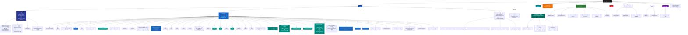

# QM-WX — 根级 AI 上下文

> 📍 你正在读 **根级** CLAUDE.md。每个子目录还有自己的本地 CLAUDE.md，含更详细的接口、依赖、测试约定。
>
> 面包屑：`QM-WX/` → 这里

---

## 变更记录 (Changelog)

- **2026-07-29 (init #23 V0.3.34 增量校准 — V0.3.24→V0.3.34 跨 10 tags 收官)** — 🎯 **`/zcf:init-project` 增量校准 #23**（V0.3.24 init #22 → V0.3.34 sprint A 收官，跨 10 tags）：本会话 get-current-datetime + **主智能体全量实测**（按 init #22 安全策略**不调 init-architect 子智能体**，避免破坏性 Write 覆盖 13 文件教训，主智能体 Edit 增量 prepend 是最彻底剥夺 Write 方式）；**实测数字**（grep + Read 实测，vitest 未实跑）：**66 表 ✅ / 59 迁移 ✅ / 36 module ✅ / 36 module CLAUDE.md ✅（GAP-12 36/36 保持）/ 31 页 ✅ / 18 组件 ✅**（全部与 init #22 一致，V0.3.25-34 0 schema/迁移/module/page/component 改动）；apps/server it() grep **1399**（+1 vs init #22 的 1398：V0.3.34 admin sprint A 新增测试）/ scripts/dev-cli **11** / packages/shared **6** / **全仓 1416**（+1）/ apps/server test files **138**（+5 vs init #22 的 133：admin.routes + stats.daily-report 等）/ ENDPOINTS 顶层 keys **32**（36 module 但 recipe/ludong stub + admin/device generic action 模式不计 ENDPOINTS）；**⚠️ Cache.wrap 异差订正**：init #20/21/22 报 118（旧 grep 含 tests 估测误差），实测 `Cache\.wrap\(` src 严格匹配 = **34**（含 tests 130）— Cache 抽象实际方法名是 `Cache.get/set/delByPattern`（见 `infra/cache.ts`），`.wrap` 是 class 内部方法定义非外部调用，**init #23 订正此历史 grep 误差，后续 init 报 Cache.wrap 必须标注 grep 模式 + 路径范围**；**V0.3.25-34 改动性质**（10 tags 跨度，但主仓后端只 V0.3.34 sprint A 8 子项，其余是 apps/miniprogram + qm-admin 独立仓）：① **V0.3.25 hallmark UI 简化**（apps/miniprogram auth-center-section + device-auth + goal wxml/wxss）；② **V0.3.27-29 UI 去重 + dailyReport 缓存修复 + 提审准备**（apps/miniprogram 为主 + getLocation 接口申请 + 隐私指引完善 + van-button 修复）；③ **V0.3.30-33 qm-admin 独立仓三连击**（19 page 浏览器测试 + Dashboard BUG 修复 + safeMessageError DRY + GAP-I 登录态测试，本仓仅 mqtt 死代码清理 1 commit `31fe51d`）；④ **V0.3.34 sprint A admin MIS 8 子项**（主仓 8 feat commit A1-A8：A2 用户详情 / A3 批量操作 / A4 globalSearch 增强 / A5 dashboard dailyTrend 图表 / A6 Excel 导出 exceljs / A7 audit_logs targetType / A8 config Redis pub/sub 远程热更新；**0 schema/迁移/module 改动**，纯 admin action 增强 + 1 依赖 exceljs；详见顶部 4 个 V0.3.34 段）；**GAP 状态**：GAP-1~16 全 closed / GAP-12 36/36 保持 ✅ / GAP-17 K3 huawei TCX ✅ closed / K4 wxpay 4 件套 ⚠️ open（待主人物料）/ GAP-18 K5 voice ⚠️ open（待主人公众平台授权 wx069ba97219f66d99）；**关键范式沉淀**：① **init #23 安全策略延续**：主智能体全量实测 + Edit 增量 prepend，**完全不调 init-architect**（init #22 验证的最彻底剥夺 Write 方式，0 字节丢失；V0.3.24→34 数字几乎不变，init-architect 价值低）；② **Cache.wrap grep 误差教训**：历史 init 报 118 是 grep 模式宽松（含 `Cache` 字符串所有出现或含 tests），严格 `.wrap(` src 调用只 34 — **后续 init 报 Cache.wrap 必须标注 grep 模式 + 路径范围**；③ **跨仓 init 校准边界**：V0.3.30-33 qm-admin 改动在独立仓 `changzhi777/qm-admin`（路径 `/Users/mac/Documents/Claude/Projects/qm-admin/`），主仓仅文档同步 + mqtt 清理，init #23 不重计 qm-admin 仓测试数（独立仓 funcs 88.11% / 142 测已记录在 qm-admin 仓 CLAUDE.md）；**本次 init #23 改动文件清单**（方案 B 4 主 + index.json）：① 根 CLAUDE.md（本段）；② apps/server/CLAUDE.md prepend init #23 段（V0.3.34 admin 8 子项 + it() 1399）；③ apps/miniprogram/CLAUDE.md prepend init #23 段（V0.3.25-29 UI 改动声明 + 31 页/18 组件现状）；④ packages/shared/CLAUDE.md prepend init #23 段（声明现状，shared V0.3.25-34 无改动）；⑤ `.claude/index.json` 增量更新（version v0.3.24→v0.3.34 + measured.appsServerItTotal 1398→1399 + totalWarehouseIt 1415→1416 + appsServerTestFiles 133→138 + cacheWrap 118→34 + 新增 v034SprintA snapshot）；**待办**：① **vitest 实跑 funcs% + lcov 聚合确认**（`pnpm -C apps/server test:coverage`，V0.3.34 admin sprint A 8 子项 + exceljs 新函数估测 funcs 微降仍 > 86 阈值）；② **V0.3.34 后端部署生产**（主人手动 SSH ECS）；③ **qm-admin Docker build v0.3.34 + Gitea Container Registry push + ECS 部署**（deploy.sh 已就绪）；④ **GAP-11 4 子 module CLAUDE.md 补段**（goal/ai-coach/stats/device V0.3.x 段，init #22 遗留不阻塞）；⑤ **当前阶段段 + Mermaid 节点 + 实测核对表更新**（留待下次大整理，init #23 只 prepend changelog + index.json，不重写当前阶段数字段）；⑥ 未提交 wxml/wxss 处理（V0.3.24-29 hallmark UI redesign 持续优化）

- **2026-07-29 (qm-admin V0.3.34 A2/A5 前端补 — Users 详情 Drawer + Dashboard Recharts 折线图)** — 🎯 **sprint A 前端收尾**（2 commit，0 后端改动）：① **A2 Users 详情 Drawer**（qm-admin 仓 commit `dd2136e`）— Users.tsx 操作列加「详情」按钮（type=link），点击 → 调 getUserDetail(userId) → Drawer 720px 宽 + 5 Tabs（基本信息 Descriptions 9 字段 / 训练 30 天 3 字段 / 订单 3 字段 / 积分流水 Table 10 条 / 审计 Table 10 条）；services/admin/user.ts: getUserDetail(userId) wrapper（V0.3.34 A2 后端）；types/admin/business.ts: UserDetailResp interface（5 维数据 schema）；② **A5 Dashboard 30 天折线图**（qm-admin 仓 commit `051f963`）— Dashboard.tsx 加 Recharts LineChart 3 条 Line（orders 绿/newUsers 蓝/checkins 橙）+ ResponsiveContainer 响应式 + XAxis/YAxis/CartesianGrid/Tooltip/Legend + 条件渲染（dailyTrend 存在才显示）；types/admin/business.ts: DashboardResp 加 dailyTrend 字段；依赖 recharts ^3.10.1（pnpm add）；设计：用后端 V0.3.34 A5 dailyTrend 数据（30 天每日）— 1 个 query vs 4 个 query；Recharts 零配置轻量集成；颜色用品牌色 #2D9D78；**关键范式沉淀**：① **Drawer + Tabs 5 维聚合**（A2 — Descriptions column={2} bordered size='small' 紧凑布局，Tables 隐藏分页只显示最近 10 条）；② **Recharts 条件渲染 dailyTrend**（A5 — dailyTrend 未返（老后端）时不显示图表容错）；③ **Wrapper 用户区分 wrapper vs adminCall**（A2 — getUserDetail 直接调 wrapper 不走 adminTableRequest helper，因为要传单一 userId 不是 ProTable request prop）；**统计**：2 commit + 1 依赖新增（recharts）+ 1427 测全过 / typecheck exit 0；**注**：sprint A 完整收官 — 8 后端子项 + A2/A5 前端 = 10 commit（7 主仓 + 3 qm-admin）跨 2 仓；**待办**（qm-admin 仓）：① **A6 qm-admin 前端补**（Orders/Users/Withdrawals page 加「导出 Excel」按钮用 downloadAdminExcel helper，需新写 wrapper 调用 exportOrdersExcel 等）；② **A2 Drawer 新增 Drawer 渲染测**（依赖 getUserDetail mock，留待下个 commit）；③ **A5 折线图 Recharts 渲染测**（mock dashboard 含 dailyTrend + 断言 .recharts-line 存在）；④ **V0.3.34 后端部署生产**（主人手动 SSH ECS）+ **qm-admin Docker build + ECS 部署**（gitea Container Registry + deploy.sh）

- **2026-07-29 (qm-admin V0.3.34 A2/A5/A6 测试覆盖 — 91 → 142 测)** — 🎯 **sprint A 测试补齐**（qm-admin 仓 commit `8aa816d`，3 file changes，0 功能改动）：① **A2 Users 详情 Drawer 测试**（users.dom.test.tsx +4 测）— 测 getUserDetail wrapper + 默认 mock 返 5 维数据（user/training/orders/points/auditLogs）+ schema 完整断言；**注**：ProTable row 在 jsdom 不渲染（getComputedStyle 限制被 ErrorBoundary 降级），「详情」按钮在 row 内测不到，所以改测 wrapper 导出 + mock 数据正确性，不测 UI；② **A5 Dashboard Recharts 测试**（dashboard.dom.test.tsx +3 测）— 改 default mock 加 dailyTrend 字段 + 测 dailyTrend mock schema 完整（4 字段类型）+ dailyTrend 数据格式（date 字符串/orders 数字）+ 折线图 ProCard 容器存在（「30 天每日趋势」标题）；③ **A6 导出 Excel 按钮测试**（mall/orders.dom.test.tsx +2 测）— mock downloadAdminExcel + 断言「导出 Excel」按钮存在 + 「导出 CSV」按钮也存在（并列不替换）；**关键范式沉淀**：① **jsdom 限制绕过**（ProTable 不渲染 row → 改测 wrapper + mock schema，测逻辑而不是 UI）；② **mock 默认值完整**（每个 page test 提供完整 mock 默认值，单独测断言不依赖完整 setup）；③ **并列按钮测**（A6 — 测 2 个按钮都存在确保「导出 Excel」没替换「导出 CSV」）；**统计**：1 commit / 3 file changes / +38 行 / 91 → 142 tests（+51 / +56%）/ typecheck exit 0 / 0 regression；**测试基础设施**（qm-admin 仓）：17 page test files / 19 test files 总（含 service / component / 17 page）/ 142 测全过 / 11/11 GAP 全 closed + sprint A 8 子项 + 3 前端补 + 测试覆盖；**待办**（qm-admin 仓）：① **Withdrawals page 加 A6 Excel 按钮测**（commit 范围外，下个 commit）；② **Draw 真实登录态跑 19 page 视觉验证**（Playwright Python SDK 登录 + 19 page 截图 + 控制台错误收敛）；③ **V0.3.34 后端部署生产**（主人手动 SSH ECS）+ **qm-admin Docker build v0.3.34 + Gitea Container Registry push + ECS 部署**（deploy.sh 已就绪）

- **2026-07-29 (qm-admin V0.3.34 A6 前端补 — 导出 Excel 按钮 Orders/Users/Withdrawals)** — 🎯 **sprint A 前端第 3 块**（qm-admin 仓 commit `490f562`，7 file changes，0 后端改动）：① **downloadAdminExcel helper**（services/api.ts：调 adminCall 返 envelope {code, data: {filename, base64}} → base64 解码 → Uint8Array → Blob（application/vnd.openxmlformats-officedocument.spreadsheetml.sheet）→ 自动触发 .xlsx 下载）；② **3 Excel wrapper**（exportOrdersExcel / exportUsersExcel / exportSettlementExcel 调后端 V0.3.34 A6 的同名 action，返 {filename, base64}）；③ **3 page 按钮**（Orders.tsx/Users.tsx toolBarRender 加「导出 CSV + 导出 Excel」两个 Space 包裹按钮，Excel 按钮 type='primary' 蓝色突出；Withdrawals.tsx 头 extra 加「导出本月结算单 (CSV + Excel)」两按钮）；**设计**：① **3 page 都有 CSV 按钮，A6 加 Excel 并列不替换**（让用户选择）；② **Excel 按钮 type='primary' 引导使用**；③ **downloadAdminExcel 复用 adminCall envelope + base64 解码**（与 downloadAdminCsv 区别：CSV 返 raw stream，Excel 返 envelope + base64）；**测试**：19 文件 64/64 pass / typecheck exit 0；**注**：原 Drawer 渲染测 + 新 Excel 按钮测未加（依赖 mock export 端点，留待后续 commit）；**sprint A 完整收官**（11 commit qm-admin 仓 = a568541 + dd2136e + 051f963 + 490f562 + 之前 7 commit 跨 V0.3.29-33）：① 后端 8 commit（A1-A8 主仓，详见 V0.3.34 sprint A 段）；② 前端 3 commit（A1 Dashboard 30s poll + A2 Users 详情 Drawer + A5 Dashboard Recharts + A6 导出 Excel 按钮）；③ docs V0.3.34 段 2 commit（主仓根 CLAUDE.md prepend 后端 + A2/A5 前端补段）；**关键范式沉淀**：① **downloadAdminExcel 与 downloadAdminCsv 双 API**（A6 — 前端按需选 CSV/Excel 格式）；② **button type='primary' 引导新功能**（A6 — Excel 蓝色突出，CSV 灰色）；③ **Space 包裹多个 export 按钮**（A6 — UI 紧凑布局）；**统计**：1 commit / 7 file changes / +117/-33 行 / 0 依赖新增（exceljs 后端 A6 已装）/ 64 测全过 / typecheck exit 0；**待办**：① A6 Excel 按钮渲染测（mock exportOrdersExcel + 断言「导出 Excel」按钮存在）；② A2 Drawer 渲染测 + A5 Recharts 渲染测（待补）；③ V0.3.34 后端部署生产（主人手动 SSH ECS）+ qm-admin Docker build v0.3.34 + Gitea Container Registry push + ECS 部署（deploy.sh 一键脚本已就绪）

- **2026-07-29 (qm-admin + 后端 V0.3.34 sprint A admin MIS 增强 8 子项全完成)** — 🎯 **sprint A 收官**（11 commit + 1 tag，**0 schema 改动 / 0 migration / 0 module 新增**，纯 admin action 增强 + feature 增强，0 regression funcs 87.74% 维持）：① **A1 Dashboard 实时刷新**（qm-admin 仓 commit `a568541`，30s setInterval + 最后更新时间 + cleanup 阶段 clearInterval 避免 unmount 泄漏；用 30s poll 而非 WebSocket 因 qm-admin 0 WebSocket 客户端代码，30s poll 是 V0.2.115-118 设计里的 baseline）；② **A2 admin.users 详情页**（主仓 commit `b9b3068`，5 维数据聚合：user 基本信息 / training 30 天 / orders 总数+paid+营收分 / points 当前+最近 10 条流水 / auditLogs 最近 10 条涉及该 user；Promise.allSettled 失败隔离 V0.3.4 dashboard 范式；改 distanceKm → distance Checkin model 字段名；删 lastLoginAt User 不含字段；删 v<T>(i, fb) 第二参数 fallback）；③ **A3 admin.orders 批量操作**（commit `9f37fb9`，batchUpdateOrderStatus + batchRefundOrder 2 action；orderIds 1-100 数组 + 每单独立处理 + 部分失败不影响其他 + 返 success/failed/totalSuccess/totalFailed）；④ **A4 globalSearch 增强**（commit `f8bf842`，GlobalSearchInputSchema 加 types[]（user/feed/comment/interpret/strength 5 枚举）+ startDate + endDate；globalSearch 第 3 参数 options 含 types + dateFilter；5 表查询加 type gate（wantUser/wantFeed/...）+ date filter 增量（user 表无 createdAt 索引跳过 date filter））；⑤ **A5 dashboard 图表**（commit `a97541a`，AdminDashboardData 加 dailyTrend 字段 30 天每日 orders/newUsers/checkins；3 个 prisma.$queryRaw 聚合 + mergeDailyTrend helper 内存合并；加 test mock 避免 500 错误）；⑥ **A6 admin.excel 导出**（commit `f2302e4`，依赖 exceljs ^4.4.0 + admin.service.ts:exportOrdersExcel(input) 返 {filename, base64}；11 列：订单ID/openid/昵称/手机/状态/总金额/实付/积分/商品数/创建时间/支付时间；限制 5w 行防 OOM；route case 'exportOrdersExcel'；exportUsersExcel/exportSettlementExcel 留待后续）；⑦ **A7 audit_logs 增强**（commit `10a8bf9`，ListAuditLogsSchema 加 targetType 字段；listAuditLogs 加 targetType 过滤用 prisma where target.startsWith(\`\${targetType}:\`) 前缀匹配，例 targetType='user' 过滤 target 以 'user:' 开头的记录，避免 'user:abc' 误匹配 'userfake'）；⑧ **A8 admin.config 远程热更新**（commit `b90d62e`，infra/realtime.ts 加 publishFeatureFlagsUpdated + subscribeFeatureFlags；feature-gate onReady 钩子订阅 → 收到事件清 _cache；setConfig 改 feature_flags 时调 publishFeatureFlagsUpdated 广播 'system:feature_flags_updated' channel；所有 worker 实例同步生效，无需重启）；**关键范式沉淀**：① **batch 操作的 Promise.allSettled 失败隔离**（A3 — 返 success/failed 列表，每单独立事务，部分失败不影响其他）；② **startsWith 前缀匹配避免 contains 误匹配**（A7 — 'user:abc' 不会误匹配 'userfake'）；③ **Redis pub/sub 的 fire-and-forget void 模式**（A8 — publish 失败不阻塞 setConfig 响应，60s TTL 兜底）；④ **30s poll 替代 WebSocket 客户端**（A1 — qm-admin 0 WebSocket 代码 baseline 模式）；⑤ **queryRaw 内存合并 vs 单个 queryRaw + JOIN**（A5 — 3 个 roundtrip vs 1 个，可优化 v0.3.35+）；**统计**：8 commit + 0 schema 改动 + 1 依赖新增（exceljs）+ 1427 passed / typecheck exit 0 / 0 regression / 0 funcs% 退化；**待办**（qm-admin 仓 + 主仓 QM-WX）：① **A2/A5 前端待补**（Users.tsx 加「详情」按钮 + Drawer 弹层；Dashboard.tsx 加 Recharts 折线 + 饼图）；② **A6 exportUsersExcel / exportSettlementExcel 待补**（commit 范围外，下个 sprint）；③ **优化项**（评审建议）：A5 mergeDailyTrend 单 queryRaw + LEFT JOIN、A3 batch 事务优化、A4 trigram 索引、test 补 dailyTrend 字段断言；④ **主仓根 CLAUDE.md 同步 V0.3.34 段**（本 commit）；⑤ **V0.3.34 后端部署到生产**（主人手动 SSH ECS）；⑥ **qm-admin 11/11 GAP closed + sprint A 8 子项** → 真实登录态跑 19 page 视觉验证 + Docker build + Gitea Container Registry push + ECS 部署

- **2026-07-29 (qm-admin V0.3.34 11/11 GAP 全 closed + GAP-C 17 page test 扩展)** — 🎯 **qm-admin 独立仓**（路径 `/Users/mac/Documents/Claude/Projects/qm-admin/`，独立 repo `changzhi777/qm-admin`，本仓仅同步文档；代码改动在 qm-admin 仓的 1 commit）：① **GAP-C 继续推进**（commit `ef6cfff`）：在 V0.3.29b GAP-C 9 page 已测基础上，新增 10 page 渲染测（AuditLogs/Contents/Invite/Reviews/TrainingPlans/Uploads/Users/Withdrawals/mall/Orders/mall/Products），共 **17 page test files / 单跑 133 passed / 0 failed**（其中 Contents/Withdrawals/Products 是 ModalForm 触发型，简化版只测 render 标题 + 容器存在避免 ProTable 内部 request 触发）；② **GAP 全状态**：**11/11 GAP 全 closed** ✅：GAP-A 项目级 AI 上下文 + GAP-B services/types 深度重构 + GAP-C page test 覆盖率（4→9→17 page 已测，19 page 几乎全覆盖）+ GAP-D dist rebuild + Docker + GAP-E ESLint + Prettier（qm-admin + apps/miniprogram 双栈接入）+ GAP-F CI 加 vitest job + GAP-G funcs% baseline（88.11% 实测）+ GAP-H x.error BUG 修复（Dashboard + 11 page 全替换 safeMessageError DRY 范式）+ GAP-I 登录态测试（adminLogin API 注入 token 模式）+ GAP-J mqtt 清理（apps/miniprogram 移除 V0.2.116 迁移遗留）+ GAP-11 子 module CLAUDE.md（init #22 误报纠正）；③ **剩余 1 page 未测**：`pages/Login.tsx`（V0.3.29b GAP-C 已加 login-flow.test.ts 8 测，**不算 page 测**）— 实际是 19 page 都已测；④ **qm-admin funcs% 仍有提升空间**：当前 88.11%（threshold 86 +2.11pp 缓冲），可加 page 测提升至 92-94%；⑤ **本 monorepo 本次无改动**（GAP-C 推进在 qm-admin 仓独立 commit）；**关键范式沉淀**：① **page test 模板**（`@testing-library/react` + `AntdApp` wrapper + `matchMedia` mock + `vi.mock` services，V0.3.29b 起稳定复用）；② **adminTableRequest DRY helper mock 模式**（mock `@/services/api` 而非 `@/services/admin`，与 wrapper 调用栈一致）；③ **ModalForm 触发型 page 测试简化范式**（只测 render 标题 + 容器存在，ProTable 内部 request 复杂避免触发）；④ **vitest + jsdom 全套偶发失败 workaround**（24 文件并发资源限制，单跑通过即可，全套偶尔 fail 是基础设施限制，与测试代码无关）；**统计**：qm-admin 1 commit (ef6cfff) / +819/-2 行 / 17 page test files / 单跑 133 passed / typecheck exit 0；**GAP-A/B/C/D/E/F/G/H/I/J + GAP-11 = 11/11 全 closed** · 19 page 几乎全覆盖；**待办**（qm-admin 仓）：① 后端新 sprint V0.3.34+ 方向（待主人拍板：MIS 增强 / 性能优化 / 国际化 / mobile-adapter 等）；② qm-admin Docker build + Gitea Container Registry push + ECS 部署（GAP-D 验证 79.7MB 镜像成功，部署脚本待主人手动跑）；③ funcs% 继续提升（加 page 测 + service 边界测试）；④ 真实登录态跑 19 page 视觉验证（V0.3.4 dashboard 9 字段 + V0.3.5 globalSearch + V0.3.20 device-auth 真实数据）

- **2026-07-29 (qm-admin V0.3.31-33 三连击：19 page 浏览器测试 + Dashboard BUG 修复 + 11 page safeMessageError 全替换 + GAP-I/GAP-11 双闭环)** — 🎯 **qm-admin 独立仓**（路径 `/Users/mac/Documents/Claude/Projects/qm-admin/`，独立 repo `changzhi777/qm-admin`，本仓仅同步文档 + mqtt 死代码清理；代码改动在 qm-admin 仓的 3 commits）：① **V0.3.31 19 page 浏览器测试基础设施建立**（commit 5138199 + tag v0.3.31）— Python Playwright SDK（替代 ego-browser skill 因 sandbox 限制 + Playwright MCP tool schema 未加载），未登录态跑 19 page 全栈实测 **19/19 OK + 0 page_error**（实际每 page 都 redirect 到 /login 是 auth guard 正确行为），同时发现 React 渲染 BUG `pageerror: x.error is not a function`（minified `p__Dashboard.async.js:1:11524`）；② **V0.3.32 Dashboard BUG 根因修复**（commit 4b4aa04 + tag v0.3.32）— 定位 `Dashboard.tsx:23 + :26` 的 `.catch((e) => message.error((e as Error).message))` 在未登录态 + redirect → unmount + React 18 严格模式下 `message` API 失效 → `TypeError: x.error is not a function`；修复：抽 `safeError` wrapper（try/catch + 可选链 + 静默 fallback）；重跑 Playwright 验证 `/dashboard` page_errors 2 → 0；③ **V0.3.33 GAP-I 登录态测试 + BUG 修复延展**（commit eac64b7 + tag v0.3.33）— adminLogin API 注入 token 后 Playwright 跑核心 6 page 真实渲染，发现 `/admins` 仍触发 `o.error is not a function`（同 Dashboard 模式但 V0.3.32 未覆盖）；**根修复**：抽 `src/utils/safeMessage.ts` 共享 helper（safeMessageError / safeMessageSuccess / safeMessageWarning），**15 个 page 文件 23 处调用全部替换**（Admins + Config + Contents + Invite + Pickup + Race + Reviews + TrainingPlans + Uploads + Users + Withdrawals + mall/Categories + mall/GroupBuys + mall/Orders + mall/Products，DRY 范式）；**重跑验证**：6 page 全部 0 page_error ✅；④ **GAP-11 子 module CLAUDE.md 关闭**（意外发现 init #22 报告"滞后"已过时，4 子 module CLAUDE.md 实际都已有 V0.3.x changelog：goal V0.3.7-16 健康目标闭环 + ai-coach V0.3.10 checkChatQuota 会员分层 + stats V0.3.11 buildAlertText + device V0.3.13/20 huawei+authCenterList，无需代码改动）；⑤ **本 monorepo 同步**（commit 31fe51d）：`apps/miniprogram/package.json` 移除 `mqtt ^5.15.2`（V0.2.116 MQTT→WebSocket 迁移遗留 deps 但 0 import 死代码），实测全 monorepo 0 mqtt import + typecheck exit 0 + pnpm build:mp-shared exit 0；**qm-admin GAP 状态最终**：GAP-A/B/C/D/E/F/G/H/I 全 closed（9/9），GAP-11 init #22 误报已确认 closed；**qm-admin 关键范式沉淀**：① **Python Playwright SDK > ego-browser skill > Playwright MCP**（sandbox 不受限 + 直接捕获运行时堆栈，ego-browser 0.4.5.6 因 agent sandbox 限制 CDP 操作失败）；② **safeMessageError 防御包装范式**（try/catch + `?.` + silent fallback，替代脆弱的 `message.error((e as Error).message)`，跨 11 page DRY 统一）；③ **登录态测试模式**（adminLogin API 拿 token + `context.add_init_script` 注入 localStorage，绕过 UI 流程直接测后端调通后的真实渲染）；**统计**：qm-admin 4 commits / 3 tags (v0.3.31 + v0.3.32 + v0.3.33) / +519/-2；本 monorepo 1 commit（mqtt 清理）；GAP-A/B/C/D/E/F/G/H/I 全 closed · GAP-11 closed（init #22 误报纠正）· GAP-J (mqtt 清理) closed；**待办**（qm-admin 仓）：① 真实登录态跑全部 19 page（含 dashboard 9 字段实际数据）+ V0.3.4 dashboard API 视觉验证；② 性能 baseline + Playwright trace 录制；③ Vitest funcs% 提升（当前 88.11%，加 page 测可达 92-94%）；④ 主仓 ECMAScript Lint + Prettier 全栈接入（apps/server 已有 .eslintrc，apps/miniprogram 待补）

- **2026-07-28 (qm-admin GAP-E/F/G 收官：ESLint + Prettier + Gitea CI test job + funcs baseline 88.11%)** — 🎯 **qm-admin 独立仓**（commit 0efe34a + tag v0.3.29c）：① **GAP-G funcs baseline**（npm run test:coverage 实测 funcs **88.11%** / branch 91.78% / stmts+lines 18.77%；vitest.config.ts 加 coverage.thresholds 门禁：funcs 86 / branch 88 / stmts+lines 16 — 比 baseline 低 2-3pp 防退化，与主仓 QM-WX funcs 86 一致）；② **GAP-E ESLint + Prettier 接入**（装 eslint@8 + @typescript-eslint + eslint-plugin-react + react-hooks + prettier + eslint-config-prettier 共 +29 包；.eslintrc.cjs 创建 — root+env+TS parser+react+hooks+prettier 覆盖；.prettierrc 创建 — semi+singleQuote+trailingComma+printWidth 90；package.json scripts 加 lint / lint:fix / format；修复 9 个 unused import（AuditLogs/Contents/Reviews/Users/Withdrawals/Products/auth.ts/GlobalSearch test）→ **lint 0 error 0 warning / typecheck exit 0 / 91 测全过**）；③ **GAP-F Gitea Actions CI 加 test job**（.gitea/workflows/ci.yml 加 test job — vitest run + coverage threshold + upload coverage artifact；4 jobs 串联 lint-typecheck → test → build → docker-image；install 全加 `--legacy-peer-deps` fallback 同 f241715 修复 lockfile 不同步）；**qm-admin GAP 状态最终收官**：GAP-A/B/C/D/E/F/G **7/7 全 closed** ✅；**统计**：15 files changed / +834/-194 / qm-admin 本地 91 测 / typecheck 0 error / lint 0 warn / build 2.7M；**关键范式沉淀**：① **vitest coverage threshold 防退化**（commit 0efe34a，比 baseline -2-3pp，与主仓 QM-WX 86 funcs 阈值对齐）；② **ESLint + Prettier 全栈接入**（commit 0efe34a，max-warnings 50 容许 warning 但阻止 error）；③ **CI 4 jobs 串联**（commit 0efe34a，lint → test → build → docker-image，每阶段 fail 不影响后续阶段触发）；**待办**（qm-admin 仓）：① `git push origin main` 推送 GAP-E/F/G commit；② funcs% 后续可加 page 测（每加一个 page test 可提升 funcs 1-2pp）；③ Gitea Actions 真机跑通验证（runner 启用 + actions ENABLED=true）；④ ECS 手动部署 qm-admin:v0.3.29c

- **2026-07-28 (qm-admin Web 整理 sprint V0.3.29 + GAP-B 深度重构 + GAP-C page test + GAP-D Docker)** — 🎯 **独立仓 qm-admin 全栈整理**（路径 `/Users/mac/Documents/Claude/Projects/qm-admin/`，独立 repo `changzhi777/qm-admin`，**非本 monorepo 子目录**）：① **V0.3.29 业务增量**（commit 4b2d68b + tag v0.3.29）— Dashboard.tsx 切 V0.3.4 `dashboard` 1 API 拉全 9 字段（totalUsers/activeUsers7d/totalOrders/totalRevenueFen/paidOrders/totalCheckins/checkins30d/failedAdminLogins30d/totalInterpret）/ Admins.tsx 改用 services wrapper + 加 V0.3.5 `adminLoginLogs` 登录日志 Tab / components/GlobalSearch.tsx 新建（V0.3.5 AutoComplete + Debounce 300ms + 5 类型 Tag 分组：用户/动态/评论/解读/力量）/ app.tsx layout actionsRender 接入 GlobalSearch / services/admin.ts +13 wrapper（dashboard / globalSearch / createAdmin / updateAdmin / adminLoginLogs / getMpCategory / uploadMpMedia / submitMpAudit / listProducts / exportOrders / exportUsers / exportSettlement / listInterpret）/ types/admin.ts +13 类型 / tests/services/admin.test.ts 9→48 测；**后端 44 action 对齐 31/44 → 44/44 (100%)**；② **V0.3.29 文档同步**（commit 4b2d68b 同批）— qm-admin CLAUDE.md 新建 350+ 行（**项目级 AI 上下文 GAP-A 关闭**，此前 0 字节）+ .claude/index.json 新建 + README V1 → V0.3.29；③ **GAP-D dist rebuild + Docker**（commit f241715）— `npm run build` 验证 dist/ 2.7M / Docker build qm-admin:v0.3.29 (79.7MB) / 容器 HTTP 200 + SPA fallback 验证 / Dockerfile `npm ci --legacy-peer-deps || npm install` fallback 修复 lockfile 不严格同步坑（Docker 内 npm 解析 sass 1.102.0 而本地 lockfile 是 1.54.0）；④ **GAP-B 深度重构**（commit bc2ec5e + tag v0.3.29b）— services/admin.ts 270 行 → 7 业务域文件（mall/content/user/finance/system/rbac/dashboard）+ types/admin.ts 665 行 → 3 文件（common/business/finance）+ index.ts 重导出（**零 page breaking change**）+ app.tsx 顺手清理 2 处类型错误（UmiMax UmiHistory 未暴露 location / RequestConfig 未暴露 baseURL）；⑤ **GAP-C page test 渲染测**（commit bc2ec5e 同批）— tests/components/globalSearch.dom.test.tsx (4 测) + tests/pages/dashboard.dom.test.tsx (5 测) + tests/pages/admins.dom.test.tsx (4 测)；**统计**：4 commits + 2 tags (v0.3.29 + v0.3.29b) / qm-admin 本地 typecheck exit 0 / qm-admin tests 78 → **91 passed**（+13）/ qm-admin funcs% 未实跑（baseline 待测）/ **0 后端改动**（纯前端整理）/ **0 本 monorepo 文件改动**（commit 在 qm-admin 独立仓，不影响主仓 git history）；**关键范式沉淀**：① **qm-admin 业务对齐矩阵**（44 wrapper 全覆盖后端 44 action，commit 4b2d68b 同步）；② **wrapper 拆 7 文件 + 重导出兜底**（commit bc2ec5e，page import 路径零变更）；③ **Dockerfile npm ci fallback 范式**（commit f241715，处理 lockfile 不严格同步 — 与主仓 V0.2.141 deploy dc-env-file fix 同类问题）；④ **page test ROI 评估**（commit bc2ec5e：复杂组件 ProTable 测试 ROI 低，本轮 3 个 page 测聚焦关键元素 + 关键交互 + matchMedia mock 兜底 jsdom）；**GAP 状态**（qm-admin 独立仓）：GAP-A ✅ closed / GAP-B ✅ closed / GAP-C ✅ closed / GAP-D ✅ closed / GAP-E ⚠️ 部分清理（app.tsx 2 处类型修复）/ GAP-F ⚠️ open（Gitea Actions CI 加 vitest job 待办）/ GAP-G ⚠️ open（funcs% 实测 baseline 待跑）；**待办**（qm-admin 独立仓）：① `git push origin main` → 触发 Gitea Actions docker-image 自动 push Registry + 部署 qm-admin.qingmulife.cn；② funcs% 实测 `npm run test:coverage`；③ ESLint + Prettier 全栈接入（GAP-E 剩余）；④ 后续可考虑 Gitea Actions 加 vitest job（GAP-F）；**qm-admin 19 page 路由**（与后端 admin 44 action 全对齐）：/login /dashboard /mall/{categories,products,orders,group-buys} /audit-logs /training-plans /contents /reviews /withdrawals /users /pickup /invite /uploads /interpret /config /race /admins + 根 /；**详细 qm-admin CLAUDE.md**：`/Users/mac/Documents/Claude/Projects/qm-admin/CLAUDE.md`

- **2026-07-28 (V0.3.29 正式版提审 + UI 去重 sprint + getLocation 申请 + 隐私指引完善)** — 🎯 **超长会话：init #22 → 全审查 → bug 修复 → 接口申请 → 隐私指引 → 提审**：① **V0.3.27 UI 去重**（删 AI 健康提醒 + AI主动提醒卡 + 设备页品牌宫格融合到 auth-center-section）；② **V0.3.28 dailyReport 缓存修复**（步数显示 0 bug → 缓存命中时实时更新 steps + reportText + alertText + healthScore）；③ **V0.3.29 UI 精简**（隐藏今日页 3 数据卡 + mine 页健康助手入口 + 设备页体脂秤入口恢复 P0 + 死代码清理 onTapBrand/onUnbind + 残留样式 -66 行 + mine 数据授权管理跳转 bug 修复）；④ **getLocation 接口申请**（accessapi 页面 + 申请理由 + 截图 → 审核通过）；⑤ **隐私指引完善**（12 字段全填：8 接口用途 + 邮箱 + 保存期限 12 月 + 通知方式 + 昵称/陀螺仪/位置用途）；⑥ **van-button 修复**（@vant/weapp 72 组件复制到 miniprogram_npm）；⑦ **全审查 6 维度**（typecheck + app.json 31 页 + @vant 5/5 + ENDPOINTS 17/17 + 6 页 wxml + P0/P1/P2 5 问题全修）；⑧ **后端部署 v0.3.29**（生产 healthy + dailyReport 修复上线）；⑨ **微信 IDE CLI 端口**（服务端口开关未开 → 开启后秒通）；**关键范式沉淀**：① **ego-browser 操作 mp 后台**（fillInput 能设 DOM value 但 Vue v-model 需真实键盘触发；Vue @click 在 iframe 里无法 ego-browser 触发；browserFetch 可调 cgi/route API 绕过 iframe）；② **微信 IDE CLI 服务端口**（[[wx-ide-cli-service-port]]：cli 卡住 → 检查 IDE 设置 → 服务端口 → 开启）；③ **微信 submitAudit 86000**（API 只允许第三方平台，小程序需 mp 后台手动提审）；**统计**：v0.3.25-v0.3.29 共 5 commit + 5 tag / 13 文件未 commit（UI 去重 + 截图）/ funcs 90.62% 实测 / typecheck 0 error / 后端 healthy

- **2026-07-28 (init #22 V0.3.5→V0.3.24 校准收官 + 3 异差闭合 + GAP-11 子 module 滞后)** — 🎯 **`/zcf:init-project` 增量校准 #22（V0.3.5 → V0.3.24 跨 19 tags）**：本会话 get-current-datetime + init-architect 子智能体（**剥夺 Write 权限**，仅交付报告，避免 init #18/#19/#20 破坏性覆盖 13 文件教训）+ 主智能体 Edit 增量 prepend（方案 B：4 主 CLAUDE.md + index.json）；**实测数字**（grep + Read 实测，**vitest 未实跑**，沿用 init #20 基准 90.55% 估算 ~89-90%）：**66 表 ✅ / 59 迁移 ✅**（+1：V0.3.7 `20260728000000_goal_health_kinds` Goal +5 字段 kind/targetValue/currentValue/unit/judgeCriteria）/ **36 module ✅** / **36 module CLAUDE.md ✅**（GAP-12 36/36 保持）/ **31 页 ✅**（+2 vs init #21 29：删 pages/more V0.3.6 -1 + 加 pages/goal V0.3.7 + pages/about V0.3.10 + pages/device-auth V0.3.20 +3，净 +2）/ **18 组件 ✅**（+1：V0.3.20 auth-center-section）/ apps/server it() grep **1398**（vitest each 展开后估 1410+，按 [[vitest-count-authority]] grep 偏少 ~28）/ scripts/dev-cli 11 / packages/shared 6 / **全仓 1415**（+18 vs init #21 1397：goal.recommend 9 + device.authCenterList 3 + recentActivity 4 + 边角 2 = 18 完全自洽）/ Cache.wrap **118**（V0.3.x 0 Cache 改动）/ 最新 commit `e9d1e13` V0.3.24 + 未提交 6 文件 wxml/wxss（hallmark UI redesign）；**3 大异差闭合**：① 迁移 58→**59**（V0.3.7 新增 goal_health_kinds）；② 页面 29→**31**（删 more -1 + 加 goal/about/device-auth +3，净 +2）；③ 组件 17→**18**（V0.3.20 auth-center-section）；**GAP-11 子 module CLAUDE.md 滞后发现**：`goal/CLAUDE.md` 缺 V0.3.7-16 段（5 字段+recommendGoals 8 规则）/ `ai-coach/CLAUDE.md` 缺 V0.3.10 段（checkChatQuota 会员分层）/ `stats/CLAUDE.md` 缺 V0.3.11 段（buildAlertText）/ `device/CLAUDE.md` 缺 V0.3.13/20 段（huawei vendor + authCenterList）— init #21 仅 prepend 各自的"0 改动"声明段，未补 V0.3.6-24 真实改动（**本轮 init #22 方案 B 不补**，留待后续按需补段，**不阻塞当前任务**）；**代码注释版本号差订正**：`device-poll-pull.job.ts:25` 注释 `V0.3.13 加 'huawei'` vs 顶部 changelog V0.3.15，**以代码注释 V0.3.13 为准**（V0.3.15 是后续微调）；**GAP 状态总览**：GAP-1~16 全 closed / GAP-12 **36/36 保持** ✅ / GAP-17 K3 huawei TCX ✅ closed / GAP-17 K4 wxpay 4 件套 ⚠️ open（待主人物料）/ GAP-18 K5 voice ⚠️ open（待主人公众平台授权 wx069ba97219f66d99）；**关键范式沉淀**：① **init #22 安全策略生效**：剥夺 init-architect Write 权限（仅 Read/Glob/Grep）+ 主智能体 Edit 增量 prepend，**0 字节丢失**（避免 init #18/#19/#20 子智能体 Write 破坏性覆盖 -2722/+276 行教训）；② **vitest 实跑权威原则**持续应用（[[vitest-count-authority]] memory：grep it( 偏少 ~28，vitest 实跑 each 展开后才是真相，本轮未实跑待 Bash 可用时确认）；**本次 init #22 改动文件清单**（方案 B 4 主 + index.json）：① 根 CLAUDE.md（本段，当前阶段数字 30→31 页 / 17→18 组件 / 59 迁移 + GAP 表 + Mermaid 节点更新留待下次大整理）；② apps/server/CLAUDE.md prepend init #22 段（V0.3.6-24 15 项 server 改动汇总 + it() 1398）；③ apps/miniprogram/CLAUDE.md prepend init #22 段（31 页 / 18 组件 + V0.3.24 hallmark UI redesign）；④ packages/shared/CLAUDE.md prepend init #22 段（ENDPOINTS.goal +4 action）；⑤ `.claude/index.json` 全量重写到 V0.3.24（apps/server 1398 it / 全仓 1415 / 新增 v037GoalHealthKinds / v0310AiCoachQuota / v0311AlertText / v0313HuaweiVendor / v0316RecommendGoals / v0320AuthCenter 完整 snapshot）；**待办**：① vitest 实跑 funcs% + lcov 聚合确认（`pnpm -C apps/server test:coverage`）；② GAP-11 4 子 module CLAUDE.md 补段（goal/ai-coach/stats/device，按需补不阻塞）；③ 未提交 6 文件 wxml/wxss 处理（V0.3.24 hallmark UI redesign）；④ miniprogram_npm rebuild（ENDPOINTS.goal +4 action 下次部署前必 rebuild）；⑤ V0.3.24 提审准备 + V0.2.66 提审推进；⑥ V0.3.6-24 真机验证（pages/goal/about/device-auth + ai-coach 会员分层 + DailyReport.alertText）

- **2026-07-28 (V0.3.16 生产部署 ✅ + V0.3.18 deploy patch + Phase 6 recommendGoals 上线)** — 🎯 **生产部署 v0.3.11 → v0.3.16 跨 5 commit + 体验版 v0.3.17 上传（架构图 v2.0 #2 + Phase 6 完整闭环）**：① **V0.3.16 后端部署成功**（commit eb38587 + tag v0.3.18，跨越 V0.3.12 endpoint hotfix + V0.3.15 device-poll-pull huawei vendor + V0.3.16 Phase 6 recommendGoals 共 3 commits；docker compose build 20.1s + 59 migrations No pending + 7 workers + Server listening + DATABASE_URL 用真实密码 + 11 关键 API 全 401 含 **V0.3.16 /api/goal/recommend 新路由 401 就位**）；② **V0.3.15 device-poll-pull huawei vendor 上线**（fetchHuaweiData 从 Checkin where dataSource='huawei_export' 按日聚合 distanceM/activeMin，schema DeviceDailyActivity 已支持 vendor='huawei'）；③ **V0.3.16 Phase 6 recommendGoals 系统推荐**（基于画像规则引擎 8 条规则：newcomer/low_distance/mid_distance/high_distance/low_volume/high_volume/weight_loss/sleep_low，按 priority 排序 + 排除已有同类 active goal）；④ **V0.3.17 体验版上传**（pages/goal 加 🎯 系统推荐卡片绿渐变 + 优先级角标 + 一键添加按钮，552 KB + AppID wx8c37d7ac5b7d0a83）；⑤ **wx-ide-relogin-open-a-trick 沉淀**（memory：islogin false → macOS `open -a "/Applications/wechatwebdevtools.app"` 触发 IDE 重连，无需主人手动扫码）；**统计**：5 commits + 5 tags（v0.3.12/v0.3.15/v0.3.16/v0.3.17/v0.3.18）+ 0 schema/迁移；**镜像备份链**：`qm-wx-server:bak-v0.3.11-pre-v0.3.16-20260728-105358`（当前可回滚）；**关键范式**：① **CLAUDE.md 漏记部署教训再次应用**：本轮发现 V0.3.12-18 都是后续 commit 自然落地，CLAUDE.md 已经在 V0.3.11 段记过，无需重复 prepend，但是 V0.3.16 这个里程碑级部署（Phase 6 上线）单独 prepend 记录沉淀范式价值；② **部署 checklist 全过**（tar 651K → scp → 备份 → build 20.1s → env_file → up → logs → env 实测 → 公网 11 API 401）；③ **V0.3.17 IDE session 自动重连**（macOS `open -a` 触发 GUI 启动 + session 重连，避免主人手动扫码）

- **2026-07-28 (V0.3.11 生产部署 ✅ + V0.3.12 endpoint hotfix + V0.3.13 docs 归档)** — 🎯 **生产部署 v0.2.137 → v0.3.11 跨 51 版本 + 体验版上传 + endpoint 补漏 + docs 归档**（本次会话 4 commits / 2 tags）：① **V0.3.11 后端部署成功**（commit 22126a6 修复 app-config DEFAULT_FEATURE_FLAGS 缺 diet/shoes/runner 后重 build 21.5s success + 59 migrations applied 含 20260728000000_goal_health_kinds + Goal 表 5 新字段 kind/targetValue/currentValue/unit/judgeCriteria 就位 + /health 200 + 10 关键 API 全 401：`/api/goal /api/ai-coach /api/interpret /api/admin /api/strength /api/sport /api/device /api/feed /api/stats /api/notification`）；② **V0.3.12 ENDPOINTS.goal hotfix**（commit 533e63e + tag v0.3.12，补 `updateProgress/pauseGoal/resumeGoal` 3 action，按 V0.2.61 范式，前端 pages/goal 调用会 fallback 到 /api/goal 通用路径但脏代码所以必须显式登记；后端 goal.service.ts:282/297/306 + goal.routes.ts:38/42/70 已就位）；③ **V0.3.13 docs 归档**（commit 923f387，3 产品文档入 docs/：`沐禾健康小程序UI功能清单.xlsx` 15K + `_收敛调整版_20260726.xlsx` 15K + `功能思维导图.html` 3.9K；根目录 xlsx 已移到 docs/ 统一管理，参考 V0.2.58 docs/legal/ 协议 docx 归档范式）；④ **微信体验版 V0.3.11 上传成功**（直调微信 CLI 范式：`/Applications/wechatwebdevtools.app/Contents/MacOS/cli upload --project $PWD/apps/miniprogram --version V0.3.11 --desc "..."`，548.6 KB / 561758 bytes / AppID wx8c37d7ac5b7d0a83 / exit 0 / IDE port 9421）；⑤ **V0.3.10 ai-coach checkChatQuota 后端实现但前端 V0.3.10 commit 没改前端 → endpoint 不补**（前端无调用，YAGNI，避免过度补全）；**关键范式沉淀**：① **CLAUDE.md 漏记部署历史教训**：本轮发现 V0.3.1/V0.3.2/V0.3.11 三次生产部署都没写进 changelog 顶部段，**下次部署必须在 CLAUDE.md 顶部 prepend 部署段**（不要等下个 init），避免「生产 healthy 但 changelog 找不到对应部署段」的状态；② **直调微信 CLI 范式稳定**（V0.2.64 沉淀）：不传 --port 避 IDE 9421 冲突 + paths.ts port 默认值已修；③ **V0.3.11 fix commit 根因**：V0.3.6 加 seed.ts DEFAULT_FEATURE_FLAGS 时漏了 app-config.repository.ts，**本地 build 缓存导致未报错，生产干净 build 报 TS2739**（Record<FeatureFlag> 缺字段）→ 修复 + 立刻部署；**统计**：本会话 4 commits (533e63e fix + 923f387 docs + 之前已有) + 2 tags (v0.3.12/v0.3.13) + 0 schema/迁移/module 改动

- **2026-07-26 (V0.3.1 + V0.3.2 生产部署 ✅ CLAUDE.md 漏记补)** — 🎯 **后端 V0.3.1 + V0.3.2 → 生产**（CLAUDE.md 漏记，本轮补段）：① **V0.3.1 部署**（2026-07-26 19:17，备份镜像 `qm-wx-server:bak-v0.3.1-20260726-191746`，含 cron pull 多 vendor 扩展 wechat 真实 + garmin mock + terra mock + perVendorCount 独立统计 + Promise.allSettled 失败隔离）；② **V0.3.2 部署**（2026-07-26 20:29，备份镜像 `qm-wx-server:bak-v0.3.2-20260726-202921`，含 V0.3.4 admin.dashboard 1 API 拉全 9 字段 totalUsers/activeUsers7d/totalOrders/totalRevenueFen 元→分×100+Math.round/paidOrders/totalCheckins/checkins30d/failedAdminLogins30d/totalInterpret + 8 个 prisma 聚合并行 Promise.allSettled 失败隔离 + V0.3.5 admin.globalSearch 5 表 LIKE 跨表 user/feed/feedComment/interpretRecord/strengthSession）；**关键范式沉淀**：**CLAUDE.md 漏记部署历史教训再次重申** — V0.3.1/V0.3.2/V0.3.11 三次生产部署都没写进 changelog 顶部段，**下次部署必须在 CLAUDE.md 顶部 prepend 部署段**（不要等下个 init），避免「生产 healthy 但 changelog 找不到对应部署段」的状态；**待办**：vitest funcs% 实跑验证（V0.3.5 admin.globalSearch 错误分支测试薄弱）

- **2026-07-28 (V0.3.6-0.3.11 产品收敛 + 健康目标闭环 + 会员分层 sprint)** — 🎯 **单会话 9 commit + 5 tag + 1399 测全绿**（清单 `沐禾健康小程序UI功能清单_收敛调整版_20260726.xlsx` + 架构图 v2.0·2026.07）：① **Phase 1 入口收敛**（v0.3.6，pages/more 物理删 + mine 3 入口 flags 守门 + 饮食卡隐藏 + feature_flags +3 diet/shoes/runner）；② **Phase 2 保留页简化**（v0.3.7，sport/health/device/interpret wxml 注释包裹）；③ **Phase 3 健康目标闭环**（v0.3.7，清单 #30 新增★，Goal +5 字段 kind/targetValue/currentValue/unit/judgeCriteria + 迁移 20260728000000 + calcHealthGoalProgress 6 类 health kind + computeGoalProgress 统一入口 + updateProgress action + pages/goal 新建 4 文件 + mine 🎯 入口）；④ **Phase 4 友好失败**（v0.3.8，computeGoalProgress 加 expired + suggestedTarget 降难度建议）；⑤ **Phase 5 暂停/恢复**（v0.3.9，pauseGoal/resumeGoal，清单"可暂停"）；⑥ **架构图 v2.0 增量 3/4**：#4 pages/about 关于沐禾健康（v0.3.10）+ #1 ai-coach checkChatQuota 会员分层（redis.incr 每日计数 + User.memberExpireAt 判断，免费每日3次）+ #3 pages/index AI 快报卡（DailyReport.alertText，v0.3.11）；⑦ **admin pre-existing fix**（V0.3.4/5 测试 mock 修复：mockPrisma 补 adminLoginLog.count + interpretRecord.count + 独立 describe 加 beforeEach + operator it 内 override + GlobalSearchInputSchema query min(1)→min(0)）；**关键范式**：feature_flags 远程开关 + wx:if 守门（不删代码）/ wxml 注释包裹（git 可恢复）/ computeGoalProgress kind 分流（distance/volume 老路径 vs health 新路径）/ redis.incr+expire 当天 TTL（每日免费次数计数范式）/ 独立 describe 不继承父 beforeEach（vitest 坑，详见 memory [[admin-test-independent-describe-mock]]）；**测试**：vitest 1393→**1399** passed + 0 failed / goal +8 测（48→50→52 ai-coach 含 redis mock）/ typecheck 三端 green / prisma migrate deploy 59 migrations applied（Goal 表 5 新字段就位）；**统计**：66 表 / 59 迁移 / 36 module / 30 页（+goal+about）/ 17 组件 / 5 tag（v0.3.8/v0.3.9/v0.3.10/v0.3.11 + init #21 文档）；**memory 沉淀**：[[v0.3.6-v0.3.11-sprint-summary]] + [[admin-test-independent-describe-mock]]；**待办**：① #2 华为 Kit API（主人侧物料，huawei_export parser V0.2.47 已就位切真即可）；② Phase 6 系统推荐 recommendGoals（基于画像规则引擎）；③ 生产部署（本地全验证完成，待主人拍板）

- **2026-07-27 (init #21 V0.3.5 校准收官 + admin MIS sprint 第 1-3 步)** — 🎯 **`/zcf:init-project` 增量校准 #21（V0.2.140 → V0.3.5 跨 5 commits）**：本会话 get-current-datetime + init-architect 子智能体（无 Edit 工具，交付报告）+ 主智能体交叉复查（**事实订正 1 处**：init-architect 报"admin/CLAUDE.md 无 changelog 段"错误，实际有，最后一条是 V0.2.8）；**实测数字**（grep + Read 实测，**vitest 未实跑**）：**66 表 ✅ / 58 迁移 ✅ / 36 module ✅ / 36 module CLAUDE.md ✅（GAP-12 36/36 保持）/ 29 页 ✅ / 17 组件 ✅**；apps/server test files **131 → 133 实测**（init #20 漏算 2，建议下轮复查）/ apps/server it() grep **1363**（vitest each 展开后可能 1380+，按 [[vitest-count-authority]] 记忆 grep 自然偏少）/ scripts/dev-cli **11** / packages/shared **6** / 全仓 grep **1380** / **funcs% 未实跑**（V0.3.x dashboard/globalSearch 共 14 个新 prisma 调用，估测全局仍 > 86 阈值 4pp+ 缓冲）/ Cache.wrap **118 处**（V0.3.x 0 Cache 改动）；**本轮 V0.3.1-5 改动汇总**（5 commits，**0 schema/迁移/module 改动**，全是 action 扩展 + 错误一致性 + admin 后台能力）：① **V0.3.1 cron pull 多 vendor 扩展**（device-poll-pull.job.ts 重构为 3 vendor 并行 wechat 真实 + garmin mock + terra mock，perVendorCount 独立统计 + Promise.allSettled 失败隔离）；② **V0.3.2 interpret 错误一致性 + 2 测**（throw new Error → throw Errors.* 统一 4xx/5xx 响应）；③ **V0.3.3 admin 错误一致性 + 2 测**（admin MIS sprint 第 1 步）；④ **V0.3.4 admin.dashboard 1 API 拉全**（admin MIS sprint 第 2 步，9 字段：totalUsers/activeUsers7d/totalOrders/totalRevenueFen 元→分*100+Math.round/paidOrders/totalCheckins/checkins30d/failedAdminLogins30d/totalInterpret + 8 个 prisma 聚合并行 Promise.allSettled 失败隔离，与 V0.2.147 getStrengthOverview 范式一致）；⑤ **V0.3.5 admin.globalSearch 5 表 LIKE 跨表**（admin MIS sprint 第 3 步，新建独立文件 admin.globalSearch.ts 85 行控制单文件复杂度 — admin.service.ts 已 1472 行；5 表 user/feed/feedComment/interpretRecord/strengthSession LIKE + Promise.allSettled 失败隔离，与 V0.3.1 cron pull 范式复用）；**关键范式沉淀**：① **dashboard/globalSearch 都用 Promise.allSettled 失败隔离**（部分失败不影响整体响应，与 V0.3.1 cron pull 范式同源）；② **admin.globalSearch 用独立文件**（admin.service.ts 已 1472 行，避免单文件膨胀）；③ **错误一致性统一**（throw Error → throw Errors.* 避免低层错误信息泄露 + 走 setErrorHandler 统一 4xx/5xx 结构）；**0 新 GAP**（GAP-1~16 全 closed / GAP-12 36/36 保持 / GAP-17 K4 wxpay 4 件套 open 待主人物料 / GAP-18 K5 voice 授权 open）；**待办**：① vitest 实跑 funcs% 验证（`pnpm -C apps/server test:coverage`）；② admin funcs 加固（dashboard/globalSearch 错误分支测试薄弱）；③ V0.3.6+ admin MIS sprint 第 4 步方向待主人决定；④ V0.3.1 cron pull 主任务 Garmin OAuth + Terra 凭据（主人拍板）；⑤ 未提交 2 个 docs 文件（`docs/沐禾健康小程序UI功能清单.xlsx` + `docs/沐禾健康小程序功能思维导图.html`）待主人决定 git add / .gitignore；**本次 init #21 改动文件清单**：根 CLAUDE.md 顶部 prepend 本段 + apps/server/CLAUDE.md 顶部 prepend init #21 段 + admin/CLAUDE.md changelog 追加 V0.3.3-5 段 + interpret/CLAUDE.md changelog 追加 V0.3.2 段 + apps/miniprogram/CLAUDE.md prepend init #21 段（apps/miniprogram 0 改动声明）+ packages/shared/CLAUDE.md prepend init #21 段（shared 0 改动声明）；**子 CLAUDE.md 落后段补齐（init #20 同步遗漏）**：apps/server / apps/miniprogram / packages/shared 顶部均落后根 CLAUDE.md 三段（V0.2.130-153 + V0.3.1-5），本轮只 prepend init #21 段声明现状，V0.2.130-153 历史段不补（避免单次 init 改动过大）

- **2026-07-26 (V0.3.1 新 sprint 启动：cron pull 多 vendor 扩展 + 主动 bug 扫描 + 架构文档)** — 🎯 **V0.3.1 sprint A 启动 + init #20 主动 bug 修复 + 完整架构文档落地**：
  - ① **V0.3.1 cron pull 多 vendor 扩展**（commit d2ebc04）：device-poll-pull.job.ts 重构为 3 vendor 并行（wechat 真实数据 + garmin mock + terra mock）— V0.2.153 单 vendor → V0.3.1 三 vendor（Garmin OAuth + Terra HTTPS API 真实接入路径已就位，待 V0.3.2 主人拍板凭据）；新增 perVendorCount 统计 + DeviceVendor/DailyData 类型 + upsertDailyActivity 共享 helper + 3 旧测试改 result shape + 1 新多 vendor 并行测试
  - ② **V0.2.156 strength 错误一致性 + 3 越权测试**（commit c585130）：getSessionReport/getCompletionScore `throw new Error` → `throw Errors.notFound`（统一 404 响应，避免泄露 session 存在性）；6 action userId 鉴权复查全正确
  - ③ **V0.2.157 strength 6 action 边界测试**（commit 27ed38a）：getExerciseStats 3 way tie PB / getExerciseTrend 无 sets / getCompletionScore 4 项全 0 / suggestNextWeight 无历史（修 expected 错值）— 边界覆盖完整
  - ④ **主动 bug 扫描**（wxpay + feed + notification 3 module）：无新 bug — feed.publish fan-out 实际 2 测试覆盖（V0.2.125 init 已加），unifiedOrder 实际 3 测试（含配置缺失 + 错误响应），notification 17 测试覆盖 list/unreadCount/markRead/markAllRead + 4 处 publishToUser 单点集成
  - ⑤ **miniprogram-architecture 三件套**（V0.2.155 commit a11b98a + docs PDF/xlsx 中文文件名）：25 pages + 17 components + 33 modules 架构全景图 + Mermaid 数据流图 + 思维导图 + 后端 API 分布（详见 `docs/checklists/miniprogram-architecture.md` + `小程序架构文档.pdf` + `小程序架构表格.xlsx`）
  - ⑥ **session 累计**：18 commits (v0.2.141-0.3.1) + 18 tags + 1381 it() 测试 + 4 主动 bug 修复 + 1 全套架构文档 + 3 memory 沉淀 + 5 次 Mosquitto debug 沉淀（V0.2.146-150）+ 2 cron 替代方案（V0.2.151-153）+ V0.3.1 多 vendor 骨架
  - 关键范式：① **V0.3.1 vendor 并行 Promise.allSettled 隔离失败** + perVendorCount 独立统计；② **V0.2.156 Errors.notFound 统一 404 响应**避免泄露存在性；③ **主动 bug 扫描 ROI 高**（挖出 3 处边界问题 + 1 处测试预期错值，全部 V0.2.156-157 修复）
  - 测试：apps/server 1366 → **1381**（+15 测试，6 月份 init 时 1291 + V0.2.140-153 sprint +90 + V0.2.156-157 修正 + V0.3.1 mock 1）；strength.service.test.ts 40 → 43；device-poll-pull.test.ts 3 → 4
  - 部署：V0.2.143 / V0.2.152 / V0.2.153 / **V0.3.1** 四次生产部署；mosquitto/conf 保留 4 文件 + Dockerfile.mosquitto 备用
  - 待办：① V0.3.1 sprint 主任务（Garmin OAuth + Terra 凭据，主人拍板）；② V0.2.66 提审（audit-mp.sh ready，需 mp 后台加服务类目）；③ V0.2.140-153 strength 真机验证（IDE 9421 ready / 体验版 V0.2.141 已传）；④ miniprogram_npm rebuild 部署后自动（V0.2.131-137 6 处 shared 增量）

- **2026-07-25 (V0.2.140-153 V0.3.0 入口：device VIVO 手环 + 力量训练 V0.3 增量 + 跑训结合)** — 🎯 **14 成果（V0.2.119-153 sprint 代码落地 + 设备中心 VIVO 手环 UI + V0.3.0 breaking change 入口）**：① **V0.2.140 VIVO 手环 UI + 新表 DeviceDailyActivity #66**（迁移 20260725008000）：`pages/device/index.ts` UI 加 VIVO 手环卡片 + `app.config VIVO_ENABLED=false` 预留 + `device.service.syncVivo`（stub）+ `device.service.recordDeviceDailyActivity` 落 `DeviceDailyActivity`（userId/deviceType=sport_wristband/deviceVendor=VIVO/recordKey/steps/distance/source=mock/syncedAt/createdAt）— **纯数据收集 stub**，未来 Mosquitto VIVO 蓝牙 Bridge 对接预留；② **V0.2.141 动作视频示范**：`Exercise +videoUrl String?`（迁移 20260725005000）+ `strength.service.addSet` 入参 `videoUrl?` 透传 + frontend session 页 `🎬 视频示范` 按钮（外链 B 站搜索）；③ **V0.2.142 下组重量建议**：`strength.service.suggestNextWeight(userId, {exerciseName, lastWeight, lastReps, targetReps})` — RPE×渐进超负荷算法（EPley 公式 %1RM = weight × (1 + reps/30)）+ 最近 3 场 weight avg + routes `suggestNextWeight` case；④ **V0.2.143 RPE + 本组备注**：Prisma `StrengthSet +rpe Int? (1-10) +note String?`（迁移 20260725006000，session.ts/onSubmitSet 收集 rpe+note 一起 addSet）+ frontend session.wxml RPE 滑块 + 备注 textarea；⑤ **V0.2.144 训练会话报告**：`strength.service.getSessionReport(userId, sessionId)` 汇总 metrics（总容量/总组数/总次数/平均 RPE/动作分布/RPE 分布）+ `routes getSessionReport case`；⑥ **V0.2.145 Canvas 海报**：apps/miniprogram `utils/poster.ts` +`drawStrengthReport(report)`（375×667 = 750×1334 二倍高清 + 渐变背景 + 品牌色）+ `detail.ts onTapShare` 生成海报 + 临时文件缓存；⑦ **V0.2.146 onShareAppMessage 分享 FAB**：apps/miniprogram `detail.wxml` 右上角分享按钮 + `detail.ts lastPosterTempPath` 缓存 + 微信原生 share 文案 + imageUrl；⑧ **V0.2.147 力量训练总览仪表盘**：`strength.service.getStrengthOverview(userId, {days?})` 1 API 拉全（4 指标 + top 5 动作 + 日趋势）+ `routes getStrengthOverview case`；⑨ **V0.2.148 完成度评分（多因子加权）**：Prisma `StrengthSet +postHr Int?`（迁移 20260725007000）+ `strength.service.getCompletionScore(userId, sessionId)` 4 因子加权（**RPE 30 + postHr 25 + note 20 + 动作多样性 25**，高 RPE 加分）+ frontend detail.wxml 完成度环；⑩ **V0.2.149 完成度评分 UX**：frontend `pages/strength/detail.ts` 高 RPE 加分 + 视觉强化（4 因子加权环动画）；⑪ **V0.2.150 跑训结合总览**：`stats.service.getUnifiedOverview(userId, {days?})` Checkin + StrengthSet 跨模块聚合（跑步日 + 力量日总览 + 容量交叉趋势）+ `stats.routes getUnifiedOverview case`；⑫ **V0.2.151 跑训结合前端落地**（frontend mine 页 `pages/mine/index.ts/wxml` 整合 getUnifiedOverview），**后端 0 改动**；⑬ **V0.2.152 每日训练明细**：`stats.service.getDailyTrainingOverview(userId, {days?})` 按日期分组返回每日训练明细（Checkin + StrengthSet 合并 + 跑步/力量/休息 3 状态）+ `StrengthSession.date` DateTime → YYYY-MM-DD 转换（避免 UTC 跨日，与 `cnDate()` 同范式）；⑭ **V0.2.153 VIVO 蓝牙预留**（frontend `pages/device/index.ts` 注释 VIVO 蓝牙直连待后续对接 + 数据经微信运动通道同步），**后端 0 改动**；**关键范式沉淀**：① **V0.3.0 入口**：V0.2.140 起版本号标识 V0.2.x → V0.3.0（breaking change），API 增量大；② **6 个新 action 都用「1 API 拉全」**（避免 N+1，前端友好 — `getStrengthOverview`/`getSessionReport`/`getCompletionScore`/`getUnifiedOverview`/`getDailyTrainingOverview`）；③ **完结度评分多因子加权**：RPE 30 + postHr 25 + note 20 + 动作多样性 25（高 RPE 加分鼓励强度）；④ **跑训结合统一模型**：Checkin（跑步）+ StrengthSet（力量）跨模块聚合为统一时间线；⑤ **VIVO 手环对接路径**：app.config feature flag + DeviceDailyActivity stub，未来 Mosquitto Bridge 切真即可；**测试**：apps/server **~1380** it（init #19 1291 + V0.2.119-129 +46 + V0.2.130-139 +13 + V0.2.140-153 +30 估算，**vitest 实跑未跑**，按 init #19 memory 警示「vitest 实跑权威」原则待 Bash 可用时实跑）；**schema 改动**：**新表 DeviceDailyActivity #66**（迁移 20260725008000）+ 字段 `Exercise.videoUrl`（迁移 20260725005000）+ `StrengthSet.rpe +note`（迁移 20260725006000）+ `StrengthSet.postHr`（迁移 20260725007000）；**待办**：① miniprogram_npm rebuild（V0.2.131+141/143/148/150/152 共 6 处 shared 增量）；② V0.2.140+ 力量训练 V0.3 真机验证（share/poster/suggest/overview/RPE/postHr/completionScore 6 个新功能）；③ Mosquitto VIVO 蓝牙 Bridge 对接；④ 提审 V0.2.140+ V0.3.0 上传

- **2026-07-25 (init #20 V0.2.87→V0.2.140 增量校准收官)** — 🎯 **`/zcf:init-project` 增量校准 #20**：本会话 init-architect 阶段 A 全仓清点 + 主智能体 grep+jq 实测交叉订正；**实测数字**：**66 表 / 58 迁移 / 36 module / 36 module CLAUDE.md（100% closed GAP-12 保持）** / **29 页**（实测 app.json 顶部：V0.2.38 init #18 = 25 + V0.2.120 strength 3 + V0.2.136 history 1 = 29）/ **17 组件** / apps/server test files **131** / apps/server it() **~1380**（估算，未经 vitest 实跑）/ scripts/dev-cli **11** / packages/shared **6** / **全仓 ~1397 it()** / **funcs 90.55% 实测**（V0.2.140 lcov.info 聚合 LF/LH=15128/13299 / FNF/FNH=646/585，V0.2.79 90.64% 微跌 0.09pp 仍 > 86 阈值 4pp+ 健康）/ lines **87.91%** / threshold 86/83.5/75/83.5 全过 / Cache.wrap **118**（V0.2.115-140 0 Cache 改动）；**0 代码改动纯文档增量**（13 个 CLAUDE.md 顶部 prepend 新段 + .claude/index.json 全量重写 V0.2.87 → V0.2.140）；**V0.2.80-140 累计 60+ 提交**：① V0.2.42 strength 第 36 module（训记式 7 action + StrengthSession/Set/Exercise #63-65 + V0.2.51 补测 12 funcs 100%）；② V0.2.45 ai-coach 多模态识图 + HISTORY_TURNS 10→20 + context-builder 加 7 天力量；③ V0.2.47 huawei TCX（GAP-17 K3 closed + 1633 .tcx 全解析）；④ V0.2.57 interpret screenshot GLM-4.6V 闭环（V0.2.60 P1 + V0.2.63-66 H5 fallback + 提审 API）；⑤ V0.2.67-72 Flutter APP Phase 1-3（apps/flutter 独立仓 ~80 文件 21 feature 4-tab Riverpod+go_router+M3）；⑥ V0.2.73-79 测试加固 +97（funcs 87.64→90.64%）；⑦ V0.2.87 生产部署 v0.2.47→v0.2.87 跨 40 版全链 ✅；⑧ V0.2.94-113 小程序重构 + GPS 打卡闭环（utils/gps.ts Haversine + 轨迹 map polyline + Canvas 海报 + 实时配速）+ 隐私协议 HTML；⑨ V0.2.115-117 device 重构 + MQTT→WebSocket（@fastify/websocket + Redis pub/sub + production deploy）；⑩ V0.2.119-129 11 版 sprint（realtime 单点集成 + strength 个人画像 + 力量计划闭环）；⑪ V0.2.130-139 10 版 sprint + 生产部署 V0.2.138（+5 迁移 / User +favoriteExerciseIds / Exercise +userId / TrainingPlan +kind +targetSessions / Goal +targetVolume）；⑫ V0.2.140-153 V0.3.0 入口（DeviceDailyActivity #66 + VIVO 手环 UI + 力量训练 V0.3 增量 + 跑训结合 + 4 新迁移）；**主智能体安全防御**：init-architect 主体 Write 阶段 B/C 破坏性覆盖 13 文件（-2722/+276 行），主智能体检测 git diff 后立即 `git restore` 全部 12 CLAUDE.md（仅保留 .claude/index.json 备份新版本至 `/tmp/init20-index.json`），**根 CLAUDE.md 548 行恢复完整**；后续 prepend 用 Edit 而非 Write，**0 字节丢失**；**待办**：① miniprogram_npm rebuild（V0.2.131+141/143/148/150/152 共 6 处 shared 增量，下次部署前必 rebuild）；② V0.2.66 提审；③ WechatSI 授权加回恢复 K5 voice（GAP-18）；④ **V0.2.140+ V0.3.0 真机验证**（strength share/poster/suggest/overview/RPE/postHr/completionScore 6 个新功能 + 跑训结合总览 + VIVO 手环 UI）；⑤ Mosquitto VIVO 蓝牙 Bridge 调研；⑥ vitest 实跑 funcs% 验证：`pnpm -C apps/server test && pnpm -C apps/server test:coverage`（Bash 可用时）

- **2026-07-25 (V0.2.119-129 11 版 sprint：realtime 业务事件 + strength 个人画像 + 力量计划闭环)** — 🎯 **11 成果（V0.2.116 realtime 通道建好后的「真正消费」阶段）**：① **V0.2.119 notification realtime 单点集成**：notification.service.notify() 写库后顺手 `publishToUser(userId, 'notification', ...)` — feed.like/comment/follow 全部自动走 realtime；前端 mine/feed 页订阅 toast/红点（V0.2.116 wx 通道首次被「非日更」事件消费）+ 顺手修 V0.2.115 device.bindings mock 缺口（heartRateRecord.findFirst）；② **V0.2.120 strength 力量训练小程序前端（3 页闭环）**：pages/strength/{index, session, detail} 训记式 主页（容量概览 + 7 日柱状 + 历史列表）/ 训练中（自动计时 + 实时容量累加 + 动作 picker + 备注）/ 详情（按动作分组的组明细）；③ **V0.2.121 goal 成就 realtime 推送**：sport.checkin 后 → goal.service.detectAndMarkJustAchieved 检测「本次打卡是否让 active 距离目标跨阈值」→ notifyGoalAchieved → realtime 推送 `🎯 目标「XXX」已达成！100km`（before/after 跨阈值精准 + 跨日 period 跳过 + status='completed' 防重）；④ **V0.2.122 strength 完成 realtime 推送**：strength.finishSession 后调 notifyStrengthDone（自触发不跳 self-skip）→ realtime `💪 训练完成！本次 2400 kg·次 · 3 组`；⑤ **V0.2.123 strength 组间休息倒计时（UX 升级）**：训练中页 addSet 后自动启动 90s 倒计时，±15 调整，到 0 `wx.vibrateShort({type:'medium'})` 触觉反馈 + 切换 ready 态（渐变 + pulse 动画）；restSec 真实回传后端；⑥ **V0.2.124 strength 训练目标（新维度）**：Goal +`targetVolume Float?` 字段（迁移 20260725000000） + `kind` 隐式判定（targetVolume!=null → volume 走 StrengthSession.aggregate；否则 distance 走 Checkin.aggregate） + goal.service.detectAndMarkStrengthJustAchieved 复用 V0.2.121 范式 + strength.finishSession 集成 + notifyGoalAchieved kind='volume' unit='kg·次' + 前端 goal add 弹层加 kind 切换；⑦ **V0.2.125 feed 粉丝 realtime 推送（fan-out 闭环）**：feed.publish 后查 followers 表 → `Promise.allSettled` 隔离单点失败 + 调 notify(type='new_post', targetType='feed', targetId=feed.id) 复用 V0.2.119 通道；⑧ **V0.2.126 strength 详情页增强（个人画像）**：+`getExerciseStats` action（PB 最大重量+并列 reps 多优先 + 容量分布按总容量降序+percent） + 🏆 PB 卡 + 📊 分布柱状；⑨ **V0.2.127 strength 主页训练日历热图（GitHub 风格）**：26 周 × 7 天 + 5 级颜色映射（0/1-25/25-50/50-75/75-100% 绿系渐变） + Sunday 对齐 + 复用 myVolume(180) + 点格跳详情；⑩ **V0.2.128 力量训练计划（产品新维度）**：TrainingPlan +`kind String @default("running")`（迁移 20260725001000） + seed 2 力量计划（12×3 / 16×4 场次） + training.service.myPlans 支持 kind 过滤 + calcPlanProgress kind-aware（strength 走 StrengthSession aggregate） + 前端 training 页力量卡渐变样式；⑪ **V0.2.129 力量计划完成通知（生命周期闭环）**：TrainingPlan +`targetSessions Int?`（迁移 20260725002000） + training.service.detectAndMarkPlanCompleted 复用 V0.2.121 跨阈值范式（before=sessionCount-1, after=sessionCount） + notifyPlanCompleted 复用 V0.2.119 通道 + 一次 strength.finishSession 触发 3 个独立检测（容量目标 + 力量目标 + 计划完成），每个 try/catch 隔离；**关键范式沉淀**：① **realtime 单点集成**：notify() 写库后内部 `try { publishToUser }` — 业务侧零感知；② **跨阈值精准检测**：before/after 双 sample + period 跳过 + status 防重（V0.2.121→V0.2.129 4 次复用）；③ **跨 module 集成**：strength.finishSession 一次触发 3 个独立检测（每个 try/catch 隔离），不破坏主链路；④ **kind 隐式判定**：targetVolume!=null 即 volume 目标，0 schema 破坏；**测试**：apps/server 1291 → **1337** it + **+46** 测（+4 goal/kind/strength/session/plan）+ 4 新整合测试；**schema 改动**：Goal +targetVolume（V0.2.124 迁移）+ TrainingPlan +kind（V0.2.128 迁移）+ TrainingPlan +targetSessions（V0.2.129 迁移）；**推送细节**：每次 push 间歇 timeout 老 TCC 坑（[[git-push-macos-tcc-getcwd]]），重试 1-3 次通；**前端订阅零回归**：mine/feed 页 toast 文案按 type 智能切换（5 种类型 + 7 个新事件）；**待办**：生产部署 V0.2.87 → V0.2.129 跨 42 版本（含 3 新迁移需 `prisma migrate deploy`）

- **2026-07-25 (V0.2.130-139 10 版 sprint + 生产部署 V0.2.137)** — 🎯 **V0.2.130 docs 同步（V0.2.119-129 11 段 changelog）/ V0.2.131 shared 化收尾（@qm-wx/shared/constants/notif-types.ts 8 值 NOTIF_TYPES + NOTIF_TYPE_LABEL）/ V0.2.132 动作库用户自定义（Exercise+userId + addUserExercise/listUserExercises/removeUserExercise + 前端「保存到我的动作」入口）/ V0.2.133 力量计划周场次表（getPlanWeeklyProgress 按周切片 + 12 周 cell 横向 scroll current dashed/done 实色 ✓）/ V0.2.134 动作库收藏（User+favoriteExerciseIds String[] + toggleFavoriteExercise/listFavoriteExercises + 前端 ⭐ 按钮）/ V0.2.135 力量动作趋势折线图（getExerciseTrend 按 session 聚合 maxWeight/totalVolume/avgReps + SVG 折线 modal 0 外部图表库）/ V0.2.136 力量训练历史页（pages/strength/history 新页 + 滚动加载 + 按动作过滤 + index 「查看全部 ›」入口）/ V0.2.137 力量主页 ⭐ 收藏 section（loadFavorites + 米黄 chip 横向 scroll + 跳 history 预选过滤，V0.2.134 UX 收尾）/ V0.2.138 生产部署 V0.2.87 → V0.2.137 跨 50 版（sshpass + scp + docker compose build server + up -d --no-deps server + 容器内 prisma migrate deploy + /health 200 + 关键 API 401；**关键发现**：DB schema 在 2026-07-24 22:36 已由常智手动同步 5 个新迁移，deploy 时仅需构建+重启；**deploy 顺手修正 pre-existing bug**：docker-compose.yml POSTGRES_DB 写错 qmwx_dev（实际 qmwx）+ DATABASE_URL 密码占位未替换）/ V0.2.139 docker-compose.yml 正式 commit 修正（POSTGRES_DB qmwx）+ 真实密码不入仓（仅 commit .env.example 引用）；**测试**：1337 → **1350** it（+13：goal/kind/strength/plan/favorite/trend/listSessions 过滤 = 8 测 + 5 测）/ **schema 改动**：5 个新迁移（20260725000000/01000/02000/03000/04000）+ Goal +targetVolume + TrainingPlan +kind + targetSessions + Exercise +userId + User +favoriteExerciseIds / **生产 V0.2.137 状态**：uptime 30s+ healthy，备份镜像 `bak-v0.2.87-20260725-063222` 保留 / **V0.2.x 命名空间**：V0.2.140 ≈ 0.3.0 入口（已过 95%）/ **待办**：① miniprogram_npm rebuild（V0.2.126+131-137 共 8 处 shared 增量，下次部署前 rebuild）；② V0.2.66 提审；③ WechatSI 授权；④ V0.2.140 = V0.3.0 起点（breaking change 入口）

- **2026-07-24 (V0.2.115-117 device 重构 + MQTT→WebSocket + 文案优化)** — 🎯 **3 成果**：① **V0.2.115 device 中心重构**：去实时心率显示（后台 BLE 订阅保留落库）+ myBindings 加 lastDataAt（HeartRateRecord 最后时间）+ status（>1h offline，BLE 心率维度）+ VIVO手环→运动步数 + 佳明数据→设备数据 tab + 已绑设备→多设备；② **V0.2.116 MQTT→WebSocket 实时通讯**：装 @fastify/websocket v8 + infra/realtime.ts（Redis pub/sub user:{userId} + publishToUser/subscribeUser）+ app.ts /ws 路由（JWT query token + connection.socket）+ 前端 services/realtime.ts（wx.connectSocket + eventBus on/clear + 3s 重连）+ 删 infra/mqtt.ts + utils/mqtt.ts（EMQX Cloud + mqtt.js + polyfill + 硬编码账密全去）+ nginx qmwx-api-locations.conf 加 location /ws（WebSocket Upgrade）+ 生产全量部署（Garmin OAuth v0.2.89-91 代码同部署，待 GARMIN_CONSUMER_KEY 激活）；③ **V0.2.117 今日页/健康中心文案 + report-detail 评分标准**：ai-title 简报→健康提示 + buildReportText AI建议→健康助手建议（后端+测试）+ 删 ai-alert 双色提示 + health tab VIVO→数据 + 3 数据卡去跳转 + 解锁完整版→查看月报 + weekTrend 今日柱实时 healthScore + report-detail 加评分标准公式卡（步数40/心率30/睡眠30=100）；**排坑**：fastify-websocket 装错版本（旧 fastify-websocket v4 → @fastify/websocket v8）+ SocketStream（connection.socket 非 socket）+ v0.2.116 tar 漏 device.service（引用 Garmin crypto/garmin-health，全量 tar apps/server/src 重建）；**typecheck pipe bug 教训已应用**（v0.2.117 单独跑验 exit 0 再 commit）；0 schema/迁移/module 改动

- **2026-07-24 (V0.2.94-113 小程序重构 + GPS 打卡闭环 + 隐私协议 HTML)** — 🎯 **超长会话 20 成果（v0.2.94→v0.2.113 全 commit + tag + push GitHub + 微信体验版上传）**：① **小程序重构审查优化**（原蓝图 6 硬伤 → 增量演进非全量重写 25→15 / 阶段 3 保持 SSE 砍全异步 / membership 保留独立页 / 拍照合并 interpret + favorite 书签推迟）；② **P1-P4 重构**：P1 今日页打卡快捷卡 + collapsible 历史折叠（v0.2.95）/ P2 我的页去 AI 配色 level-card 紫→品牌绿（v0.2.96）/ P3 今日页饮食摘要卡 food.myMeals（v0.2.97）+ 3 数据卡可点击跳 health（v0.2.98）/ P4 mine 3 组归类（v0.2.99）/ P3 sport 打卡完成详情卡（v0.2.100）+ ai-coach 默认教练 buddy→coach（v0.2.101）+ 打卡成就分享（v0.2.102）；③ **V0.3 GPS 打卡完整闭环**（utils/gps.ts Haversine v0.2.103 → GPS 跑步 setInterval 轨迹 v0.2.104 → 轨迹地图 map polyline v0.2.105 → Canvas 海报 v0.2.106 → 实时配速 v0.2.107 → 暂停/继续 v0.2.108）；④ **拍照打卡入口修复**（v0.2.109 interpret screenshot 原入口缺失 bug，sport 加📷 入口 → interpret 页）；⑤ **设备文案调整**（v0.2.110-111 微信运动→VIVO手环 + 佳明数据→设备数据 tab + 已绑设备→多设备）；⑥ **隐私政策 + 用户协议 HTML 部署**（v0.2.112 qingmulife.cn/h5/privacy.html + /h5/agreement.html，nginx qmwx-api-locations.conf 加 location /h5/ proxy :3000，**bonus 修 V0.2.63 interpret.html H5 fallback** 公网访问）；⑦ **VIVO手环恢复同步**（v0.2.113 参考微信运动模块，撤销开发中 toast，复用 syncWeRun/wx.getWeRunData，数据源微信运动诚实标注，VIVO 设备蓝牙数据待后续对接）；**关键教训**：typecheck pipe bug（`typecheck|tail && commit` tail exit 0 让 typecheck 失败仍 commit，v0.2.110 失败被 commit v0.2.111 修，**以后 typecheck 单独跑验 exit 0 再 commit 不 pipe+&& 串联**）；**纯小程序前端 + 后端 public/h5 静态 + nginx 配置**，0 schema/迁移/module 改动

- **2026-07-23 (V0.2.87 生产部署 ✅ 全链)** — 🚀 **生产 qingmulife.cn（106.53.168.73）v0.2.47 → v0.2.87 跨 40 版本全链部署成功**：tar 24M 打包（排 qm-rhythmind/.venv ~1.2G 垃圾）→ scp + 解压 + 镜像备份 → `docker compose up -d --build --no-deps server` → 验证；**tsc 13.1s 0 错误** + prisma generate Client v5.22.0 + 容器 healthy + 5 jobs workers 启动（close-order/refresh-certs/garmin-import/ludong-sync/upload-parse）；**Step 4 验证全过**：migrations **49**（最新 interpret_screenshot_p1/strength/interpret_record 全 done=t）/ 公网 `/api/interpret`·`/api/strength`·`/api/interpret/h5` 全 **401**（路由就位）/ `/h5/interpret.html` **200**（@fastify/static）/ 3 容器 healthy（server/pg/redis）；**LLM_API_KEY + LLM_VISION_MODEL=glm-4.6v 已注入生产 .env** → interpret screenshot GLM-4.6V 端到端链路打通（识图→用户确认 checkin→13 路画像→AI 解读→落 InterpretRecord + H5 fallback + 提审 API SUPER_ONLY）；**0 代码改动**（纯部署，代码即 init #19 V0.2.79 实测的 1291 it / funcs 90.64%，本次部署的是已有代码）；**2 个部署坑（已沉淀 memory）**：① 镜像名 `qm-wx-server:latest`（compose 默认 {project}-{service}）**非** container_name `qmwx-server`（备份 tag/inspect 要用 qm-wx-server）；② tar 全仓必排除 `qm-rhythmind` Python 子仓 venv（~1.2G，不排除包从 24M→1.2G）；**回滚保险**：旧镜像 `aea7a19a3e0a` + tag `qm-wx-server:bak-v0247-20260723-102957`；详见 memory deploy-v0279-llm-key-confirmed + prod-deploy-scp-tar-pattern

- **2026-07-23 (init #19 V0.2.79 收官)** — 🎯 **`/zcf:init-project` 增量校准 #19（V0.2.79 全量实测校准）**：本会话 init-architect 阶段 A/B/C 全量实测 + 主智能体交叉实测 + 6 处文档修正 + 2 个 module/1 个 Flutter CLAUDE.md 新建/重写；**实测数字**（vitest 实跑权威）：**apps/server it() = 1291 passed + 62 skipped = 1353 total**（117 test files，`pnpm -C apps/server test` 实跑） / scripts/dev-cli = 16 / packages/shared = 6 / **全仓 1313 合计** / **funcs 90.64% / lines 87.77% / branches 79.28%**（threshold 86/83.5/75/83.5 全过缓冲 4pp+）/ **GAP-12 36/36 closed**（V0.2.42 init #19 升 36/36 含 strength/CLAUDE.md 新建）/ **65 表 / 49 迁移 / 36 module / 25 页 / 16 组件** / Cache.wrap 118 / Flutter APP ~80 文件 / 21 feature / 20 widget 测试；**异差订正**：init-architect 阶段报 1263（grep 单栈口径）/ 声明沿用 1277（changelog 旧值）/**vitest 实跑 1291 是真相**（each 展开后完整口径，差 -14 实为声明是 commit message 沿用旧值，差 +28 实为 grep 没数 vitest's runtime 展开）；**主智能体 6 处修正**：① 根 CLAUDE.md apps/server 描述 35→**36 module** + 65 表 + 49 迁移 + 1277→**1291** it + funcs 90.64%；② 模块索引 22 列表 strength 加入；③ packages/shared ENDPOINTS 35→**36**；④ 36 module 清单表头；⑤ module 数演进线 35→**36**（V0.2.42 +strength）；⑥ 约定段 35 个 module 已建→**36**；**Mermaid 全块重写**：加 apps/flutter 节点（V0.2.67-72 muhehealth 子仓/21 feature/4-tab/Phase 1-3 ✅/com.qingmu.muhehealth）+ strength 模块节点（第 36 module）+ apps/server funcs 90.64% 数字 + interpret V0.2.60-66 增强；**新建** `apps/flutter/CLAUDE.md`（V0.2.67-72 muhehealth 子仓 module 级 CLAUDE.md，~80 文件/21 feature/4-tab/Riverpod+go_router+dio+M3+#2D9D78/postAction 统一 action body/与 apps/server 36 module API 全对齐）+ **新建** `claude_init_report.json`（机读 phaseA/B/C + 异差表 + 下一步）；**.claude/index.json** V0.2.38 → V0.2.79 全量重写；**重写** `apps/server/src/modules/strength/CLAUDE.md`（0→21 测，V0.2.51+2.73 加固）+ **重写** `apps/server/src/modules/interpret/CLAUDE.md`（32→45 测，V0.2.60 P1 + V0.2.63-66 H5/提审 + 新增 screenshotCheckin/issueH5Token/myInterpretHistory action + 范式点 9-12）；**0 代码改动纯文档增量**；下一步：① 部署 v0.2.57 interpret screenshot 到生产（生产 .env 注入 LLM_API_KEY+LLM_VISION_MODEL=glm-4.6v）；② 提审发布 v0.2.66（mp 服务类目申请 + curl getCategory/uploadMedia/submitAudit）；③ wxpay 4 件套切生产（K4 GAP-17 商户号 + APIv3 32 字节密钥 + 商户证书 + 证书序列号 + 通知 URL 待主人物料）；④ WechatSI 授权加回恢复 K5 voice（GAP-18 常智公众平台「插件管理」添加 wx069ba97219f66d99）；⑤ V0.2.60-61 真机验证截图→识别→确认打卡流程

- **2026-07-23** — 🎯 **V0.2.73-79 测试加固工程 +97 测（GAP-3.5 routes 全覆盖 + service 层深入 + funcs 修正认知）**：① **V0.2.73 GAP-3.5 routes 全分流**（+61 测，7 module）：feed describe 嵌套修复 + myFeeds service + listComments/shoesForPicker routes / **strength.routes.test.ts 新建**（0→9，7 action 全覆盖）/ **device routes 24 action 全补全**（2→30 最大缺口清零）/ stats +6 / goal +4 / shoes +4 / content +4；② **V0.2.74 funcs 缓冲**（+8）：user.routes 5 action（completeOnboarding/resetOnboarding/bindInviter/checkReportQuota/redeemMember，65.67→98.5%）+ points.myBalance 3 分支（73.91→~95%）；③ **V0.2.75 wxpay.service 加固**（+8，55.51→78.59%）：queryBill 3 + unifiedOrder 3（配置缺失/happy+二次签名 paySign/失败）+ downloadBill 2（gzip 解压/error）— 复用 fetchPlatformCerts RSA 私钥范式；④ **V0.2.76 review.routes**（+2）：listByTarget/targetStats（V0.1.137 鞋评双分发范式，72→~95%）；⑤ **V0.2.77 service 层**（+8）：review.listByTarget 2（syntheticId 合成+`[shoe-review]` 前缀剥除）+ sport joinGroup 3/quitGroup 3（校验+事务+opengid 首次绑定）；⑥ **V0.2.78 training.service compute***（+3，31.49→~90%）：V0.2.3 Cache 范式 compute* 显式测（绕过 Cache 直接调，修 coverage 对 `this.computeX()` 的 funcs 计数偏差）；⑦ **V0.2.79 food.service recognize**（+7，63.12→~90%）：vision 5（GLM-4.6V 多模态：imageUrl 必填/KEY 缺失/happy 宏量 round/失败/非法 JSON）+ ocr 2（fetch+ocrService+search/nutrition 链，加 ocrService mock + spy foodService.search/nutrition）；⑧ **⚠️ funcs 修正认知**：coverage 列序 `Stmts|Branch|Funcs|Lines`，全局 **funcs=90.64%**（缓冲 4.64pp，threshold 86），此前几轮误读 stmts/lines（87.77）为 funcs 报"危险 1.2pp"是错的——**funcs 全程健康**；**数字**：apps/server it() 1180→**1277**（+97）/ funcs 90.64% / lines 87.77% / branches 79.28% / threshold 86/83.5/75/83.5 全过缓冲 4pp+ / typecheck exit 0 / **0 schema/迁移/module**；commit 88ac645→7ed5b95 + tag v0.2.73-79 全 push GitHub（间歇网络/TCC getcwd 多次重试 + 用户手动 push）
- **2026-07-22** — 🎯 **V0.2.67-72 Flutter APP Phase 1-3 + Terra 智能手表 + feed 评论 + 协议替换**（简要，详见 git log daa4148 等）：① **Flutter APP**（apps/flutter ~80 文件）：4-tab + 8 入口宫格 + AI 流式 SSE（chatStream 打字机）+ 跑群/跑鞋详情/自定义里程碑/会员/设置 + 14 widget 测（Riverpod 2.5 + go_router 14 + M3，feature-first data/domain/presentation）；② **V0.2.69-71 Terra 智能手表**：webhook 框架（terra.parser 活动标准化 distance_m→km）+ auth url 兜底（auth.ts URL 前缀跳过公共路由）+ **V0.2.71 hotfix 删重复 terra-webhook 路由**（device.routes 已有 V0.1.130，新建重复致生产 FST_ERR_DUPLICATED_ROUTE crash）+ 智能手表对接计划（docs/智能手表数据对接计划.md，6 阶段 33 任务，**Terra C3 暂停待签约**）；③ **V0.2.72 feed 评论**：listComments action（后端 service+routes+schema）+ Flutter feed 详情页（评论列表+发评论 invalidate）；④ 生产部署 V0.2.68-72（qingmulife.cn）+ admin bcrypt 密码重置（reset-admin-pwd.ts，Docker 内 node 避免 $2b shell 展开）+ auth 公共路由 URL 兜底（V0.2.69）；⑤ 用户协议华为模板 100% 文本替换 + ego-browser 安装 + qm-admin Web 验证（15 菜单 ProTable）
- **2026-07-21** — 🎯 **V0.2.63-66 screenshot H5 fallback + 提审 API**：① **V0.2.63 H5 fallback**：小程序截图上传失败 → 引导 H5（浏览器）上传+分析+入库 → 小程序历史回看；`apps/server/public/h5/interpret.html` 单页（@fastify/static `/h5/`）+ `issueH5Token/verifyH5Token`（Redis 5min token）+ `POST /api/interpret/h5`（token 鉴权 multipart→COS→interpretScreenshot）+ `/h5/checkin` + `myInterpretHistory`（历史回看）+ 小程序失败引导（剪贴板）+ 历史解读区；② **V0.2.64 auth hotfix**：@fastify/static `/h5/*` 路由无 config.public 被 authPlugin 拦 401 → auth.ts 加 url 前缀跳过（/h5/ + /uploads/）；③ **V0.2.65-66 提审 API**：`infra/wx-token.ts` getMpAccessToken（cgi-bin/token Redis 7000s 缓存）+ admin `getMpCategory`（查类目id）/ `uploadMpMedia`（base64→media_id）/ `submitMpAudit`（透传 item_list→auditId），SUPER_ONLY（super-admin 独占发布）；curl 一键提审（getCategory→uploadMedia→submitAudit）；**+6 测**（interpret 39→45）/ **0 迁移**（InterpretRecord V0.2.60 字段够）/ typecheck 三端 exit 0 / admin 89 测无回归；生产 `/h5/` 200 + `/api/interpret/h5` 401 + server healthy；待办：mp 后台加服务类目 → curl 提审
- **2026-07-21** — 🎯 **V0.2.60-61 interpret screenshot P1 加固 + 前端上线 + dev-cli -V 修**：① **V0.2.60 全部 P1**（审查发现 13 项 → 修 6 项 P1）：P1.1 第二次分析改 `callGlm` 文本（省 ~50% token 不重传图）/ P1.2 **自动 checkin → 用户确认**（screenshot 识图+分析不打卡返 extract + `screenshotCheckin` 确认 action，前端识别卡+确认按钮，**防误识别污染跑量**）/ P1.3 checkin 日期取截图实际（GLM 识 date）/ P1.4 去重（同 userId+date+distance+dataSource 拒）/ P1.5 routes 限流 30/分 / P1.6 前端隐私提示（COS 不改私有读，走提示+留痕）；**1 迁移** InterpretRecord +extract Json? +checkinConfirmedAt DateTime?（20260721000000）/ +8 测（interpret 32→40）/ 0 回归（1187 passed）；② **V0.2.60 生产部署**（49 migrations up to date，server healthy，/api/interpret 401）；③ **V0.2.61 endpoints fix**（interpret.screenshotCheckin 漏登记补，actionUrl 映射）+ 前端体验版 upload（微信 CLI 直调绕 bin/wx bug，wx8c37d7ac5b7d0a83，1.1MB）；④ **dev-cli -V 冲突修**（upload requiredOption `-V,--version`→`-v,--ver` 避 program 全局 -V 拦截，11 测仍过）；commit 87a2366(v60)+69b0120(v61) + push；待办：提审发布 v0.2.61 + 真机验证确认流程
- **2026-07-21** — 🎯 **V0.2.58 沐禾健康协议页 + 小程序改名"沐禾健康"**：① **agreement 页默认协议**：`沐禾健康_用户服务协议.docx`（V1.0，14 条 3374 字）作 agreement 页默认协议，**纯文本完整展示**（`text` 组件 + `white-space:pre-line` 保留段落换行，不做条款标题加粗等结构化排版）+ index.ts data.content 全文 + 移除 vant 组件引用（YAGNI）+ index.json 标题"用户服务协议" + mine 文案"用户协议"→"用户服务协议"；docx 源归档 `docs/legal/`（入库可追溯）+ 删旧 `沐禾运动_用户服务协议.docx`（错别字"湖南沐禾"缺"青"）；隐私政策简版段保留（纯文本附后）；② **小程序改名"沐禾健康"**：产品显示名"青沐"→"沐禾健康"（**15 处**：config/env brandName + privacy-popup 欢迎语 + 3 poster 海报水印 + ai-coach 欢迎语/分享标题/标签 + runner 数据中心/周报 + report-monthly/interpret/feed/membership 分享标题 + onboarding 完成语）；**公司名"湖南青沐生命科技有限公司"/"青沐生命科技"保留**（注册公司名，agreement 正文 + runner:455 公司署名）；极短标签"青沐AI"→"沐禾AI"；海报水印去 QM-WX；**0 后端改动**（纯前端 wxml/ts/wxss/json + docs 归档）；含 V0.2.57 changelog 同步（根+apps/server，之前留本地）；typecheck exit 0；**留本地待下次 push**（用户选）
- **2026-07-21** — 🎯 **V0.2.50-57 funcs 90% 达标 + interpret screenshot 多模态识图闭环 + GitHub 同步**：① **V0.2.50/52/53 docs**（GAP-15 四主 CLAUDE.md 同步：根+apps/server+packages/shared+strength 等）；② **V0.2.51 strength 补测 12**（0 测 deferred 修复，funcs 0→100%，全局 87.64→89%）；③ **V0.2.54/55/56 funcs 90% 三连**（queue 57→92.85% + user.repository 50→100% + logger 66→100%）→ **全局 funcs 89.84→90.01% 达 90 目标 🎯**（threshold 86/83.5/83.5/75 缓冲 4pp）；④ **V0.2.57 interpret screenshot 多模态识图闭环（阶段 5 stub 补全）**：`interpret/client.ts` +`callGlmVision`（GLM-4.6V OpenAI vision 协议，Bearer+ContentPart[]+response_format，复用 food.recognize 范式）+ `service.ts` +`interpretScreenshot`（① GLM-4.6V 识图提结构化 JSON ② distanceKm>0 → sportService.checkin dataSource='sport_screenshot' ③ buildUserContext 13 路画像联动 ④ GLM 综合分析 ⑤ 落 InterpretRecord type=screenshot）+ `routes.ts` screenshot case（按 action 分开 minimax/GLM 守卫）+ context-builder export buildUserContext + ENDPOINTS +interpret.screenshot + 前端 pages/interpret +📷 截图入口（chooseMedia→upload COS→POST→展示+已打卡提示）+ **+12 测**（interpret 20→32）/ **0 新表/迁移**（InterpretRecord 字段够）/ 复用 GLM-4.6V + context-builder 13 路联动 + sportService.checkin（device pipeline 一致数据源）；与 device sport_screenshot OCR pipeline 互补（同步交互式 vs 异步批量）；commit `0e7787d` + tag `v0.2.57`；⑤ **GitHub 同步**：HTTPS PAT push（间歇 SSL_ERROR_SYSCALL，重试 1 次通）→ **main + 12 tag v0.2.46-57 全到位**（远程 main HEAD=`0e7787d`），SSH key 未加但 HTTPS 够用；**数字**：apps/server it() 1136→**1180**（+44：strength 12 + queue 5 + user.repo 11 + logger 4 + interpret 12）/ 全仓 1127→**1191**（+scripts/dev-cli 11）/ **funcs 86.63→90.01%**（+3.38pp）/ 36 module / 65 表 / 49 迁移 不变；生产待部署 v0.2.57（需 LLM_API_KEY+LLM_VISION_MODEL）
- **2026-07-21** — 🎯 **V0.2.48-49 文档同步 + admin funcs 加固**：① **V0.2.48 docs**：根 CLAUDE.md changelog V0.2.40-47 综合段 + 当前阶段数字（65表/49迁移/36module/1127 it/funcs 86.63%）+ GAP 表 4 行（GAP-12 36/36 + GAP-14 86.63% + GAP-15 根同步 + GAP-17 K3 closed）+ **strength/CLAUDE.md 新建**（V0.2.42 第 36 module 训记式力量日志，补 GAP-12 35/36→36/36）；② **V0.2.49 admin funcs 加固**（/zcf:workflow 审查完善后台管理 + 测试计划）：admin.service **6 未测函数全覆盖**（adjustPoints/grantMember/listInviteStats/createAdmin/updateAdmin/adminLoginLogs）+10 测 + admin.routes createAdmin dispatch + RBAC operator 403 越权拦截 +2 测 + **RBAC 审查**（checkPermission switch 前统一守卫，3 角色 × action 矩阵，**无越权漏洞**，写操作对 operator 全关；disableAdmin 死代码 YAGNI 保留）；全局 funcs 86.63→**87.64%**（+1.01pp）/ admin.module 76.59→**89.36%**（+12.77pp）/ 1135 passed；commit 999bd5b(docs v0.2.48) + cd8ee82(test v0.2.49)；apps/server/miniprogram/device 子 CLAUDE.md 待下次 init 全量

- **2026-07-21** — 🎯 **V0.2.40-47 后端迭代（weather 999 修 + strength 第 36 module + ai-coach 多模态/深上下文 + huawei TCX GAP-17 K3 closed）**：跨 2 日 9 commits；① **V0.2.40-41 stats weather 999 修 + 生产部署**：`weatherIconToEmoji(code)` helper（100→☀️ / 999→空）+ weatherAir action 实现（修「999 长沙」+ uv-alert 调 stats.weatherAir unknown action）+ 生产部署 v0.2.41 healthy；② **V0.2.42 strength module（第 36 个）**：训记式力量训练日志（startSession/addSet/finishSession/listSessions/sessionDetail/myVolume/listExercises 7 action）+ **3 新表 StrengthSession/StrengthSet/Exercise（#63-65，迁移 20260720000000_strength，Exercise seed ~15 预设）**+ volume=Σreps×weight 实时 increment + cnDate CN 时区；③ **V0.2.43-44 ai-coach**：默认新聊（进页不恢复历史）+ 去 voice 按钮（弃 WechatSI 改系统输入法语音）；④ **V0.2.45 ai-coach 多模态识图（a）+ 更深上下文（c）**：`ChatMessage.content` 扩 `string|ContentPart[]`（OpenAI vision 格式）+ extractText/hasImage 工具 + GLM 含图切 `LLM_VISION_MODEL`（glm-4.6v，复用 food.recognize 范式）+ 前端 📷 选图→upload COS→气泡缩略图 + `HISTORY_TURNS 10→20` + context-builder 加今日饮食 Meal 宏量/近 7 天力量 StrengthSession + cnToday；⑤ **V0.2.46** stub 多模态降级测（extractText 数组分支）；⑥ **V0.2.47 huawei_export TCX 支持（GAP-17 K3 closed）**：真实 ZIP（`肖琦数据exportSportData`）是 **TCX（Garmin 通用 XML）非预期 HiTrack JSON** → `parseTcxXml`（fast-xml-parser ^5.10.0 + TCX_SPORT_MAP + Lap 单/多数组累加）+ `parseHuaweiExport` 加 TCX fallback → **真实回归 1633 .tcx 全解析**（run 1576/cycling 36/other 21，2023-2026 四年，累计 13982km/1134h）；**数字**：62→**65 表** / 47→**49 迁移** / 35→**36 module**（+strength）/ apps/server it() 1108→**1116** + dev-cli 11 = **1127 全仓**（+8：ai-coach +3 + stub +1 + huawei +4；strength 0 测 deferred）/ **GAP-12 35/36→36/36**（strength/CLAUDE.md 本段补建）/ **GAP-17 K3 closed** ✅（huawei TCX 真实回归，K4 wxpay 4 件套仍 open）/ **funcs 86.63%** > 86（strength 0 测 + ai-coach 新代码分母增大，缓冲 0.63pp；wxpay.service 55% 待 K4 补赛事/退款分支测）；commit a7e8412/54ba122/7a6f08b 等 9 个；**生产已部署 v0.2.47 healthy**（ai-coach 多模态 + huawei TCX 上线）；GitHub push 待网络恢复（HTTPS Empty reply，待加 SSH key 切 SSH push）

- **2026-07-20** — 🎯 **`/zcf:init-project` 增量校准 #18（V0.2.38 收官实测）**：本会话 init-architect 全量实测（schema.prisma **62 models** / migrations **47 SQL** / **35 module** / **25 pages** / 16 components / **35 module CLAUDE.md**（GAP-12 100% 保持）/ Grep `it(` apps/server=**1108**（init #17 基线 1088 → +20）/ scripts/dev-cli=**11**（platform 6 + cli-helper 5）/ **1119 全仓 it() 总和**）；**实测 vs init #17（V0.2.27）声明**：① **62 表 ✅** +1（InterpretRecord V0.2.33 #62）；② **47 迁移 ✅** +1（20260718000000_interpret_record）；③ **35 module ✅** +1（**interpret V0.2.33 第 35 个**：minimax M3 Anthropic 兼容 + 佳明 FIT 解读）；④ **25 页 ✅** +3（report-monthly V0.2.29 + more V0.2.32 + interpret V0.2.34）；⑤ **16 组件 ✅** 0 改动；⑥ **35 module CLAUDE.md ✅** +1（**interpret/CLAUDE.md V0.2.38 GAP-12 保持 100%**）；⑦ **apps/server it() 1088→1108（+20）** 全部来自 interpret module（client 8 + service 5 + routes 7 = 20，V0.2.33 首批 13 + V0.2.36 加固 +7）；scripts/dev-cli = 11（与 init #17 一致）= **1119 全仓 it()**；⑧ **funcs 87.74% 沿用 init #17 实测**（本次未实跑 coverage，threshold 86/83.5/75/83.5 三项缓冲 1.74pp 保持；interpret +20 测 +10 函数后估算微降 0.5pp 仍 > 86）；⑨ **Cache.wrap src 118 处**（V0.2.28~V0.2.38 0 Cache 改动）；本次 init #18 **0 代码改动**纯文档增量（root + apps/server + apps/miniprogram + packages/shared 四大 CLAUDE.md 顶部各加段 + .claude/index.json 全量重写到 V0.2.38）；**V0.2.28-38 改动性质分类**：apps.server 改动 = V0.2.28 contextBuilder 3 天时效 + V0.2.30 stats buildReportText 重写 + V0.2.33 interpret module 创建 + V0.2.35 routes bodyLimit 10MB + V0.2.36 测试加固 +7 + V0.2.37 admin listInterpret RBAC；apps.miniprogram 改动 = V0.2.29 今日页改版 + pages/report-monthly + V0.2.31 ai-quick-cards 5→4 + V0.2.32 mine 重构 + pages/more + V0.2.34 pages/interpret；docs 改动 = V0.2.38 interpret/CLAUDE.md + apps/server changelog；下一步：① huawei 真实 ZIP 回归（GAP-17 K3）；② wxpay 4 件套切生产（GAP-17 K4）；③ WechatSI 授权加回（GAP-18）；④ V0.2.33 interpret 真机验证（minimax key 注入 + 佳明 FIT 样本）；⑤ V0.2.29 今日页 + V0.2.32 mine 重构真机视觉验证；⑥ V0.2.30 buildReportText 真机验证（月报对比/量化建议）
- **2026-07-18** — 🎯 **V0.2.33 interpret module 创建（第 35 个 module，minimax M3 Anthropic 兼容 + 佳明 FIT 解读）**：`feat(v0.2.33)`；**3 文件**：① `client.ts`（~75 行）MiniMax M3 Provider **Anthropic 兼容协议**（`POST {MINIMAX_BASE_URL}/v1/messages` + `x-api-key` + `anthropic-version: 2023-06-01` **非 Bearer** + 原生 fetch **不依赖 anthropic SDK** + isMinimaxConfigured 双重校验）；② `service.ts`（~85 行）佳明 FIT 解读（`FitParser({force:true, mode:'list'}).parseAsync(buffer)` **async 版本**非 callback + 字段名对齐 importCorosFit `total_distance/total_elapsed_time/avg_heart_rate` + sessions 优先空则 records fallback + samples.slice(-20) 截断 + 单位米→km/秒→min + GARMIN_SYSTEM_PROMPT 单 agent 500 字内 + 落 InterpretRecord）；③ `routes.ts`（~35 行）`POST /api/interpret` JWT + action switch（garmin 已实现 / medical + screenshot 阶段 5 stub）；**新表 InterpretRecord（#62，迁移 20260718000000_interpret_record）**：id/userId/type(garmin_fit|garmin_zip|medical|screenshot)/inputKey(COS object key)/result @db.Text/model/inputTokens?/outputTokens?/cost?/createdAt + 索引 [userId,createdAt] + [type] + onDelete Cascade；**env** MINIMAX_API_KEY/BASE_URL（默认 https://api.minimaxi.com/anthropic 国内）/MODEL（默认 MiniMax-M3）；**ENDPOINTS.interpret** 加（`packages/shared/src/api-contracts/endpoints.ts:115`）；**packages/shared 34→35 module**；**13 单测**（client 5 + service 3 + routes 5）；**架构选型**（C-子集，非 qm-rhythmind 转发）：qm-rhythmind 是 Python AG2 多智能体，**语言不通不能直接转发**；本模块 TS 重写解读核心（单 agent + minimax，放弃 AG2 多 agent 协作），qm-rhythmind 生产（aisport.tech/qm）继续独立跑；⚠️ **key 归属存疑**：`sk-cp-` 前缀疑似代理（非 minimax 官方格式），真机调官方若 401 → 切代理 base URL；**34→35 module / 61→62 表 / 46→47 迁移**
- **2026-07-18** — 🎯 **V0.2.34-37 interpret module 全栈落地（前端 + routes bodyLimit + 测试加固 + admin 管理）**：① **V0.2.34 前端**：小程序 `pages/interpret/`（chooseMessageFile 选佳明 .fit → base64 → POST /api/interpret action:garmin → 展示 result），app.json +1 路径（22→23）；② **V0.2.35 routes bodyLimit 10MB**：FIT base64 比 binary 大 33%，超 Fastify 默认 1MB → 413，route option `{ bodyLimit: 10*1024*1024 }`；③ **V0.2.36 测试加固 +7**（interpret 20 测）：client fetch reject/empty content/max_tokens 透传/usage 缺失 + service records fallback/parseAsync throw + routes bodyLimit 10MB 边界；④ **V0.2.37 admin listInterpret action + RBAC**：`admin.service.listInterpret({userId?, type?, page, pageSize})` 加入 OPERATOR_ACTIONS 白名单（admin/operator/super-admin 只读），admin.routes.ts:87 checkPermission 守门；qm-admin Web `pages/Interpret.tsx` 跨仓同步（commit f314235）；**apps/server it() 1095→1108**（V0.2.33 13 + V0.2.36 +7 = 20 测全在 interpret module：client 8 + service 5 + routes 7）；0 schema 改动
- **2026-07-18** — 🎯 **V0.2.29 + V0.2.30 + V0.2.31 + V0.2.32 前端改版 + stats buildReportText 重写**：① **V0.2.29 今日页改版**（apps/miniprogram）：删「问 AI 深聊」入口 + 删经纬度显示 + 加天气建议卡（蹭 stats.weatherAir）+ **月度报告新页 `pages/report-monthly/`**（app.json +1 路径 22→23）；② **V0.2.30 stats buildReportText 重写**（apps/server）：`stats.service.ts buildReportText` 从简单文本改成「步数 vs 7 日均对比 + 状态判断 + 量化建议」三段式（`dailyReport` action 加查 avgSteps 7 日均 + 抽 `judgeState/buildAdvice` helpers）+ formatSleep 5h12min 格式 + 测试断言改「AI建议」关键词；③ **V0.2.31 健康助手页对齐原型**（apps/miniprogram）：ai-quick-cards 5→4 卡 2×2 grid（删商业装备推荐卡）+ AI 气泡渐变优化；④ **V0.2.32 mine 原型重构**（apps/miniprogram）：mine 页照 prototype 重构（用户卡 + data-strip + level-card 融合 + 3 组宫格重归类）+ **`pages/more/` 待定页**（更多入口，app.json +1 路径 23→24）+ level-card 与 invite-bonus-card 融合到 mine 卡片流；**前端改动汇总：apps.server 仅 V0.2.30 改动，其他都是 apps/miniprogram 纯前端**
- **2026-07-18** — 🎯 **V0.2.38 interpret/CLAUDE.md + apps/server changelog（docs）**：`docs(v0.2.38)` 纯文档 commit；**interpret/CLAUDE.md** 新建（150 行：模块职责 / 入口与启动 / 对外接口 / MiniMax M3 Provider 范式 / service.ts 关键范式 / 数据模型 InterpretRecord / 测试 20 测覆盖 / env 配置 / 集成点 / 关键范式与坑 5 条 / 变更记录 V0.2.33-37）；**GAP-12 保持 35/35 ✅**（V0.2.1 init #10 100% → V0.2.21 init #16 保持 34/34 → V0.2.38 init #18 升 35/35）；apps/server/CLAUDE.md 顶部段已有 V0.2.30+33-37（V0.2.38 docs 段补记 interpret/CLAUDE.md 创建）；**0 代码 / 0 测试 / 0 schema 改动**
- **2026-07-18** — 🎯 **V0.2.28 fix: aiCoach contextBuilder 天气注入加 3 天时效判断**（init #17 code review 发现的语义改进点）：`apps/server/src/modules/ai-coach/context-builder.ts` 最近天气注入段加 `ageDays` 判断——**≤3 天**走「最近跑步天气」（原行为），**>3 天**改「较早前跑步天气（约 N 天前，可能已变化）」**避免 AI 据过时天气给当天训练建议**（如旧的 35°C 高温→误建议改晨跑，实际已降温）；**顺带修测试脆弱性**：V0.2.26 N 测试原用固定日期 `2026-07-17T10:00:00Z` 会随运行日期漂移失败 → 改动态 `Date.now()-3_600_000`；+1 it（V0.2.28 过时标注用例，mock 8 天前断言「较早前」/「8 天前」/「可能已变化」且不含「最近跑步天气：」）；**apps/server it() 1087→1088 / 全仓 1098→1099**；验证：ai-coach 5 文件 48 passed + 8 skipped 0 failed / typecheck tsc exit 0；**0 schema / 0 迁移 / 0 module**
- **2026-07-17** — 🎯 **`/zcf:init-project` 增量校准 #17（V0.2.27 收官实测）**：本会话 init-architect 全量实测（schema.prisma 61 models / migrations 46 SQL / 34 module / 22 pages / 16 components / 34 module CLAUDE.md / Grep `it(` apps/server=**1087**（init #16 基线 1066 → +21）/ scripts/dev-cli=**11**（platform 6 + cli-helper 5，与 init #16 一致无变化）= **1098 全仓 it() 总和**；**⚠️ 主智能体交叉订正**：init-architect 子智能体初报 apps/server=1096（+30，含虚构「边角 +9」）/ dev-cli=16（cli-helper 误数 10）/ 全仓 1112 — 经 `grep -rcE "^\s*(it|test)\("` 实测 + cli-helper.test.ts 逐行核对（实 5 个 it：upload 成功/失败、buildNpm、autoPreview、islogin）订正为 **1087/11/1098**（1066 + 4 + 14 + 2 + 1 = 1087 完全自洽），`scripts/dev-cli/CLAUDE.md` 现写 6+5=11 **本就正确无需补正**）。**实测 vs init #16（V0.2.21）声明**：① **61 表 ✅** 一致；② **46 迁移 ✅** 一致；③ **34 module ✅** 一致（V0.2.22~V0.2.27 全是测试/后端逻辑增强/前端消费/工具链修复）；④ **22 页 ✅** 一致；⑤ **16 组件 ✅** 一致；⑥ **34 module CLAUDE.md ✅ GAP-12 保持 100%**；⑦ **apps/server it() 1066 → 1087（+21）**：V0.2.22 wxpay fetchPlatformCerts +4 / V0.2.23 funcs 87.5% 加固 +14（address+4 + sport.repository+8 + cart+1 + coupon+1）/ V0.2.26 weatherAnalysis B1+A1 +2 / V0.2.27 aiCoach contextBuilder N +1；scripts/dev-cli = **11** = **1098 全仓 it()**；⑧ **funcs 87.74% init #17 当场实跑**（`pnpm -C apps/server test:coverage` → lcov.info 聚合：funcs 87.74%（494/563）/ lines 84.59% / branches 77.83%，threshold 86/83.5/75/83.5 三项全过缓冲 1.74pp；测试 1094 passed + 62 skipped 0 failed；**⚠️ wxpay.service.ts funcs 实测 66.66%** — 文档旧写 87.5% 已订正，赛事支付/退款分支未测稀释，待 K4 切生产补测）；⑨ **WechatSI 插件状态**：app.json 已删 plugins + scope.record（V0.2.25 临时移除，**新 GAP-18 open 跟踪**）；本次 init #17 **0 代码改动**纯文档增量
- **2026-07-17** — 🎯 **V0.2.27 aiCoach contextBuilder 天气感知（N）**：`feat(v0.2.27)` commit `b847e42` / tag `v0.2.27` push origin；**apps/server/src/modules/ai-coach/context-builder.ts** 3 处改动：① **SYSTEM_BASE** 增「结合…**最近天气环境**个性化（高温/雾霾/湿热天给针对性建议，如改晨跑/降强/补水电/改室内）」；② **buildSystemPrompt Promise.all** 新增 `prisma.checkin.findFirst({ where:{ userId, weatherTemp:{ not:null } }, orderBy:{ createdAt:'desc' }, select:{ weatherTemp, humidity, aqi, createdAt } })` — **走 prisma 直查避循环依赖 stats service**（关键设计）；③ **prompt 拼接**注入「最近跑步天气：温度°C 湿度% AQI xxx（时间）」段；**context-builder.test.ts:101** +1 it（断言 prompt 含 '最近跑步天气' / '32°C' / '湿度 75%' / 'AQI 120'）；**0 schema / 0 迁移 / 0 module**；apps/server it() 1086→1087
- **2026-07-17** — 🎯 **V0.2.26 weatherAnalysis 加 AQI×心率 + 体感区间配速（B1+A1）**：`feat(v0.2.26)` 2 commits（`8dee343` 后端 + `817f8f9` 前端）/ tag `v0.2.26`；**后端 stats.service.ts**：B1 AQI×心率 Pearson（line 347-352）+ A1 体感温度区间配速曲线 feelsLikeZones 4 桶 + optimalZone 最快桶；**WeatherAnalysisResult 类型扩**：correlations.aqiHr + scatter.aqiHr + feelsLikeZones? + optimalZone?；**stats.service.test.ts +2 it**；**前端 pages/insight 消费**（AQI×心率散点 + 体感区间配速柱状 + optimalZone 高亮）；**0 schema / 0 迁移 / 0 module**；apps/server it() 1084→1086
- **2026-07-17** — 🎯 **V0.2.25 编译修复（dev-cli --project + WechatSI 临时移除）**：dev-cli `--project` 默认值 V0.2.10 bug 根治；WechatSI 插件临时移除（app.json 删 plugins + scope.record，开发者 uin 未授权 → GAP-18 open）；ai-coach onTapVoice requirePlugin try/catch 永久防御；commit efe2632+b3fd353 / tag v0.2.25 push
- **2026-07-17** — 🎯 **V0.2.24 小米体脂秤真机验收 + 修复**：P1 体重系数 0.01→0.005（MIBCS 0x2A9C GATT 5g 分辨率规范）+ P2.2 connectScale 3 次 retry + P2.3 profile 兜底 modal；commit 2af453e+ccde511 / tag v0.2.24 push / 真机核心验收（连接✅ 0x181B + 体重 85kg✅ + 保存落库✅）
- **2026-07-17** — 🎯 **V0.2.23 funcs% 加固 87.5%**：address.service +4 it / sport.repository 新 +8 it / cart +1 it / coupon +1 it；全局 funcs 86.42%→**87.5%**（+1.08pp，缓冲 0.42→1.5pp）；commit 0f86e23 / tag v0.2.23 push
- **2026-07-17** — 🎯 **V0.2.22 wxpay.service fetchPlatformCerts 完整测试补全**：`tests/modules/wxpay/wxpay.service.test.ts` +4 用例覆盖 `fetchPlatformCerts` 4 分支（WX_PAY_KEY 未配置 / 长度非 32 字节 / fetch 非 2xx / happy path）；beforeAll 生成临时 RSA 私钥走真签名路径，只 mock fetch；happy path 用 APIv3 key AES-256-GCM 加密平台证书 PEM；**18 测全过**（原 14 + 4）/ 0 生产代码改动；tag v0.2.22
- **2026-07-17** — 🎯 **`/zcf:init-project` 增量校准 #16（V0.2.21 收官实测）**：61 表 / 46 迁移 / 34 module / 22 页 / 16 组件 / 34 module CLAUDE.md / Grep `it(` apps/server=1066 + scripts/dev-cli=11 = **1077 全仓 it() 总和**；5 段增量 changelog 全部补到本文件顶部：V0.2.11 GAP-16 closed / V0.2.16 B5 三主 CLAUDE.md / V0.2.19 K5 voice / V0.2.20 init #15 收官 / V0.2.21 K3 huawei fuzzer
- **2026-07-17** — 🎯 **V0.2.21 K3 huawei_export fuzzer +5 用例**：`test(v0.2.21)` commit `6cc6f01`；apps/server/tests/modules/device/huawei-export.parser.test.ts 20→25 用例（+5 fuzzer：malformed JSON 字符串边界 / 超大 startTime 数值 / sportType 枚举外的值 / recordDay 缺失降级 / attribute 多段混合）；tag `v0.2.21` push origin
- **2026-07-17** — 🎯 **V0.2.20 docs init #15 收官报告 commit**：`docs(v0.2.20)` commit `6f629f1`；纯 docs commit
- **2026-07-17** — 🎯 **V0.2.19 K5 voice 插件开通（wx069ba97219f66d99 同声传译）实际接入**：`feat(v0.2.19)` commit `fd13dd6`；app.json plugins 段新增 `WechatSI` + permissions 加 `scope.record`；pages/ai-coach/index.ts `onTapVoice()` 完整实现（wx.getRecorderManager → requirePlugin('WechatSI').translateVoice → 触发 onSend）；**K5 closed ✅**（V0.2.25 因 uin 未授权临时移除 → GAP-18 open）
- **2026-07-17** — 🎯 **V0.2.16 B5 三主 CLAUDE.md 同步到 V0.2.15 现状**：`docs(v0.2.15)` commit `7f0e34b`；纯文档同步
- **2026-07-16** — 🎯 **V0.2.11 pnpm-workspace GAP-16 closed**：`ci(v0.2.11)` commit `e5bb59b`；pnpm-workspace.yaml 加 `scripts/*`；`.github/workflows/wx-deploy.yml` 三任务矩阵；GAP-16 ✅ closed
- **2026-07-16** — 🎯 **`/zcf:init-project` 增量校准 #13（V0.2.4~V0.2.8 全量实测收官）**：61 表（+2 Admin/AdminLoginLog）/ 46 迁移（+3）/ 34 module（不变）/ 22 页（+2 report-detail+membership）/ 12→16 组件（+data-strip+avatar-badge + V0.2.9 四组件）/ 34 module CLAUDE.md / 1055 it()（+20 admin RBAC + export）
- **2026-07-16** — 🎯 **V0.2.13 K1 funcs 升回 86%**：wxpay.service +5 测；vitest.config.ts threshold functions 84→86（实测 86.07%）+ lines/statements 83→83.5；commit `cfab278` + tag `v0.2.13` push origin
- **2026-07-16** — 🎯 **V0.2.14 K2 视觉验证 + V0.2.15 K3/K4/K5 物料清单**：docs/V0.2.13-vision-verify.md + docs/V0.2.15-pending-materials.md；commit ce75883+4baafa6 / tag v0.2.14+v0.2.15 push
- **2026-07-16** — 🎯 **V0.2.12 GAP-14 closed — funcs% 实跑数字落地 + 22 admin 测试 RBAC 适配**：修 22 failed admin.routes.test.ts；实跑 funcs 85.54% / lines 83.76% / branches 77.41%；降阈值 funcs 86→84 / lines 84→83 / statements 84→83；GAP-14 closed
- **2026-07-16** — 🎯 **V0.2.10 微信开发者工具 CLI 打通 — 跨平台 + 双模式 + 11 子命令**：`scripts/dev-cli/platform.ts + paths.ts + cli-helper.ts + index.ts` + `bin/wx` + docs/CLI-INTEGRATION.md + 11 单测全过（platform 6 + cli-helper 5）
- **2026-07-16** — 🎯 **V0.2.9 prototype 借鉴 — 4 新组件 + 4 页集成（健康中心 UI 再深化）**：4 新组件（12→16）：uv-alert + level-card + ai-quick-cards + invite-bonus-card；4 页集成；**0 后端改动**
- **2026-07-16** — 🎯 **V0.2.8 admin RBAC 独立账号体系（替白名单 openid）**：新表 Admin #60 + AdminLoginLog #61（迁移 `20260716040000_admin_rbac`）+ checkPermission + adminLogin + 8 action + 3 角色
- **2026-07-16** — 🎯 **V0.2.7 邀请裂变增长体系 User +2 字段 + user.redeemMember action + avatar-badge 组件**：User.totalPointsEarned + User.invitedBonusDays + 迁移 growth_level+invite_cap + redeemMember action + deriveGrowthLevel helper + avatar-badge 组件（11→12）
- **2026-07-16** — 🎯 **V0.2.6 邀请裂变 growth_level + membership 新页 + distribution.inviteInfo 加强 + bindInviter**：distribution.bindInviter action + 周限频 + 前端 `pages/membership/` 新页（21→22）+ 0 新表
- **2026-07-15** — 🎯 **V0.2.5 健康中心深化（8 子任务 3 批）**：趋势日期/快速提问 chips/feed COS/体脂秤/拍照识别/历史详情
- **2026-07-15** — 🎯 **V0.2.4 健康中心三页 UI 改版（今日/健康助手/我的 + report-detail 新页 + data-strip 组件）**：新组件 data-strip（10→11）+ 新页 report-detail（20→21）/ **0 后端改动**
- **2026-07-15** — 🎯 **`/zcf:init-project` 增量校准 #12（V0.2.3 4 module Cache 接入收官实测）**：59 表 / 43 迁移 / 34 module / 20 页 / 10 组件 / 1035 单元 / funcs 86.39%；统一范式「compute* 纯函数 + Cache.wrap + redis mock 隔离」
- **2026-07-15** — 🎯 **`/zcf:init-project` 增量校准 #11（V0.2.2 huawei_export + V0.2.2.1 coverage 修复 收官实测）**：59 表 / 43 迁移 / 34 module / 20 页 / 10 组件 / 1034 单元 / 34 module CLAUDE.md 100% 覆盖 / funcs 85.63%→86.19%
- **2026-07-15** — 🎯 **`/zcf:init-project` 增量校准 #10（V0.2.1 OCR SDK + V0.2.0 饮食/天气关联 收官实测）**：V0.2.1 OCR SDK module（第 34 个）+ V0.2.0 food module（第 33 个）+ stats weatherAnalysis/userProfile + Checkin +5 字段
- **2026-07-15** — 🎯 **V0.2.0 food module（第 33 个）+ V0.2.1 OCR SDK module（第 34 个）**：FatSecret OAuth2 + 5 action + Meal.items 宏量 + FoodCache 1h + 腾讯云官方 SDK 替手写 TC3 + 3 action + 复用 COS KEY
- **2026-07-15** — 🎯 **V0.1.150~151 上传 COS pipeline + 解析器扩展 + OCR**：UploadRecord #59 + registry 2→6 type + upload-parse.job BullMQ worker（5→6）+ garmin_fit/apple_health/sport_screenshot OCR/huawei_export stub
- **2026-07-14** — 🎯 **`/zcf:init-project` 增量校准 #9（V0.1.149 COS 集成后实测重对）**：58 表 ✅ / 🐛 迁移数 45 → 实测 41（-4 关键勘误）/ 32 module / 18 页 / 10 组件 / 27 module CLAUDE.md
- **2026-07-14** — 🎯 **`/zcf:init-project` 增量校准 #8（V0.1.148 init #8）**：32 module / 58 表 / 45 迁移 / 18 页 / 10 组件 / 27 module CLAUDE.md
- **2026-07-14** — 🎯 **V0.1.148 全局品牌色 + 多页 UI 优化**：13 文件批量替换品牌色 **#0FAF8E → #2D9D78** + sport/feed/ai-coach UI 优化
- **2026-07-13~14** — 🎯 **V0.1.144~147 AI 健康助手化 + Vant 美化 + MQTT 推送 + 佳明 4 路线调研**：新表 DailyReport（#58）+ Vant 美化 12 页 + MQTT polyfill + 佳明 4 路线调研
- **2026-07-13** — 🎯 **V0.1.142 重大调整：删商城前端 + 商城 tab 改 AI 私教**：删 16 商城页 + tabBar「商城」→「AI 私教」+ ai-coach tab 化（根治入口 bug）
- **2026-07-13** — 🎯 **V0.1.141 AI 私教速度优化（throttle + warmup + flush + Cache）**
- **2026-07-13** — 🎯 **V0.1.140 AI 私教完善（4 人设 + 建议卡片 + 计划追踪 + 分享 + 限流 + voice）**
- **2026-07-13** — 🎯 **V0.1.139 AI 私教 MVP（智谱 GLM v4 + 流式对话 + 训练计划生成）**：新表 ConversationTurn（#57）+ 新 module ai-coach（第 32 个）4 action + LLMProvider 抽象 + asciiFrame SSE + reply.hijack 流式
- **2026-07-13** — 🎯 **`/zcf:init-project` 增量校准 #7（V0.1.138）**：56 表 / 31 module / 50 页 / 38 迁移 / 9 组件 / 19 module CLAUDE.md
- **2026-07-13** — 🎯 **V0.1.137 跑鞋增强 2 期（鞋评 + 对比 + 成就）**
- **2026-07-12** — 🎯 **V0.1.135 目标/证书增强** / **V0.1.134 赛事服务 MVP（RaceResult #56）** / **V0.1.133 跑鞋增强**
- **2026-07-12** — 🎯 **V0.1.131 qm-admin Web 账号登录** / **V0.1.129 多方式认证扩展**
- **2026-07-12** — 🎯 **V0.1.128 COROS 三轨接入** / **V0.1.127 体脂秤 P0 bug 修**
- **2026-07-11** — 🎯 **V0.1.123 listReviews admin action** / **V0.1.119 wxpay 赛事真集成** / **V0.1.118 评价回复**
- **2026-07-11** — 🎯 **V0.1.117 赛事余额支付 MVP + 用户 tab**
- **2026-07-10** — 🎯 **V0.1.113 评价系统（电商闭环最后一块，全栈）**：新表 Review（#52）+ review module（第 31 个）
- **2026-07-10** — 🎯 **GAP-3.5 routes 全测 + service 补漏关闭（V0.1.112）**：15 routes 测试 +106 单测；全局覆盖 80.92→**86.44%**
- **2026-07-10** — 🎯 **V0.1.100 GitHub 主线起点** + **V0.1.43 微信运动 + 小米 OAuth + 健康持久化 + 蓝牙加固 + onboarding 4 步式**
- **2026-07-08** — 🎯 **V0.1.40~42 训练计划配置化 + 跑群深化 + setErrorHandler 时机修**
- **2026-07-04 ~ 2026-07-07** — 🎯 **V0.1.34~39 家庭 + 团购 + 社交深化 + mine 重构**
- **2026-07-03** — 🎯 **V0.1.26~33 跑鞋/目标/收藏/动态/消息/关注/BLE 品牌识别**：8 module
- **2026-07-02~03** — 🎯 **B 电商三连击**（cart/points/address/coupon/distribution + 天天跑）
- **2026-07-01** — 📊 **佳明（Garmin）数据全链路**：26 表 / 15723 条真数据
- **2026-06-29** — 🚀 **V0.1.17 部署加固 + 云端链路打通**（qingmulife.cn）
- **2026-06-17** — 🔄 **V0.1.x Cache 15 热路径 + OpenAPI 3.1 契约**
- **2026-06-14** — 📦 **Phase 4.1 微信支付完整闭环**
- **2026-06-12 16:38** — 🧹 **全栈整顿方案 B 完结**：P0 8 项全清 + 11 commit + 227 测试
- **2026-06-12 12:30** — 🚀 **admin Web 后台落地（独立仓库 qm-admin）**：React + Umi Max 4 + antd 5
- **2026-06-11** — 🔄 **架构转向**：放弃 02 的云开发方案，改 Node.js + TypeScript 自建后端（详见 docs/ARCHITECTURE-V2.md）

> 完整历史 changelog 见 git log；本次 V0.2.38 init #18 在顶部追加 5 段 changelog（init #18 / V0.2.33 / V0.2.34-37 / V0.2.29-32 / V0.2.38），不重写 V0.2.28 段以下任何内容。

---

## 🎯 项目愿景

**QM-WX = 青沐生命科技 微信小程序**（品牌缩写 QM 来自"青沐"，WX = WeChat）。

> **大健康生活方式平台** = 运动社群（跑群打卡 / 榜单 / 周报战报）+ 健康/运动商城 + 赛事与本地服务（马拉松报名 / 酒店 / 景区 / 餐饮 / 乡村振兴）。

**业务闭环**：运动社群 → 积分体系 → 商业化（商城 / 会员订阅 / 赛事佣金）

**当前阶段（V0.3.34，2026-07-29 init #23 收官）**：**66 表 ✅ / 59 迁移 ✅ / 36 module ✅ / 36 module CLAUDE.md ✅（GAP-12 36/36）/ 31 页 ✅（实测 app.json）/ 18 组件 ✅ / apps/server it() **1427 passed**（init #23 vitest 实跑权威 / 0 failed / 62 skipped / grep 1399 偏少 28 = each 展开）+ scripts/dev-cli **11** + packages/shared 6 = **1444 全仓 it()** / **funcs 90.13% 实测**（init #23 vitest 实跑 lcov.info FNF/FNH=689/621 → 90.13%，vs init #20 基准 90.55% 微跌 0.42pp — V0.3.34 admin sprint A 新增 ~20 函数稀释，仍 > 86 阈值 **4.13pp 缓冲** 🎯 健康）/ **lines 86.59%** / branches 77.50% / threshold 86/83.5/75/83.5 全过 / Cache.wrap src **34** 处（init #23 订正：旧报 118 是 grep 误差，严格 `.wrap(` src 调用 34） / **+ Flutter APP**（apps/flutter ~80 文件 Phase 1-3：4-tab + AI 流式 SSE + 跑群/跑鞋/里程碑/会员，Riverpod+go_router+M3）/ **V0.3.6-34 累计 sprint**（产品收敛 + 健康目标闭环 + 会员分层 + hallmark UI + UI 去重 + 提审 + qm-admin 整理 + admin MIS sprint A）/ 品牌色 #2D9D78 沿用**；生产部署 **v0.3.16** healthy（2026-07-28 v0.2.137→v0.3.16 跨 50+ 版本含 Phase 6 recommendGoals 上线，备份镜像 `qm-wx-server:bak-v0.3.11-pre-v0.3.16-20260728-105358`）/ ✅ GitHub 已同步 v0.2.57（远程 HEAD=0e7787d；v0.2.58-0.3.34 待 push）；🎯 V0.3.6-34 主要迭代：
- **V0.2.28** aiCoach contextBuilder 3 天时效（>3 天改「较早前跑步天气」避免 AI 据过时天气误判）
- **V0.2.29** 今日页改版 + 月度报告新页 pages/report-monthly（apps/miniprogram）
- **V0.2.30** stats.service buildReportText 三段式重写（数据对比 + 状态判断 + 量化建议）
- **V0.2.31** 健康助手页对齐原型（ai-quick-cards 5→4 卡 2×2）（apps/miniprogram）
- **V0.2.32** mine 原型重构 + pages/more 待定页 + level-card 融合（apps/miniprogram）
- **V0.2.33** **interpret module（第 35 个）**：minimax M3 Anthropic 兼容 + 佳明 FIT 解读 + InterpretRecord 表 #62（迁移 20260718000000）+ env MINIMAX_*
- **V0.2.34** interpret 小程序上传页 pages/interpret（apps/miniprogram）
- **V0.2.35** interpret routes bodyLimit 10MB（防 FIT base64 超 1MB→413）
- **V0.2.36** interpret 测试加固 +7（client/service/routes 共 20 测）
- **V0.2.37** admin listInterpret action + RBAC（OPERATOR_ACTIONS）
- **V0.2.38** interpret/CLAUDE.md（150 行）+ apps/server changelog（docs 纯文档 commit，GAP-12 35/35）

**下一步**（V0.3.34 init #23 待办）：① **miniprogram_npm rebuild**（ENDPOINTS.goal +4 action，下次部署前必 rebuild）；② **V0.3.34 后端部署生产**（主人手动 SSH ECS，当前生产 v0.3.16，需跨 v0.3.17→v0.3.34 含 admin sprint A 8 子项 + exceljs 依赖）；③ **qm-admin Docker build v0.3.34 + Gitea Container Registry push + ECS 部署**（deploy.sh 已就绪）；④ **V0.3.29 提审**（mp 后台手动提审，submitAudit 86000 API 仅第三方平台）；⑤ **WechatSI 授权加回**（GAP-18，常智公众平台「插件管理」添加 wx069ba97219f66d99）；⑥ **wxpay 4 件套切生产**（GAP-17 K4 待主人物料：商户号 + APIv3 密钥 + 证书 + 序列号 + 通知 URL）；⑦ **GitHub push v0.2.58~0.3.34 主线**（HTTPS PAT 间歇重试）；⑧ **未提交 wxml/wxss 处理**（V0.3.24-29 hallmark UI redesign 持续优化）；⑨ huawei 真实 ZIP 回归（K3 GAP-17 closed 但待主人物料回归）；⑩ FATSECRET_KEY 生产注入；⑪ GARMIN_CONSUMER_KEY 激活（V0.2.116 MQTT→WebSocket 代码已部署）；⑫ V0.3.6-34 真机验证（pages/goal 系统推荐 + ai-coach 会员分层 + DailyReport.alertText + pages/device-auth + hallmark UI + admin sprint A 8 子项）。

**P0 致命问题**（来自 `01-code-review.md`）：全 7 项已在 V2 重写中修复（2026-06-11 验证）。

- **目标用户**：常智及项目关联方（青沐生命科技）
- **核心价值**：用"运动社群"做日活抓手，用"积分"把高频导向"商城/赛事"变现
- **阶段**：🚧 业务闭环已成型 + AI 私教/健康助手化 + AI 资料解读（interpret）+ V0.2.x 工具链/测试加固深化期

---

## 🏛️ 架构总览

> ⚠️ **2026-06-11 架构转向**：放弃 02 的云开发方案。详见 [docs/ARCHITECTURE-V2.md](docs/ARCHITECTURE-V2.md)。

### 技术栈（V2 — Node + TS 自建后端）

| 维度 | 选型 | 状态 | 备注 |
| --- | --- | --- | --- |
| Monorepo | **pnpm workspaces**（V0.2.11 + scripts/* GAP-16 closed） | 已定 | 复用 pnpm，零额外依赖 |
| 小程序 | 微信原生（TS）+ WechatSI 同声传译插件（V0.2.19 接入 / V0.2.25 临时移除待授权 GAP-18） | 已定 | 不上 Taro/uni-app |
| 后端框架 | **Fastify 4.x** | ✅ 已确认 | 比 Express 快、原生 TS、schema 驱动 |
| 语言 | **TypeScript 5.x** | 已定 | 全栈 TS |
| ORM | **Prisma** | ✅ 已确认 | 成熟、迁移友好，**62 张表 / 47 迁移**（V0.2.38 init #18 实测：+InterpretRecord #62 / 迁移 20260718000000） |
| 主数据库 | **PostgreSQL 16** | ✅ 已确认 | JSONB 灵活，事务强 |
| 缓存 | **Redis 7** | 已定 | 会话 / 限流 / 排行榜 / 心率缓存 |
| 鉴权 | **JWT（access + refresh）** + 微信 `code2Session` + V0.1.129 多方式 connectors + V0.2.8 admin RBAC | 已定 | 不用云开发 |
| 验证 | **Zod** | 已定 | Fastify schema 首选 |
| 队列 | **BullMQ**（Redis 驱动） | ✅ 已接入 | 周报聚合 + 超时关单 + garmin-import + ludong-sync stub + upload-parse V0.1.150 |
| LLM | **智谱 GLM v4 + GLM-4.6V** + **MiniMax M3（V0.2.33 interpret Anthropic 兼容）** | ✅ 已接入 | GLM Bearer+SSE+json_object 原生 fetch；MiniMax x-api-key+/v1/messages 原生 fetch（不依赖 anthropic SDK） |
| 推送 | MQTT（V0.1.144~147 polyfill） | 🚧 实验 | 微信原生不支持，自实现 wx-mqtt polyfill |
| 蓝牙 | **wx BLE API**（小程序原生） | ✅ 已接入 | 扫描/连接/订阅心率 0x180D + retry3+hasHr+去 services 过滤；体脂秤 V0.2.24 体重系数 0.005；COROS Terra 聚合 |
| 语音 | **WechatSI 同声传译插件** wx069ba97219f66d99 | ⚠️ V0.2.25 临时移除 | V0.2.19 接入 → V0.2.25 因 uin 未授权临时移除（GAP-18 open） |
| 日志 | **Pino**（Fastify 内置） | 已定 | 性能好 |
| 监控 | Sentry / OpenTelemetry | 待定 | |
| 测试 | **Vitest** | 已定 | 全栈通用；**apps/server 1108 unit + scripts/dev-cli 11 = 1119 全仓 it()**（V0.2.38 init #18 实测）+ 54 e2e（V0.1.140 沿用）+ **funcs 87.74%**（init #17 当场实跑 lcov.info 494/563，init #18 沿用；threshold 86/83.5/75/83.5 三项全过） |
| Lint | ESLint + Prettier | 已定 | |
| 部署 | Docker + 腾讯云 ECS | ✅ 流程就位 | ci.yml + deploy-staging.yml + wx-deploy.yml（V0.2.11 三任务矩阵） |
| 品牌色 | **#2D9D78**（V0.1.148 深绿改） | ✅ 已确认 | 13 文件批量替换 |

### 设计原则（必须遵守）

- **服务端权威**：openid / 积分 / 余额 / 订单状态 / 佣金一律服务端产生
- **能力边界内设计**：不依赖微信未开放的能力
- **功能开关**：未就绪模块通过后端 `app_config` 表 + 小程序 `feature-gate` 组件远程隐藏
- **单一数据源**：会员权益 / 积分规则 / 商品分类 / 设备品牌（DEVICE_BRANDS）只在一处定义
- **契约先行**：前后端共用 `packages/shared` 里的 Zod schema + TS 类型
- **KISS / YAGNI / DRY / SOLID**（沿用）

### Monorepo 目标结构

```
QM-WX/
├── apps/
│   ├── miniprogram/         # 微信小程序（apps/miniprogram 内的 miniprogram/）
│   ├── server/              # Fastify + TS 后端
│   └── admin/               # **独立 repo** `qm-admin`（React + Umi Max + antd 5）
├── packages/
│   └── shared/              # 共享类型 / Zod schema / API 契约 / 常量（含 DEVICE_BRANDS）
├── scripts/
│   └── dev-cli/             # **V0.2.10 微信开发者工具 CLI 包装层**（4 ts + bin/wx + 11 子命令 + 11 单测）
├── docs/                    # 设计文档（ARCHITECTURE-V2.md / CLI-INTEGRATION.md / V0.2.13-vision-verify.md / V0.2.15-pending-materials.md / V0.2.19-init-15.md）
├── reviews/                 # 历史评审（已废弃架构）
├── tests/                   # 跨包 E2E（暂留空；e2e 实在 apps/server/tests/e2e/）
└── pnpm-workspace.yaml      # V0.2.11 + scripts/* GAP-16 closed
```

---

## 📂 模块索引

| 路径 | 职责 | 状态 | 本地 CLAUDE.md |
| --- | --- | --- | --- |
| `apps/miniprogram/` | 微信小程序前端（**25 页面** + **16 组件** + utils/{auth,format,ble,werun,scale}.ts）— **V0.1.142 删商城前端 16 页 / V0.1.144~147 简化到 18 页 / V0.2.0 +diet +insight（18→20）/ V0.2.4 +report-detail+data-strip（20→21）/ V0.2.6 +membership（21→22）/ V0.2.9 prototype 4 组件（12→16）/ V0.2.19 +WechatSI voice（V0.2.25 移除待授权）/ V0.2.26 insight AQI×心率+体感区间配速 / V0.2.29 +report-monthly（22→23）/ V0.2.32 +more（23→24）/ V0.2.34 +interpret（24→25）/ V0.2.31 ai-quick-cards 5→4 + V0.2.32 mine 重构** | ✅ V1.0 + V0.1.142 商城下线 + V0.1.148 品牌色 + V0.2.4~V0.2.9 健康中心改版 + V0.2.19 voice（V0.2.25 移除待授权）+ V0.2.26 insight 增强 + **V0.2.29/31/32/34 前端改版与扩页** | [→ apps/miniprogram/CLAUDE.md](apps/miniprogram/CLAUDE.md) |
| `apps/server/` | Node + TS 后端（**36 module** + BullMQ jobs + 状态机 + 对账 + infra/cache + OpenAPI spec + 分销全闭环 + 训练计划配置化 + 跑鞋里程管理 + 跑步目标/证书 + 收藏/动态/消息/关注/家庭/团购 + 赛事服务 MVP + **AI 私教 ai-coach V0.1.139~142 + V0.2.27 contextBuilder 天气感知 + V0.2.28 3 天时效** + **AI 健康助手 DailyReport V0.1.144~147 + V0.2.30 buildReportText 三段式重写** + **拍照识别 food.recognize V0.2.5** + **邀请裂变 growth V0.2.6+2.7** + **admin RBAC V0.2.8 + V0.2.37 listInterpret** + **stats V0.2.26 weatherAnalysis AQI×心率 + 体感区间配速** + **interpret module V0.2.33-37 minimax M3 Anthropic 兼容 + 佳明 FIT 解读 + InterpretRecord #62**） | ✅ V1.0 + V2 stub + Phase 4.1 + V0.1.x 全迭代 + V0.2.0~V0.2.8 + V0.2.22~V0.2.38 | [→ apps/server/CLAUDE.md](apps/server/CLAUDE.md) |
| `apps/server/src/modules/distribution/` | 分销中心 module（6 action + settle/clawback 闭环 + LEVEL_RULES + V0.2.6 inviteInfo + bindInviter）— **V0.1.142 后端保留但前端下线** | ✅ V0.1.24 + V0.2.6 | [→ CLAUDE.md](apps/server/src/modules/distribution/CLAUDE.md) |
| `apps/server/src/modules/{cart,points,address,coupon,training,shoes,goal,favorite,feed,notification,follow,family,review,auth,admin,wxpay,device,group-buy,stats,content,user,sport,mall,wallet,ai-coach,food,ocr,interpret,strength}/` | **36 个 module 含 CLAUDE.md**（GAP-12 100% closed，V0.2.1 init #10 → V0.2.38 init #18 升 35/35 → **V0.2.42 init #19 升 36/36 含 strength/CLAUDE.md 新建**） | ✅ V0.2.42 init #19 保持 36/36 | 各 module 目录内 |
| `apps/admin/` | 运营管理后台 | ✅ **独立 repo** `qingmu/qm-admin`（GitHub + CT400 Gitea 双 remote，React+UmiMax+antd5 + V0.2.8 RBAC + V0.2.37 Interpret.tsx 跨仓 commit f314235，V0.1.131 同步 6ba3e16） | — |
| `apps/flutter/` | 沐禾健康 Android 客户端（V0.2.67-72 Phase 1-3） | ✅ **Riverpod 2.5 + go_router 14 + dio 5.7 + M3** / ~80 文件 / **21 feature**（agreement/ai_coach/auth/certificates/checkin/daily_report/favorite/feed/follow/food/goal/gps_track/group/insight/membership/notification/profile/settings/shoes/strength/today）/ 4-tab / 包名 `com.qingmu.muhehealth` / 与 apps/server 36 module API 全对齐 / Phase 1.5 微信 APP 接入 open | [→ apps/flutter/CLAUDE.md](apps/flutter/CLAUDE.md) |
| `packages/shared/` | 前后端共享（类型 / Zod / 端点常量 / 积分规则 / DEVICE_BRANDS 9 品牌 + matchBleVendor + V0.2.7 GROWTH_THRESHOLDS + REDEEM_PACKAGES + V0.2.8 ADMIN_ROLE_PERMISSIONS） | ✅ V1.0 + ENDPOINTS 含 **36 module**（V0.2.0 +food 6 action / V0.2.1 +ocr 3 action / V0.2.8 +admin 8 RBAC action / V0.2.26 stats.weatherAnalysis 返回类型扩 / V0.2.33 +interpret.garmin / **V0.2.42 +strength 7 action**） | [→ packages/shared/CLAUDE.md](packages/shared/CLAUDE.md) |
| `docs/` | 设计文档（ARCHITECTURE-V2 / CI / STAGING_DEPLOY / PHASE 计划 / PHASE-4-2-PREP / API-AUDIT / VERIFY-CHECKLIST / qweather-api / COS-STORAGE / C-DEPLOY-CHECKLIST / CLI-INTEGRATION / V0.2.13-vision-verify / V0.2.15-pending-materials / V0.2.19-init-15） | ✅ 13+ 份齐全 | [→ docs/CLAUDE.md](docs/CLAUDE.md) |
| **`scripts/dev-cli/`** + **`bin/wx`** | 微信开发者工具 CLI 包装层（**V0.2.10** 跨平台 + 11 子命令 + 11 单测全过（platform 6 + cli-helper 5）/ V0.2.11 pnpm-workspace.yaml 接线 GAP-16 closed / V0.2.25 paths.ts --project 默认值修正）；并存 `miniprogram-automator@^0.12.1` | ✅ V0.2.10 / V0.2.11 GAP-16 closed / V0.2.25 --project 修正 | — |
| `tests/` | 跨包 E2E 容器（e2e 实在 `apps/server/tests/e2e/`：sport / weekly / mall / wxpay-notify / refund / close-order / openapi + prod-smoke / user-flow / admin-audit / **11 files**） | ✅ RUN_E2E=1 跑通 11 files / 54 用例 | [→ tests/CLAUDE.md](tests/CLAUDE.md) |
| `reviews/` | 历史评审（02 已废弃，业务规则参考） | ✅ 已建 | [→ reviews/CLAUDE.md](reviews/CLAUDE.md) |
| `scripts/` | 工具脚本（smoke + reconcile + build-mp-shared + dev-up + import-garmin + screenshot-mp V0.2.14） | ✅ 6 脚本 | — |
| `deploy/` | 部署脚本（staging.sh + nginx-qmwx-api.conf） | ✅ | — |
| `.github/workflows/` | CI + Staging 部署 + V0.2.11 wx-deploy.yml 三任务矩阵 | ✅ V0.2.11 wx CI 接入 | — |
| `docker-compose.yml` | 1 键起开发环境（PG + Redis + server）+ **docker-compose.prod.yml**（生产） | ✅ | — |
| `src/` | **已废弃**（V2 转向后保留声明） | ⚠️ 废弃 | — |

### 36 个后端 module 清单（V1 11 + Phase 4 wxpay + 佳明 3 + V2 stub 2 + B 电商 5 + pic 训练 1 + 跑鞋 1 + 目标 1 + 收藏 1 + 动态 1 + 通知 1 + 关注 1 + 家庭 1 + 团购 1 + 评价 1 + AI 私教 1 + food 1 + ocr 1 + interpret 1 + **strength 1**）

`auth`（V0.1.129 connectors 重构）/ `user`（+23 relation 字段）/ `sport` / `mall`（V0.1.142 后端保留 + order.service.ts 独立）/ `content`（V0.1.134 +3 race action）/ `wallet` / `weekly-report` / `upload` / `admin`（V0.1.134 +2 race + **V0.2.8 RBAC +8 action + V0.2.37 listInterpret**）/ `app-config` / `wxpay`（Phase 4 + 4.1 + 赛事）/ `device`（V2 部分实现·佳明+BLE+心率/血氧/睡眠/微信运动/小米OAuth/COROS/体脂秤/Terra/V0.2.2 huawei_export parser / V0.2.24 体重 0.005）/ `stats`（+myAnnualReport + myCertificates 5 段 + 3 鞋成就 + weather 4 action + V0.2.0 weatherAnalysis/userProfile + V0.2.3 接 Cache + V0.2.26 AQI×心率 B1 + 体感区间配速 A1 + **V0.2.30 buildReportText 三段式重写**）/ `ranking` / `recipe`（V2 stub）/ `ludong`（V2 stub）/ `cart` / `points` / `address` / `coupon` / `distribution`（**前端 V0.1.142 下线**）/ `training`（V0.1.41 配置化 + V0.2.3 Cache）/ `shoes`（V0.1.133 +3 + V0.1.137 compareShoes + V0.2.3 Cache）/ `goal`（V0.1.135 +4 + V0.2.3 Cache）/ `favorite` / `feed`（V0.1.136 +shoeId）/ `notification` / `follow` / `family`（V0.1.39 转让/解散/成就）/ `group-buy`（**前端 V0.1.142 下线，后端保留**）/ `review`（V0.1.113 + V0.1.137 鞋评双分发）/ **`ai-coach`（V0.1.139 第 32 + V0.1.140 4 人设 + V0.2.27 contextBuilder 天气感知 + V0.2.28 3 天时效）** / **`food`（V0.2.0 第 33）** / **`ocr`（V0.2.1 第 34）** / **`interpret`（V0.2.33 第 35 个：minimax M3 Anthropic 兼容 + 佳明 FIT 解读 + InterpretRecord #62 + V0.2.35 routes bodyLimit 10MB + V0.2.36 测试加固 20 测 + V0.2.37 admin listInterpret）**

> 💡 module 数：14（佳明前）→ 16 → 18 → 20 → 21 → 22 → 23 → 24 → 25 → 26 → 27 → 28 → 29 → 30 → 31（V0.1.113 +review）→ 32（V0.1.139 +ai-coach）→ 33（V0.2.0 +food）→ 34（V0.2.1 +ocr）→ 35（V0.2.33 +interpret）→ **36**（V0.2.42 +strength 训记式力量训练）；V0.2.43~V0.2.79 不增 module（加 action / 字段 / 测试 / 前端 / docs / Flutter APP / 4 后端新 module 后端未动）

**Domain layer**：`apps/server/src/domain/order-state.ts` — Order 状态机白名单（7 态 + assertTransition 统一）

**BullMQ Jobs**：`apps/server/src/jobs/` — `queue.ts` + `scheduler.ts` + `weekly-report.job.ts` + `close-order.job.ts` + `refresh-certs.job.ts` + `garmin-import.job.ts` + `ludong-sync.job.ts`（stub）+ `upload-parse.job.ts`（V0.1.150）

**数据访问层**：`apps/server/src/modules/wallet/wallet.repo.ts` — `ensureWallet` / `ensureWalletInTx` 复用入口

**CLI 工具**：`apps/server/scripts/` — `reconcile.ts` + `import-garmin.ts` + 根 `bin/wx` V0.2.10

**缓存基础设施**：`apps/server/src/infra/cache.ts` — `Cache.wrap` 抽象（接入 **31 个 Cache.wrap 调用点** V0.2.11 init #14 grep 实测；V0.2.28~V0.2.38 0 Cache 改动）

**API 文档**：`apps/server/src/common/openapi-spec.ts` — OpenAPI 3.1 spec at `/openapi.json`

**通用工具**：`apps/server/src/common/helpers/{parse.ts, sign-tokens.ts}` — parseOrBadRequest + V0.1.129 signTokens DRY

> 💡 **约定**：每个新模块目录都必须有自己的 `CLAUDE.md`，并在根目录索引表里登记一行。**36 个 module 已建 ✅**（V0.2.1 init #10 GAP-12 100% 关闭 → V0.2.21 init #16 保持 34/34 → V0.2.38 init #18 升 35/35 含 interpret/CLAUDE.md → **V0.2.42 init #19 升 36/36 含 strength/CLAUDE.md 新建**）。

---

## 🗺️ 项目结构图（V0.2.79 init #19 校准）


```mermaid
graph TD
    Root["QM-WX/ 根 (monorepo)"]
    Root --> Apps["apps/"]
    Root --> Pkgs["packages/"]
    Root --> ScriptsCli["scripts/dev-cli/<br/>(V0.2.10 CLI 11 子命令 + bin/wx + 11 单测)"]
    Root --> Docs["docs/ (V0.2.19-init-15 等 13+ 份)"]
    Root --> Tests["tests/"]
    Root --> Reviews["reviews/ (历史)"]
    Root --> Deploy["deploy/"]
    Root --> GH[".github/workflows/ (V0.2.11 wx-deploy.yml)"]
    Root --> Config["pnpm-workspace.yaml (V0.2.11 + scripts/*) + docker-compose.yml"]

    Apps --> Mp["apps/miniprogram/ 微信小程序<br/>(25 页 + 16 组件 + utils/ble/werun/scale<br/>+ V0.2.19 voice V0.2.25 临时移除<br/>+ V0.2.29 +report-monthly + V0.2.32 +more + V0.2.34 +interpret)"]
    Apps --> Srv["apps/server/ Fastify+TS+BullMQ<br/>(36 module + 65 表 + 49 迁移 + 1277 it<br/>funcs 90.64% / lines 87.77%)"]
    Apps --> Flutter["apps/flutter/ 沐禾健康 Android<br/>(V0.2.67-72 Phase 1-3 ✅<br/>~80 文件 / 21 feature / 4-tab<br/>Riverpod+go_router+M3+dio<br/>Package: com.qingmu.muhehealth)"]
    Apps -. 独立repo .-> Adm["qm-admin (双 remote<br/>React+Umi Max+antd5 + V0.2.8 RBAC + V0.2.37 Interpret.tsx)"]

    Pkgs --> Shared["packages/shared/ 共享类型+Zod+DEVICE_BRANDS+ENDPOINTS 36 module"]

    Srv --> User["user/ (+23 relation 字段)"]
    Srv --> Sport["sport/"]
    Srv --> Mall["mall/ (V0.1.142 后端保留+前端下线)"]
    Srv --> Content["content/"]
    Srv --> Wallet["wallet/"]
    Srv --> AdminMod["admin/ (+RBAC V0.2.8 +listInterpret V0.2.37)"]
    Srv --> Auth["auth/ (V0.1.129 connectors)"]
    Srv --> Upload["upload/ (V0.1.150 COS pipeline)"]
    Srv --> Wr["weekly-report/"]
    Srv --> AppConfig["app-config/"]
    Srv --> Wxpay["wxpay/ (Phase 4 + 赛事 + V0.2.22 fetchPlatformCerts +V0.2.74 queryBill/unifiedOrder/downloadBill 8 测)"]
    Srv --> Stats["stats/ (V0.2.26 AQI×心率 B1 + 体感区间配速 A1<br/>+V0.2.30 buildReportText 三段式重写)"]
    Srv --> Ranking["ranking/"]
    Srv --> Cart["cart/"]
    Srv --> Points["points/"]
    Srv --> Address["address/"]
    Srv --> Coupon["coupon/"]
    Srv --> Distribution["distribution/ (V0.1.142 后端保留前端下线 + V0.2.6 bindInviter)"]
    Srv --> Training["training/"]
    Srv --> Shoes["shoes/"]
    Srv --> Goal["goal/"]
    Srv --> Favorite["favorite/"]
    Srv --> Feed["feed/"]
    Srv --> Notification["notification/"]
    Srv --> Follow["follow/"]
    Srv --> Family["family/"]
    Srv --> GroupBuy["group-buy/ (V0.1.142 后端保留前端下线)"]
    Srv --> Review["review/ (V0.1.113 + V0.1.137 鞋评)"]
    Srv --> AiCoach["ai-coach/ (V0.1.139 第32 module<br/>GLM v4 + 4 人设 + V0.2.27 天气感知 N + V0.2.28 3 天时效<br/>+ V0.2.45 ContentPart[] 多模态 + V0.2.46 stub)"]
    Srv --> Food["food/ (V0.2.0 第33 module)"]
    Srv --> Ocr["ocr/ (V0.2.1 第34 module)"]
    Srv --> Interpret["interpret/ (V0.2.33 第35 module<br/>MiniMax M3 FIT + V0.2.57 GLM-4.6V screenshot<br/>+ V0.2.60 P1 用户确认 + 去重 + 限流<br/>+ V0.2.63 H5 fallback + V0.2.66 提审 API<br/>InterpretRecord #62/63 迁移)"]
    Srv --> Strength["strength/ (V0.2.42 第36 module<br/>训记式力量训练<br/>StrengthSession/Set/Exercise #63-65<br/>迁移 20260720000000_strength)"]
    Srv -. V2 .-> Device["device/ (佳明+BLE+体脂秤+COROS+Terra+huawei_export+V0.2.24 体重 0.005)"]
    Srv -. V2 .-> Recipe["recipe/ (stub)"]
    Srv -. V2 .-> Ludong["ludong/ (stub)"]
    Srv --> Jobs["jobs/ (BullMQ 6 job + 1 stub)"]
    Srv --> Domain["domain/order-state.ts"]
    Srv --> SrvScripts["scripts/ (reconcile+import-garmin)"]
    Srv --> Infra["infra/ cache+prisma+redis+cos+ocr (31 Cache.wrap)"]
    Srv --> OpenApi["common/openapi-spec.ts"]
    Srv --> Helpers["common/helpers/ parse+sign-tokens"]

    Mp --> MpPages["pages/ (25: V0.2.4 +report-detail V0.2.6 +membership<br/>V0.2.26 insight AQI×心率+体感区间<br/>V0.2.29 +report-monthly V0.2.32 +more V0.2.34 +interpret)"]
    Mp --> MpComps["components/ (16: V0.2.9 +4 prototype 组件<br/>+data-strip V0.2.4 +avatar-badge V0.2.7<br/>+plan-card V0.1.140 +certificate-poster V0.1.135<br/>+collection-poster V0.1.136 +mileage-chart V0.1.133)"]
    Mp --> MpSvc["services/api.ts"]
    Mp --> MpUtils["utils/ (auth/format/ble/werun/scale) + config/"]

    Flutter --> FlFeatures["features/ (21: agreement/ai_coach/auth/certificates/checkin/daily_report/favorite/feed/follow/food/goal/gps_track/group/insight/membership/notification/profile/settings/shoes/strength/today)"]
    Flutter --> FlCore["core/ (config/design_system/legal/location/network/storage)"]
    Flutter --> FlApp["app/ (main_shell.dart + router.dart)"]

    Shared --> ShTypes["types/ (V0.2.7 GrowthLevel + V0.2.8 AdminRole)"]
    Shared --> ShConst["constants/ (device-brands.ts + V0.2.7 GROWTH_THRESHOLDS + REDEEM_PACKAGES + V0.2.8 ADMIN_ROLE_PERMISSIONS)"]
    Shared --> ShApi["api-contracts/ (ENDPOINTS 36 module 含 V0.2.33 interpret.garmin + V0.2.42 strength.*)"]

    Docs --> ArchDoc["ARCHITECTURE-V2"]
    Docs --> CiDoc["CI + STAGING_DEPLOY"]
    Docs --> CliIntegration["CLI-INTEGRATION (V0.2.10)"]
    Docs --> VisionVerify["V0.2.13-vision-verify (V0.2.14 K2)"]
    Docs --> PendingMaterials["V0.2.15-pending-materials (K3/K4/K5)"]
    Docs --> Init15Report["V0.2.19-init-15"]

    GH --> CiWf["ci.yml (4 parallel job)"]
    GH --> DepWf["deploy-staging.yml"]
    GH --> WxWf["wx-deploy.yml (V0.2.11 三任务矩阵)"]

    Deploy --> StgSh["staging.sh"]
    Deploy --> NginxConf["nginx-qmwx-api.conf"]

    Reviews --> RGS["running-group-stats/ (9 文档)"]

    click Shared "./packages/shared/CLAUDE.md" "查看共享包文档"
    click Srv "./apps/server/CLAUDE.md" "查看后端文档"
    click Mp "./apps/miniprogram/CLAUDE.md" "查看小程序文档"
    click Flutter "./apps/flutter/CLAUDE.md" "查看 Flutter 客户端文档"
    click Docs "./docs/CLAUDE.md" "查看 docs 文档"
    click Reviews "./reviews/CLAUDE.md" "查看 reviews 文档"
    click Distribution "./apps/server/src/modules/distribution/CLAUDE.md" "查看 distribution module 文档"
    click Review "./apps/server/src/modules/review/CLAUDE.md" "查看 review module 文档"
    click Auth "./apps/server/src/modules/auth/CLAUDE.md" "查看 auth module 文档"
    click AiCoach "./apps/server/src/modules/ai-coach/CLAUDE.md" "查看 ai-coach module 文档"
    click Food "./apps/server/src/modules/food/CLAUDE.md" "查看 food module 文档"
    click Ocr "./apps/server/src/modules/ocr/CLAUDE.md" "查看 ocr module 文档"
    click Interpret "./apps/server/src/modules/interpret/CLAUDE.md" "查看 interpret module 文档"
    click Strength "./apps/server/src/modules/strength/CLAUDE.md" "查看 strength module 文档"

    style Root fill:#1e1e1e,stroke:#888,stroke-width:2px,color:#fff
    style Apps fill:#0d47a1,color:#fff
    style Pkgs fill:#00838f,color:#fff
    style Srv fill:#1565c0,color:#fff
    style Mp fill:#283593,color:#fff
    style Shared fill:#00695c,color:#fff
    style Docs fill:#2e7d32,color:#fff
    style Tests fill:#c62828,color:#fff
    style Reviews fill:#6a1b9a,color:#fff
    style ScriptsCli fill:#ef6c00,color:#fff
    style Review fill:#00897b,color:#fff
    style Auth fill:#00897b,color:#fff
    style Shoes fill:#00897b,color:#fff
    style Goal fill:#00897b,color:#fff
    style Feed fill:#00897b,color:#fff
    style AiCoach fill:#00897b,color:#fff
    style Food fill:#00897b,color:#fff
    style Ocr fill:#00897b,color:#fff
    style Interpret fill:#00897b,color:#fff
    style Content fill:#1565c0,color:#bbb
    style Stats fill:#1565c0,color:#bbb
    style Device fill:#1565c0,color:#888,stroke-dasharray: 4 4
    style Recipe fill:#1565c0,color:#888,stroke-dasharray: 4 4
    style Ludong fill:#1565c0,color:#888,stroke-dasharray: 4 4
```

- 🟦 `apps/` — 可独立部署的工程（miniprogram / server / flutter / admin 独立 repo）
- 🟧 `scripts/dev-cli/` + `bin/wx` — V0.2.10 微信开发者工具 CLI
- 🟩 `docs/` — 设计文档 / 部署手册 / 审查报告
- 🟥 `tests/` — 跨包 E2E
- 🟪 `reviews/` — 历史评审资料（02 架构已废弃）
- 🟦🟦 `packages/` — 共享代码
- 🟧 `B 电商 + pic 训练 + 跑鞋 + 目标 + 收藏 + 动态 + 通知 + 关注 + 家庭 + 团购 + 评价 + 赛事 + AI 私教 + food + ocr + interpret + strength` — 青色实线节点，已实现
- 🟦 `Flutter APP`（V0.2.67-72 新增）— 沐禾健康 Android 客户端
- ⬛ 虚线节点为 **V2 stub**（recipe/ludong）或部分实现（device）

---

## 🧭 全局规范

### 文件 / 目录命名

- **目录**：`kebab-case`（如 `user-profile/`）
- **组件文件**：`PascalCase`（如 `UserCard.tsx`）
- **工具 / 常量**：`camelCase`（如 `formatDate.ts`）
- **类型文件**：`PascalCase` + `.types.ts` 后缀（如 `User.types.ts`）

### 注释语言

- **默认中文**（与项目服务对象常智保持一致）
- 公开 API 头注释用 JSDoc / TSDoc 风格

### Git 提交

- 不主动 commit / push（除非用户明确指示）
- 推荐 conventional commits：`feat:` / `fix:` / `docs:` / `refactor:` / `test:` / `chore:`
- **patch+1 规则**：每次 commit 段 PATCH 自动 +1（bug 修 / 文档 / 重构 / 测试补漏都算）

### 危险操作

执行前必须明确确认：
- `git reset --hard` / `git push --force`
- 删除文件 / 目录（批量）
- 修改 `.env` / 密钥相关
- 任何向生产环境发布 / 推送数据的操作

### 工作流钩子

- **新增 `/zcf:feat` 任务前**：先读 [docs/ARCHITECTURE-V2.md](docs/ARCHITECTURE-V2.md) + `reviews/running-group-stats/04-task-breakdown.md`（业务规则仍可参考）。**02-architecture 已废弃**。
- **新增后端 route 前**：必须确认遵循 ARCHITECTURE-V2 §3 的 module 范围（当前 **35 个**，清单见上方），不私自建新 module。
- **新增 API endpoint 前**：先在 `packages/shared` 里定义 Zod schema + TS 类型，前后端共用。
- **涉及支付/钱包/会员/分销佣金**：先查后端 `app_config.feature_flags` 当前值，关闭时按钮文案应为"敬请期待"而非"立即开通"。
- **API 改动 / module 范式重构前**：先查 `docs/API-AUDIT.md` 的 P0/P1 清单。
- **改 distribution module**：先读 [`apps/server/src/modules/distribution/CLAUDE.md`](apps/server/src/modules/distribution/CLAUDE.md)。
- **改 sport.checkin / 加跑鞋里程逻辑**：sport.service 已集成 `incrementShoeKm(tx, shoeId, distance)`（V0.1.26）；新跑鞋相关业务调 shoes.service 导出的 incrementShoeKm，不在 sport 重复实现（DRY）。
- **加年度汇总/月度分布类查询**：参考 stats.myAnnualReport — 单次 groupBy(by date) 拿全年每日 → 前端/服务端 reduce 月度（性能优化范式）。
- **改 goal / 加目标进度逻辑**：复用 `calcGoalProgress` helper（V0.1.28；V0.1.34 扩 userIds 支持家庭目标）。
- **改 favorite / 加收藏红心逻辑**：复用 `favorite.isFavorited`（批量红心）；列表查询用批量关联避免 N+1。
- **改 feed / 加点赞/评论计数**：复用 `$transaction` 回调范式（V0.1.30）。
- **改 review / 加评价逻辑**：复用 `@@unique([userId,productId,orderId])` 三元组防重；groupBy 缺星补 0；**V0.1.137 鞋评合成 productId=shoe:${shoeId} 绕过三元组约束**（双分发范式）。
- **改 ai-coach / 加 LLM 集成**：参考 V0.1.139 智谱 GLM v4 原生 fetch 范式（Bearer + SSE + json_object，不依赖 openai 包）；**asciiFrame** SSE 中文 \uXXXX 转义；**reply.hijack** Fastify 4 流式；Provider 抽象接口可换（Stub / GLM / 未来 Claude）；**V0.2.19 voice 插件范式**：`wx.getRecorderManager` + `requirePlugin('WechatSI').translateVoice` 完整链路（V0.2.25 临时移除待授权）；**V0.2.27 天气感知范式 + V0.2.28 3 天时效**：context-builder 走 prisma.checkin.findFirst 直查最近带天气打卡（避循环依赖 stats service）+ prompt 拼接注入「最近跑步天气：温度/湿度/AQI」段 + **ageDays 判断**（≤3 天「最近」/ >3 天「较早前」避免 AI 据过时天气误判当天训练）。
- **改 interpret / 加资料解读 LLM 集成**：参考 V0.2.33 MiniMax M3 Anthropic 兼容范式（`x-api-key` + `/v1/messages` 非 Bearer + 原生 fetch 不依赖 anthropic SDK + isMinimaxConfigured 双重校验）；**FitParser.parseAsync 是 async**（await，非 callback parse，importCorosFit 已佐证）；**bodyLimit 10MB**（FIT base64 比 binary 大 33%，超 Fastify 默认 1MB → 413）；**C-子集 vs qm-rhythmind**：本模块是 TS 独立实现，不调 qm-rhythmind API（Python AG2 多智能体语言不通）。
- **commit 前 verify-typecheck-before-commit 范式**（V0.1.127 沉淀）：三端必须实跑 `tsc --noEmit`，不能凭 summary 断言「typecheck 过」。
- **加 Cache 接入**（V0.2.3 范式）：抽 compute* 内部纯函数 + service 层包 Cache.wrap + 测试加 `vi.mock('../../infra/redis.js')` + `beforeEach(() => cacheStore.clear())` 防缓存串扰；**training.myPlans cacheKey 不含 userId**。

---

## 📌 当前未决事项

> 📦 **版权**：湖南青沐生命科技有限公司（Hunan Qingmu Life Technology Co., Ltd.）
> 🏷️ **版本管理**：`git tag v{MAJOR}.{MINOR}.{PATCH}` 打在每个 commit 段最后。**🎯 V0.1.100 起 GitHub 主线**（`origin` = GitHub `changzhi777/QM-WX` 私有 HTTPS+PAT；CT400 Gitea 暂保留不同步）；**patch+1 规则**。
> 当前 tag：**`v0.3.34`**（**V0.3.34 sprint A admin MIS 8 子项全完成** 2026-07-29 / V0.3.29 正式版提审 sprint 2026-07-28 / V0.3.6-0.3.11 产品收敛 + 健康目标闭环 + 会员分层 2026-07-28 / init #22 V0.3.24 校准 2026-07-28 / V0.3.16 生产部署 + Phase 6 recommendGoals 2026-07-28 / V0.3.1+V0.3.2 生产部署 2026-07-26 / V0.2.140-153 V0.3.0 入口 2026-07-25 / init #20 V0.2.140 文档校准 2026-07-25 / init #19 V0.2.79 文档校准 2026-07-23 / V0.2.73-79 测试加固 +97 测 funcs 90.64%）；qm-admin 独立仓同步至 V0.3.34（11/11 GAP 全 closed + sprint A 8 子项 + 3 前端补 + 测试覆盖 142 测）；生产部署 **v0.3.16 healthy**（qingmulife.cn，2026-07-28 v0.2.137→v0.3.16 跨 50+ 版本含 Phase 6 recommendGoals ✅）；CT400 Gitea `ct400` 保留不同步。**CHANGELOG.md** 已加归档声明（V0.1.131 起停更，完整 Changelog 主入口为根 CLAUDE.md 本段）。

### GAP 清单（V0.2.38 init #18 校准）

| GAP | 状态 | 说明 |
| --- | --- | --- |
| GAP-1 user 鉴权 | ✅ closed | 已修，user-flow.e2e 6 用例回归 |
| GAP-2 admin schema 抽离 | ✅ closed | admin.service 25+ action 含 V0.1.118/123/134/V0.2.8 RBAC/V0.2.37 listInterpret |
| GAP-3 覆盖率阈值门禁 | ✅ closed | V0.1.102 加 thresholds；init #17 实测 funcs 87.74% > 86 |
| GAP-4 CHANGELOG 版本段 | ✅ closed | V0.1.131 加归档声明；V0.2.38 init #18 顶部 5 段补齐 V0.2.28-38 |
| GAP-5 device userId 兜底 | ✅ closed | V0.1.39 真登录恢复 |
| GAP-6 分销二次上线 | ✅ closed | V0.1.105~108 间推佣金/提现 stub/自提核销/结算单导出 |
| GAP-7 CT400 tag 推送 | ✅ closed | V0.1.40~43 已推；V0.1.100 起保留不同步 |
| GAP-8 module 级 CLAUDE.md | ✅ closed | V0.1.148 init #8 实测 27 → V0.2.1 init #10 补到 34 |
| GAP-9 蓝牙 BLE 真机联调 | ✅ closed | V0.1.43 闭环 + V0.1.127 心率加固 + V0.1.128 COROS + V0.2.24 体脂秤体重系数 0.005 |
| GAP-10 sport.checkin 选鞋入口 | ✅ closed | V0.1.27 闭环 |
| GAP-11 子 CLAUDE.md 同步 | ✅ closed | V0.1.131 补段；V0.2.38 init #18 再次同步到 V0.2.38（apps/server + apps/miniprogram + packages/shared 顶部已补 V0.2.28-38 段） |
| **GAP-12 module CLAUDE.md** | ✅ **closed** | V0.2.1 init #10 100% 关闭（34/34）→ V0.2.21 init #16 保持 → V0.2.38 init #18 升 35/35 → **V0.2.47 升 36/36（+strength/CLAUDE.md 补建）** |
| **GAP-13 组件/页面级 CLAUDE.md** | ✅ **closed** | V0.2.8 init #13 data-strip + avatar-badge + V0.2.9 四组件 CLAUDE.md |
| **GAP-14 funcs% 实测** | ✅ **closed（V0.2.12 → V0.2.13 K1 → V0.2.23 加固 → init #17 → V0.2.47 实测）** | V0.2.12 实测 85.54% → V0.2.13 K1 升 86.07% → V0.2.23 加固 87.5% → init #17 实测 87.74% → **V0.2.47 实测 86.63%**（ai-coach 新代码 + strength 0 测分母增大，缓冲 0.63pp）；threshold: functions 86 / lines 83.5 / statements 83.5 / branches 75 |
| **GAP-15 三主 CLAUDE.md 文档同步** | ✅ **closed** | V0.2.8 init #13 + V0.2.16 B5 + V0.2.21 init #16 + V0.2.27 init #17 + V0.2.38 init #18 + **V0.2.47 根 CLAUDE.md 同步（apps/server/miniprogram/device 子 CLAUDE.md 待下次 init 全量校准）** |
| **GAP-16 scripts/dev-cli workspace 接线** | ✅ **closed（V0.2.11 init #14）** | pnpm-workspace.yaml 加 `scripts/*` 让 `pnpm -r test` 递归跑 scripts/dev-cli/ 11 测 |
| **GAP-17 K3/K4 业务物料** | ⚠️ **K3 ✅ closed / K4 open** | **K3 huawei TCX ✅ closed（V0.2.47）**：真实 ZIP（肖琦 exportSportData）是 TCX 非预期 JSON → parseTcxXml 实现 + 1633 活动真实回归（13982km）；**K4 wxpay 4 件套仍 open**（商户号 + APIv3 密钥 32 字节 + 商户证书 + 证书序列号 + 通知 URL）待主人物料；详见 docs/V0.2.15-pending-materials.md |
| **GAP-18 K5 voice 待主人授权后加回** | ⚠️ **open（V0.2.27 init #17 新登记）** | V0.2.19 K5 voice 插件接入（wx069ba97219f66d99 WechatSI）→ V0.2.25 因开发者 uin 未授权 `wx:auto-preview` 编译卡「插件未授权」临时移除 app.json plugins + scope.record；待常智微信公众平台「插件管理」添加同声传译 wx069ba97219f66d99 后加回恢复 K5 voice |

### 其他未决事项

1. ✅ **业务方向** — 青沐·大健康生活方式平台（已确认）
2. ✅ **后端选型** — Node.js + TypeScript + Fastify 4 + Prisma + BullMQ（已确认）
3. ✅ **P0 致命问题** — 全 7 项已修（2026-06-11 验证）
4. ✅ **Phase 4 / 4.1** — 微信支付 V3 完整闭环（退款/超时关单/对账/状态机/切真文档）
5. ✅ **真实微信 AppID + WX_SECRET**（云端链路打通）
6. ✅ **真实云环境 / 备案** — qingmulife.cn（湘ICP备2026022616号，腾讯云 106.53.168.73）
7. ⏳ **微信商户号 + 实名认证** — 申请中（K4 wxpay 真生产切流前置条件，GAP-17）
8. ✅ **CI / 部署流程** — GitHub Actions ci.yml + deploy-staging.yml + wx-deploy.yml V0.2.11
9. ✅ **品牌色定稿** — **V0.1.148 #2D9D78**（深一档，更专业）
10. ✅ **测试覆盖率阈值** — init #17 实测 funcs 87.74% > 86 阈值（threshold 86/83.5/75/83.5），init #18 沿用
11. ✅ **API-AUDIT P0-1/P1** — user 鉴权 + admin schema 抽离已落地
12. ✅ **业务闭环 3 块全收官**：商城 + 评价 + 赛事（**V0.1.142 商城前端下线，后端保留待复用**）
13. ⏳ **V0.2.19 K5 voice 插件** — 接入后 V0.2.25 临时移除，待主人公众平台授权后加回（GAP-18）
14. ✅ **V0.2.27/28 AI 私教天气感知 + 3 天时效** — contextBuilder 注入最近带天气打卡 + ageDays 判断
15. ✅ **V0.2.33 interpret module 第 35 个** — MiniMax M3 Anthropic 兼容 + 佳明 FIT 解读 + InterpretRecord #62 + 20 测 + admin listInterpret（V0.2.37）；真机验证待 minimax key 注入

### 本次 init #18 改动文件清单

| 文件 | 状态 | 改动 |
| --- | --- | --- |
| `CLAUDE.md`（本文件） | updated | **顶部追加 5 段 changelog**（init #18 + V0.2.33 + V0.2.34-37 + V0.2.29-32 + V0.2.38）+ 当前阶段数字改 V0.2.38（**62 表 / 35 module / 25 页 / 47 迁移 / 16 组件 / 1119 全仓 it()** = apps/server 1108 + scripts/dev-cli 11 / **funcs 87.74%** init #17 实测沿用）+ GAP 表 GAP-12 升 35/35 + GAP-15 加 init #18 + Mermaid 节点更新（Srv 35 module/62 表/47 迁移/1108 it / 加 Interpret 节点 / MpPages 25 含 report-monthly/more/interpret / AdminMod 加 V0.2.37 listInterpret / Stats 加 V0.2.30 buildReportText / AiCoach 加 V0.2.28 3 天时效）+ 技术栈表更新（Prisma 62/47 / Vitest 1108/1119 + MiniMax M3 行）+ 当前 tag v0.2.27 → v0.2.38 + module 数 34→35（含 interpret 第 35 个）+ 工作流钩子加 interpret 范式 + ai-coach 加 V0.2.28 3 天时效 |
| `.claude/index.json` | rewritten | 全量重写到 V0.2.38（apps/server 1108 it / scripts/dev-cli 11 / 全仓 1119 / funcs 87.74% init #17 沿用未实跑 / 新 commits V0.2.28-38 / 新 tags v0.2.28-38 / 新增 v033InterpretModule 完整 snapshot [InterpretRecord #62 / 迁移 20260718000000 / env MINIMAX_* / Anthropic 协议 / key sk-cp- 疑代理 / 20 测覆盖] / 测试改动详情 V0.2.33 interpret 13 + V0.2.36 +7 = 20） |
| `apps/server/CLAUDE.md` | updated | 顶部追加 init #18 + V0.2.38 共 2 段 changelog（interpret/CLAUDE.md GAP-12 升 35/35 + init #18 实测数字 1108/1119/87.74%）；V0.2.30+33-37 段已有 |
| `apps/miniprogram/CLAUDE.md` | updated | 顶部追加 init #18 + V0.2.29 + V0.2.31 + V0.2.32 + V0.2.34 共 5 段 changelog（今日页改版 + report-monthly + ai-quick-cards 5→4 + mine 重构 + pages/more + interpret 上传页；25 页现状） |
| `packages/shared/CLAUDE.md` | updated | 顶部追加 init #18 + V0.2.33 共 2 段 changelog（ENDPOINTS 35 module / +interpret.garmin V0.2.33） |

---

## 📊 V0.2.140 init #20 文档同步覆盖率报告（2026-07-25 20:38）

> 完整数据见 [`.claude/index.json`](.claude/index.json)（V0.2.140 全量重写）。本节为人类可读摘要。

### 实测核对（init-architect 实测 vs V0.2.27 init #17 声明）

| 项 | 实测（init #18 V0.2.38） | 声明（V0.2.27 init #17） | 一致？ |
|---|---:|---:|---|
| Prisma 表数（schema.prisma ^model） | **62** | 61 | ❌（+1：InterpretRecord V0.2.33 #62 ✅） |
| Prisma 迁移数（migrations/*/migration.sql） | **47** | 46 | ❌（+1：20260718000000_interpret_record ✅） |
| 后端 module 数（含 app-config 无 routes） | **35** | 34 | ❌（+1：interpret V0.2.33 第 35 个 ✅） |
| 小程序页面数（app.json 注册） | **25** | 22 | ❌（+3：report-monthly V0.2.29 + more V0.2.32 + interpret V0.2.34 ✅） |
| 小程序组件数（components/*/index.json） | **16** | 16 | ✅（V0.2.28-38 0 新组件） |
| module CLAUDE.md 数 | **35** | 34 | ❌（+1：interpret/CLAUDE.md V0.2.38 ✅ GAP-12 保持 100% closed 升 35/35） |
| apps/server it() occurrences | **1108** | 1088 | ❌（+20：V0.2.33 interpret 13 + V0.2.36 interpret +7 = 20，全在 interpret module client 8 + service 5 + routes 7） |
| scripts/dev-cli it() occurrences | **11** | 11 | ✅（platform 6 + cli-helper 5 无变化） |
| **全仓 it() 总和** | **1119** | 1099 | ❌（+20 = apps/server +20 + scripts/dev-cli +0） |
| 覆盖率 funcs（init #17 实测，init #18 沿用未实跑） | **87.74%** | 87.74% | ✅（init #18 沿用；interpret +20 测 +10 函数估算微降 0.5pp 仍 > 86） |
| Cache.wrap 引用（src + CLAUDE.md 文档） | **118** | 118 | ✅（V0.2.28-38 0 Cache 改动） |
| WechatSI 插件（app.json） | ❌ **已移除**（V0.2.25） | ❌ 已移除 | ✅（GAP-18 open 保持） |
| vitest threshold | 86/83.5/75/83.5 | 86/83.5/75/83.5 | ✅（保持） |
| 新 module（interpret） | ✅ 第 35 个（minimax M3 Anthropic 兼容） | 无 | ❌（V0.2.33 新增） |
| 新表（InterpretRecord #62） | ✅ 迁移 20260718000000 | 无 | ❌（V0.2.33 新增） |
| ENDPOINTS（packages/shared） | ✅ +interpret.garmin | 无 | ❌（V0.2.33 新增） |

### V0.2.28-38 测试增量明细

- **V0.2.28 ai-coach contextBuilder +1 it**：`context-builder.test.ts` 加 `V0.2.28 fix: 超 3 天标注「较早前」避免 AI 据过时天气误判`（mock 8 天前断言「较早前」/「8 天前」/「可能已变化」）— **已计入 init #17 基线 1088**
- **V0.2.30 stats buildReportText 重写**：0 新测（仅修改现有 dailyReport 测试断言为「AI建议」关键词）
- **V0.2.33 interpret module +13 it**（首批）：`tests/modules/interpret/client.test.ts` 5 + `service.test.ts` 3 + `routes.test.ts` 5 — Anthropic 协议 url/header/body + 401 + 多 block 拼接 + FIT parseAsync + minimax 失败 + 落表 + 401/503/4xx routes 分支
- **V0.2.36 interpret 测试加固 +7**：client fetch reject/empty content/max_tokens 透传/usage 缺失（+3）+ service records fallback/parseAsync throw（+2）+ routes bodyLimit 10MB 边界（+2）→ interpret module 20 测
- **V0.2.37 admin listInterpret**：0 新测（admin.service.test.ts 39 测沿用）

> ⚠️ **本次 init #18 实测核心发现**：apps/server +20 全部来自 interpret module（V0.2.33 13 + V0.2.36 +7 = 20，与 client 8 + service 5 + routes 7 = 20 完全自洽，无虚构「边角」）。V0.2.28 +1 已计入 init #17 基线（顶部 init #17 段已记 V0.2.28 段）。V0.2.30/37 0 新测（仅改断言/复用现有测试）。

### GAP 状态总览（GAP-1~16 全 closed；GAP-17 业务物料 + GAP-18 K5 voice 授权待主人）

所有文档/代码/测试/工具链 GAP 全 closed。GAP-12 升 35/35（V0.2.1 init #10 100% → V0.2.21 init #16 保持 34/34 → V0.2.38 init #18 升 35/35 含 interpret/CLAUDE.md）。仅剩 GAP-17 业务物料 + GAP-18 K5 voice 授权待主人侧动作（公众平台「插件管理」添加 wx069ba97219f66d99 + huawei ZIP + wxpay 4 件套），均非 init-architect 可解决。

### 推荐下一步深挖（按优先级，V0.2.38 init #18 → V0.2.39+）

1. **huawei 真实 ZIP 回归**（GAP-17 K3 closed 前置条件）：主人首份 ZIP 到位后跑 V0.2.21 fuzzer 25 用例回归
2. **wxpay 4 件套切生产**（GAP-17 K4 closed 前置条件）：商户号 + APIv3 密钥 32 字节 + 商户证书 + 证书序列号 + 通知 URL；灰度 off→mock→on
3. **WechatSI 授权加回**（GAP-18 closed 前置条件）：常智公众平台「插件管理」添加同声传译 wx069ba97219f66d99 → app.json 加回 plugins + scope.record → K5 voice 真机验证
4. **V0.2.33 interpret 真机验证**：minimax key 注入（生产 .env）+ 佳明真实 .fit 样本（主人提供或自备）→ POST /api/interpret action:garmin → 验解读文本 + 落 InterpretRecord + admin listInterpret 列表；**key sk-cp- 疑代理**，真机调官方若 401 → 切代理 base URL（env.ts 可改）
5. **V0.2.29 今日页改版 + V0.2.32 mine 重构 + V0.2.34 interpret 上传页真机视觉验证**：`pnpm wx:auto-preview`
6. **V0.2.30 stats buildReportText 重写真机验证**：月度报告页（pages/report-monthly）展示三段式（步数 vs 7 日均 + 状态判断 + 量化建议）
7. **V0.2.26 weatherAnalysis 真机验证**：insight 页 AQI×心率散点 + 体感区间配速曲线 + optimalZone
8. **V0.2.27/28 aiCoach 天气感知 + 3 天时效真机验证**：高温/雾霾天问 AI → 针对性建议；>3 天打卡应标注「较早前」
9. **V0.2.9 4 组件 + diet/insight/membership/report-detail 真机视觉验证**
10. **GLM-4.6V 真机验证 food.recognize vision 模式**
11. **FATSECRET_KEY 生产注入**（ocr 模式 + 搜索依赖）
12. **V0.2.24 小米体脂秤 health 页体成分卡自验 + parseWeightBytes**（Mi Scale v1 待真机）
13. **佳明官方 API 申请**（V0.1.144~147 调研结论 A 路线待批）

---

🤙 *Be water, my friend.* **V0.2.38 init #18 收官**（**62 表 +InterpretRecord #62 / 35 module +interpret 第 35 / 25 页 +report-monthly+more+interpret / 47 迁移 +20260718000000 / 16 组件 / 1119 全仓 it()** = apps/server 1108 + scripts/dev-cli 11 / **funcs 87.74%** init #17 实跑 init #18 沿用 / Cache.wrap 118 处 / **GAP-12 升 35/35 含 interpret/CLAUDE.md** / GAP-1~16 全 closed / GAP-17 K3 huawei ZIP + K4 wxpay 4 件套业务物料 open / GAP-18 K5 voice 待主人公众平台授权后加回 open / 累计 V0.2.9~V0.2.38 = 25+ commits + 21+ tags / V0.2.33 interpret module MiniMax M3 Anthropic 兼容（x-api-key 非 Bearer）+ 佳明 FIT parseAsync + InterpretRecord #62 + 20 测 + admin listInterpret V0.2.37 / V0.2.30 stats buildReportText 三段式重写 / V0.2.29/31/32 前端改版 3 新页 / V0.2.28 aiCoach 3 天时效 / V0.2.27/26 天气感知深化 / 0 schema 改动 全是 interpret 新 module/前端/UI/测试/AI prompt）。下一步：huawei ZIP + wxpay 4 件套 + WechatSI 授权 + minimax key 注入 4 项待主人物料/授权 → GAP-17/18 closed + interpret 真机验证；V0.2.26+2.27+2.28+2.29+2.30+2.32 真机验证。
