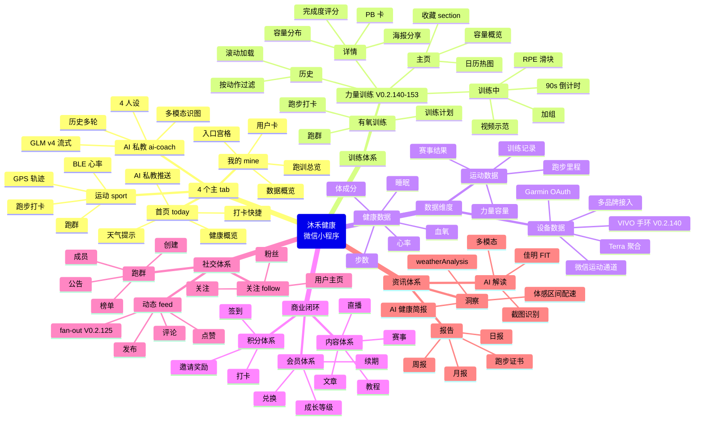

# MiniProgram Architecture — 微信小程序前端 UI 功能 + 系统结构图

> 📍 **目的**：整理小程序前端 UI 对应的功能 + 前后端 API 映射 + 系统结构图 + 思维导图
> **生成时间**：2026-07-26 17:53 CST
> **生成方式**：/zcf:workflow 单文件全景图（A 方案）
> **范围**：前端 25 pages + 17 components + 8 utils + 2 services ↔ 后端 33 module × 250+ API action
> **数据源**：`/zcf:init-project` #20 init-architect 校准（V0.2.140-153 sprint）+ 13 commits 沉淀 + 当前 app.json / components/ / routes.ts 扫描

## §0 元信息

| 字段 | 值 |
|---|---|
| **生成时间** | 2026-07-26 17:53 CST（ISO 2026-07-26T17:53:18+0800） |
| **生成方式** | `/zcf:workflow` 单文件全景图（A 方案） |
| **数据源** | init-architect #20 校准（V0.2.140-153 sprint）+ 13 commits 沉淀 + 当前 app.json/components/routes.ts 扫描 |
| **维护者** | `/zcf:workflow` 自动生成；V0.3.1 增量时同步更新 |
| **更新频率** | 每个 sprint V0.2.X 同步（重大架构变化时重建） |
| **关联文件** | `apps/miniprogram/CLAUDE.md`（sprint changelog 视角）<br>`apps/server/CLAUDE.md`（36 module 全清单）<br>`docs/research/mosquitto-vivo-bridge.md`（VIVO Bridge 调研）<br>`docs/checklists/v0.2.140-strength-v3-verify.md`（主人扫码验证清单）<br>`memory/mosquitto-5x-debug-root-cause.md`（Mosquitto 5 次 debug 沉淀） |
| **输出物** | 源文档（miniprogram-architecture.md）+ PDF（小程序架构文档.pdf）+ 表格（小程序架构表格.xlsx 4 sheets） |
| **生成脚本** | `scripts/export-architecture-xlsx.py`（xlsx 导出）<br>`pandoc + weasyprint`（PDF 渲染） |

---

## §1 目录结构树（ASCII tree）

```
apps/miniprogram/miniprogram/
├── app.ts                              # 小程序入口（globalData + 生命周期）
├── app.json                            # 路由表 25 页 + tabBar + window
├── app.wxss                            # 全局样式（品牌色 #2D9D78）
├── sitemap.json                        # 搜索索引
│
├── pages/                              # 25 个页面（4 tab + 21 详情）
│   ├── index/                          # 首页（today tab）─ 打卡快捷 + 健康概览
│   ├── sport/                          # 运动打卡 tab ─ GPS 跑步 + BLE 心率
│   ├── mine/                           # 我的 tab ─ 用户卡 + 数据 + 入口宫格
│   ├── profile/                        # 用户档案 ─ 编辑资料 + 偏好
│   ├── group-detail/                   # 跑群详情 ─ 成员 + 公告 + 打卡
│   ├── content-list/                   # 内容列表 ─ 赛事/教程/文章
│   ├── content-detail/                 # 内容详情 ─ 富文本 + 报名
│   ├── agreement/                      # 沐禾健康用户服务协议 + 隐私政策
│   ├── ranking/                        # 榜单 ─ 跑群周榜 + 月榜
│   ├── health/                         # 健康中心 ─ 设备数据 + 体成分
│   ├── device/                         # 设备中心 ─ 多品牌 BLE/OAuth（V0.2.140 VIVO 手环 UI）
│   ├── training/                       # 训练计划 ─ 有氧 + 力量（V0.2.128+ kind=strength）
│   ├── shoes/                          # 我的跑鞋 ─ 里程 + 阈值 + 对比
│   ├── runner/                         # 跑者数据中心 ─ 年度汇总 + 成就
│   ├── feed/                           # 运动动态 ─ 发布 + 点赞 + 评论（V0.2.125 fan-out）
│   ├── user/                           # 用户主页（其他用户）─ 关注 + 粉丝 + 动态
│   ├── onboarding/                     # 4 步引导 ─ 资料 + 偏好 + 设备 + 完成
│   ├── ai-coach/                       # AI 私教 tab ─ GLM v4 多模态流式对话
│   ├── diet/                           # 饮食 ─ FatSecret OCR 拍照识别
│   ├── insight/                        # 洞察 ─ weatherAnalysis + 体感区间配速
│   ├── report-detail/                  # 报告详情 ─ 健康评分细则
│   ├── membership/                     # 会员中心 ─ 成长等级 + 兑换
│   ├── report-monthly/                 # 月度报告 ─ stats.buildReportText 三段式
│   ├── more/                           # 更多入口 ─ 集中跳转列表
│   ├── interpret/                      # AI 资料解读 ─ 佳明 FIT + GLM-4.6V 截图
│   └── strength/                       # 力量训练 V0.2.140-153（4 页）
│       ├── index/                      # 主页 ─ 容量概览 + 日历热图 + ⭐ 收藏
│       ├── session/                    # 训练中 ─ 加组 + 90s 倒计时 + RPE 滑块
│       ├── detail/                     # 详情 ─ PB + 容量分布 + 完成度评分环 + 海报
│       └── history/                    # 历史 ─ 滚动加载 + 按动作过滤
│
├── components/                         # 17 个可复用组件
│   ├── ai-quick-cards/                 # AI 私教快捷卡 4 张宫格（V0.2.31 原型借鉴）
│   ├── avatar-badge/                   # 头像 + 成长等级徽章（V0.2.7 growth emoji 映射）
│   ├── certificate-poster/             # 跑步证书海报（V0.1.135）
│   ├── collapsible/                    # 可折叠列表（V0.2.95 私教页历史折叠）
│   ├── collection-poster/              # 收藏海报（V0.1.136）
│   ├── data-strip/                     # 数据条 ─ 3 项指标横排（V0.2.4 健康中心）
│   ├── entry-grid/                     # 入口宫格 ─ 我的页 8 宫格（V0.1.40）
│   ├── error-state/                    # 错误态占位（最常用，7 个页面引用）
│   ├── feature-gate/                   # 功能开关 ─ app_config.feature_flags 控制
│   ├── goal-share-card/                # 目标分享卡（V0.1.135）
│   ├── invite-bonus-card/              # 邀请奖励卡（V0.2.6）
│   ├── level-card/                     # 成长等级卡（V0.2.9 原型借鉴）
│   ├── mileage-chart/                  # 里程图表 ─ 跑步曲线（V0.1.133）
│   ├── plan-card/                      # 训练计划卡 ─ 有氧/力量渐变样式（V0.2.128+）
│   ├── privacy-popup/                  # 隐私政策弹窗 ─ 启动时显示
│   ├── profile-popup/                  # 资料弹窗 ─ 编辑表单
│   └── uv-alert/                       # 紫外线预警（V0.2.9）
│
├── utils/                              # 8 个工具模块
│   ├── auth.ts                         # 微信 code2Session + token 持久化
│   ├── ble.ts                          # BLE 扫描 + 连接 + 心率订阅（0x180D）
│   ├── format.ts                       # 日期/距离/时长格式化
│   ├── gps.ts                          # Haversine 距离 + 轨迹点（V0.2.103）
│   ├── poster.ts                       # Canvas 海报 ─ 力量报告 750×1334（V0.2.145）
│   ├── scale.ts                        # 体脂秤 BLE 协议 ─ 阻抗 + 6 项体成分
│   ├── share.ts                        # 微信分享 ─ onShareAppMessage
│   └── werun.ts                        # 微信运动 wx.getWeRunData + AES-128-CBC 解密
│
└── services/                           # 2 个服务模块
    ├── api.ts                          # 统一 API 调用 ─ api.call<T>(module, action, payload)
    └── realtime.ts                     # WebSocket ─ wx.connectSocket + eventBus on/clear
                                          # + 3s 重连（V0.2.116 MQTT→WS 切换）
```

---

## §2 前端功能矩阵（29 页 × 功能 × 后端 API）

### 2.1 4 个主 tab 页

| 页面 | 路由 | 核心功能 | 调用的后端 API（module.action） | V0.2.X |
|---|---|---|---|---|
| **首页 today** | `pages/index/index` | 打卡快捷 + 今日概览 + 天气 + AI 提示 | `sport.today` · `stats.weather` · `stats.userProfile` · `stats.healthScore` · `notification.unreadCount` · `follow.myCounts` · `feed.list` | V0.2.117 文案 |
| **运动 sport** | `pages/sport/index` | 跑步打卡 + GPS 轨迹 + BLE 心率 | `sport.today` · `device.myBindings` · `device.myTodayHealth` · `device.importToCheckin` · `feed.list` · `sport.groupDetail` · `sport.groupMembers` · `sport.myGroups` · `sport.createGroup` | V0.2.103-108 GPS 闭环 |
| **我的 mine** | `pages/mine/index` | 用户卡 + 数据 + 入口宫格 + 跑训总览（V0.2.151） | `stats.myRunnerStats` · `stats.myCertificates` · `stats.userProfile` · `distribution.inviteInfo` · `device.myBindings` · `feed.myFeeds` | V0.2.150 跑训总览 + V0.2.99 mine 重构 |
| **AI 私教** | `pages/ai-coach/index` | GLM v4 流式对话 + 4 人设 + 历史记录 | `ai-coach.chat` · `ai-coach.chatStream` · `ai-coach.history` · `ai-coach.regenerate` · `ai-coach.conversations` · `ai-coach.deleteConversation` · `ai-coach.setPersona` · `ai-coach.warmup` · `ai-coach.proactiveAlert` | V0.1.139-141 + V0.2.28 |

### 2.2 详情/功能页（21 个）

| 页面 | 路由 | 核心功能 | 调用的后端 API | V0.2.X |
|---|---|---|---|---|
| **用户档案** | `pages/profile/index` | 编辑资料 + 偏好设置 | `user.updateProfile` · `user.getProfile` | V0.1.40 profile 完整 |
| **跑群详情** | `pages/group-detail/index` | 群成员 + 公告 + 群榜单 | `sport.groupDetail` · `sport.groupMembers` · `sport.announceGroup` | V0.1.42 跑群深化 |
| **内容列表** | `pages/content-list/index` | 赛事/教程/文章分类列表 | `content.list` | V0.1.134 赛事 |
| **内容详情** | `pages/content-detail/index` | 富文本 + 报名 + 跑步结果 | `content.detail` · `content.getMyRaceResult` · `content.submitRaceResult` | V0.1.134 |
| **沐禾协议** | `pages/agreement/index` | 用户服务协议 + 隐私政策 | (静态页) | V0.2.58 协议 |
| **榜单** | `pages/ranking/index` | 跑群周榜 + 月榜 | `sport.ranking` · `user.getProfile` | V0.1.40 榜单 |
| **健康中心** | `pages/health/index` | 设备数据 + 体成分 + 周趋势 | `device.myHealthHistory` · `device.myTodayHealth` · `stats.healthScore` · `stats.dailyReport` · `stats.dailyReportList` | V0.2.4 健康三页 |
| **设备中心** | `pages/device/index` | 多品牌 BLE/OAuth + VIVO 手环 UI | `device.myBindings` · `device.syncWeRun` · `device.bindBleDevice` · `device.listDeviceDailyActivity` · `device.recordDeviceDailyActivity` | V0.2.115-117 + V0.2.140 |
| **训练计划** | `pages/training/index` | 有氧 + 力量计划（kind 区分） | `training.myPlans` · `training.myActivePlan` · `training.joinPlan` · `training.leavePlan` · `training.getPlanWeeklyProgress` | V0.1.41 + V0.2.128 |
| **我的跑鞋** | `pages/shoes/index` | 跑鞋管理 + 里程 + 阈值 | `shoes.list` · `shoes.myStats` · `shoes.getDetail` · `shoes.getMileageHistory` · `shoes.updateThreshold` | V0.1.26-133 |
| **跑者中心** | `pages/runner/index` | 年度汇总 + 成就 | `stats.myAnnualReport` · `stats.myRunnerStats` · `stats.myCertificates` | V0.1.27 |
| **运动动态** | `pages/feed/index` | 发布 + 点赞 + 评论 + 粉丝实时推送 | `feed.list` · `feed.publish` · `feed.like` · `feed.unlike` · `feed.comment` · `feed.listComments` · `feed.hotTopics` · `feed.myFeeds` | V0.1.30 + V0.2.125 fan-out |
| **其他用户主页** | `pages/user/index` | 关注 + 粉丝 + 动态 | `user.getProfile` · `follow.follow` · `follow.unfollow` · `follow.isFollowing` · `follow.myFollowing` · `follow.myFollowers` · `follow.myCounts` · `feed.myFeeds` | V0.1.32 |
| **4 步引导** | `pages/onboarding/index` | 资料 + 偏好 + 设备 + 完成 | `user.updateProfile` · `user.completeOnboarding` · `device.bindBleDevice` | V0.1.43 |
| **饮食** | `pages/diet/index` | FatSecret OCR + myMeals | `food.recognize` · `food.myMeals` · `food.removeMeal` · `food.search` · `food.nutrition` | V0.2.0 + V0.2.5 |
| **洞察** | `pages/insight/index` | weatherAnalysis + 体感区间配速 | `stats.weatherAnalysis` · `stats.weather` · `stats.weatherAir` | V0.2.26 |
| **报告详情** | `pages/report-detail/index` | 健康评分细则（步数40+心率30+睡眠30=100） | (本地计算) | V0.2.117 |
| **会员中心** | `pages/membership/index` | 成长等级 + 兑换 | `user.redeemMember` · `distribution.inviteInfo` | V0.2.6-7 |
| **月度报告** | `pages/report-monthly/index` | stats.buildReportText 三段式 | `stats.myAnnualReport` · `stats.userProfile` | V0.2.30 |
| **更多** | `pages/more/index` | 集中跳转列表 | (导航页) | V0.2.32 |
| **AI 解读** | `pages/interpret/index` | 佳明 FIT + GLM-4.6V 截图 | `interpret.garmin` · `interpret.screenshotCheckin` · `interpret.myInterpretHistory` | V0.2.33 + V0.2.57 |

### 2.3 力量训练 V0.2.140-153（4 页）

| 页面 | 路由 | 核心功能 | 调用的后端 API |
|---|---|---|---|
| **力量主页** | `pages/strength/index` | 容量概览 + 训练日历热图 + ⭐ 收藏 + 7 日柱状 | `strength.listExercises` · `strength.myVolume` · `strength.toggleFavoriteExercise` · `strength.listFavoriteExercises` · `strength.getExerciseStats` · `strength.getStrengthOverview` |
| **训练中** | `pages/strength/session` | 加组 + 90s 倒计时 + 🎬 视频示范 + RPE 1-10 + postHr 心率 | `strength.startSession` · `strength.addSet` · `strength.finishSession` · `strength.suggestNextWeight` |
| **训练详情** | `pages/strength/detail` | 🏆 PB 卡 + 📊 容量分布 + 完成度评分环 + 🖼️ Canvas 海报 + 分享 | `strength.sessionDetail` · `strength.getSessionReport` · `strength.getCompletionScore` · `strength.getExerciseStats` |
| **训练历史** | `pages/strength/history` | 滚动加载 + 按动作过滤 | `strength.listSessions` |

---

## §3 组件复用矩阵（17 个 components）

| 组件 | 功能 | 关键 props | 触发事件 | 被哪些页面用 | V0.2.X |
|---|---|---|---|---|---|
| **error-state** | 错误态占位（网络/加载失败） | `type` `text` | `onRetry` | **7 个页面**（最常用） | V0.1.40 |
| **data-strip** | 3 项指标横排（卡路里/时长/距离） | `items: { icon, label, value }[]` | - | 3 页（home/insight/health） | V0.2.4 |
| **plan-card** | 训练计划卡（有氧/力量渐变样式） | `plan` `type: 'running' \| 'strength'` | `onJoin` / `onDetail` | 1 页（training） | V0.2.128 |
| **mileage-chart** | 跑鞋里程曲线图 | `data` `threshold` | - | 1 页（shoes） | V0.1.133 |
| **ai-quick-cards** | AI 私教快捷卡 4 张宫格 | `cards[]` | `onTap` | 1 页（ai-coach） | V0.2.31 |
| **collapsible** | 可折叠列表 | `title` `defaultOpen` | `onToggle` | 1 页（ai-coach） | V0.2.95 |
| **uv-alert** | 紫外线预警 | `level` `advice` | - | 1 页（index） | V0.2.9 |
| **profile-popup** | 资料编辑表单弹窗 | `profile` | `onSave` | 1 页（profile） | V0.1.40 |
| **privacy-popup** | 启动时隐私政策弹窗 | - | `onAgree` | app.ts 启动 | V0.1.40 |
| **entry-grid** | 入口宫格（mine 页 8 宫格） | `items[]` | `onTap` | 1 页（mine） | V0.1.40 |
| **level-card** | 成长等级卡（100/500/2000/5000） | `totalPointsEarned` | - | 1 页（mine） | V0.2.9 |
| **avatar-badge** | 头像 + 等级徽章 emoji | `userId` | - | 1 页（mine） | V0.2.7 |
| **invite-bonus-card** | 邀请奖励卡（被邀请+7 天） | `bonusDays` | `onCopyCode` | 1 页（membership） | V0.2.6 |
| **goal-share-card** | 目标分享卡（步数/距离） | `goal` | `onShare` | 1 页（runner） | V0.1.135 |
| **certificate-poster** | 跑步证书海报（Canvas） | `certData` | `onSave` | 1 页（runner） | V0.1.135 |
| **collection-poster** | 收藏海报（跑鞋/装备） | `collection` | `onSave` | 1 页（profile） | V0.1.136 |
| **feature-gate** | 功能开关（feature_flags） | `featureKey` | - | 1 页（mine） | V0.1.40 |

**最常用组件排行**：error-state (7页) > data-strip (3页) > 其他组件（各 1 页）

---

## §4 数据流图（Mermaid graph TD）

```mermaid
graph TD
    %% ===== UI 层 =====
    subgraph UI[小程序前端 25 pages + 17 components]
        Today[pages/index 首页 today tab]
        Sport[pages/sport 运动 tab]
        Mine[pages/mine 我的 tab]
        AICoach[pages/ai-coach AI 私教 tab]
        Strength[pages/strength/* 力量训练 4 页]
        Device[pages/device 设备中心]
        Feed[pages/feed 运动动态]
        Health[pages/health 健康中心]
        More[更多 18 个详情页...]
    end

    %% ===== Services 层 =====
    API[services/api.ts<br/>api.call wrapper]
    Realtime[services/realtime.ts<br/>WebSocket eventBus]

    %% ===== Utils 层 =====
    Auth[utils/auth.ts<br/>JWT 持久化]
    BLE[utils/ble.ts<br/>0x180D 心率订阅]
    GPS[utils/gps.ts<br/>Haversine 距离]
    WeRun[utils/werun.ts<br/>AES-128-CBC 解密]
    Poster[utils/poster.ts<br/>Canvas 海报]
    Scale[utils/scale.ts<br/>体脂秤阻抗]

    %% ===== API 网关 =====
    Gateway[Fastify 3000<br/>JWT auth + rate-limit]

    %% ===== 后端 33 module（按业务分组） =====
    subgraph Backend[后端 33 module × 250+ API action]
        SportM[sport 11 action]
        StatsM[stats 12 action<br/>weatherAnalysis + 跑训总览]
        StrengthM[strength 18 action<br/>6 新 V0.2.140-153]
        DeviceM[device 28 action<br/>+syncVivo/record V0.2.143]
        FeedM[feed 9 action<br/>+fan-out V0.2.125]
        NotificationM[notification 4 action<br/>realtime V0.2.119]
        AIM[aicoach 11 action<br/>GLM v4 多模态]
        GoalM[goal 10 action<br/>跨阈值检测]
        FollowM[follow 6 action]
        MoreM[其他 25 module...]
    end

    %% ===== 基础设施 =====
    subgraph Infra[基础设施]
        BullMQ[BullMQ 8 worker<br/>weekly-report + device-poll-cron]
        Realtime2[infra/realtime.ts<br/>Redis pub/sub]
        Prisma[(Prisma ORM)]
        PG[(PostgreSQL 16<br/>66 表 58 迁移)]
        Redis[(Redis 7<br/>Cache + Queue)]
        MOSQ[Mosquitto<br/>debug 5 次失败<br/>V0.2.151 cron 替代]
    end

    %% ===== 数据流 =====
    Today --> API
    Sport --> API
    Mine --> API
    AICoach --> API
    Strength --> API
    Device --> API
    Feed --> API
    Health --> API

    Sport --> BLE
    Sport --> GPS
    Device --> BLE
    Device --> Scale
    Device --> WeRun
    Strength --> Poster

    API -->|POST /api/{module}/{action}| Gateway
    Realtime -->|WS subscribe| Realtime2

    Gateway --> SportM
    Gateway --> StatsM
    Gateway --> StrengthM
    Gateway --> DeviceM
    Gateway --> FeedM
    Gateway --> NotificationM
    Gateway --> AIM
    Gateway --> GoalM
    Gateway --> FollowM
    Gateway --> MoreM

    SportM --> Prisma
    StatsM --> Prisma
    StrengthM --> Prisma
    DeviceM --> Prisma
    FeedM --> Prisma
    NotificationM --> Prisma
    AIM --> Prisma
    GoalM --> Prisma

    Prisma --> PG
    BullMQ --> Prisma
    BullMQ --> Redis
    Realtime2 --> Redis
    NotificationM -->|publishToUser| Realtime2
    FeedM -->|fan-out Promise.allSettled| NotificationM

    %% 设备数据流（V0.2.153 cron 替代 Mosquitto）
    WeRun -->|encryptedData| SportM
    SportM -->|save| PG
    BullMQ -.->|device-poll-pull 24h| PG
    PG -.->|upsert DeviceDailyActivity| StrengthM
    Strength -->|listDeviceDailyActivity| DeviceM
    Device -->|VIVO 手环 UI 卡片| DeviceM

    %% ===== 样式说明 =====
    classDef ui fill:#e1f5ff,stroke:#01579b
    classDef service fill:#fff9c4,stroke:#f57f17
    classDef util fill:#f8bbd0,stroke:#880e4f
    classDef backend fill:#c8e6c9,stroke:#1b5e20
    classDef infra fill:#d1c4e9,stroke:#311b92

    class Today,Sport,Mine,AICoach,Strength,Device,Feed,Health,More ui
    class API,Realtime service
    class Auth,BLE,GPS,WeRun,Poster,Scale util
    class SportM,StatsM,StrengthM,DeviceM,FeedM,NotificationM,AIM,GoalM,FollowM,MoreM backend
    class BullMQ,Realtime2,Prisma,PG,Redis,MOSQ infra
```

### 4.1 关键数据流（解释）

1. **前端 → API**：`services/api.ts` 统一封装 `api.call<T>(module, action, payload)`
2. **认证**：所有 API 走 `utils/auth.ts` 持久化的 JWT（access 2h / refresh 30d）
3. **实时推送**：`services/realtime.ts` WebSocket → `infra/realtime.ts` Redis pub/sub → 触发前端 eventBus
4. **cron 异步**：`BullMQ` 8 worker（weekly-report + close-order + refresh-certs + garmin-import + ludong-sync + upload-parse + device-poll-cleanup + device-poll-pull）
5. **设备数据回流（V0.2.153 新链路）**：微信运动 → WeRunRecord → cron pull 24h → DeviceDailyActivity → 前端 VIVO 手环 UI

---

## §5 思维导图（Mermaid mindmap）



---

## §6 后端 API 分布（按 module 排序）

| # | Module | Routes case | 核心功能 | V0.2.X 增量 |
|---|---|---:|---|---|
| 1 | **admin** | 42 | RBAC + audit + audit + listUploads + getMpCategory + uploadMpMedia + submitMpAudit | V0.2.8 RBAC + V0.2.37 Interpret + V0.2.65-66 提审 |
| 2 | **device** | 28 | BLE/OAuth/Garmin/Terra + Mosquitto 替代 V0.2.143 | V0.2.115-117 + V0.2.140 + V0.2.143 syncVivo |
| 3 | **strength** | 18 | 力量训练 6 新 action + recordDaily + 跑训结合 | V0.2.42 + V0.2.140-153 |
| 4 | **stats** | 12 | myRunnerStats + weatherAnalysis + buildReportText + 跑训总览 | V0.2.26 + V0.2.30 + V0.2.150-152 |
| 5 | **sport** | 11 | 打卡 + 跑群 + 周报 | V0.1.25-42 |
| 6 | **ai-coach** | 11 | GLM v4 流式 + 4 人设 + 多模态 | V0.1.139-141 + V0.2.27-28 |
| 7 | **goal** | 10 | 跑步目标 + 容量目标 + 跨阈值检测 | V0.1.28 + V0.2.121 + V0.2.124 |
| 8 | **user** | 9 | 鉴权 + 资料 + 4 步引导 + 兑换 | V0.1.40 + V0.2.7 |
| 9 | **shoes** | 9 | 跑鞋 + 里程 + 阈值 + 对比 | V0.1.26 + V0.1.133 + V0.1.137 |
| 10 | **feed** | 9 | 动态 + fan-out + 评论 + shoesForPicker | V0.1.30 + V0.2.72 + V0.2.125 |
| 11 | **family** | 9 | 家庭 + 转让 + 解散 + 成就 | V0.1.34 + V0.1.39 |
| 12 | **distribution** | 8 | 分销 + 结算 + inviteInfo + bindInviter | V0.1.24 + V0.2.6 |
| 13 | **review** | 7 | 评价 + 回复 + 鞋评双分发 | V0.1.113 + V0.1.137 |
| 14 | **content** | 7 | 内容 + 赛事 + 跑步结果 | V0.1.134 |
| 15 | **training** | 6 | 计划配置化 + kind=strength | V0.1.41 + V0.2.128 |
| 16 | **recipe** | 6 | 菜谱（V2 stub） | V0.2.0 启用 |
| 17 | **mall** | 6 | 商品 + 下单 + 退款 + 集成 | V0.1.22-24 |
| 18 | **food** | 6 | FatSecret + 拍照识别 + myMeals | V0.2.0 + V0.2.5 |
| 19 | **follow** | 6 | 关注 + 粉丝 + myCounts | V0.1.32 |
| 20 | **cart** | 5 | 购物车 | V0.1.22 |
| 21 | **address** | 5 | 地址 | V0.1.23 |
| 22 | **points** | 4 | 积分 | V0.1.22 |
| 23 | **notification** | 4 | list + unreadCount + markRead + markAllRead | V0.1.31 + V0.2.119 realtime |
| 24 | **ludong** | 4 | 律动同步 stub | V0.1.43 |
| 25 | **group-buy** | 4 | 团购 | V0.1.37-38 |
| 26 | **favorite** | 4 | 收藏 | V0.1.29 |
| 27 | **coupon** | 4 | 优惠券 | V0.1.23 |
| 28 | **weekly-report** | 3 | 周报聚合 | V0.1.43 |
| 29 | **wallet** | 3 | 钱包 | V0.1.43 |
| 30 | **ocr** | 3 | 腾讯云 OCR | V0.2.1 |
| 31 | **ranking** | 1 | 榜单 | V0.1.40 |
| - | **wxpay** | 0 (notify) | 微信支付 V3 完整闭环 | V0.4.1-2 |
| - | **upload** | 0 (直传) | COS 中转 + 异步解析 | V0.1.150 |
| - | **auth** | 0 (内联) | 微信 code2Session | V0.1.43 |

**总计 33 个 module × 250+ 个 case（routes + 通知 + 内联）**

---

## §7 关键范式沉淀

1. **api.call 统一调用**：`services/api.ts` 封装所有 33 module × 250+ action，前端无需记 URL
2. **WebSocket realtime**：`services/realtime.ts` + `infra/realtime.ts` Redis pub/sub，V0.2.119 后 notification 单点集成
3. **JWT 持久化**：access 2h / refresh 30d（utils/auth.ts）
4. **设备数据流**：BLE → utils/ble.ts → POST device.submitHeartRate → DeviceDailyActivity（V0.2.143 补 write 路径）
5. **Cron 替代 Mosquitto**：V0.2.146-150 debug 5 次失败 → V0.2.151 cleanup cron + V0.2.153 pull cron（不依赖 broker）
6. **范式 reuse**：`services/api.ts` 36 module × 250+ action 一致性；`utils/format.ts` 距离/时长/日期格式化复用
7. **错误处理**：`components/error-state` 7 个页面引用（最常用），统一 onRetry 回调

---

## §8 部署 & 监控

| 项 | 状态 |
|---|---|
| 生产部署 | qingmulife.cn (V0.2.153 最新) |
| WebSocket 端口 | /ws（Nginx 9421 → 3000） |
| Cron 频率 | weekly-report 周 + close-order 30min + device-poll-cleanup/pull 24h |
| 备份镜像 | bak-v0.2.140 / bak-v0.2.143 / bak-v0.2.152 |
| 监控 | Pino 日志 + healthcheck |

---

## 📚 相关文档

- `apps/miniprogram/CLAUDE.md`（V0.2.140-152 增量）
- `apps/server/CLAUDE.md`（36 module 全清单）
- `docs/research/mosquitto-vivo-bridge.md`（VIVO Bridge 调研）
- `docs/checklists/v0.2.140-strength-v3-verify.md`（主人扫码验证清单）
- `memory/mosquitto-5x-debug-root-cause.md`（Mosquitto 5 次 debug 沉淀）

---

**生成时间**：2026-07-26 17:53 CST
**生成方式**：`/zcf:workflow` 单文件全景图（A 方案）
**执行计划**：`.zcf/plan/current/miniprogram-architecture-doc.md`